> [!bookinfo|noicon]+ **灰与幻想的格林姆迦尔**
> 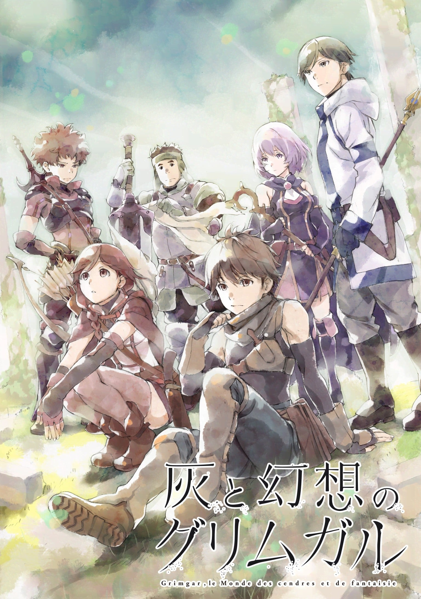
>
| 日文名 | 灰と幻想のグリムガル |
|:------: |:------------------------------------------: |
| 类型 | 小说改 |
| 新番 | 2016 年 1 月 |
| 集数 | 共12话 |
| 官网 | [http://grimgar.com/](https://http://grimgar.com/) |
| 制作 | A-1 Pictures |
| 导演 | 中村亮介 |
| 脚本 | 中村亮介 |
| 评分 | 7.5|
| 制片人 | 大松裕 |

> [!abstract]+ **简介**
> 我们为什么要这么做……？

哈尔希洛回过神来，才发现自己身处在黑暗当中，他完全不知道自己人在何处，也不明白这个地方是哪里。

他的身边有一群和他一样失去记忆，只记得自己名字的男女；而离开了地底后，等待着众人的是一个「宛如游戏」的世界。

为求生存，哈尔希洛与自己有着相同境遇的伙伴们组成队伍、学习技能，以义勇兵见习者的身份踏入了这个世界--「格林姆迦尔」。

没有人知道未来会遇见什么……这一切，就是从灰烬之中所诞生的冒险谭。 

> [!tip]+ **章节列表**
>- [ ] 第1话：低语，咏唱，祈祷，觉醒吧 (2016-01-10)
>- [ ] 第2话：见习义勇军的漫长一天 (2016-01-17)
>- [ ] 第3话：哥布林袋里装着我们的梦想吗？ (2016-01-24)
>- [ ] 第4话：前往尘埃飞舞的空中 (2016-01-31)
>- [ ] 第5话：哭泣不是因为软弱。忍耐不是因为坚强 (2016-02-07)
>- [ ] 第6话：她的情况 (2016-02-14)
>- [ ] 第7话：被称为哥布林杀手 (2016-02-21)
>- [ ] 第8话：为了与你的回忆 (2016-02-28)
>- [ ] 第9话：度过假日的方式 (2016-03-06)
>- [ ] 第10话：虽然没有领导气质 (2016-03-13)
>- [ ] 第11话：在生与死之间 (2016-03-20)
>- [ ] 第12话：明天见—— (2016-03-27)
>- [ ] 第2.5话：浴室墙壁上挥洒的青春——再有1公分 (2016-03-16)

> [!tip]+ **主要角色**
> 
| 角色 | CV | 简介| 角色图片 |
|:----:|:---:|:---:|:--------:|
| ハルヒロ | 細谷佳正 | 本作主人公。クラスは盗賊。 眠そうな目をしている。そのせいでギルドの師匠によって盗賊界の通り名が年寄り猫（オールドキャット）にされてしまう。基本的に及び腰な性格。草食系。 | 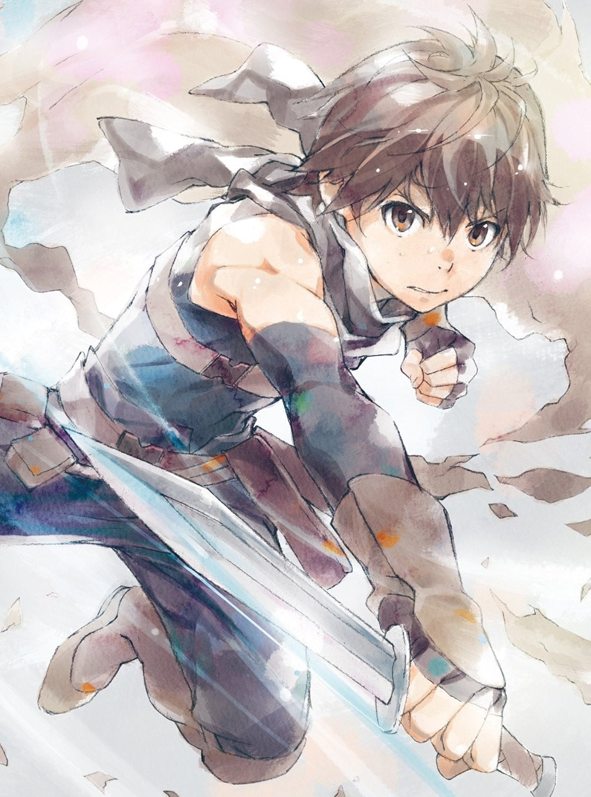 |
| ユメ | 小松未可子 | 微妙な関西弁で喋る。クラスは狩人。 所謂天然系。特に横文字が苦手。狩人のクラスだが弓が苦手で、主に剣鉈で戦う。 よくランタと喧嘩になる。 | 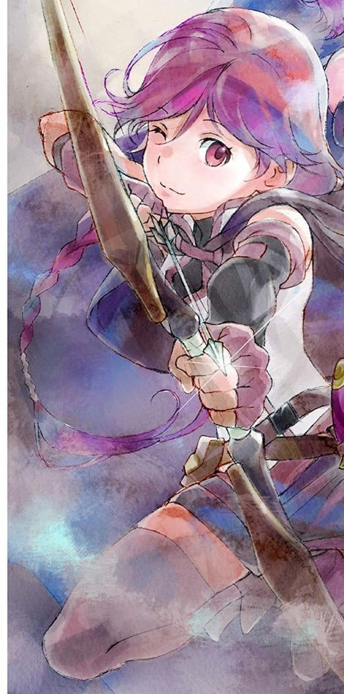 |
| シホル | 照井春佳 | 引っ込み思案で臆病。クラスは魔法使い。 状態異常系の魔法を主に使う。隠れ巨乳。 | 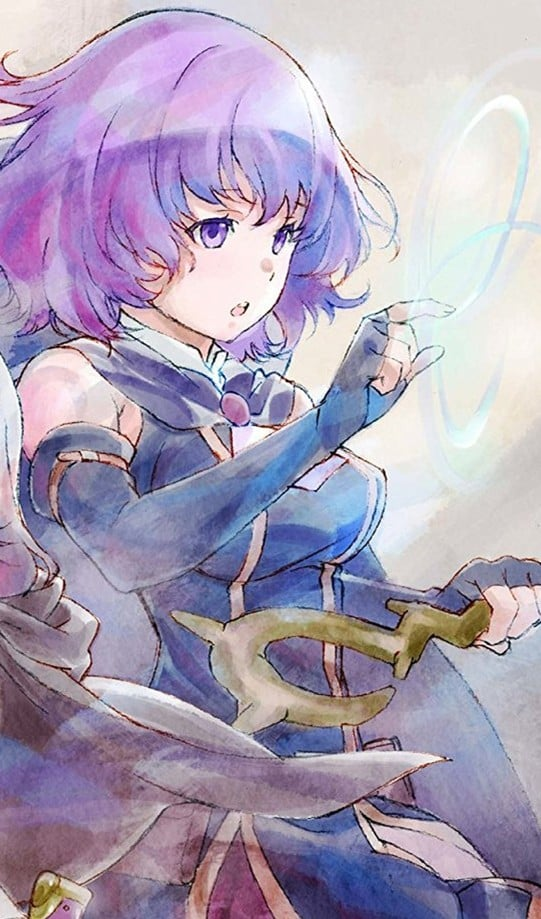 |
| ランタ | 吉野裕行 | 天パ。クラスは暗黒騎士。 お調子者で我儘でテキトー。その上非常に口が悪い。そのためパーティメンバーからは鬱陶しがられている。 クラススキルによって「ゾディアックん」という悪霊を招来できる。 | 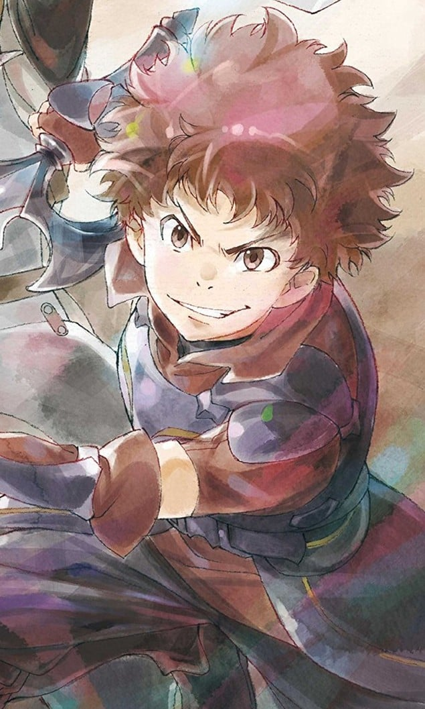 |
| メリイ | 安済知佳 | クールな美人。クラスは神官。 目や態度が冷たくて非常にコワイ。治療もロクにしてくれないと、冒険者の間でもいろいろ噂になってる。 いろいろとわけありのようだが…？ | 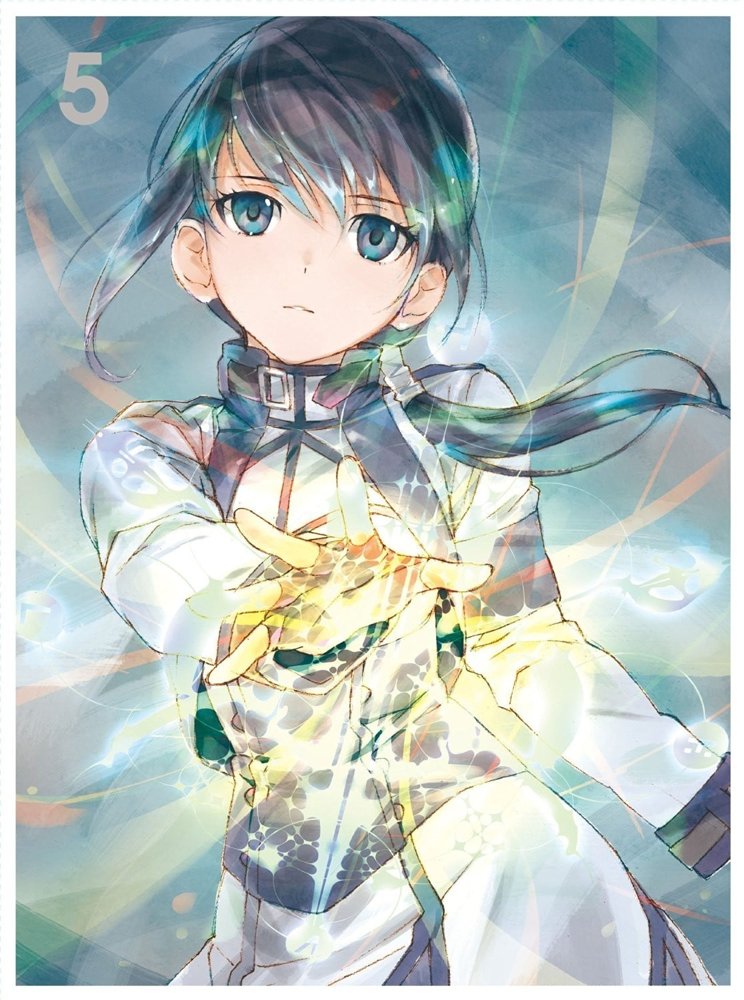 |
| モグゾー | 落合福嗣 | でかい。くまっぽい。クラスは戦士。 若干のろいが剣の扱いは正確で意外と器用。決める時に決めてくれる。 | 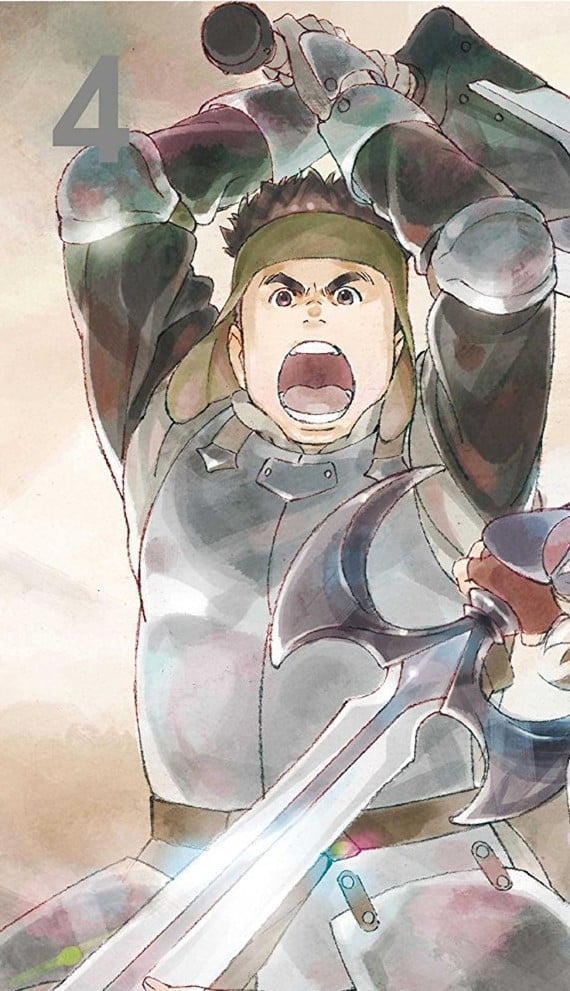 |
| マナト | 島﨑信長 | パーティのまとめ役。リーダー。クラスは神官。 パーティメンバーに対して、それぞれ的確な言葉をかけたり、指示を与えたりできる気配り人。いいやつ。 | 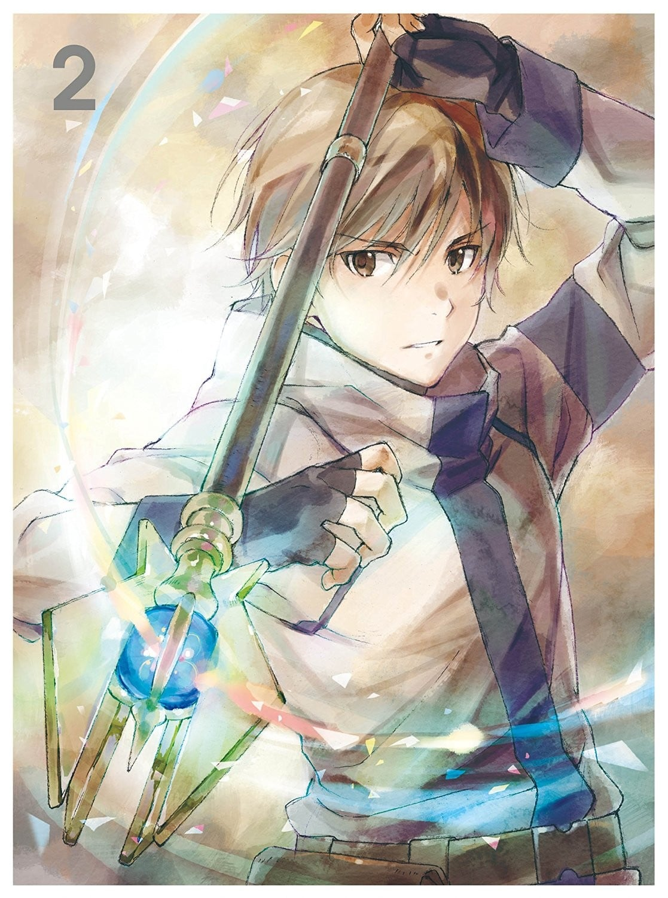 |
| チビ |  | 正式义勇军，同期十二人中最矮小的黑短发少女，职业为神官，莲崎队的一员。 | 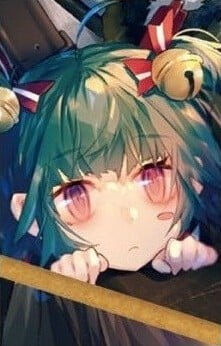 |
| レンジ | 関智一 | ハルヒロと一緒にグリムガルへやってきた人間で、チーム・レンジのリーダー。クラスは戦士。 「使えそう」な人間をすぐさま選んで、グリムガルの世界へと踏み出していく。 ワイルドな性格。こっちもコワイ。 | 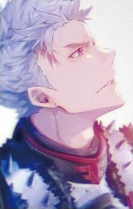 |
| バルバラ | 能登麻美子 | 盗贼公会教官，穿着性感，短发，戴着眼镜的抖S美人。 | 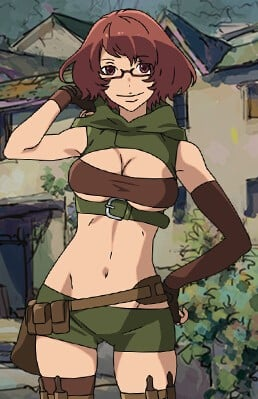 |
| ブリトニー | 安元洋貴 | 圣骑士，边境义勇军赤月事务所所长兼接待员，讲话很女性为其特征，最讨厌被人称呼娘娘腔，向十二位主角说明义勇军相关事物。 | 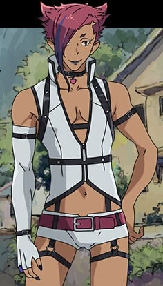 |
| キッカワ | 浪川大輔 | 正式义勇军，细眼的青年，职业为战士，个性飘然轻浮，没加入任何队伍，独自一人。 常与马纳多在酒吧交换情报，于小说六卷加入时宗（普吉姆）的队伍。 | 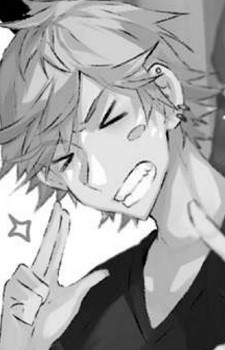 |