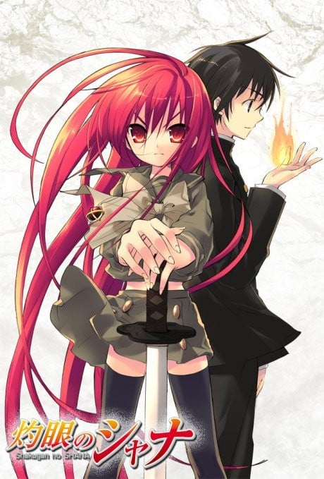
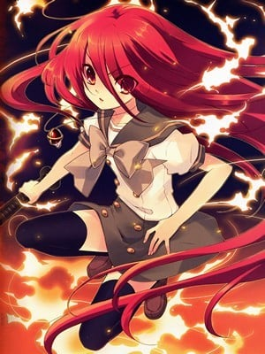
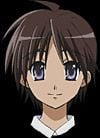
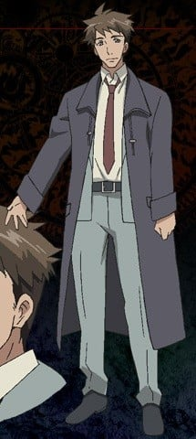

> [!bookinfo|noicon]+ **灼眼的夏娜**
> 
>
| 日文名 | 灼眼のシャナ |
|:------: |:------------------------------------------: |
| 类型 | 小说改 |
| 新番 | 2005 年 10 月 |
| 集数 | 共24话 |
| 官网 | [http://www.shakugan.com/](https://http://www.shakugan.com/) |
| 制作 | J.C.STAFF |
| 导演 | 渡部高志 |
| 脚本 | 小林靖子,白根秀樹,佐藤勝一 |
| 评分 | 7.2|
| 制片人 |  |

> [!abstract]+ **简介**
> 悠二、おまえは私が護るから。

平凡な高校生・坂井悠二の日常は、ある日突然消滅した。異界から渡り来た、人の“存在”を灯りに変えて、喰らうという化け物“紅世の徒”が悠二を襲う。逃げることも忘れ呆然と立ちすくむ悠二を救ったのは、紅蓮の髪と瞳をもつ謎の少女だった。そして──その少女は、悠二にこう告げた。「おまえはもう【存在】していないのよ」と。

[中文简介]
某一天在平凡的高中生坂井悠二的身旁，出现了一位名叫“炎发灼眼的追踪者”夏娜的少女，她告诉悠二，说他的生命马上就要结束了——原来在这个世界之外，还有另一个被称作“红世”的世界，那里的人们为了实现他们的野心，将人类身上的世界本源之力“存在之力”陆续夺走。悠二就受害者之一。红世之徒将“存在”夺走之后，为了缓和现实中产生的扭曲，还会留下“Torch（烛火）”作为代替。然后随着时间的推移，“Torch（烛火）”也终将从人们的记忆中淡去。修二的命运究竟会怎样呢？

> [!tip]+ **章节列表**
>- [ ] 第1话：全部的结束、一切的开始 (2005-10-05)
>- [ ] 第2话：点燃的火焰 (2005-10-12)
>- [ ] 第3话：火炬与火雾战士 (2005-10-19)
>- [ ] 第4话：迷惑的火雾战士 (2005-10-26)
>- [ ] 第5话：各自的想法 (2005-11-02)
>- [ ] 第6话：交错・发动・对决 (2005-11-09)
>- [ ] 第7话：两位火雾战士 (2005-11-16)
>- [ ] 第8话：美丽的酒杯 (2005-11-23)
>- [ ] 第9话：恋爱与欲望的游泳池畔 (2005-11-30)
>- [ ] 第10话：纠结的思念 (2005-12-07)
>- [ ] 第11话：悠二与夏娜与吻 (2005-12-14)
>- [ ] 第12话：摇篮中盛开的花 (2005-12-21)
>- [ ] 第13话：校园里的宣战布告 (2006-01-04)
>- [ ] 第14话：伟大的人 (2006-01-11)
>- [ ] 第15话：红莲的诞生之日 (2006-01-18)
>- [ ] 第16话：炎发灼眼的杀手 (2006-01-25)
>- [ ] 第17话：新的序章 (2006-02-01)
>- [ ] 第18话：破碎的希望 (2006-02-08)
>- [ ] 第19话：战斗之中 (2006-02-15)
>- [ ] 第20话：无情的威尔艾米娜 (2006-02-22)
>- [ ] 第21话：遥远的思念 (2006-03-01)
>- [ ] 第22话：摇曳的火焰 (2006-03-08)
>- [ ] 第23话：星黎殿之战 (2006-03-15)
>- [ ] 第24话：红莲的心意 (2006-03-22)

> [!tip]+ **主要角色**
> 
| 角色 | CV | 简介| 角色图片 |
|:----:|:---:|:---:|:--------:|
| シャナ | 釘宮理恵 | 继承了第一代“炎发灼眼的杀手”的火雾战士，作品的女主角。 　　在动画版中，身高被设定为141cm。从样貌看，是一个大约11或12岁的女孩，但因为订立了契约后，会变成长生不老，因此看不出她的真实年龄。 　　“夏娜”之名是悠二由其所持武器大太刀“贽殿遮那（台湾播出的动画中文版本翻成“贽殿纱那”）”命名的。其在尚未觉醒自燃的能力之前就定契约，因此作战以挥舞贽殿遮那和近身肉搏为主，在遇上悠二之前都是过着追杀红世使徒的流浪生活，在取代平井缘的存在之后，才开始其正常社交活动和处世的一面。 　　特别喜爱甜食，连喝咖啡也是喝特别甜的；最喜爱的食物是甜瓜包（又译密瓜包、菠萝包，日文原字为メロンパン（melon bun）），并自创一套理论：吃甜瓜包时，要先咬一口酥脆的外皮，再咬一口柔软的部份，在这两种口感相互交替，才能享受甜瓜包的美味。 　　性格非常倔强，为傲娇的代表人物之一，对悠二有很深厚的感情。口头禅是：“吵死了！吵死了！吵死了！（うるさい！うるさい！うるさい！）” 　　从小就居住在“天道宫”，跟着威尔艾米娜．卡梅尔还有专门训练他的梅利希姆(小白)，文武双全的杀手，御崎高中不少只会使用老师的地位却没有实际才能的老师在她的面前失去身为老师的尊严，后来就分成两种类型(正面对决和视而不见)，跟吉田一美算是情敌也算好友。在和法利亚葛尼的战斗被宝具“幸福扳机”强迫其体内的亚拉斯特尔显现，因此在和“悼文吟诵人”战斗中回想当时感受到的强大的自己，因而得到了使用火焰的能力，并学会使用火焰的翅膀飞翔，深信有悠二在旁没有办不到的事情。（2008中国萌战冠军，与C.C.并列萌王）（娇蛮版萝莉） 2016年世界最萌大赛萌王 |  |
| 坂井悠二 | 日野聡 | 御崎高中一年二班的学生，故事的开始时遇到封绝，在封绝中被磷子发现自身为内有宝具的密斯提斯因而被牵扯进了磷子与夏娜的战斗，也开始了身为体内藏有宝具“零时迷子”的“密斯提斯”的命运。其实真正的人类悠二早已被吞灭其存在之力，在故事一开始他就只是一个“火炬”，却在不明的情况下得到“零时迷子”且可以在封绝中自由行动，因此严格上他并非人类。 　　与其他火炬不同，“零时迷子”可以令他每天所消耗的存在之力于当日午夜十二时回复，使他不会消失，但是如果“零时迷子”遭破坏或者是被拿取出来，悠二还是有消失的可能。在小说中，悠二身上的“零时迷子”被加入了“戒禁”。在动画第一季中由“化装舞会”策划的将御崎市化为“存在之泉”的计划，使他拥有了与一般红世之王当量的存在之力，而且能作为上限每天被回复。 　　虽然没有明显的长处，没有强烈的上进心，却也不会因此怠惰，在学校的成绩也只是不上不下，可是当遇到困难时却可以表现出相当出色的观察力、判断力，也擅长找出重要关键，大家都对悠二这点感到有趣。感情迟钝，目前处于三角关系中。 |  |
| 吉田一美 | 川澄綾子 | 御崎高中一年二班的学生，内向且可爱的女生，在受过悠二和夏娜的帮助之后对他产生了好感，本片第二个女主角。面对的是最具压迫感的情敌，固执起来也是很可怕。其身材在同学之间闻名（主要可见于动画第一季OVA）。曾帮助过“调音师”卡姆辛。她有饲养一只名叫“艾卡特利娜”的小狗；自己也有一个名叫“小健”的弟弟（以上情节有在漫画版、动画版第一季提及）。 |  |
| アラストール | 江原正士 | 真名为“天壤劫火”。与夏娜订契约的红世魔王，行事正派，在红世里有“王”或是“神”的称号，至从第一代“灼眼的杀手”死亡后，就一直待在“天道宫”，在动画“红莲诞生之日”跟夏娜订下契约，扮演悠二跟夏娜指导者的角色，有着父亲的存在。曾经跟悠二的母亲以手机交谈过，也认同悠二的母亲──坂井千草的理念，神器为吊坠“克库特斯”，颜色是红莲。其显现后的型态为“天谴神(天罚神)”。 |  |
| 池速人 | 野島裕史 | 悠二国中以来的好友，戴眼镜的资优生，同时也是御崎高中一年二班上的班长，以擅长资料搜集及主持活动而自豪（然而事实上不喜欢忙碌工作）。对吉田有好感，却经常帮助她追求悠二，容易晕车，乘长途车时、电动娃娃车、云霄飞车、摩天轮都会晕昡。 |  |
| 平井ゆかり | 浅野真澄 | 御崎高中一年二班的学生，坐在悠二隔壁座位的女生，常与悠二讨论功课，对池速人有好感，在原著小说及漫画版中对于她并没有做出详细的交代，只知她与家人早已变成火炬，由夏娜在她消失前占去其存在。动画版中改成于回家途中遭磷子攻击，被吸取了存在之力，夏娜在她消失当日为她制作火炬，但在第二天即熄灭消失，悠二在动画版中对本尊平井缘也是火炬的存在，而感到难过尽力的想让大家不要忘记她的存在，可惜最后还是因为存在之力的消耗而渐渐失去存在感。与原著一样后来被夏娜取代。平井缘本人的人格已不复存在，形同死亡。 |  |
| 佐藤啓作 | 野島健児 | 御崎高中一年二班的学生，长相俊美、言行轻佻的财团少爷，家中有珍藏好酒的酒吧，在动画第一季第五集成为玛琼琳·朵的部下，一心想要帮忙玛琼琳·朵，但是多次遭到阻碍跟拒绝，成为玛琼琳·朵心中影响力大的人物。 |  |
| 田中栄太 | 近藤孝行 | 御崎高中一年二班的学生，个性温和的大块头，跟佐藤一起成为玛琼琳·朵的部下，崇拜玛琼琳，尊称她为“大姐”，与同班同学绪方真竹发展为情侣关系。 |  |
| 緒方真竹 | 小林由美子 | 御崎高中一年二班的学生，班中活跃得像男孩子的女生，排球社的强力打手。身材一般，扮演领导者的角色，对田中荣太有好感，曾经向他表达好感，并且多次受到玛琼琳·朵的指导。 |  |
| 坂井千草 | 櫻井智 | 悠二的母亲，丈夫在海外工作。家事了得，聪慧娴淑，什么状况都能接受，对夏娜和威尔艾米娜均曾进行料理方面的指导。因其对生活琐事以及感情方面极为精通，使得夏娜对千草的话几乎唯命是从，于某次千草指点了夏娜的感情观后，使得亚拉斯特尔主动与千草进行对谈，结束后，亚拉斯特尔不仅对千草极为佩服，也将类似对夏娜的“监护权”的权利交予千草。常以“阿悠”和“小娜（或小夏娜） |  |
| 坂井贯太郎 | 藤原啓治 | 悠二的父亲，长期派驻国外工作不在家中，至小说第9卷（动画版为第二季）才登场，拥有杰出的洞察力。 |  |
| マージョリー・ドー | 生天目仁美 | 通称为“悼文吟诵人（又译悼词朗诵者）”的火雾战士，签约的红世魔王是“蹂躏的爪牙”马可西亚斯。 　　来自英国，身穿紫色套装、栗色长发扎马尾、碧眼、戴平光眼镜，身材姣好如超级名模一般的成熟美女。好战份子，只要有对象就针对目标一口气扫荡的性格，不分青红皂白的追杀拉弥。喜欢喝酒，酒品极差，宿醉时丑态百出，但还是一有机会就牛饮。对于调侃她的马可西亚斯会施以拳击，醉时则更施以酷刑——百回转。 　　她在作战时所念的咒语统称为“屠杀之即兴诗”。并且有个不为人知的凄惨过去，一心要找出“银”达成报复。 |  |