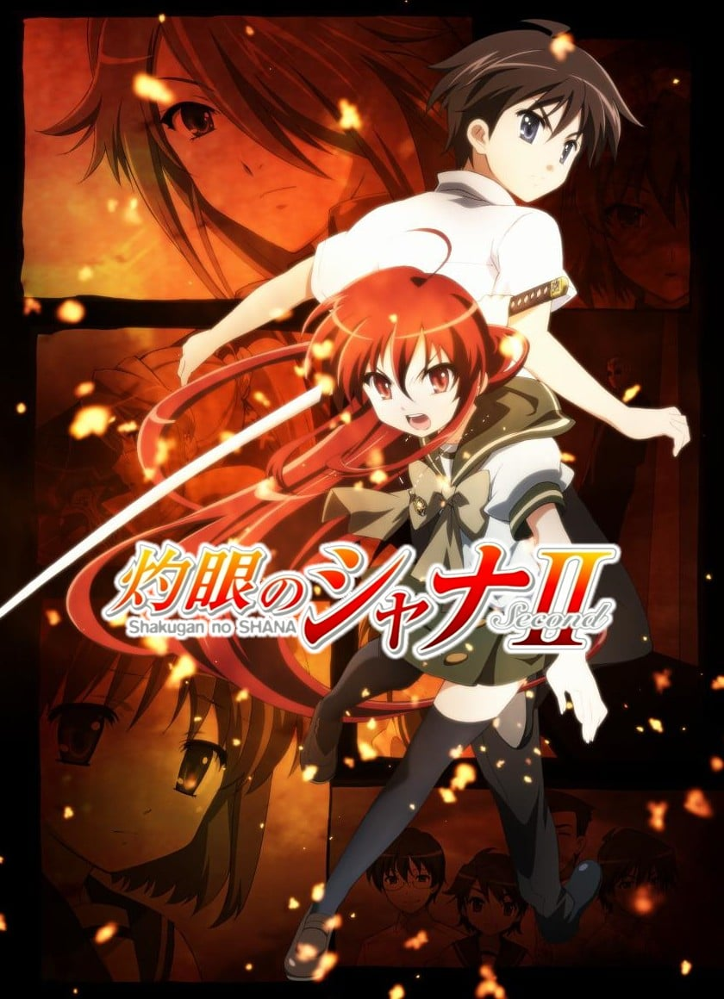
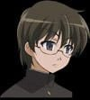
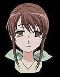

> [!bookinfo|noicon]+ **灼眼的夏娜II**
> 
>
| 日文名 | 灼眼のシャナII |
|:------: |:------------------------------------------: |
| 类型 | 小说改 |
| 新番 | 2007 年 10 月 |
| 集数 | 共24话 |
| 官网 | [http://www.shakugan.com/](https://http://www.shakugan.com/) |
| 制作 | J.C.STAFF |
| 导演 | 渡部高志 |
| 脚本 | 犬飼和彦,小林靖子,水上清資,白根秀樹 |
| 评分 | 7|
| 制片人 | 田部谷昌宏 |

> [!abstract]+ **简介**
> 夏天结束后，新学期开始了。
许多事物没有任何变化，但是同时也有不少事情逐渐发展着。
池和吉田，绪方和田中之间产生了些许微妙的关系。
还有在我身旁，飘逸着长发的夏娜。
但是，这一切似乎有着一丝奇怪的违何感。
在我们所不知道的地方，红世之徒再次展开了行动……

[简介原文]
バル・マスケとの戦いを終え、平和を取り戻した御崎市。
シャナと悠二は町にとどまり、穏やかな日々を過ごす。
だが、悠二を、宝具「零時迷子」を狙い新たな“徒”が現れる……。

> [!tip]+ **章节列表**
>- [ ] 第1话：再临之时 (2007-10-04)
>- [ ] 第2话：全部的序章 (2007-10-11)
>- [ ] 第3话：可疑的转校生 (2007-10-18)
>- [ ] 第4话：忧虑的少女 (2007-10-25)
>- [ ] 第5话：家庭的餐厅 (2007-11-01)
>- [ ] 第6话：试炼的前夜 (2007-11-08)
>- [ ] 第7话：池速人、荣光之日 (2007-11-15)
>- [ ] 第8话：通往过去的门 (2007-11-22)
>- [ ] 第9话：悲伤的里程碑 (2007-11-29)
>- [ ] 第10话：归来的男子 (2007-12-06)
>- [ ] 第11话：约定的两人 (2007-12-13)
>- [ ] 第12话：清秋祭开幕 (2007-12-20)
>- [ ] 第13话：收束、其后的预兆 (2008-01-10)
>- [ ] 第14话：永远的恋人 (2008-01-17)
>- [ ] 第15话：觉醒 (2008-01-24)
>- [ ] 第16话：无尽的思念 (2008-01-31)
>- [ ] 第17话：各自的道路 (2008-02-07)
>- [ ] 第18话：错综的悠二 (2008-02-14)
>- [ ] 第19话：没有说出的话语 (2008-02-21)
>- [ ] 第20话：暗红色的死斗 (2008-02-28)
>- [ ] 第21话：合众之力 (2008-03-06)
>- [ ] 第22话：圣诞前夕 (2008-03-13)
>- [ ] 第23话：危难之胎动 (2008-03-20)
>- [ ] 第24话：所要守护的人 (2008-03-27)

> [!tip]+ **主要角色**
> 
| 角色 | CV | 简介| 角色图片 |
|:----:|:---:|:---:|:--------:|
| シャナ | 釘宮理恵 | 继承了第一代“炎发灼眼的杀手”的火雾战士，作品的女主角。 　　在动画版中，身高被设定为141cm。从样貌看，是一个大约11或12岁的女孩，但因为订立了契约后，会变成长生不老，因此看不出她的真实年龄。 　　“夏娜”之名是悠二由其所持武器大太刀“贽殿遮那（台湾播出的动画中文版本翻成“贽殿纱那”）”命名的。其在尚未觉醒自燃的能力之前就定契约，因此作战以挥舞贽殿遮那和近身肉搏为主，在遇上悠二之前都是过着追杀红世使徒的流浪生活，在取代平井缘的存在之后，才开始其正常社交活动和处世的一面。 　　特别喜爱甜食，连喝咖啡也是喝特别甜的；最喜爱的食物是甜瓜包（又译密瓜包、菠萝包，日文原字为メロンパン（melon bun）），并自创一套理论：吃甜瓜包时，要先咬一口酥脆的外皮，再咬一口柔软的部份，在这两种口感相互交替，才能享受甜瓜包的美味。 　　性格非常倔强，为傲娇的代表人物之一，对悠二有很深厚的感情。口头禅是：“吵死了！吵死了！吵死了！（うるさい！うるさい！うるさい！）” 　　从小就居住在“天道宫”，跟着威尔艾米娜．卡梅尔还有专门训练他的梅利希姆(小白)，文武双全的杀手，御崎高中不少只会使用老师的地位却没有实际才能的老师在她的面前失去身为老师的尊严，后来就分成两种类型(正面对决和视而不见)，跟吉田一美算是情敌也算好友。在和法利亚葛尼的战斗被宝具“幸福扳机”强迫其体内的亚拉斯特尔显现，因此在和“悼文吟诵人”战斗中回想当时感受到的强大的自己，因而得到了使用火焰的能力，并学会使用火焰的翅膀飞翔，深信有悠二在旁没有办不到的事情。（2008中国萌战冠军，与C.C.并列萌王）（娇蛮版萝莉） 2016年世界最萌大赛萌王 |  |
| 坂井悠二 | 日野聡 | 御崎高中一年二班的学生，故事的开始时遇到封绝，在封绝中被磷子发现自身为内有宝具的密斯提斯因而被牵扯进了磷子与夏娜的战斗，也开始了身为体内藏有宝具“零时迷子”的“密斯提斯”的命运。其实真正的人类悠二早已被吞灭其存在之力，在故事一开始他就只是一个“火炬”，却在不明的情况下得到“零时迷子”且可以在封绝中自由行动，因此严格上他并非人类。 　　与其他火炬不同，“零时迷子”可以令他每天所消耗的存在之力于当日午夜十二时回复，使他不会消失，但是如果“零时迷子”遭破坏或者是被拿取出来，悠二还是有消失的可能。在小说中，悠二身上的“零时迷子”被加入了“戒禁”。在动画第一季中由“化装舞会”策划的将御崎市化为“存在之泉”的计划，使他拥有了与一般红世之王当量的存在之力，而且能作为上限每天被回复。 　　虽然没有明显的长处，没有强烈的上进心，却也不会因此怠惰，在学校的成绩也只是不上不下，可是当遇到困难时却可以表现出相当出色的观察力、判断力，也擅长找出重要关键，大家都对悠二这点感到有趣。感情迟钝，目前处于三角关系中。 |  |
| 吉田一美 | 川澄綾子 | 御崎高中一年二班的学生，内向且可爱的女生，在受过悠二和夏娜的帮助之后对他产生了好感，本片第二个女主角。面对的是最具压迫感的情敌，固执起来也是很可怕。其身材在同学之间闻名（主要可见于动画第一季OVA）。曾帮助过“调音师”卡姆辛。她有饲养一只名叫“艾卡特利娜”的小狗；自己也有一个名叫“小健”的弟弟（以上情节有在漫画版、动画版第一季提及）。 |  |
| アラストール | 江原正士 | 真名为“天壤劫火”。与夏娜订契约的红世魔王，行事正派，在红世里有“王”或是“神”的称号，至从第一代“灼眼的杀手”死亡后，就一直待在“天道宫”，在动画“红莲诞生之日”跟夏娜订下契约，扮演悠二跟夏娜指导者的角色，有着父亲的存在。曾经跟悠二的母亲以手机交谈过，也认同悠二的母亲──坂井千草的理念，神器为吊坠“克库特斯”，颜色是红莲。其显现后的型态为“天谴神(天罚神)”。 |  |
| 池速人 | 野島裕史 | 悠二国中以来的好友，戴眼镜的资优生，同时也是御崎高中一年二班上的班长，以擅长资料搜集及主持活动而自豪（然而事实上不喜欢忙碌工作）。对吉田有好感，却经常帮助她追求悠二，容易晕车，乘长途车时、电动娃娃车、云霄飞车、摩天轮都会晕昡。 |  |
| 佐藤啓作 | 野島健児 | 御崎高中一年二班的学生，长相俊美、言行轻佻的财团少爷，家中有珍藏好酒的酒吧，在动画第一季第五集成为玛琼琳·朵的部下，一心想要帮忙玛琼琳·朵，但是多次遭到阻碍跟拒绝，成为玛琼琳·朵心中影响力大的人物。 |  |
| 田中栄太 | 近藤孝行 | 御崎高中一年二班的学生，个性温和的大块头，跟佐藤一起成为玛琼琳·朵的部下，崇拜玛琼琳，尊称她为“大姐”，与同班同学绪方真竹发展为情侣关系。 |  |
| 緒方真竹 | 小林由美子 | 御崎高中一年二班的学生，班中活跃得像男孩子的女生，排球社的强力打手。身材一般，扮演领导者的角色，对田中荣太有好感，曾经向他表达好感，并且多次受到玛琼琳·朵的指导。 |  |
| 坂井千草 | 櫻井智 | 悠二的母亲，丈夫在海外工作。家事了得，聪慧娴淑，什么状况都能接受，对夏娜和威尔艾米娜均曾进行料理方面的指导。因其对生活琐事以及感情方面极为精通，使得夏娜对千草的话几乎唯命是从，于某次千草指点了夏娜的感情观后，使得亚拉斯特尔主动与千草进行对谈，结束后，亚拉斯特尔不仅对千草极为佩服，也将类似对夏娜的“监护权”的权利交予千草。常以“阿悠”和“小娜（或小夏娜） |  |
| 坂井贯太郎 | 藤原啓治 | 悠二的父亲，长期派驻国外工作不在家中，至小说第9卷（动画版为第二季）才登场，拥有杰出的洞察力。 |  |
| マージョリー・ドー | 生天目仁美 | 通称为“悼文吟诵人（又译悼词朗诵者）”的火雾战士，签约的红世魔王是“蹂躏的爪牙”马可西亚斯。 　　来自英国，身穿紫色套装、栗色长发扎马尾、碧眼、戴平光眼镜，身材姣好如超级名模一般的成熟美女。好战份子，只要有对象就针对目标一口气扫荡的性格，不分青红皂白的追杀拉弥。喜欢喝酒，酒品极差，宿醉时丑态百出，但还是一有机会就牛饮。对于调侃她的马可西亚斯会施以拳击，醉时则更施以酷刑——百回转。 　　她在作战时所念的咒语统称为“屠杀之即兴诗”。并且有个不为人知的凄惨过去，一心要找出“银”达成报复。 |  |
| マルコシアス | 岩田光央 | 真名为“蹂躏的爪牙”的红世魔王，显现时的外形是壮得像熊的狼。喜欢调侃契约人玛琼琳·朵。神器为大型精装书“格利摩尔”，炎色是群青；名字是来自恶魔Marchosias（地狱侯爵，形态为有角的狼）。经常说了一些令玛琼琳·朵不悦的说话而被殴打。（但在玛琼琳·朵遭受挫折及情绪低落时始终选择安慰而非调侃） |  |