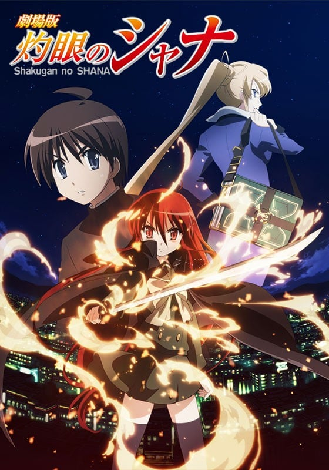
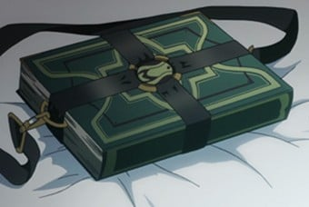
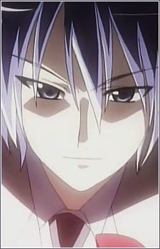
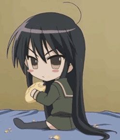
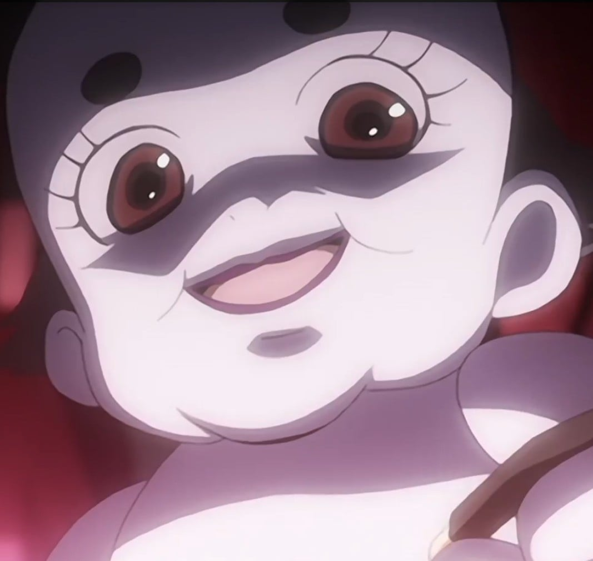
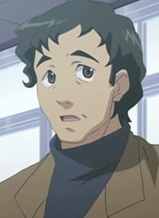

> [!bookinfo|noicon]+ **灼眼的夏娜 剧场版**
> 
>
| 日文名 | 劇場版 灼眼のシャナ |
|:------: |:------------------------------------------: |
| 类型 | 小说改 |
| 新番 | 2007 年 4 月 |
| 集数 | 共1话 |
| 官网 | [http://www.shakugan.com/movie/index.html](https://http://www.shakugan.com/movie/index.html) |
| 制作 | J.C.STAFF |
| 导演 | 渡部高志 |
| 脚本 | 小林靖子 |
| 评分 | 6.7|
| 制片人 | 松倉友二 |

> [!abstract]+ **简介**
> 　　此次的剧场版是小说第一卷内容的再构成。既是夏娜与悠二相遇相识的过程，也是TV动画版中曾经播出过的情节。不过作为剧场版，必然会在画面、情节等诸多方面做出更大的改进和加强。

> [!tip]+ **章节列表**
>- [ ] 第1话： (2007-04-21)

> [!tip]+ **主要角色**
> 
| 角色 | CV | 简介| 角色图片 |
|:----:|:---:|:---:|:--------:|
| シャナ | 釘宮理恵 | 继承了第一代“炎发灼眼的杀手”的火雾战士，作品的女主角。 　　在动画版中，身高被设定为141cm。从样貌看，是一个大约11或12岁的女孩，但因为订立了契约后，会变成长生不老，因此看不出她的真实年龄。 　　“夏娜”之名是悠二由其所持武器大太刀“贽殿遮那（台湾播出的动画中文版本翻成“贽殿纱那”）”命名的。其在尚未觉醒自燃的能力之前就定契约，因此作战以挥舞贽殿遮那和近身肉搏为主，在遇上悠二之前都是过着追杀红世使徒的流浪生活，在取代平井缘的存在之后，才开始其正常社交活动和处世的一面。 　　特别喜爱甜食，连喝咖啡也是喝特别甜的；最喜爱的食物是甜瓜包（又译密瓜包、菠萝包，日文原字为メロンパン（melon bun）），并自创一套理论：吃甜瓜包时，要先咬一口酥脆的外皮，再咬一口柔软的部份，在这两种口感相互交替，才能享受甜瓜包的美味。 　　性格非常倔强，为傲娇的代表人物之一，对悠二有很深厚的感情。口头禅是：“吵死了！吵死了！吵死了！（うるさい！うるさい！うるさい！）” 　　从小就居住在“天道宫”，跟着威尔艾米娜．卡梅尔还有专门训练他的梅利希姆(小白)，文武双全的杀手，御崎高中不少只会使用老师的地位却没有实际才能的老师在她的面前失去身为老师的尊严，后来就分成两种类型(正面对决和视而不见)，跟吉田一美算是情敌也算好友。在和法利亚葛尼的战斗被宝具“幸福扳机”强迫其体内的亚拉斯特尔显现，因此在和“悼文吟诵人”战斗中回想当时感受到的强大的自己，因而得到了使用火焰的能力，并学会使用火焰的翅膀飞翔，深信有悠二在旁没有办不到的事情。（2008中国萌战冠军，与C.C.并列萌王）（娇蛮版萝莉） 2016年世界最萌大赛萌王 |  |
| 坂井悠二 | 日野聡 | 御崎高中一年二班的学生，故事的开始时遇到封绝，在封绝中被磷子发现自身为内有宝具的密斯提斯因而被牵扯进了磷子与夏娜的战斗，也开始了身为体内藏有宝具“零时迷子”的“密斯提斯”的命运。其实真正的人类悠二早已被吞灭其存在之力，在故事一开始他就只是一个“火炬”，却在不明的情况下得到“零时迷子”且可以在封绝中自由行动，因此严格上他并非人类。 　　与其他火炬不同，“零时迷子”可以令他每天所消耗的存在之力于当日午夜十二时回复，使他不会消失，但是如果“零时迷子”遭破坏或者是被拿取出来，悠二还是有消失的可能。在小说中，悠二身上的“零时迷子”被加入了“戒禁”。在动画第一季中由“化装舞会”策划的将御崎市化为“存在之泉”的计划，使他拥有了与一般红世之王当量的存在之力，而且能作为上限每天被回复。 　　虽然没有明显的长处，没有强烈的上进心，却也不会因此怠惰，在学校的成绩也只是不上不下，可是当遇到困难时却可以表现出相当出色的观察力、判断力，也擅长找出重要关键，大家都对悠二这点感到有趣。感情迟钝，目前处于三角关系中。 |  |
| 吉田一美 | 川澄綾子 | 御崎高中一年二班的学生，内向且可爱的女生，在受过悠二和夏娜的帮助之后对他产生了好感，本片第二个女主角。面对的是最具压迫感的情敌，固执起来也是很可怕。其身材在同学之间闻名（主要可见于动画第一季OVA）。曾帮助过“调音师”卡姆辛。她有饲养一只名叫“艾卡特利娜”的小狗；自己也有一个名叫“小健”的弟弟（以上情节有在漫画版、动画版第一季提及）。 |  |
| 池速人 | 野島裕史 | 悠二国中以来的好友，戴眼镜的资优生，同时也是御崎高中一年二班上的班长，以擅长资料搜集及主持活动而自豪（然而事实上不喜欢忙碌工作）。对吉田有好感，却经常帮助她追求悠二，容易晕车，乘长途车时、电动娃娃车、云霄飞车、摩天轮都会晕昡。 |  |
| 平井ゆかり | 浅野真澄 | 御崎高中一年二班的学生，坐在悠二隔壁座位的女生，常与悠二讨论功课，对池速人有好感，在原著小说及漫画版中对于她并没有做出详细的交代，只知她与家人早已变成火炬，由夏娜在她消失前占去其存在。动画版中改成于回家途中遭磷子攻击，被吸取了存在之力，夏娜在她消失当日为她制作火炬，但在第二天即熄灭消失，悠二在动画版中对本尊平井缘也是火炬的存在，而感到难过尽力的想让大家不要忘记她的存在，可惜最后还是因为存在之力的消耗而渐渐失去存在感。与原著一样后来被夏娜取代。平井缘本人的人格已不复存在，形同死亡。 |  |
| マルコシアス | 岩田光央 | 真名为“蹂躏的爪牙”的红世魔王，显现时的外形是壮得像熊的狼。喜欢调侃契约人玛琼琳·朵。神器为大型精装书“格利摩尔”，炎色是群青；名字是来自恶魔Marchosias（地狱侯爵，形态为有角的狼）。经常说了一些令玛琼琳·朵不悦的说话而被殴打。（但在玛琼琳·朵遭受挫折及情绪低落时始终选择安慰而非调侃） |  |
| ヴィルヘルミナ・カルメル |  | 和红世魔王“梦幻冠带”契约，通称为“万条巧手”的火雾战士。为实现先代“炎发灼眼的杀手”的遗愿，于“天道宫”上培育夏娜成为现任“炎发灼眼的杀手”，为构成夏娜个性及回忆的要人之一，其角色地位相当于夏娜的母亲。 　　口头禅为语末加上“～是也（～であります）”，总是作古式女仆装扮，为人古肃谨直，面无表情且待人冷淡，但暗地里却极易动情且对夏娜呵护备至。 　　作战时放出缎带构成各种结构作攻防为其绝技，不擅长进攻，但活用战技及防御使其成为强大的火雾战士之一，因此也被称为“战技无双的舞踏姬”。战斗状态搭配狐脸面具型神器“佩尔苏娜”。对“虹之翼”梅利希姆抱有淡淡的爱情。 |  |
| フリアグネ | 諏訪部順一 | 外表是世上不存在梦幻般白衣美男子，因收集宝具跟猎杀火雾战士而有“猎人”之名，能自由使用多种宝具，并已消灭数个火雾战士的红世魔王。为了使“磷子”玛莉安奴成为真实的存在而企图引发“吞食城市”，使用“幸福扳机”、“蓝天（又译湛蓝）”、“舞会”、“泡沫锁链”让夏娜陷入苦战，被现身的亚拉斯特尔所败。炎色为白。动画版中删去了“舞会”的人偶大战，直接与夏娜单对单决斗，最后因玛琼琳．朵中途介入战场而被夏娜趁机加以打倒。 |  |
| シャナたん |  |  |  |
| マリアンヌ | こやまきみこ |  |  |
| 燐子 | 新井里美 |  |  |
| 大峰悟 | 保村真 | 名前はアニメ版のみ。悠二たちのクラス担任。温厚な性格。 ドラマCDでは、教職に就く前はメロンパン職人だったと語っている。　 |  |