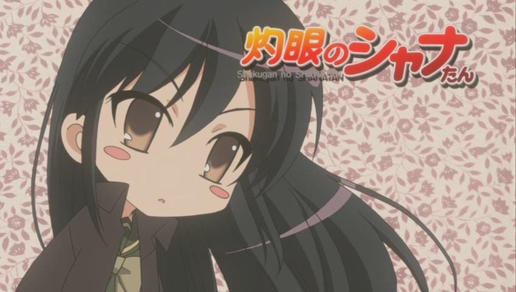
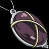
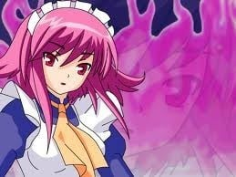
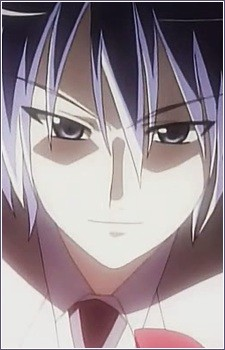
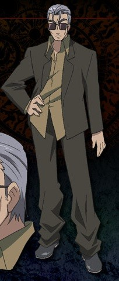
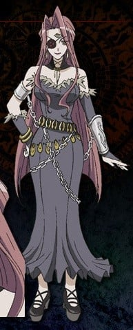

> [!bookinfo|noicon]+ **灼眼的夏娜炭**
> 
>
| 日文名 | 灼眼のシャナたん |
|:------: |:------------------------------------------: |
| 类型 | 小说改 |
| 新番 | 2006 年 1 月 |
| 集数 | 共15话 |
| 官网 |  |
| 制作 | J.C.STAFF |
| 导演 |  |
| 脚本 |  |
| 评分 | 6.9|
| 制片人 |  |

> [!abstract]+ **简介**
> 各话从属的主线如下：
ep1~3：灼眼のシャナ
ep4~6：劇場版 灼眼のシャナ
ep7~9：灼眼のシャナII -Second- 
ep10~13：灼眼のシャナS
ep14~15：灼眼のシャナIII -Final-

> [!tip]+ **章节列表**
>- [ ] 第1话：灼眼的夏娜炭 (2006-01-25)
>- [ ] 第2话：灼眼的夏娜炭 Returns (2006-05-25)
>- [ ] 第3话：頂之座 Hecate炭 (2006-10)
>- [ ] 第4话：灼眼的夏娜炭 剧场版公开前夕 (2007-04-04)
>- [ ] 第5话：卡梅爾桑的Bonjour (2007-09-21)
>- [ ] 第6话：灼眼的夏娜炭@剧场板Ver (2007-09-21)
>- [ ] 第7话：灼眼的夏娜炭 BEGINS (2008-01-25)
>- [ ] 第8话：灼眼的夏娜炭&amp;吉田 -近衛史菜的逆襲- (2008-05-23)
>- [ ] 第9话：灼眼的夏娜炭 Revenge (2009-10-19)
>- [ ] 第10话：灼眼的夏娜炭G (2009-10-23)
>- [ ] 第11话：灼眼的夏娜炭2dos (2010-02-26)
>- [ ] 第12话：灼眼的夏娜炭3tri~ (2010-06-25)
>- [ ] 第13话：灼眼的夏娜炭FRONTIER (2010-09-29)
>- [ ] 第14话：灼眼的夏娜炭 Final Destruction (2012-01-27)
>- [ ] 第15话：灼眼的夏娜炭 Final Destruction (2012-05-30)

> [!tip]+ **主要角色**
> 
| 角色 | CV | 简介| 角色图片 |
|:----:|:---:|:---:|:--------:|
| 坂井悠二 | 日野聡 | 御崎高中一年二班的学生，故事的开始时遇到封绝，在封绝中被磷子发现自身为内有宝具的密斯提斯因而被牵扯进了磷子与夏娜的战斗，也开始了身为体内藏有宝具“零时迷子”的“密斯提斯”的命运。其实真正的人类悠二早已被吞灭其存在之力，在故事一开始他就只是一个“火炬”，却在不明的情况下得到“零时迷子”且可以在封绝中自由行动，因此严格上他并非人类。 　　与其他火炬不同，“零时迷子”可以令他每天所消耗的存在之力于当日午夜十二时回复，使他不会消失，但是如果“零时迷子”遭破坏或者是被拿取出来，悠二还是有消失的可能。在小说中，悠二身上的“零时迷子”被加入了“戒禁”。在动画第一季中由“化装舞会”策划的将御崎市化为“存在之泉”的计划，使他拥有了与一般红世之王当量的存在之力，而且能作为上限每天被回复。 　　虽然没有明显的长处，没有强烈的上进心，却也不会因此怠惰，在学校的成绩也只是不上不下，可是当遇到困难时却可以表现出相当出色的观察力、判断力，也擅长找出重要关键，大家都对悠二这点感到有趣。感情迟钝，目前处于三角关系中。 |  |
| 吉田一美 | 川澄綾子 | 御崎高中一年二班的学生，内向且可爱的女生，在受过悠二和夏娜的帮助之后对他产生了好感，本片第二个女主角。面对的是最具压迫感的情敌，固执起来也是很可怕。其身材在同学之间闻名（主要可见于动画第一季OVA）。曾帮助过“调音师”卡姆辛。她有饲养一只名叫“艾卡特利娜”的小狗；自己也有一个名叫“小健”的弟弟（以上情节有在漫画版、动画版第一季提及）。 |  |
| アラストール | 江原正士 | 真名为“天壤劫火”。与夏娜订契约的红世魔王，行事正派，在红世里有“王”或是“神”的称号，至从第一代“灼眼的杀手”死亡后，就一直待在“天道宫”，在动画“红莲诞生之日”跟夏娜订下契约，扮演悠二跟夏娜指导者的角色，有着父亲的存在。曾经跟悠二的母亲以手机交谈过，也认同悠二的母亲──坂井千草的理念，神器为吊坠“克库特斯”，颜色是红莲。其显现后的型态为“天谴神(天罚神)”。 |  |
| 池速人 | 野島裕史 | 悠二国中以来的好友，戴眼镜的资优生，同时也是御崎高中一年二班上的班长，以擅长资料搜集及主持活动而自豪（然而事实上不喜欢忙碌工作）。对吉田有好感，却经常帮助她追求悠二，容易晕车，乘长途车时、电动娃娃车、云霄飞车、摩天轮都会晕昡。 |  |
| 平井ゆかり | 浅野真澄 | 御崎高中一年二班的学生，坐在悠二隔壁座位的女生，常与悠二讨论功课，对池速人有好感，在原著小说及漫画版中对于她并没有做出详细的交代，只知她与家人早已变成火炬，由夏娜在她消失前占去其存在。动画版中改成于回家途中遭磷子攻击，被吸取了存在之力，夏娜在她消失当日为她制作火炬，但在第二天即熄灭消失，悠二在动画版中对本尊平井缘也是火炬的存在，而感到难过尽力的想让大家不要忘记她的存在，可惜最后还是因为存在之力的消耗而渐渐失去存在感。与原著一样后来被夏娜取代。平井缘本人的人格已不复存在，形同死亡。 |  |
| マージョリー・ドー | 生天目仁美 | 通称为“悼文吟诵人（又译悼词朗诵者）”的火雾战士，签约的红世魔王是“蹂躏的爪牙”马可西亚斯。 　　来自英国，身穿紫色套装、栗色长发扎马尾、碧眼、戴平光眼镜，身材姣好如超级名模一般的成熟美女。好战份子，只要有对象就针对目标一口气扫荡的性格，不分青红皂白的追杀拉弥。喜欢喝酒，酒品极差，宿醉时丑态百出，但还是一有机会就牛饮。对于调侃她的马可西亚斯会施以拳击，醉时则更施以酷刑——百回转。 　　她在作战时所念的咒语统称为“屠杀之即兴诗”。并且有个不为人知的凄惨过去，一心要找出“银”达成报复。 |  |
| マルコシアス | 岩田光央 | 真名为“蹂躏的爪牙”的红世魔王，显现时的外形是壮得像熊的狼。喜欢调侃契约人玛琼琳·朵。神器为大型精装书“格利摩尔”，炎色是群青；名字是来自恶魔Marchosias（地狱侯爵，形态为有角的狼）。经常说了一些令玛琼琳·朵不悦的说话而被殴打。（但在玛琼琳·朵遭受挫折及情绪低落时始终选择安慰而非调侃） |  |
| ヴィルヘルミナ・カルメル | 伊藤静 | 和红世魔王“梦幻冠带”契约，通称为“万条巧手”的火雾战士。为实现先代“炎发灼眼的杀手”的遗愿，于“天道宫”上培育夏娜成为现任“炎发灼眼的杀手”，为构成夏娜个性及回忆的要人之一，其角色地位相当于夏娜的母亲。 　　口头禅为语末加上“～是也（～であります）”，总是作古式女仆装扮，为人古肃谨直，面无表情且待人冷淡，但暗地里却极易动情且对夏娜呵护备至。 　　作战时放出缎带构成各种结构作攻防为其绝技，不擅长进攻，但活用战技及防御使其成为强大的火雾战士之一，因此也被称为“战技无双的舞踏姬”。战斗状态搭配狐脸面具型神器“佩尔苏娜”。对“虹之翼”梅利希姆抱有淡淡的爱情。 |  |
| フリアグネ | 諏訪部順一 | 外表是世上不存在梦幻般白衣美男子，因收集宝具跟猎杀火雾战士而有“猎人”之名，能自由使用多种宝具，并已消灭数个火雾战士的红世魔王。为了使“磷子”玛莉安奴成为真实的存在而企图引发“吞食城市”，使用“幸福扳机”、“蓝天（又译湛蓝）”、“舞会”、“泡沫锁链”让夏娜陷入苦战，被现身的亚拉斯特尔所败。炎色为白。动画版中删去了“舞会”的人偶大战，直接与夏娜单对单决斗，最后因玛琼琳．朵中途介入战场而被夏娜趁机加以打倒。 |  |
| シュドナイ | 三宅健太 | 真名为“千变”的红世魔王，外表为穿戴墨镜西服，吸烟中年男性，显现时可变身为身种外型不同的合成兽。他受爱染兄妹（苏拉特和蒂丽亚）委托而担任保护他们免受火雾战士的攻击，但实际上为组织红世使徒邪恶组织“化妆舞会”的“将军”。在组织中他偶然有意无意地接近黑卡蒂，似乎是超过一般程度地照顾和关心她。与玛琼琳．朵似乎是长久以来的敌人，持有攻击力强大的宝具“神铁如意”，但限于执行“敕令”时使用。炎色为混浊的紫色。 |  |
| ヘカテー | 能登麻美子 | 真名为“顶之座”的红世魔王，头戴大帽子，身披大披风，长着及肩浅蓝发，无机质的少女。为红世使徒邪恶组织“化妆舞会”的“巫女”，对修德南冷淡，但称丹塔利欧为“叔叔”。自身可容纳极大量，甚至无限多的存在之力，其他一切不明。持有宝具“三角锡杖”但限于执行“敕令”时使用。炎色为天蓝色。 |  |
| ベルペオル | 大原さやか | 真名为“逆理裁判者”的红世魔王，拥有高佻身材，身上戴着大型锁链形饰物，右眼戴眼罩，长着三只眼睛的长发洋装女性。为红世使徒邪恶组织“化妆舞会”的“参谋”，处理“化妆舞会”的极大多数事务，虽然能干但极度无情，将部下视为耗材，用完即弃，在战斗方面拥有惊人的实力在动画版中曾让威尔艾米娜陷入苦战。持有宝具“地狱锁链”但限于执行敕令时使用，炎色为金色。 |  |