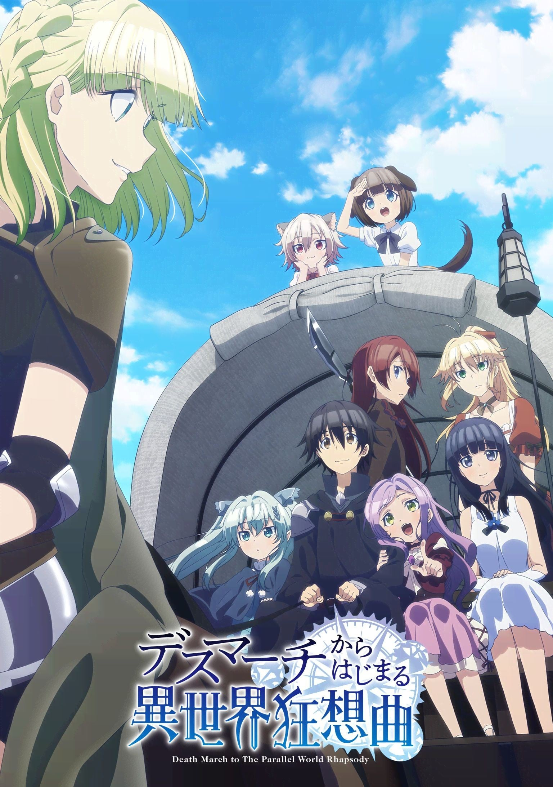

> [!bookinfo|noicon]+ **爆肝工程师的异世界狂想曲**
> 
>
| 日文名 | デスマーチからはじまる異世界狂想曲 |
|:------: |:------------------------------------------: |
| 类型 | 小说改 |
| 新番 | 2018 年 1 月 |
| 集数 | 共12话 |
| 官网 | [http://deathma-anime.com](https://http://deathma-anime.com) |
| 制作 | CONNECT |
| 导演 | 大沼心 |
| 脚本 | 下山健人 |
| 评分 | 5.4|
| 制片人 | 田部谷昌宏 |

> [!abstract]+ **简介**
> 正在爆肝加班当中的程式设计师，游戏中名为“佐藤”的铃木一郎（29岁）。
原本应该在小睡片刻的他，回过神竟发现自己被放逐到了陌生的异世界。
连慌乱的闲暇都没有，一大群从未见过的怪物逼近眼前，流星雨自天空倾盆而降——
然后转眼间，最强等级的力量和巨额财富都得手了。
就这样，佐藤“温馨，时而严肃，并兼具后宫”的异世界冒险故事就此展开。

> [!tip]+ **章节列表**
>- [ ] 第1话：爆肝开始的天地异变 (2018-01-11)
>- [ ] 第2话：爆肝开始的街头散步 (2018-01-18)
>- [ ] 第3话：爆肝开始的恋爱事件 (2018-01-25)
>- [ ] 第4话：爆肝开始的迷宫探索 (2018-02-01)
>- [ ] 第5话：爆肝开始的疯狂公主 (2018-02-08)
>- [ ] 第6话：爆肝开始的都市保卫战 (2018-02-15)
>- [ ] 第7话：爆肝开始的露营训练 (2018-02-22)
>- [ ] 第8话：爆肝开始的不老不死 (2018-03-01)
>- [ ] 第9话：爆肝开始的情感纠葛 (2018-03-08)
>- [ ] 第10话：爆肝开始的狩猎进行曲 (2018-03-15)
>- [ ] 第11话：爆肝开始的幻想阴谋 (2018-03-22)
>- [ ] 第12话：爆肝开始的异（世）界旅情 (2018-03-29)

> [!tip]+ **主要角色**
> 
| 角色 | CV | 简介| 角色图片 |
|:----:|:---:|:---:|:--------:|
| サトゥー | 堀江瞬 | デスマーチ中に仮眠を取っていたはずが、気がつくと異世界に迷い込んでしまっていた。本名は鈴木一郎。最高レベルの力と莫大な財宝を手に入れ、異世界生活を堪能中！ |  |
| ゼナ・マリエンテール | 高橋李依 | マリエンテール士爵家の娘にしてセーリュー伯爵領軍の魔法兵。風の魔法が得意。サトゥーが初めて言葉を交わした異世界人。薄い金髪で痩せ形の地味系美人。17歳。 ワイバーン戦でサトゥーに救われて以来彼に好意を寄せるようになり、何度かセーリュー市でデートしている。 |  |
| ポチ | 河野ひより | 犬耳族（Web版では犬人族）の少女。10歳。茶髪のボブカット。 リザ、タマと共にザイクーオン神殿による扇動に利用されていたが、セーリュー市内での迷宮騒動渦中に主人が死亡し、サトゥーに拾われ脱出を共にする。｢取り替え子｣として親から捨てられたせいで、当初は名前を持たず以前の主人からは「犬」と呼ばれていたが、サトゥーに名付けられて以後彼の奴隷として旅に同行する。語尾に「～なのです」と付けるのが特徴。タマと仲が良くいつも一緒にいる。肉好き。｢片手剣｣｢投擲｣スキルを持ち、前衛として活躍する。少々粗忽で、一行の中ではオチを飾ることが多い。 |  |
| タマ | 奥野香耶 | 猫耳族（Web版では猫人族）の少女。10歳。白髪ショートヘアー。 リザ、ポチと共にザイクーオン神殿による扇動に利用されていたが、セーリュー市内での迷宮騒動渦中に主人が死亡し、サトゥーに拾われ脱出を共にする。｢取り替え子｣として親から捨てられたせいで、当初は名前を持たず以前の主人からは「猫」と呼ばれていたが、サトゥーに名付けられて以後彼の奴隷として旅に同行する。間延びした語尾が特徴ののんびり屋だが、直感が非常に鋭い。ポチと仲が良くいつも一緒にいる。｢片手剣｣｢投擲｣スキルを持ち、前衛として活躍する。ある種の天才肌で年齢からは想像できないような画才の持ち主でもある。肉好き。 |  |
| リザ | 津田美波 | 橙鱗族（Web版では蜥蜴人族）の少女。18歳。赤い長髪でスレンダーな体型。 鼬帝国との戦争で故国を失い奴隷に落ち、タマ、ポチと共にザイクーオン神殿による扇動に利用されていたが、セーリュー市内での迷宮騒動渦中に主人が死亡し、サトゥーに拾われ脱出を共にする。以後サトゥーの奴隷として旅に同行する。命の恩人であり、主であるサトゥーに忠誠を誓っている。初めから｢槍｣スキルを持っており、前衛の要となっている。真面目な性格で、一行の中では年長組であることから子供たちの保護者的な役割も務めている。｢料理｣スキルの保有者でもあり、サトゥーやルルがスキルを手に入れるまでは厨房を一手に引き受けていた。成人後に奴隷落ちしたので本来の名前があったが、それは長い上に擦過音が混じる呼びにくいものであった為、本人の希望によりサトゥーに新たに名付けられた。肉好き。高所恐怖症。 |  |
| アリサ | 悠木碧 | 故国クボォーク王国の王女。11歳。実はサトゥーと同じ日本人で前世の名前は橘 亜里沙（たちばな ありさ）。北欧系の美少女だが忌み色とされる紫色の髪と瞳を持ち、「亡国の魔女」「乱心王女」の称号を持つ。陰謀によって失敗した農業改革の責任を負わされ、現在は「強制（ギアス）」によって奴隷に身を落としている。 迷宮騒動で懇意となった奴隷商人に連れられたサトゥーにルルと共に買われ、その旅に同行する。前世からの筋金入りのショタコンであり、初対面でサトゥーに一目惚れし、度々セクハラまがいの行動に出ることがあるが逆に迫られるのは苦手。ユニークスキルは2つで、全魔力・スタミナを消費して一撃の威力を何倍にも引き上げる「不撓不屈（ネバー・ギブアップ）」と最大3回という制約があるが一定確率で防御やレベル差を突破できる「全力全開（オーバー・ブースト）」を持つ。家族に隠れて習得した「精神魔法」スキルを持っていたが、公都にてリセットを行い｢空間魔法｣スキルを獲得した。 その特殊な出自からサトゥーの事情をある程度教えられており、見た目以上にしっかり者で一行の中では参謀役。ただしかなりの自爆体質も持ち合わせる残念なところがあり、言動の端々に昭和臭が漂う[注 4]。前世ではコスプレを自作していたらしく裁縫を得意としている。喪女のまま生涯を終えたこともあってリア充に敵意を抱くこともあり、サトゥーに悪い虫がつきそうな気配にはかなり敏感。 |  |
| ルル | 早瀬莉花 | アリサの腹違いの姉（庶子）。14歳。その立場から王城でメイドとして働いていたが、アリサと同じく「強制（ギアス）」によって奴隷に身を落としている。サトゥー曰く「傾星」クラスの黒髪美少女で、外見はサガ帝国の勇者であった曾祖父からの遺伝。だが、その外見はこの世界の人間には是とされず、本人も自身の外見にコンプレックスを持っている。アリサと共にサトゥーに買われ、以後行動を共にする。当初はコンプレックスもあって男性恐怖症に陥っていたが、自分の容姿を嫌わないでくれたサトゥーに好意を寄せるようになり、次第に女の子らしい感情を表すようになった。 当初は完全な非戦闘員だったが自らの意思で戦闘に参加するようになり、レベルアップの結果｢射撃｣スキルに目覚め魔法銃を武器とする後衛として活躍できるようになる。また｢操車｣｢詠唱｣｢調理｣スキルも獲得しており、特に最近では料理の腕も上がってきている。 |  |
| ミーア | 永野愛理 | 本名はミサナリーア・ボルエナン。ボルエナンの森の最も年若いエルフ。エメラルドグリーンの瞳に薄い青緑色の長髪で外見は12、3歳だが、実年齢は130歳。 ゼンによって故郷から攫われ、その後経緯を経てサトゥーと出会い、故郷へ送ってもらうことになる。二度も命を救ってくれたサトゥーに異種族でありながら好意を寄せており、アリサと共に｢鉄壁ペア｣として彼に近づく女性たちを警戒している。たびたび｢婚約者」｢相思相愛｣を主張しているものの、サトゥーから見れば外見年齢が恋愛対象外であるせいで流されている。普段は無口で会話の際も一言、二言しか話さないが、感情が高ぶったり酒に酔ったりすると饒舌になる。またエルフとの会話では何もなくても普通に会話できる。 ギフトに｢精霊視｣スキルを持ち、このスキルによってサトゥーの居場所を探ることができる。また｢弓｣と｢水魔法｣スキルを持つため回復を兼ねた後衛として活躍する。 ミーアを両親の元に届けるのが旅の目的の一つであり、当初はボルエナンの里に着いた時点で別れる予定だったが、作戦勝ちに近い形でサトゥーと制約の口づけを交わし、親からも認められてそれ以降の旅にも同行することになる。 |  |
| ナナ | 安野希世乃 | 魔術師ゼンにより、トラザユーヤ・ボルエナンの研究を基に作られたホムンクルスNo.7。ミーアをベースとしていると推察され外見が酷似しているが、金髪でEカップの巨乳美女。が、実年齢は0歳。種族の固有スキルである「理術」を使った戦闘を得意とする。「～～すると○○します」などといった変わった口調で話すが、他のホムンクルスは基本番号が若いほど言葉が流暢になる。ゼン亡き後はホムンクルスの姉妹たちとの勝負でサトゥーに同行する権利を勝ち取り、彼を「マスター」と呼び行動を共にする。その際、サトゥーに「No.7」から「ナナ」と命名された。現在は｢人成りの護符｣という隠蔽アイテムで人族に偽装している。可愛いもの好き。 戦闘時のポジションは前衛で｢理術｣の身体強化や｢盾｣｢挑発｣といったスキルを使う。 |  |