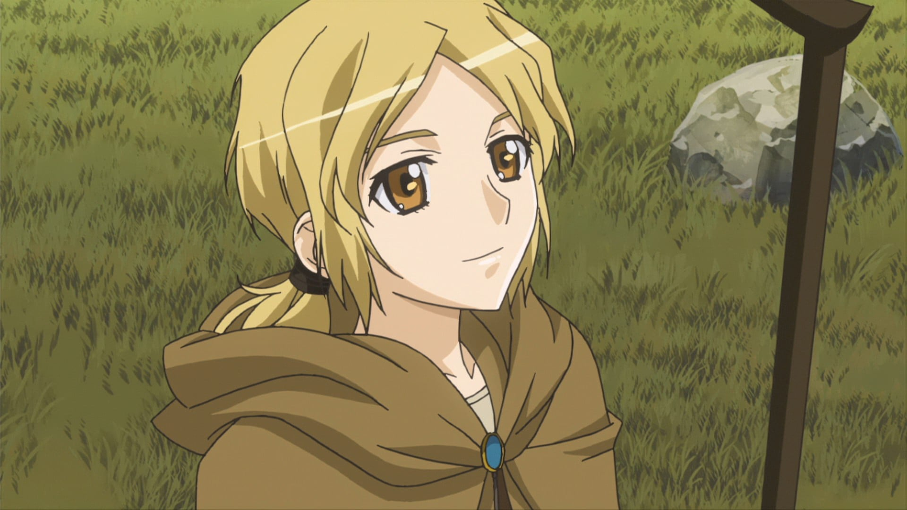
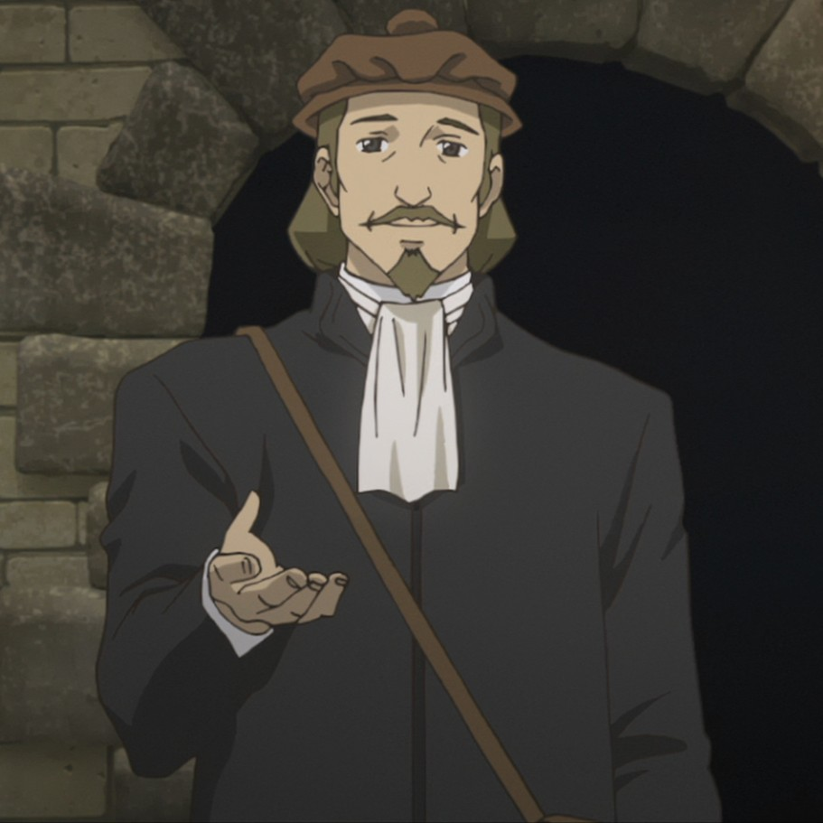
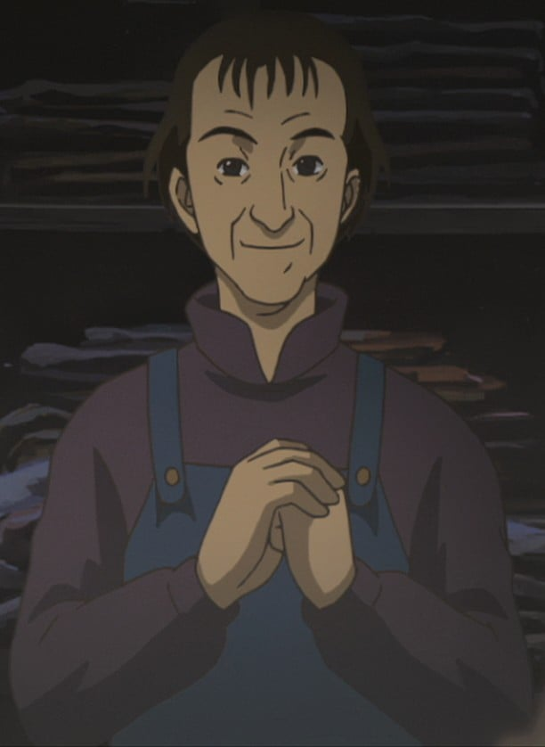
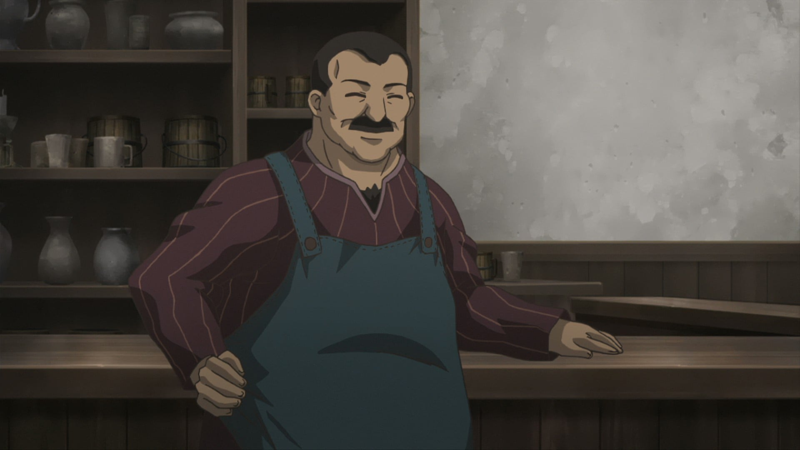

> [!bookinfo|noicon]+ **狼与香辛料**
> 
>
| 日文名 | 狼と香辛料 |
|:------: |:------------------------------------------: |
| 类型 | 小说改 |
| 新番 | 2008 年 1 月 |
| 集数 | 共13话 |
| 官网 | [http://spicy-wolf.com/1st/top.html](https://http://spicy-wolf.com/1st/top.html) |
| 制作 | イマジン |
| 导演 | 高橋丈夫 |
| 脚本 | 荒川稔久 |
| 评分 | 7.8|
| 制片人 | 中塚裕治 |

> [!abstract]+ **简介**
> 到处旅行靠贩卖一些小商品为生的商人罗兰斯，从因为收获祭而沸腾的帕斯洛耶村回来后却发现自己的运货马车中貌似有什么东西在里面，罗兰斯把麦束拨开一看，里面却睡着一只长有狼耳和狼尾巴的少女。这位少女自称是“掌控丰收的贤狼——赫萝”，靠麦子为生的她如果脖子上挂的帕斯洛耶麦子遗失了就会死。赫萝死赖着劳伦斯希望他能够带她回到遥远的北方故乡，于是，狼女与商人“完全没有剑与魔法的”旅行由此展开……

> [!tip]+ **章节列表**
>- [ ] 第1话：第一幕 狼与唯一的华服 (2008-01-08)
>- [ ] 第2话：第二幕 狼与遥远的过去 (2008-01-15)
>- [ ] 第3话：第三幕 狼与商业才能 (2008-01-22)
>- [ ] 第4话：第四幕 狼与无力的伙伴 (2008-01-29)
>- [ ] 第5话：第五幕 狼与争风吃醋 (2008-02-05)
>- [ ] 第6话：第六幕 狼与无言的离别 (2008-02-12)
>- [ ] 第7话：第七幕 狼与幸福的尾巴 (2008-05-30)
>- [ ] 第8话：第八幕 狼与准确的天秤 (2008-02-19)
>- [ ] 第9话：第九幕 狼与牧羊人的羔羊 (2008-02-26)
>- [ ] 第10话：第十幕 狼与旋涡般的阴谋 (2008-03-04)
>- [ ] 第11话：第十一幕 狼与最大的秘计 (2008-03-11)
>- [ ] 第12话：第十二幕 狼与成群的年轻人 (2008-03-18)
>- [ ] 第13话：第十三幕 狼与新的旅程 (2008-03-25)

> [!tip]+ **主要角色**
> 
| 角色 | CV | 简介| 角色图片 |
|:----:|:---:|:---:|:--------:|
| ホロ | 小清水亜美 | 外表是拥有狼耳与尾巴的少女，但实际上是神话中被称为神明的巨狼。自称为贤狼赫萝，寄宿在帕斯罗村的麦子中带来长期丰收。在帕斯罗村的庆典中从帕斯罗村的仓库逃入罗伦斯马车上的麦子(因为赫萝可以从小把的麦逃到大把的麦中,村民也有说过:「如果收割太贪心的话,丰收之神赫萝会逃走的」这句话)，与罗伦斯一同行商，想回到遥远北方的出生故乡“约伊兹森林”。      跟自称“贤狼”相符的冷静老练言语，丰富的经验与智慧常常拯救罗伦斯。性格自大，但因为长期离开故乡因此有着孤独脆弱的一面。     赫萝以15岁左右的可爱少女模样出现，第一人称词为“咱”（日语：わっち（＝私）），第二人称词为“汝”，语助词则以“呗”（日语：～でありんす）作结，这种独特的口癖是受到花魁的影响。与罗伦斯共同遭遇了各种事情，途中虽然常常主导对话，但也有因为不了解现代知识而被驳倒的时候。喜欢美味的食物与酒，但似乎特别喜欢苹果及甜食。在追伊弗的时候，意外被罗伦斯发现，赫萝怕水。      喜欢帮助他人，但对方没有要求，赫萝也不会去回应，对于无法出一份力的自己感到有些自责。      对自己的美丽尾巴十分自豪，不懈怠地用梳子整理以及清除跳蚤。十分喜欢被别人赞美尾巴，如果糟蹋了她的尾巴，将会发生无法预知的严重后果。 |  |
| クラフト・ロレンス | 福山潤 | 旅行各地经商维生的25岁商人。与有“贤狼”之名的少女赫萝相遇，改变了他原本孤独的经商生活。第一次看见赫萝的一只手变成狼手时惊讶的说不出话来。他常常被赫萝狡猾的言论捉弄，言语交流与共同经历的事件让他与赫萝的羁绊越来越深，渐渐露出除了“善于计算的商人”外的另一面。 虽然是个商人，但是也常常出错，幸好靠着赫萝的帮助以避免窘境。旅途中的对话大多由赫萝获得主导权，即使出现让人吓一跳的言论也常常被当作“好可爱的孩子”般对待，是个头脑虽然不错但几乎无用武之地的主角。梦想是希望将来拥有一家自己的店铺。 有多次都将要赚够开店铺的钱，却都事后无成。渐渐喜欢上赫萝，也向赫萝告白，抵挡不了赫萝的狡猾表情。 虽然平时不易察觉﹐但事实上他在商人中也是比较出色的那一批人。 |  |
| クロエ | 名塚佳織 | 帕斯洛耶村村长之女，动画版原创角色。 |  |
| ノーラ・アレント | 中原麻衣 | 于小说第二集登场，住在教会都市留宾海根的牧羊人，手持着顶端附有铃铛的等身杖的金发美少女，带著名为“艾尼克”的牧羊犬。 作为牧羊人的实力不错（赫萝给予“中上”评价），但本人的梦想是制衣的裁缝师。罗伦斯对现状待遇的恶劣心怀不满的诺儿菈，托付了关系自己行商命运的走私黄金工作。在性格等方面属于罗伦斯喜欢的类型。 |  |
| リヒテン・マールハイト | 大塚芳忠 | 在港口城市帕兹欧中的第三号大的商行，米隆商行帕兹欧支店的支店长。接受了罗伦斯提出的崔尼银币交易，并且非常周到的配合计划。外表沉着冷静，谨慎使用遣词用句的人物。 |  |
| ゼーレン | 浪川大輔 | 在旅途中罗伦斯寄宿于教会时遇见的谜之商人。并且在教会透露银币价值上升的消息。 |  |
| 貴族 | 水野龍司 |  |  |
| ワイズ | 花輪英司 |  |  |
| 査定係り | 小室正幸 |  |  |
| 初老の男 | 松本大 |  |  |
| 店主 | 星野充昭 |  |  |
| ヤコブ・タランティーノ | 辻親八 |  |  |