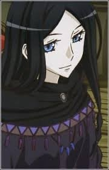
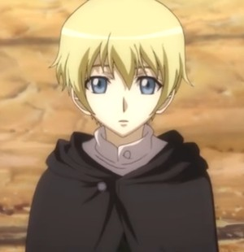
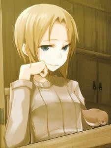
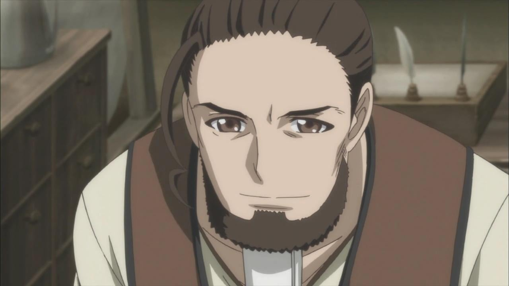
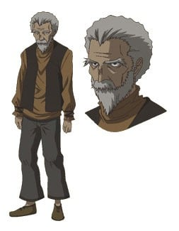

> [!bookinfo|noicon]+ **狼与香辛料 第二季**
> 
>
| 日文名 | 狼と香辛料Ⅱ |
|:------: |:------------------------------------------: |
| 类型 | 小说改 |
| 新番 | 2009 年 7 月 |
| 集数 | 共12话 |
| 官网 | [http://www.spicy-wolf.com/](https://http://www.spicy-wolf.com/) |
| 制作 | マーヴィージャック |
| 导演 | 高橋丈夫 |
| 脚本 | 荒川稔久 |
| 评分 | 7.8|
| 制片人 | 小林辰与、大野雅義 |

> [!abstract]+ **简介**
> 从教会都市出发的商人罗伦斯与贤狼赫罗，为了收集赫罗的故乡约伊兹的情报，而来到了冬季有着大祭典的热闹城市库梅尔森。在这里两人与鱼商人阿玛蒂邂逅了，而且阿玛蒂对赫罗一见钟情，并迅速开始对她展开追求攻势。另一方面，罗伦斯却和赫罗之间的微妙感情却因此加深了误解。然后，罗伦斯和阿玛蒂又因为各自的生意被卷入了大骚动中。

> [!tip]+ **章节列表**
>- [ ] 第1话：狼与小小的裂痕 (2009-07-08)
>- [ ] 第2话：狼与暴风雨前的静寂 (2009-07-15)
>- [ ] 第3话：狼与无法修复的隔阂 (2009-07-22)
>- [ ] 第4话：狼与目光短浅的末路 (2009-07-29)
>- [ ] 第5话：狼与希望和绝望 (2009-08-05)
>- [ ] 第6话：狼与信用之神 (2009-08-12)
>- [ ] 第7话：狼与玩耍的日子 (2009-08-19)
>- [ ] 第8话：狼与蛊惑的旅人 (2009-08-26)
>- [ ] 第9话：狼与无谋的商谈 (2009-09-02)
>- [ ] 第10话：狼与孤独的微笑 (2009-09-09)
>- [ ] 第11话：狼与离别的决心 (2009-09-16)
>- [ ] 第12话：狼与无止境的泪 (2009-09-23)
>- [ ] 第0话：狼与琥珀色的忧郁 (2009-04-30)
>- [ ] 第1话：わっちと&quot;おべんきょう&quot;
>- [ ] 第2话：わっちと&quot;すとれっち&quot;

> [!tip]+ **主要角色**
> 
| 角色 | CV | 简介| 角色图片 |
|:----:|:---:|:---:|:--------:|
| ホロ | 小清水亜美 | 外表是拥有狼耳与尾巴的少女，但实际上是神话中被称为神明的巨狼。自称为贤狼赫萝，寄宿在帕斯罗村的麦子中带来长期丰收。在帕斯罗村的庆典中从帕斯罗村的仓库逃入罗伦斯马车上的麦子(因为赫萝可以从小把的麦逃到大把的麦中,村民也有说过:「如果收割太贪心的话,丰收之神赫萝会逃走的」这句话)，与罗伦斯一同行商，想回到遥远北方的出生故乡“约伊兹森林”。      跟自称“贤狼”相符的冷静老练言语，丰富的经验与智慧常常拯救罗伦斯。性格自大，但因为长期离开故乡因此有着孤独脆弱的一面。     赫萝以15岁左右的可爱少女模样出现，第一人称词为“咱”（日语：わっち（＝私）），第二人称词为“汝”，语助词则以“呗”（日语：～でありんす）作结，这种独特的口癖是受到花魁的影响。与罗伦斯共同遭遇了各种事情，途中虽然常常主导对话，但也有因为不了解现代知识而被驳倒的时候。喜欢美味的食物与酒，但似乎特别喜欢苹果及甜食。在追伊弗的时候，意外被罗伦斯发现，赫萝怕水。      喜欢帮助他人，但对方没有要求，赫萝也不会去回应，对于无法出一份力的自己感到有些自责。      对自己的美丽尾巴十分自豪，不懈怠地用梳子整理以及清除跳蚤。十分喜欢被别人赞美尾巴，如果糟蹋了她的尾巴，将会发生无法预知的严重后果。 |  |
| クラフト・ロレンス | 福山潤 | 旅行各地经商维生的25岁商人。与有“贤狼”之名的少女赫萝相遇，改变了他原本孤独的经商生活。第一次看见赫萝的一只手变成狼手时惊讶的说不出话来。他常常被赫萝狡猾的言论捉弄，言语交流与共同经历的事件让他与赫萝的羁绊越来越深，渐渐露出除了“善于计算的商人”外的另一面。 虽然是个商人，但是也常常出错，幸好靠着赫萝的帮助以避免窘境。旅途中的对话大多由赫萝获得主导权，即使出现让人吓一跳的言论也常常被当作“好可爱的孩子”般对待，是个头脑虽然不错但几乎无用武之地的主角。梦想是希望将来拥有一家自己的店铺。 有多次都将要赚够开店铺的钱，却都事后无成。渐渐喜欢上赫萝，也向赫萝告白，抵挡不了赫萝的狡猾表情。 虽然平时不易察觉﹐但事实上他在商人中也是比较出色的那一批人。 |  |
| ディアン・ルーベンス | 渡辺明乃 | 炼金术士的领袖。 |  |
| フェルミ・アマーティ | 千葉紗子 | 居住于对异教徒（非正教者）以及异端者（正教非主流派别）相当宽容的卡梅尔森。在罗伦斯从留宾海根前往卡梅尔森的路上遇见的鱼商，以未满二十岁的小小年纪即拥有三辆马车的青年。与罗伦斯同属罗恩商业公会。对赫萝一见钟情，并且展开热烈追求。同时，也与罗伦斯展开一场黄铁矿的商业战。 |  |
| エーブ・ボラン | 朴璐美 | 于小说第五集首次登场，罗伦斯在港口城市雷诺斯的旅馆中相遇的商人，真实身份为一美丽的女商人，原为温菲尔王国的破落贵族。以为了不失去当商人的紧张感为由，在生意上即以“伊弗·波伦”自称，谈吐粗鲁，并刻意假扮男性。平时用厚布将面部裹得严严实实，只露出锐利的双眼。第八、九集透露有“罗姆河的狼”的外号﹐赫罗在和罗伦斯对话时常称其为“母狐狸”﹐是除了赫罗外第二位会说罗伦斯是“滥好人”的人。 |  |
| ノーラ・アレント | 中原麻衣 | 于小说第二集登场，住在教会都市留宾海根的牧羊人，手持着顶端附有铃铛的等身杖的金发美少女，带著名为“艾尼克”的牧羊犬。 作为牧羊人的实力不错（赫萝给予“中上”评价），但本人的梦想是制衣的裁缝师。罗伦斯对现状待遇的恶劣心怀不满的诺儿菈，托付了关系自己行商命运的走私黄金工作。在性格等方面属于罗伦斯喜欢的类型。 |  |
| マルク・コール | 小山力也 | 定居于卡梅尔森的城镇商人，主要货物是小麦。不仅精通异国语言，亦有不错的口才，曾做过旅行商人。待罗伦斯如好友，于其与阿玛堤的商战上给予许多帮助与建议。 |  |
| メルタ | 豊崎愛生 | 雷诺斯的修女，黎格罗·德多里的助手。 |  |
| リゴロ・デドリ | 内田夕夜 | 雷诺斯的编年史作家，镇议会书记。 |  |
| ルッズ・エリンギン | 牛山茂 | 德林商行的代表。 |  |
| アロルド・エクルンド | 廣田行生 |  |  |
| エウ・ラント | 笹島かほる |  |  |