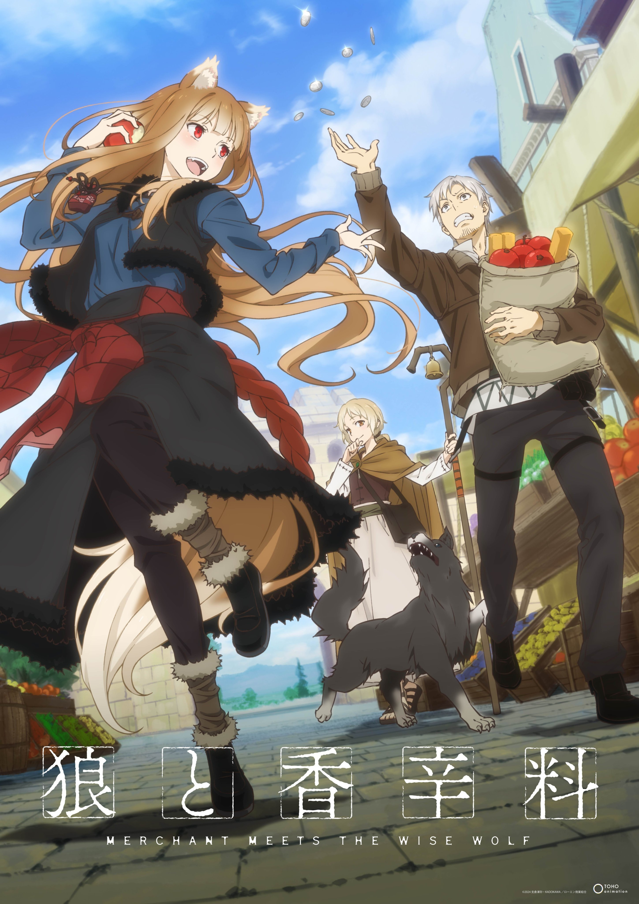

> [!bookinfo|noicon]+ **狼与香辛料 行商邂逅贤狼**
> 
>
| 日文名 | 狼と香辛料 MERCHANT MEETS THE WISE WOLF |
|:------: |:------------------------------------------: |
| 类型 | 小说改 |
| 新番 | 2024 年 4 月 |
| 集数 | 共25话 |
| 官网 | [https://spice-and-wolf.com/](https://https://spice-and-wolf.com/) |
| 制作 | パッショーネ |
| 导演 | さんぺい聖 |
| 脚本 | 浦畑達彦,木澤行人,猫田幸 |
| 评分 | 7.3|
| 制片人 | 西藤和広,高橋勇輔 |

> [!abstract]+ **简介**
> 年轻的旅行商人克拉福·罗伦斯，与一匹拖着货车的马为伴，日复一日地在各个城镇之间售卖商品。
有一天，他到达了一个遍布着金黄色麦田的小村庄，在那里，他遇到了一位拥有狼耳朵和尾巴的美丽少女。
“咱的名字是赫萝。”
自称为“贤狼”的赫萝，原来是一位掌管丰收的狼化身。
听闻她想要返回极北之地、应该存在的故乡“约伊兹森林”的愿望后，罗伦斯和赫萝决定一同朝北，开始了他们的商业旅行。
但是，旅行商人的旅途总是充满了意想不到的波折。
曾经孤独的旅行商人和孤独的狼化身，他们在马车上开始了喧闹的旅程。

> [!tip]+ **章节列表**
>- [ ] 第1话：收获祭和变窄的驾驶座 (2024-04-01)
>- [ ] 第2话：恶作剧狼和不好笑的玩笑 (2024-04-08)
>- [ ] 第3话：港口城市和甜蜜的诱惑 (2024-04-15)
>- [ ] 第4话：爱做梦的商人和月光下的离别 (2024-04-22)
>- [ ] 第5话：狼的化身与顺从的羔羊 (2024-04-29)
>- [ ] 第6话：商人与不讲理的神 (2024-05-06)
>- [ ] 第7话：神的天秤与草原的魔术师 (2024-05-13)
>- [ ] 第8话：旅伴与不祥的消息 (2024-05-20)
>- [ ] 第9话：甘甜的蜜与苦涩的盔甲 (2024-05-27)
>- [ ] 第10话：狼的智慧与商人的花言巧语 (2024-06-03)
>- [ ] 第11话：狼之森与冰冷的雨 (2024-06-10)
>- [ ] 第12话：背叛的价码与黄金的价码 (2024-06-17)
>- [ ] 第13话：三人的晚餐与二人的午后 (2024-06-24)
>- [ ] 第14话：新的城镇与思乡之情 (2024-07-01)
>- [ ] 第15话：鸟的羽毛与神秘的矿石 (2024-07-08)
>- [ ] 第16话：庆典的夜晚与失控的齿轮 (2024-07-15)
>- [ ] 第17话：旅行商人的浅见与城镇商人的看板 (2024-07-22)
>- [ ] 第18话：孤注一掷的货物与决意不悔的商谈 (2024-07-29)
>- [ ] 第19话：不见其形的神的手与难测其意的狼的心 (2024-08-12)
>- [ ] 第20话：教会少女与磨坊少年 (2024-08-19)
>- [ ] 第21话：异端村庄与祭司的契约 (2024-08-26)
>- [ ] 第22话：教会的教导与父亲的记忆 (2024-09-02)
>- [ ] 第23话：策划的灾难与应得的报应 (2024-09-09)
>- [ ] 第24话：蛇神之道与贤狼的回答 (2024-09-16)
>- [ ] 第25话：奇迹的去向与延续的旅程 (2024-09-23)

> [!tip]+ **主要角色**
> 
| 角色 | CV | 简介| 角色图片 |
|:----:|:---:|:---:|:--------:|
| ホロ | 小清水亜美 | 外表是拥有狼耳与尾巴的少女，但实际上是神话中被称为神明的巨狼。自称为贤狼赫萝，寄宿在帕斯罗村的麦子中带来长期丰收。在帕斯罗村的庆典中从帕斯罗村的仓库逃入罗伦斯马车上的麦子(因为赫萝可以从小把的麦逃到大把的麦中,村民也有说过:「如果收割太贪心的话,丰收之神赫萝会逃走的」这句话)，与罗伦斯一同行商，想回到遥远北方的出生故乡“约伊兹森林”。      跟自称“贤狼”相符的冷静老练言语，丰富的经验与智慧常常拯救罗伦斯。性格自大，但因为长期离开故乡因此有着孤独脆弱的一面。     赫萝以15岁左右的可爱少女模样出现，第一人称词为“咱”（日语：わっち（＝私）），第二人称词为“汝”，语助词则以“呗”（日语：～でありんす）作结，这种独特的口癖是受到花魁的影响。与罗伦斯共同遭遇了各种事情，途中虽然常常主导对话，但也有因为不了解现代知识而被驳倒的时候。喜欢美味的食物与酒，但似乎特别喜欢苹果及甜食。在追伊弗的时候，意外被罗伦斯发现，赫萝怕水。      喜欢帮助他人，但对方没有要求，赫萝也不会去回应，对于无法出一份力的自己感到有些自责。      对自己的美丽尾巴十分自豪，不懈怠地用梳子整理以及清除跳蚤。十分喜欢被别人赞美尾巴，如果糟蹋了她的尾巴，将会发生无法预知的严重后果。 |  |
| クラフト・ロレンス | 福山潤 | 旅行各地经商维生的25岁商人。与有“贤狼”之名的少女赫萝相遇，改变了他原本孤独的经商生活。第一次看见赫萝的一只手变成狼手时惊讶的说不出话来。他常常被赫萝狡猾的言论捉弄，言语交流与共同经历的事件让他与赫萝的羁绊越来越深，渐渐露出除了“善于计算的商人”外的另一面。 虽然是个商人，但是也常常出错，幸好靠着赫萝的帮助以避免窘境。旅途中的对话大多由赫萝获得主导权，即使出现让人吓一跳的言论也常常被当作“好可爱的孩子”般对待，是个头脑虽然不错但几乎无用武之地的主角。梦想是希望将来拥有一家自己的店铺。 有多次都将要赚够开店铺的钱，却都事后无成。渐渐喜欢上赫萝，也向赫萝告白，抵挡不了赫萝的狡猾表情。 虽然平时不易察觉﹐但事实上他在商人中也是比较出色的那一批人。 |  |
| ディアン・ルーベンス | 渡辺明乃 | 炼金术士的领袖。 |  |
| ミューリ | 田中あいみ | 赫萝与罗伦斯的女儿，跟赫萝一样外表是长着狼耳与狼尾巴的少女，红瞳灰白发色。 |  |
| フェルミ・アマーティ | 千葉紗子 | 居住于对异教徒（非正教者）以及异端者（正教非主流派别）相当宽容的卡梅尔森。在罗伦斯从留宾海根前往卡梅尔森的路上遇见的鱼商，以未满二十岁的小小年纪即拥有三辆马车的青年。与罗伦斯同属罗恩商业公会。对赫萝一见钟情，并且展开热烈追求。同时，也与罗伦斯展开一场黄铁矿的商业战。 |  |
| ノーラ・アレント | 中原麻衣 | 于小说第二集登场，住在教会都市留宾海根的牧羊人，手持着顶端附有铃铛的等身杖的金发美少女，带著名为“艾尼克”的牧羊犬。 作为牧羊人的实力不错（赫萝给予“中上”评价），但本人的梦想是制衣的裁缝师。罗伦斯对现状待遇的恶劣心怀不满的诺儿菈，托付了关系自己行商命运的走私黄金工作。在性格等方面属于罗伦斯喜欢的类型。 |  |
| リヒテン・マールハイト | 大塚芳忠 | 在港口城市帕兹欧中的第三号大的商行，米隆商行帕兹欧支店的支店长。接受了罗伦斯提出的崔尼银币交易，并且非常周到的配合计划。外表沉着冷静，谨慎使用遣词用句的人物。 |  |
| ゼーレン | 浪川大輔 | 在旅途中罗伦斯寄宿于教会时遇见的谜之商人。并且在教会透露银币价值上升的消息。 |  |
| マルク・コール | 小山力也 | 定居于卡梅尔森的城镇商人，主要货物是小麦。不仅精通异国语言，亦有不错的口才，曾做过旅行商人。待罗伦斯如好友，于其与阿玛堤的商战上给予许多帮助与建议。 |  |
| エウ・ラント | 笹島かほる |  |  |
| 貴族 | 竹内良太 |  |  |
| ワイズ | 花輪英司 |  |  |