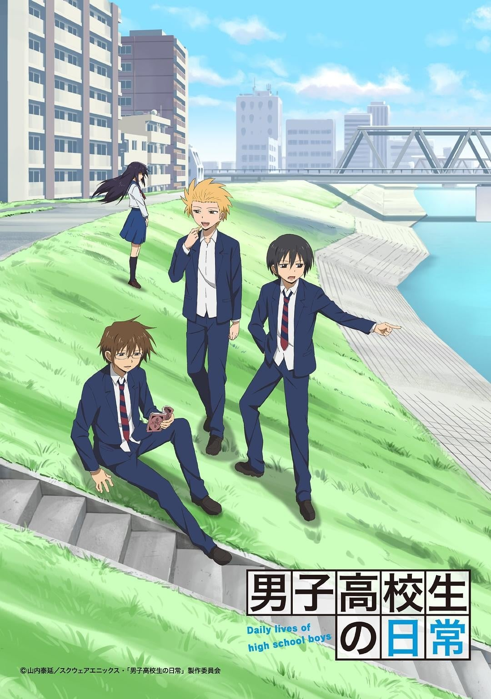
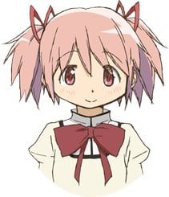
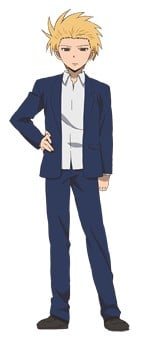
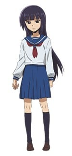
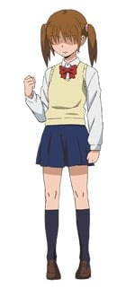
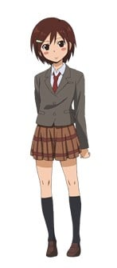
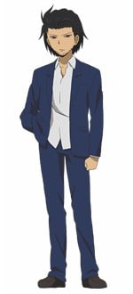
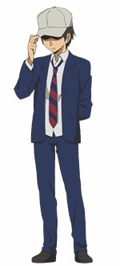
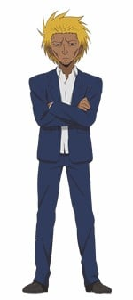
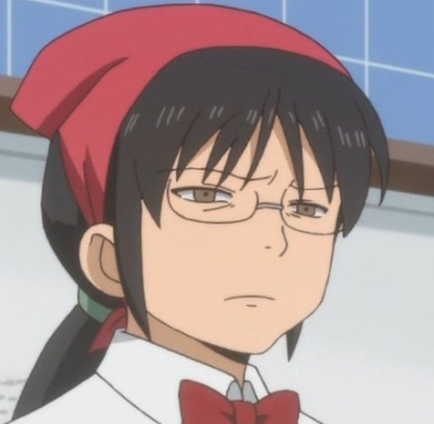

> [!bookinfo|noicon]+ **男子高中生的日常**
> 
>
| 日文名 | 男子高校生の日常 |
|:------: |:------------------------------------------: |
| 类型 | 漫改 |
| 新番 | 2012 年 1 月 |
| 集数 | 共12话 |
| 官网 | [http://www.danshinichijyo.net/](https://http://www.danshinichijyo.net/) |
| 制作 | サンライズ |
| 导演 | 高松信司 |
| 脚本 | 高松信司 |
| 评分 | 7.9|
| 制片人 |  |

> [!abstract]+ **简介**
> 原作为山內泰延连载于《ガンガンONLINE》的漫画，是描写男子高中生的日常生活的轻喜剧作品。
在一个普通的城市里，一帮普通的男子高中生过着普通的日常生活。想像着机动战士和冒险故事，放学后交女朋友的方法，对女生的裙子充满幻想，在家讲恐怖鬼故事，与女生同行被误会，以及遇上文学少女的小插曲，这一切都是男子高中生的日常生活。

> [!tip]+ **章节列表**
>- [ ] 第1话：男子高校生と放課後／男子高校生とスカート／男子高校生と怪談／男子高校生と同伴少女／男子高校生と文学少女 (2012-01-09)
>- [ ] 第2话：男子高校生と旅立ちの朝／男子高校生と凸面鏡少女／男子高校生と友情パワー／男子高校生と文学少女2／男子高校生と伝統行事／男子高校生と少年時代／男子高校生と怪談2 (2012-01-16)
>- [ ] 第3话：男子高校生と夏計画／男子高校生と海の家／男子高校生と温泉卓球／男子高校生とラジオDJ／男子高校生と夏の思い出／男子高校生と通学電車／女子高生は異常「彼氏と制服」 (2012-01-23)
>- [ ] 第4话：男子高校生と立ち聞き／男子高校生と文化祭1／男子高校生と文化祭2／男子高校生と文化祭3／男子高校生と文化祭4／男子高校生と悩み相談／女子高生は異常「滑稽」 (2012-01-30)
>- [ ] 第5话：男子高校生とアテレコ／男子高校生と年功序列／男子高校生と救世主／男子高校生と旧友／男子高校生と偉人伝／男子高校生と文学少女3／女子高生は異常「怨恨」 (2012-02-06)
>- [ ] 第6话：男子高校生と聖なる夜／男子高校生と新学期／男子高校生と妹の悩み／男子高校生とりんごちゃんの悩み／男子高校生とモトハルの悩み／男子高校生と必殺シュート／女子高生は (2012-02-13)
>- [ ] 第7话：男子高校生と一発芸／男子高校生と室内の冒険／男子高校生と室内の冒険2／男子高校生と兄／男子高校生とありのままの自分／男子高校生と進路／男子高校生とミツオ君／男子 (2012-02-20)
>- [ ] 第8话：男子高校生とモトハルの姉/男子高校生とミツオ君の悩み/男子高校生とマンガ/男子高校生とベランダ/男子高校生とコンビニ/男子高校生と塔/男子高校生とケーキ/男子高 (2012-02-27)
>- [ ] 第9话：男子高校生と兄と姉／男子高校生とドロップキック／男子高校生と夏の終わり／男子高校生とメガネ／男子高校生と生徒会の日常／男子高校生とパンツ／男子高校生と配線／女子 (2012-03-05)
>- [ ] 第10话：男子高校生と限界／男子高校生と結果／男子高校生と冬／男子高校生と走る／男子高校生と雑煮／男子高校生と地面／男子高校生と自転車／男子高校生と料理／男子高校生と学校 (2012-03-12)
>- [ ] 第11话：男子高校生と父／男子高校生と文学少女4／男子高校生と闘争／男子高校生と缶ケリ／男子高校生と雑談／男子高校生とラブレター／男子高校生と間合い／男子高校生と (2012-03-19)
>- [ ] 第12话：男子高校生と… (2012-03-26)
>- [ ] 第1话：男子高中生与文学少女 (2011-11-04)
>- [ ] 第2话：男子高中生和裙子 (2011-11-11)
>- [ ] 第3话：男子高中生与放学后 (2011-11-18)
>- [ ] 第4话：男子高中生与启程之日 (2011-11-24)
>- [ ] 第5话：男子高中生与凸面镜少女 (2011-12-01)
>- [ ] 第6话：男子高中生与友情的力量 (2011-12-08)
>- [ ] 第7话：男子高校生与广播DJ (2011-12-15)
>- [ ] 第8话：男子高校生与上学电车 (2011-12-22)

> [!tip]+ **主要角色**
> 
| 角色 | CV | 简介| 角色图片 |
|:----:|:---:|:---:|:--------:|
| 鹿目まどか |  | 「如果——如果哟，如果有人告诉你，你的任何愿望都可以通过魔法实现，你会怎么办？」 一个普通的初二学生，关心朋友，心地善良。  「もしも――もしも、だよ？魔法でどんな願い事でも叶えてもらえる、って言われたら、どうする？」 どこにでもいる平凡な中学二年生。友達想いで心優しい性格の持ち主。 |  |
| タダクニ | 入野自由 | 没什么存在感的主人公，真田北高校（男子高中）的学生。 |  |
| 田畑ヒデノリ | 杉田智和 | 颠覆了眼镜=优等生这一常识公式的笨蛋。 真田北高校（男校）的男子高中生。 |  |
| 田中ヨシタケ | 鈴村健一 | 金发笨蛋。 真田北高校（男校）的男子高中生。 |  |
| 文学少女 | 日笠陽子 | 　　本名不明，黑色长直发的少女，真田西高中学生，有很多朋友。沉默寡言。有露出眼睛的女角色之一。 　　曾以秀则作为小说人物的蓝本。与羽原和生岛相识。亲近的人会叫她“小也（やっさん）”，本名似乎姓安永。背影与元治姊相似，曾被元治误会。 　　现在貌似暗恋秀则。某次为了向秀则澄清自己没有男友的事情而追赶对方，目前以“一路追着某男子高中生（秀则）跑到隔壁镇去”而广为人知。 　　其登场的篇章皆人气甚高，大获好评。 |  |
| タダクニ妹 | 高垣彩陽 | 主人公的妹妹。 真田中央高校的女子高中生。 |  |
| りんごちゃん | 悠木碧 | 真田东高校（女校）的学生会长。 将真田北高校当作对手。 |  |
| モトハル | 浪川大輔 | 看起来像不良少年的好学生，无法违逆姐姐的命令。真田北高中的学生会成员。 |  |
| 唐沢としゆき | 小野友樹 | 少数常识尚存的人，总是戴着帽子。真田北高中的学生会成员。 |  |
| 会長 | 石田彰 | ノリと勢いだけの人。真田北高校の生徒会長。 |  |
| 副会長 | 安元洋貴 | 強面だが礼節は超一流の紳士。真田北高校生徒会の副会長。 |  |
| 奈古さん | 皆川純子 |  |  |