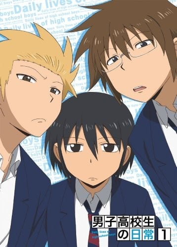
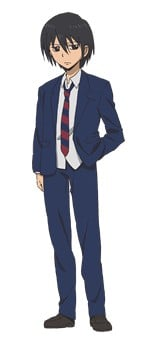
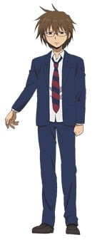
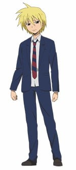
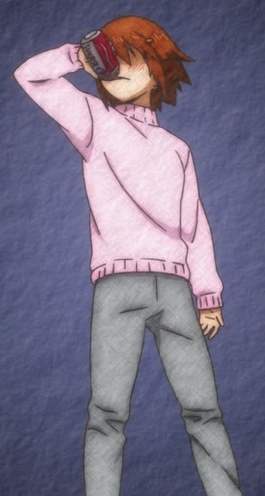
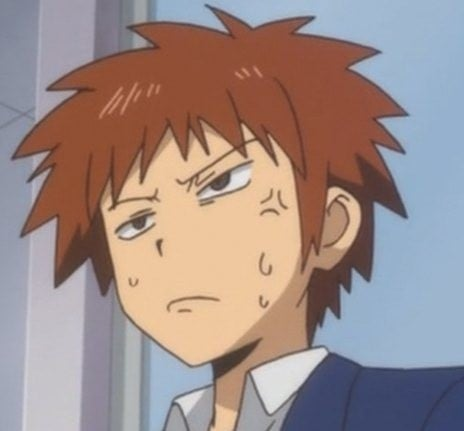
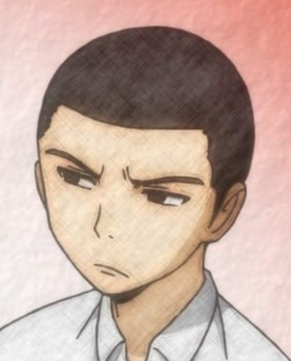
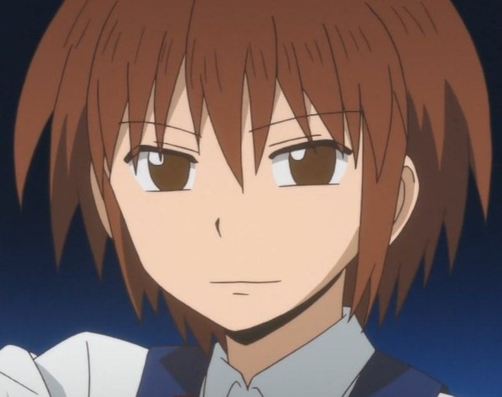
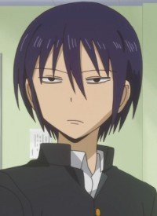

> [!bookinfo|noicon]+ **男子高中生的日常 特典**
> 
>
| 日文名 | 男子高校生の日常 特典映像 |
|:------: |:------------------------------------------: |
| 类型 | 漫改 |
| 新番 | 2012 年 4 月 |
| 集数 | 共6话 |
| 官网 | [http://www.square-enix.com/jp/magazine/ganganonline/special/danshinichijyo/](https://http://www.square-enix.com/jp/magazine/ganganonline/special/danshinichijyo/) |
| 制作 | サンライズ |
| 导演 |  |
| 脚本 |  |
| 评分 | 7.5|
| 制片人 |  |

> [!abstract]+ **简介**
> 通常特典
男子高校生と理想（1巻特典映像）
男子高校生と孤独（2巻特典映像）
男子高校生とチャック（3巻特典映像）
男子高校生とひっかけ（4巻特典映像）
男子高校生としゃっくり（5巻特典映像）
男子高校生と気遣い（6巻特典映像）

> [!tip]+ **章节列表**
>- [ ] 第1话：男子高校生与理想
>- [ ] 第2话：男子高校生与孤独
>- [ ] 第3话：男子高校生与拉链
>- [ ] 第4话：男子高校生与陷阱
>- [ ] 第5话：男子高校生与打嗝
>- [ ] 第6话：男子高校生与替人著想

> [!tip]+ **主要角色**
> 
| 角色 | CV | 简介| 角色图片 |
|:----:|:---:|:---:|:--------:|
| タダクニ | 入野自由 | 没什么存在感的主人公，真田北高校（男子高中）的学生。 |  |
| 田畑ヒデノリ | 杉田智和 | 颠覆了眼镜=优等生这一常识公式的笨蛋。 真田北高校（男校）的男子高中生。 |  |
| 田中ヨシタケ | 鈴村健一 | 金发笨蛋。 真田北高校（男校）的男子高中生。 |  |
| りんごちゃん | 悠木碧 | 真田东高校（女校）的学生会长。 将真田北高校当作对手。 |  |
| モトハル | 浪川大輔 | 看起来像不良少年的好学生，无法违逆姐姐的命令。真田北高中的学生会成员。 |  |
| 会長 | 石田彰 | ノリと勢いだけの人。真田北高校の生徒会長。 |  |
| 副会長 | 安元洋貴 | 強面だが礼節は超一流の紳士。真田北高校生徒会の副会長。 |  |
| ヨシタケの姉 | 小清水亜美 |  |  |
| 光雄 | 岡本信彦 |  |  |
| たかひろの友人 | 諏訪部順一 |  |  |
| 自意識過剰女 | 池澤春菜 |  |  |
| 松本たかひろ | 森久保祥太郎 | 羽原の向かいの家に住む男子高校生。真田西高校生で、文学少女のクラスメイト。アークデーモンの被害者の1人であり、本編にも登場している。目の下にうっすら隈のようなものがあり、一見すると目つきが悪いが気さくな性格。友人とよく「かわいい女の子の定義」や「女子の言動」などについて議論をしている。 |  |