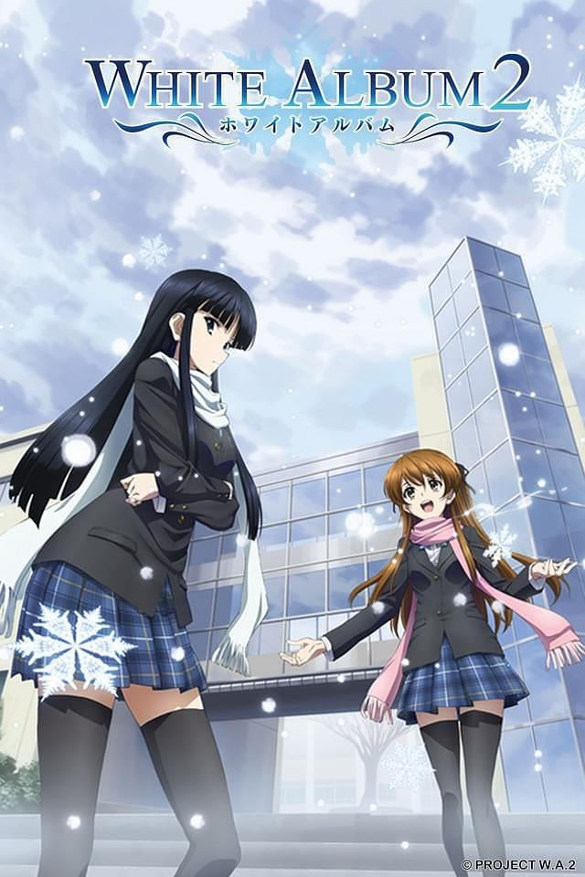
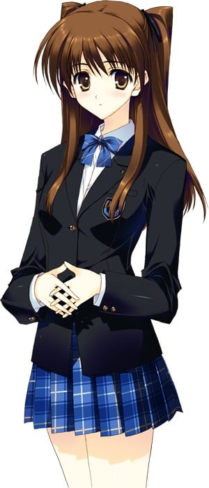
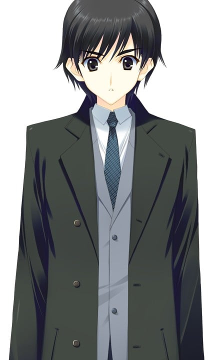
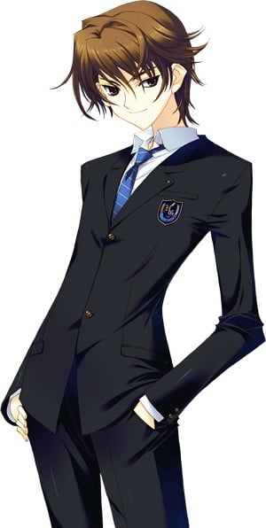
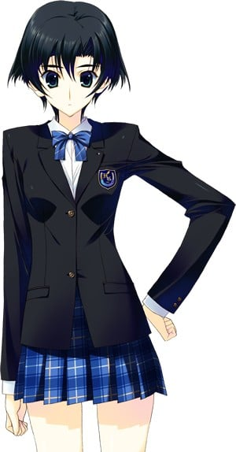
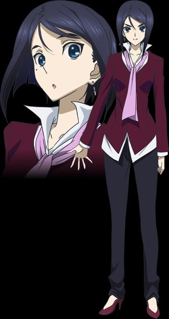
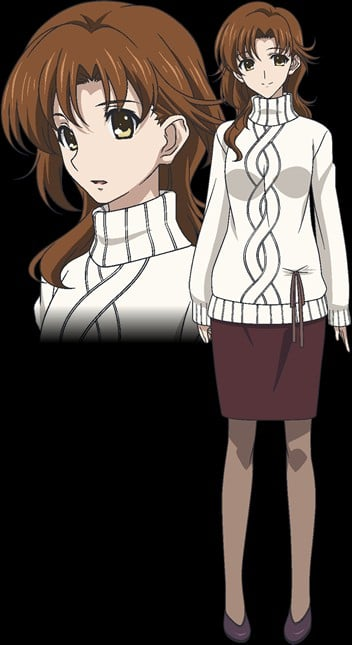
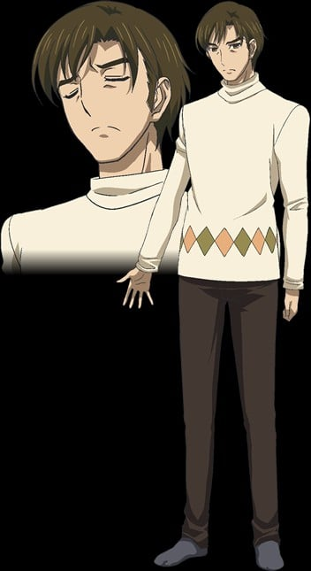

> [!bookinfo|noicon]+ **白色相簿2**
> 
>
| 日文名 | WHITE ALBUM2 |
|:------: |:------------------------------------------: |
| 类型 | 游戏改 |
| 新番 | 2013 年 10 月 |
| 集数 | 共13话 |
| 官网 | [http://whitealbum2.jp/](https://http://whitealbum2.jp/) |
| 制作 | サテライト |
| 导演 | 安藤正臣 |
| 脚本 | 丸戸史明 |
| 评分 | 7.3|
| 制片人 | 金子文雄,金子文雄、濵本悠光,濵本悠光 |

> [!abstract]+ **简介**
> 故事发生在2007年秋季的东京都。峰城大附属3年级学生北原春希为了制造学生时代最后的回忆加入了轻音乐同好会，而乐队却因为感情的纠葛而崩溃。春希为了能够在学园祭上成功演出而开始召集成员，并成功劝诱了在屋顶唱歌的学院偶像小木曾雪菜。在发现了班级的问题儿童冬马和纱的天才般音乐才能之后，两人经过千辛万苦最终使她也加入了乐队。原本毫不相关的三个人经过全神贯注的、拼命的奋斗之后在学园祭上大获成功，三个人从心底结合了起来……虽然大家都是这样认为的，但从这以后各自的爱恋却走向了残酷的悲剧……

> [!tip]+ **章节列表**
>- [ ] 第1话：白色相簿 (2013-10-05)
>- [ ] 第2话：邻座的钢琴与吉他 (2013-10-12)
>- [ ] 第3话：轻音乐同好会再次成立 (2013-10-19)
>- [ ] 第4话：命运之声 (2013-10-26)
>- [ ] 第5话：心心相印 (2013-11-02)
>- [ ] 第6话：祭典之前 (2013-11-09)
>- [ ] 第7话：最棒、最后的一天 (2013-11-16)
>- [ ] 第8话：须臾冬至 (2013-11-23)
>- [ ] 第9话：形同陌路的心与心 (2013-11-30)
>- [ ] 第10话：雪融化，然后 直至再次飘落时（前篇） (2013-12-07)
>- [ ] 第11话：雪融化，然后 直至再次飘落时（后篇） (2013-12-14)
>- [ ] 第12话：毕业 (2013-12-21)
>- [ ] 第13话：无法传达的爱恋 (2013-12-28)

> [!tip]+ **主要角色**
> 
| 角色 | CV | 简介| 角色图片 |
|:----:|:---:|:---:|:--------:|
| 小木曽雪菜 | 米澤円 | 峰城大付属３年Ａ組。 ミス峰城大付属二年連続制覇中。三連覇の期待がかかる高嶺の花。華やかな容姿に似合わず、穏やかで人当たりが良くて控えめという、非の打ちどころのない女の子。 …と、周囲に三年間信じ込ませることができるくらいにはいい性格で、その見えない壁を打ち破った者にだけ悪戯っぽく微笑むという。 誰にもひた隠しにしているが、趣味はヒトカ………カラオケ。 定番のオープニングナンバーは、ちょっと古めの流行歌(WHITE　ALBUM)。 |  |
| 冬馬かずさ | 生天目仁美 | 峰城大付属３年Ｅ組。 窓際の席で常に居眠りしている、遅刻、サボリの常習犯にして、大人はわかってくれない的な鬱屈を抱える、時代錯誤な不良娘。長く艶やかな黒髪、モデル顔負けのスタイル、切れ長の瞳というその孤高で暴力的な性格に似合いすぎる鋭利な美しさのせいで、余計に周囲との距離が広がってしまうという悪循環に陥っているが、本人は何処吹く風で強がっている。 誰にも聞かれたことはないが、どちらかと言えば緒方理奈派。 |  |
| 和泉千晶 |  | 峰城大学文学部3年级学生。 要不就趴在窗边的桌子上，要不就在研究室铺个睡袋大睡特睡，惰性十足又有气无力，典型的毫无干劲大学生。 幸亏她头脑灵活，凡事都能很快上手，也就一直顺利升级。只是最近研究班的报告多了不少，升级似乎没那么顺利了。 也许她是那种一旦来了兴致就会全身心投入的人。不过由于没人见识过她那种姿态，实在不知是真是假。 |  |
| モブキャラクター | 三宅麻理恵 | 闲角，常称作路人，在电视剧、电影等作品中，指戏份薄弱的副角、不相关的小人物、串场的闲杂人等。可能用来表达地方民众的声音，或是充当背景。 モブキャラクター（mob character）とは、漫画、アニメ、映画、コンピュータゲームなどに描かれる端役のこと。群衆（群集）、または主要キャラクター以外の、その他大勢のこと。群集キャラ、背景キャラともいう。 |  |
| 北原春希 | 水島大宙 | 峰城大付属３年Ｅ組。前期クラス委員長。 軽音楽同好会所属。セカンドギター（雑用）担当。 特技は余計なお節介と非の打ち所のない説教と完璧な理論武装。 成績はトップクラス。その面倒見が良すぎて妥協できない性格ゆえ、全校の教師と学生に非常に都合よく慕われている。 学園生活最後の年に、無謀にも派手めな思い出を残そうと思い立ち、学園祭のステージに立つことを計画する。手先はそこそこ不器用。 |  |
| 飯塚武也 | 寺島拓篤 | 峰城大付属３年Ｇ組。 軽音楽同好会部長。ギター担当。 １年の時に主人公と同じクラスになったのが運の尽き（主人公的に）で、それ以来、一番の親友を自称して厄介ごとを押しつけてきたり、自分が別れた女を押しつけてきたりと酷いような最低なような微妙な関係。 垢抜けた容姿と後腐れのなさそうな言動で女子にもそのお手軽さが人気。 各クラスに一人ずつ彼女がいるらしいが男友達は自称親友一人のみ。 昔は真面目な奴だったらしいが、その真相を知っているのは一人だけ… |  |
| 水沢依緒 | 中上育実 | 峰城大付属３年Ａ組。雪菜のクラスメイトにして元バスケ部主将。 １年の時に主人公と同じクラスになったことはともかく、その際、中学時代からの腐れ縁のチャラい男子もその場にいたせいで、切りたかった関係を主人公に無理やり保持されつつ三年間を過ごす。 さっぱりした性格、スレンダーな長身、ボーイッシュな容姿と、後輩女子に好かれる条件を全て兼ね備え、順当にそっち方面に大人気。 主人公と雪菜の関係を不釣り合いと確信しつつ適当に生温く見守っている。 |  |
| 小木曽孝宏 | 梶裕貴 | 雪菜の三歳年下の弟。 家では何事も姉優先にもかかわらず、 そんな不遇も気にしないほど大らかで素直で家族思い。 ただし成績の方も姉優先のため、 峰城大付属への進学を志望するも、 模試の判定は絶望的らしい。 |  |
| 早坂親志 | 杉山紀彰 | 峰城大学付属学園三年Ｅ組。 春希のクラスメイトにして、にわか親友。 学園祭成功のため、身を粉にして頑張る…… ふりをして春希に頼りきりなお調子者。 それでも昔に比べると随分と丸くなったとかなんとか。 |  |
| 冬馬曜子 | 夏樹リオ | かずさの母親。 世界的に有名なピアニストで、現在パリ在住のため娘とは別居中。 若い頃から奔放な私生活で芸能人並みにマスコミを賑わせていた。二度の離婚歴があるが、かずさの父親が誰なのかは定かではない。 |  |
| 小木曽秋菜 | 小野涼子 | 雪菜の母。 二人の子供の世話に追われる専業主婦。 人当たりのいい優しい性格で近所の評判もいい理想的な母親。 ただ家族との会話では、なんでも『あれ』とか『それ』で片付けるなど、少し大ざっぱなところがある。 |  |
| 小木曽晋 | 最上嗣生 | 雪菜の父。 都内の大手製造業に勤めているごく普通のサラリーマン。 仕事より家族との時間を大事にする甘めの父親。 しかし成長した子供たちからは、干渉しすぎる態度が少しばかり煙たがられ、寂しさを感じている。 |  |