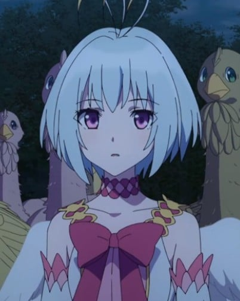
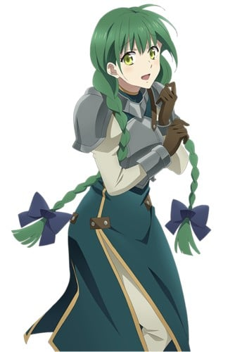

> [!bookinfo|noicon]+ **盾之勇者成名录**
> 
>
| 日文名 | 盾の勇者の成り上がり |
|:------: |:------------------------------------------: |
| 类型 | 小说改 |
| 新番 | 2019 年 1 月 |
| 集数 | 共25话 |
| 官网 | [http://shieldhero-anime.jp/](https://http://shieldhero-anime.jp/) |
| 制作 | KINEMA CITRUS |
| 导演 | 阿保孝雄 |
| 脚本 | 小柳啓伍,中山竜,田沢大典,江嵜大兄 |
| 评分 | 5.6|
| 制片人 | 小笠原宗紀 |

> [!abstract]+ **简介**
> 极为平凡的御宅族大学生·岩谷尚文，受到在图书馆发现的一本书所引导，被召唤到了异世界。他被赋予的使命，是作为装备着剑、枪、弓、盾的四圣勇者之一“盾之勇者”，驱逐给世界带来混沌的灾害“波”。因为大冒险而心潮澎湃，和同伴一同踏上旅程的尚文。但，他刚出发没几天就遭到背叛，金钱和立场全都失去。变得无法相信他人的尚文，驱使着奴隶少女·拉芙塔莉雅，向波和世界发起对抗——。究竟他能否打破这种绝望的状况？失去一切的男人的成名奇幻故事，开幕。

> [!tip]+ **章节列表**
>- [ ] 第1话：盾之勇者 (2019-01-09)
>- [ ] 第2话：奴隶少女 (2019-01-16)
>- [ ] 第3话：灾厄的大浪 (2019-01-23)
>- [ ] 第4话：拂晓的摇篮曲 (2019-01-30)
>- [ ] 第5话：菲洛 (2019-02-06)
>- [ ] 第6话：新的伙伴 (2019-02-13)
>- [ ] 第7话：神鸟圣人 (2019-02-20)
>- [ ] 第8话：诅咒之盾 (2019-02-27)
>- [ ] 第9话：梅尔蒂 (2019-03-06)
>- [ ] 第10话：纷乱之中 (2019-03-13)
>- [ ] 第11话：灾厄再临 (2019-03-20)
>- [ ] 第12话：漆黑的异邦人 (2019-03-27)
>- [ ] 第13话：盾之恶魔 (2019-04-03)
>- [ ] 第14话：无法消除的记忆 (2019-04-10)
>- [ ] 第15话：拉芙塔莉雅 (2019-04-17)
>- [ ] 第16话：菲洛鸟女王 (2019-04-24)
>- [ ] 第17话：被定下的约定 (2019-05-01)
>- [ ] 第18话：一连串的阴谋 (2019-05-08)
>- [ ] 第19话：四圣勇者 (2019-05-15)
>- [ ] 第20话：圣邪决战 (2019-05-22)
>- [ ] 第21话：尚文的凯旋 (2019-05-29)
>- [ ] 第22话：勇者会议 (2019-06-05)
>- [ ] 第23话：卡尔米拉岛 (2019-06-12)
>- [ ] 第24话：异世界的守护者 (2019-06-19)
>- [ ] 第25话：盾之勇者成名录 (2019-06-26)

> [!tip]+ **主要角色**
> 
| 角色 | CV | 简介| 角色图片 |
|:----:|:---:|:---:|:--------:|
| 岩谷尚文 | 石川界人 | 盾の勇者。20歳のオタク大学生。『四聖武器書』を読んでいたところ、異世界に召喚される。絶大な防御力を誇るが、攻撃力はほとんどない。異世界で人間不信に陥ったことで、本来の穏やかさは消え、冷徹な人間に。 |  |
| ラフタリア | 瀬戸麻沙美 | 尚文が最初に買ったラクーン種と呼ばれる亜人の奴隷。真っ直ぐな性格。尚文の剣として素直に付き従っている。 |  |
| 天木錬 | 松岡禎丞 | 剣の勇者。16歳の高校生。小柄だが端正な顔立ちをした美少年。理知的ながらもプライドが高く、他人を見下しがち。 |  |
| 北村元康 | 高橋信 | 槍の勇者。21歳の大学生。女性の扱いに慣れており、パーティも女の子だらけ。周囲の女性のこととなると周りが見えなくなり、騙されやすい。 |  |
| 川澄樹 | 山谷祥生 | 弓の勇者。17歳の高校生。物腰は柔らかくどこか儚げ。勇者の中でもっとも小柄だが、正義感は人一倍強い。正義を求めるあまり、周囲が見えなくなることも。 |  |
| フィーロ | 日高里菜 | フィロリアルと呼ばれる鳥形の魔物。高度な変身能力を持つフィロリアル・クイーンであり、背中に羽根を生やした少女の姿に変身できる。得意魔法は風。明るく元気で大飯食らい。 |  |
| メルティ＝Q＝メルロマルク | 内田真礼 | フィロリアルの群れの中で出会った女の子。生真面目で友人を大切にするが、感情的になると子どもっぽさを見せる一面もある。そして、なにやら秘密がありそうで…。 |  |
| マルティ＝S＝メルロマルク | ブリドカットセーラ恵美 | 盾の勇者の尚文の最初の仲間。遠慮のない、気さくな女の子だが……。 |  |
| オルトクレイ＝メルロマルク32世 | 仲野裕 | 尚文たちが召喚された異世界・メルロマルクの王。 四聖勇者の中でも盾の勇者・尚文を目の仇にして色々と不公平な態度を取る。 |  |
| エルハルト | 安元洋貴 | メルロマルクで武器屋を営む体格の良い親父。 オーダーメイドで蛮族の鎧を作るなど、武器屋としての腕も一流で、尚文達は信頼を置いている。 |  |
| フィトリア | 丹下桜 | 世界のフィロリアルを統括する女王。遥か昔に四聖勇者が育てた伝説のフィロリアル。白と空色を基調とした外見で、本来のフィロリアル体では全長は6ｍになる。瞳の色は赤。人間体はフィーロと同程度の背格好であり、その他に通常のフィロリアルにも擬態できる。クラスアップの際に干渉することで身体面を中心としたステータスを2倍近く上げることが出来る。 フィロリアルの聖域に住み、人里離れた龍刻の砂時計を中心に波に対処しており、霊亀とタイマンで戦えるほど戦闘能力に優れている。 クイーンになったフィーロの実力を知るためと勇者の内情を知るために封印から解かれた魔物・タイラントドラゴンレックスと戦う尚文一行の前に現れる。四聖がいがみ合い、メルロマルク以外の各地の波を放置して居ることに呆れ果て、場合によっては現四聖を処分して、新しい四聖を召喚させようと考える。フィーロの試練が終えた後は実力を認め、冠羽と祝福を与える。そして現四聖処分を保留にし、尚文に他の勇者と和解し、協力し合うことを約束させる。その後はフィーロの冠羽を介して監視と連絡を行う。あれやこれやと指示を出す割りに詳しい理由を聞いても「昔過ぎて覚えていない」と答えたり、断りもなくフィーロとラフタリアのクラスアップに干渉するなど、尚文からは今ひとつ信用されていない。 霊亀事件では独断専行した他の勇者を追うために協力を求めるも、尚も好き勝手する勇者たちを見放してしまう。しかし、キョウによって霊亀が守護獣としての役割が果たせなくなったため、霊亀の足止めのために駆け付ける。 フィロリアルであるためドラゴンとは犬猿の仲であり、尚文にフィロリアルシリーズの武器を全解放させる素材を渡すも裏でドラゴン系統の武器にロックをかけている[注 63]ほか、聖域の巣には対ドラゴン用の武器・装備が貯め込まれている。 霊亀戦で馬車を変化させたり、資質上昇もできることからWeb版と同様に馬車の勇者と思われる。尚文からも指摘を受けるがなぜか話そうとしない。 元康からの呼称は「大きなフィロリアル様」。後に「フィトリアたん」。元康はフィーロの次に好きと言っているが、フィトリアからはフィーロ同様に嫌われている。外伝の『槍の勇者のやり直し』では、初対面時に飛び掛かられたため、嫌うというより怖がられている。 |  |
| リーシア＝アイヴィレッド | 原奈津子 |  |  |