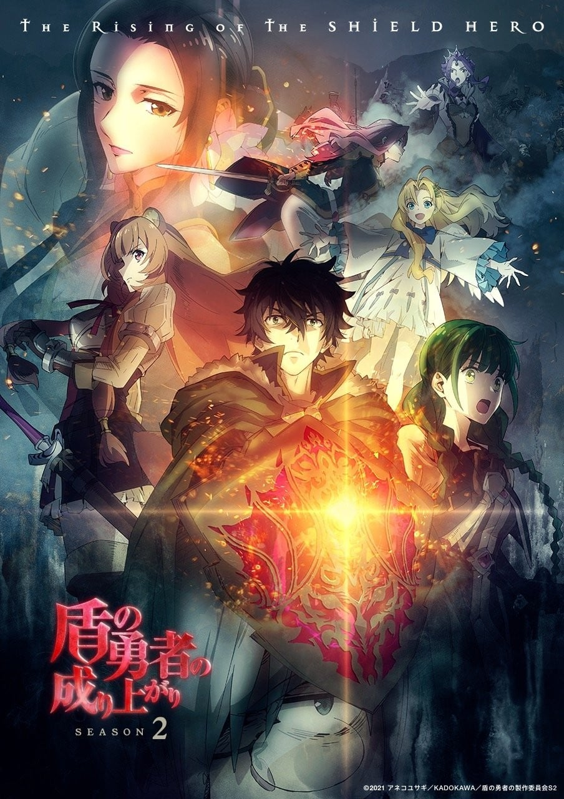
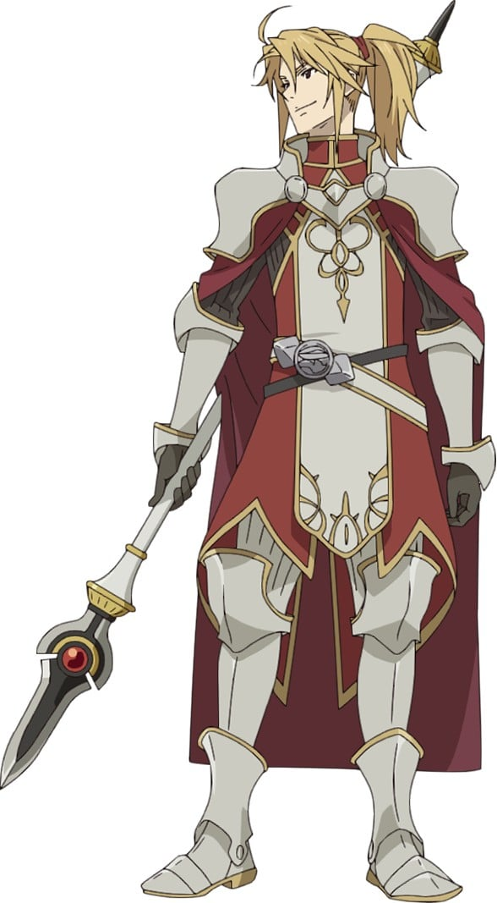
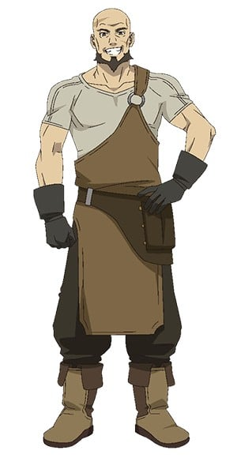
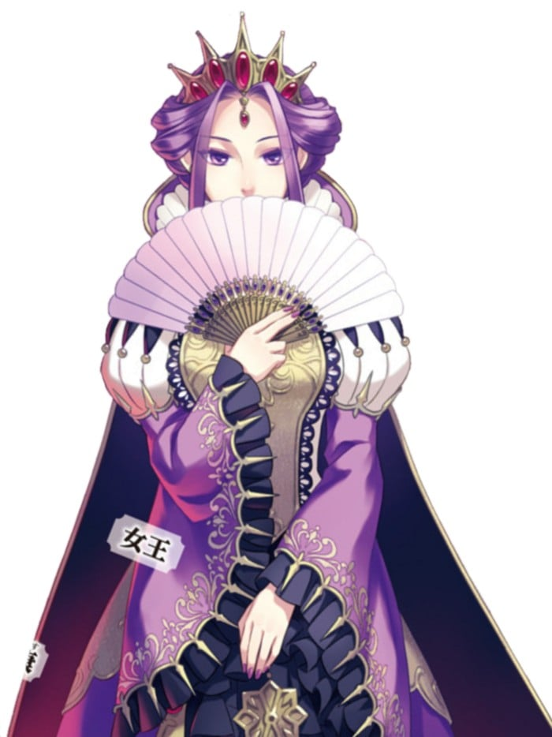

> [!bookinfo|noicon]+ **盾之勇者成名录 第二季**
> 
>
| 日文名 | 盾の勇者の成り上がり Season 2 |
|:------: |:------------------------------------------: |
| 类型 | 小说改 |
| 新番 | 2022 年 4 月 |
| 集数 | 共13话 |
| 官网 | [http://shieldhero-anime.jp/](https://http://shieldhero-anime.jp/) |
| 制作 | DR MOVIE |
| 导演 | 神保昌登 |
| 脚本 | 小柳啓伍 |
| 评分 | 4.8|
| 制片人 | 小笠原宗紀 |

> [!abstract]+ **简介**
> ごく普通の大学生・岩谷尚文は、
四聖勇者の一人「盾の勇者」として異世界に召喚される。
冤罪によって数々の迫害に遭いながらも、
大切な仲間であるラフタリア、
フィーロ、メルティと力を合わせ、
世界を脅かす災厄「波」から人々を守ってきた。

尚文はその活躍とメルロマルク女王の助力によって
名誉を回復し、自らの領地を獲得。
再び訪れる波に対抗するための準備を進めるのだった。

しかし、メルロマルクの東方にある霊亀国で
未曾有の災害をもたらす魔物「霊亀」の復活が確認される。
女王から霊亀討伐の依頼を受けた尚文は、
新たな仲間リーシアを加え霊亀国へ向かう。
連合軍が集結する中、突如として尚文の前に現れたのは、
霊亀国国王の側室にして摂政のオスト=ホウライだった。

彼女から霊亀を不正に復活させた者の存在を知らされる尚文。
果たして霊亀を討伐し、
黒幕へ辿り着くことはできるのか―。

大切なものを守るために、盾の勇者が再び立ち上がる。

> [!tip]+ **章节列表**
>- [ ] 第1话：新的咆哮 (2022-04-06)
>- [ ] 第2话：灵龟的踪迹 (2022-04-13)
>- [ ] 第3话：动摇的大地 (2022-04-20)
>- [ ] 第4话：雾中的遗迹 (2022-04-27)
>- [ ] 第5话：奥斯特·蓬莱 (2022-05-04)
>- [ ] 第6话：追逐 (2022-05-11)
>- [ ] 第7话：无限迷宫 (2022-05-18)
>- [ ] 第8话：雪之离别 (2022-05-25)
>- [ ] 第9话：神鸟歌姬 (2022-06-01)
>- [ ] 第10话：刀之勇者 (2022-06-08)
>- [ ] 第11话：绊 (2022-06-15)
>- [ ] 第12话：战斗的理由 (2022-06-22)
>- [ ] 第13话：追忆的献花 (2022-06-29)
>- [ ] 第0话：『盾の勇者の成り上がり』放送直前! ラフタリアとフィーロはSeason 2が待ちきれない!! SPECIAL (2022-03-20)

> [!tip]+ **主要角色**
> 
| 角色 | CV | 简介| 角色图片 |
|:----:|:---:|:---:|:--------:|
| 岩谷尚文 | 石川界人 | 盾の勇者。20歳のオタク大学生。『四聖武器書』を読んでいたところ、異世界に召喚される。絶大な防御力を誇るが、攻撃力はほとんどない。異世界で人間不信に陥ったことで、本来の穏やかさは消え、冷徹な人間に。 |  |
| ラフタリア | 瀬戸麻沙美 | 尚文が最初に買ったラクーン種と呼ばれる亜人の奴隷。真っ直ぐな性格。尚文の剣として素直に付き従っている。 |  |
| 天木錬 | 松岡禎丞 | 剣の勇者。16歳の高校生。小柄だが端正な顔立ちをした美少年。理知的ながらもプライドが高く、他人を見下しがち。 |  |
| 北村元康 | 高橋信 | 槍の勇者。21歳の大学生。女性の扱いに慣れており、パーティも女の子だらけ。周囲の女性のこととなると周りが見えなくなり、騙されやすい。 |  |
| 川澄樹 | 山谷祥生 | 弓の勇者。17歳の高校生。物腰は柔らかくどこか儚げ。勇者の中でもっとも小柄だが、正義感は人一倍強い。正義を求めるあまり、周囲が見えなくなることも。 |  |
| フィーロ | 日高里菜 | フィロリアルと呼ばれる鳥形の魔物。高度な変身能力を持つフィロリアル・クイーンであり、背中に羽根を生やした少女の姿に変身できる。得意魔法は風。明るく元気で大飯食らい。 |  |
| メルティ＝Q＝メルロマルク | 内田真礼 | フィロリアルの群れの中で出会った女の子。生真面目で友人を大切にするが、感情的になると子どもっぽさを見せる一面もある。そして、なにやら秘密がありそうで…。 |  |
| マルティ＝S＝メルロマルク | ブリドカットセーラ恵美 | 盾の勇者の尚文の最初の仲間。遠慮のない、気さくな女の子だが……。 |  |
| エルハルト | 安元洋貴 | メルロマルクで武器屋を営む体格の良い親父。 オーダーメイドで蛮族の鎧を作るなど、武器屋としての腕も一流で、尚文達は信頼を置いている。 |  |
| フィトリア | 丹下桜 | 世界のフィロリアルを統括する女王。遥か昔に四聖勇者が育てた伝説のフィロリアル。白と空色を基調とした外見で、本来のフィロリアル体では全長は6ｍになる。瞳の色は赤。人間体はフィーロと同程度の背格好であり、その他に通常のフィロリアルにも擬態できる。クラスアップの際に干渉することで身体面を中心としたステータスを2倍近く上げることが出来る。 フィロリアルの聖域に住み、人里離れた龍刻の砂時計を中心に波に対処しており、霊亀とタイマンで戦えるほど戦闘能力に優れている。 クイーンになったフィーロの実力を知るためと勇者の内情を知るために封印から解かれた魔物・タイラントドラゴンレックスと戦う尚文一行の前に現れる。四聖がいがみ合い、メルロマルク以外の各地の波を放置して居ることに呆れ果て、場合によっては現四聖を処分して、新しい四聖を召喚させようと考える。フィーロの試練が終えた後は実力を認め、冠羽と祝福を与える。そして現四聖処分を保留にし、尚文に他の勇者と和解し、協力し合うことを約束させる。その後はフィーロの冠羽を介して監視と連絡を行う。あれやこれやと指示を出す割りに詳しい理由を聞いても「昔過ぎて覚えていない」と答えたり、断りもなくフィーロとラフタリアのクラスアップに干渉するなど、尚文からは今ひとつ信用されていない。 霊亀事件では独断専行した他の勇者を追うために協力を求めるも、尚も好き勝手する勇者たちを見放してしまう。しかし、キョウによって霊亀が守護獣としての役割が果たせなくなったため、霊亀の足止めのために駆け付ける。 フィロリアルであるためドラゴンとは犬猿の仲であり、尚文にフィロリアルシリーズの武器を全解放させる素材を渡すも裏でドラゴン系統の武器にロックをかけている[注 63]ほか、聖域の巣には対ドラゴン用の武器・装備が貯め込まれている。 霊亀戦で馬車を変化させたり、資質上昇もできることからWeb版と同様に馬車の勇者と思われる。尚文からも指摘を受けるがなぜか話そうとしない。 元康からの呼称は「大きなフィロリアル様」。後に「フィトリアたん」。元康はフィーロの次に好きと言っているが、フィトリアからはフィーロ同様に嫌われている。外伝の『槍の勇者のやり直し』では、初対面時に飛び掛かられたため、嫌うというより怖がられている。 |  |
| リーシア＝アイヴィレッド | 原奈津子 |  |  |
| ミレリア＝Q＝メルロマルク | 井上喜久子 |  |  |