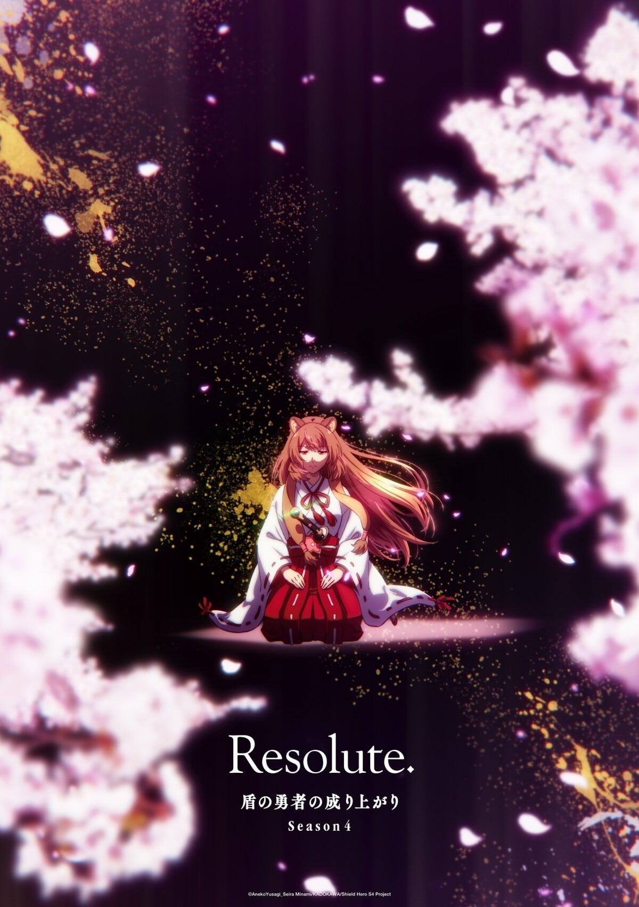
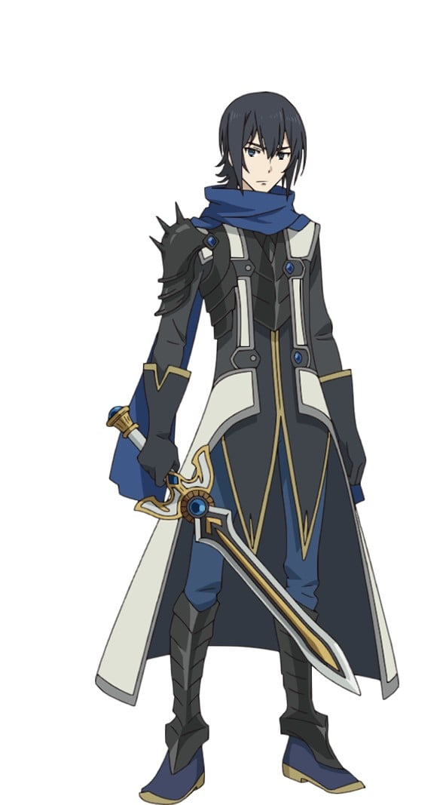
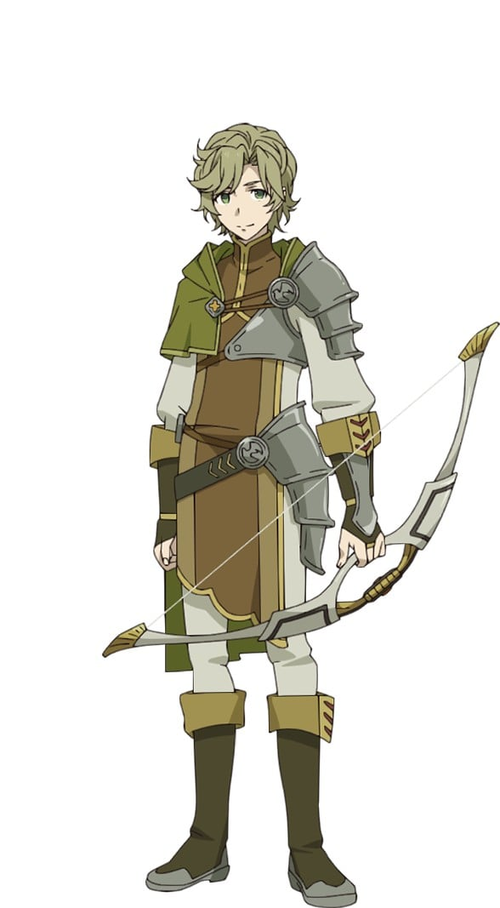
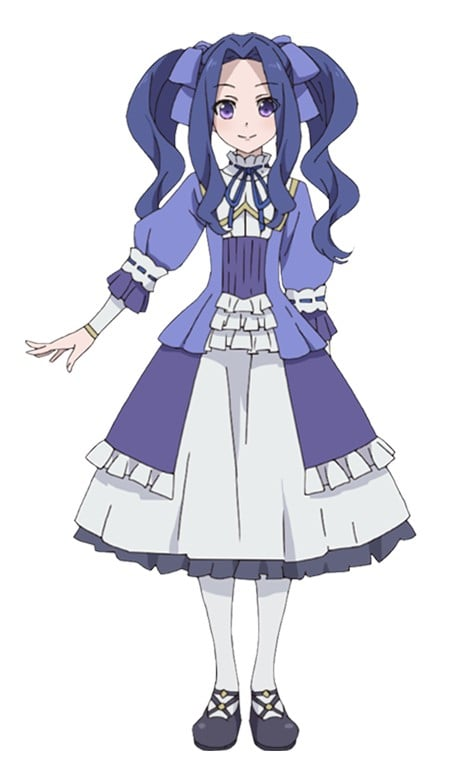
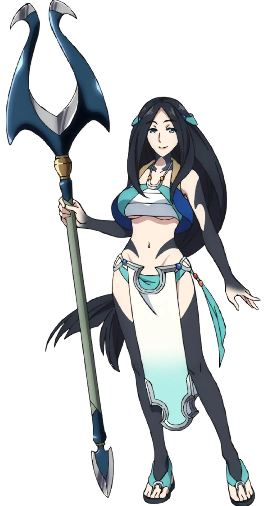

> [!bookinfo|noicon]+ **盾之勇者成名录 第四季**
> 
>
| 日文名 | 盾の勇者の成り上がり Season 4 |
|:------: |:------------------------------------------: |
| 类型 | 小说改 |
| 新番 | 2025 年 7 月 |
| 集数 | 共12话 |
| 官网 | [http://shieldhero-anime.jp/](https://http://shieldhero-anime.jp/) |
| 制作 | KINEMA CITRUS |
| 导演 | 垪和等 |
| 脚本 | 大塩哲史,冨永芳和,和場明子,田中美佳,江嵜大兄,小柳啓伍 |
| 评分 | 5.3|
| 制片人 | 小笠原宗紀 |

> [!abstract]+ **简介**
> 復活間近の四霊「鳳凰」との戦いに備える盾の勇者・岩谷尚文は、
反目し合う四聖勇者の力を合わせるべく、
三勇者と対峙し、そして和解へと至った。

しかしラフタリアが、
誤解から王位を継承する意識ありと認識され…
クテンロウという国の刺客に命を狙われてしまう。

尚文はクテンロウと話をつけるため、
唯一連絡船の出ている、亜人の国シルトヴェルトを訪れる。
盾の勇者を信仰する亜人たちに熱烈に歓迎されるが、
シルトヴェルトも一枚岩ではなく、尚文一行を歓迎しない者もいた。

そして、クテンロウもまた政情不安を抱え、
ラフタリアが革命の旗印に祭り上げられていく。

混迷を極める情勢の中、
尚文は仲間を導く光となるか――。

> [!tip]+ **章节列表**
>- [ ] 第1话：席德威鲁特 (2025-07-09)
>- [ ] 第2话：款待 (2025-07-16)
>- [ ] 第3话：何为真正的国民 (2025-07-23)
>- [ ] 第4话：受托之力 (2025-07-30)
>- [ ] 第5话：白虎 (2025-08-06)
>- [ ] 第6话：启航 (2025-08-13)
>- [ ] 第7话：登陆九天楼 (2025-08-20)
>- [ ] 第8话：大蛇 (2025-08-27)
>- [ ] 第9话：索狄雅 (2025-09-03)
>- [ ] 第10话：祈愿 (2025-09-10)
>- [ ] 第11话：神讬巫女 (2025-09-17)
>- [ ] 第12话：天命归位 (2025-09-24)

> [!tip]+ **主要角色**
> 
| 角色 | CV | 简介| 角色图片 |
|:----:|:---:|:---:|:--------:|
| 岩谷尚文 | 石川界人 | 盾の勇者。20歳のオタク大学生。『四聖武器書』を読んでいたところ、異世界に召喚される。絶大な防御力を誇るが、攻撃力はほとんどない。異世界で人間不信に陥ったことで、本来の穏やかさは消え、冷徹な人間に。 |  |
| ラフタリア | 瀬戸麻沙美 | 尚文が最初に買ったラクーン種と呼ばれる亜人の奴隷。真っ直ぐな性格。尚文の剣として素直に付き従っている。 |  |
| 天木錬 | 松岡禎丞 | 剣の勇者。16歳の高校生。小柄だが端正な顔立ちをした美少年。理知的ながらもプライドが高く、他人を見下しがち。 |  |
| 北村元康 | 高橋信 | 槍の勇者。21歳の大学生。女性の扱いに慣れており、パーティも女の子だらけ。周囲の女性のこととなると周りが見えなくなり、騙されやすい。 |  |
| 川澄樹 | 山谷祥生 | 弓の勇者。17歳の高校生。物腰は柔らかくどこか儚げ。勇者の中でもっとも小柄だが、正義感は人一倍強い。正義を求めるあまり、周囲が見えなくなることも。 |  |
| フィーロ | 日高里菜 | フィロリアルと呼ばれる鳥形の魔物。高度な変身能力を持つフィロリアル・クイーンであり、背中に羽根を生やした少女の姿に変身できる。得意魔法は風。明るく元気で大飯食らい。 |  |
| メルティ＝Q＝メルロマルク | 内田真礼 | フィロリアルの群れの中で出会った女の子。生真面目で友人を大切にするが、感情的になると子どもっぽさを見せる一面もある。そして、なにやら秘密がありそうで…。 |  |
| オルトクレイ＝メルロマルク32世 | 仲野裕 | 尚文たちが召喚された異世界・メルロマルクの王。 四聖勇者の中でも盾の勇者・尚文を目の仇にして色々と不公平な態度を取る。 |  |
| フィトリア | 丹下桜 | 世界のフィロリアルを統括する女王。遥か昔に四聖勇者が育てた伝説のフィロリアル。白と空色を基調とした外見で、本来のフィロリアル体では全長は6ｍになる。瞳の色は赤。人間体はフィーロと同程度の背格好であり、その他に通常のフィロリアルにも擬態できる。クラスアップの際に干渉することで身体面を中心としたステータスを2倍近く上げることが出来る。 フィロリアルの聖域に住み、人里離れた龍刻の砂時計を中心に波に対処しており、霊亀とタイマンで戦えるほど戦闘能力に優れている。 クイーンになったフィーロの実力を知るためと勇者の内情を知るために封印から解かれた魔物・タイラントドラゴンレックスと戦う尚文一行の前に現れる。四聖がいがみ合い、メルロマルク以外の各地の波を放置して居ることに呆れ果て、場合によっては現四聖を処分して、新しい四聖を召喚させようと考える。フィーロの試練が終えた後は実力を認め、冠羽と祝福を与える。そして現四聖処分を保留にし、尚文に他の勇者と和解し、協力し合うことを約束させる。その後はフィーロの冠羽を介して監視と連絡を行う。あれやこれやと指示を出す割りに詳しい理由を聞いても「昔過ぎて覚えていない」と答えたり、断りもなくフィーロとラフタリアのクラスアップに干渉するなど、尚文からは今ひとつ信用されていない。 霊亀事件では独断専行した他の勇者を追うために協力を求めるも、尚も好き勝手する勇者たちを見放してしまう。しかし、キョウによって霊亀が守護獣としての役割が果たせなくなったため、霊亀の足止めのために駆け付ける。 フィロリアルであるためドラゴンとは犬猿の仲であり、尚文にフィロリアルシリーズの武器を全解放させる素材を渡すも裏でドラゴン系統の武器にロックをかけている[注 63]ほか、聖域の巣には対ドラゴン用の武器・装備が貯め込まれている。 霊亀戦で馬車を変化させたり、資質上昇もできることからWeb版と同様に馬車の勇者と思われる。尚文からも指摘を受けるがなぜか話そうとしない。 元康からの呼称は「大きなフィロリアル様」。後に「フィトリアたん」。元康はフィーロの次に好きと言っているが、フィトリアからはフィーロ同様に嫌われている。外伝の『槍の勇者のやり直し』では、初対面時に飛び掛かられたため、嫌うというより怖がられている。 |  |
| リーシア＝アイヴィレッド | 原奈津子 |  |  |
| ミレリア＝Q＝メルロマルク | 井上喜久子 |  |  |
| サディナ | 小清水亜美 | ゼルトブルの地下賭博闘技場で出会った、お気楽な酔いどれお姉さん。しかし戦闘となると、雷の魔法を使い、大きな銛で接近戦もこなす。尚文たちの強力なライバルとなるが、ラフタリアとは接点があったようで…。 |  |