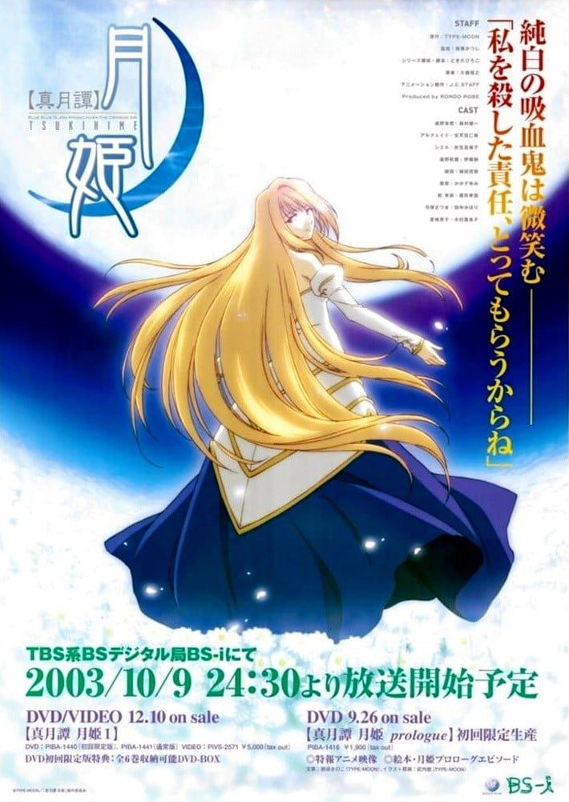
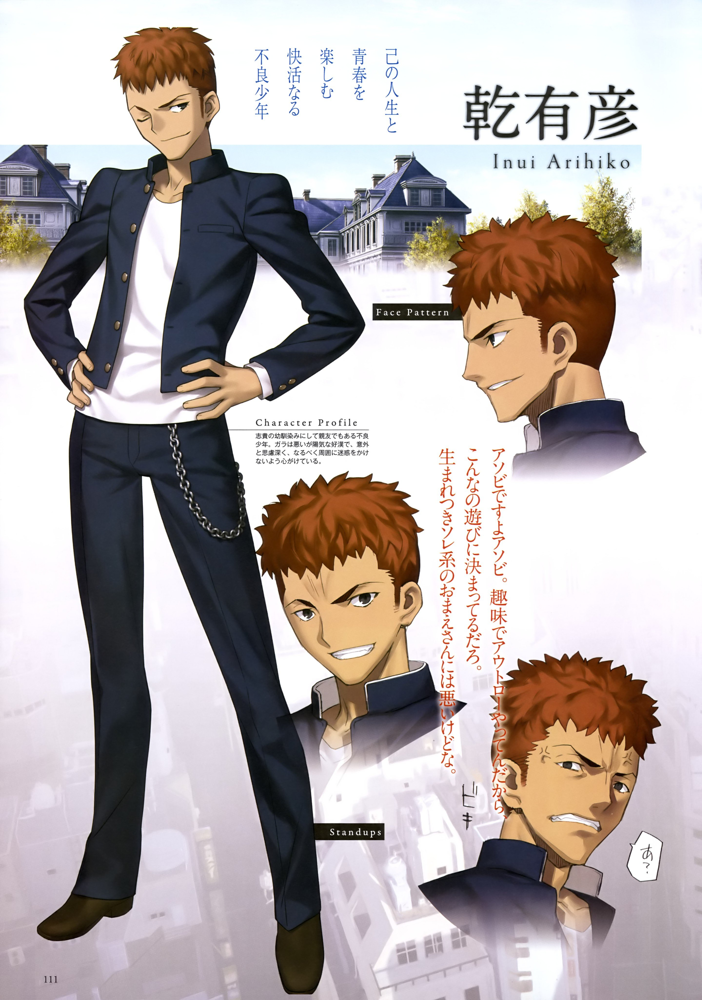
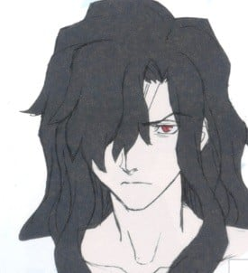
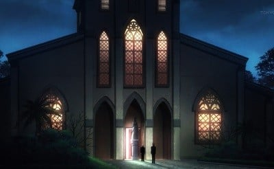

> [!bookinfo|noicon]+ **真月谭月姬**
> 
>
| 日文名 | 真月譚 月姫 |
|:------: |:------------------------------------------: |
| 类型 | 游戏改 |
| 新番 | 2003 年 10 月 |
| 集数 | 共12话 |
| 官网 | [[{'k': 'NBC环球', 'v': 'https://www.nbcuni.co.jp/rondorobe/anime/tsukihime/'}, {'k': 'J.C.STAFF', 'v': 'http://www.jcstaff.co.jp/sakuhin/nenpyo/2003/08_tsukihime/tsukihime.htm'}]](https://[{'k': 'NBC环球', 'v': 'https://www.nbcuni.co.jp/rondorobe/anime/tsukihime/'}, {'k': 'J.C.STAFF', 'v': 'http://www.jcstaff.co.jp/sakuhin/nenpyo/2003/08_tsukihime/tsukihime.htm'}]) |
| 制作 | J.C.STAFF |
| 导演 | 桜美かつし |
| 脚本 | ときたひろこ |
| 评分 | 5.8|
| 制片人 |  |

> [!abstract]+ **简介**
> 故事描述主人公远野志贵在八年前的意外中，获得能杀死事物的“直死之魔眼”。由于对自己的新能力的恐惧，他在当天逃离了医院，并邂逅了一个名为苍崎青子的魔法使，在她的帮助下，魔眼的能力得以用一副眼镜封印起来。之后的八年间，志贵作为养子在远野的分家有间家度过。

八年平凡的日子后，由于父亲的去世，他被成为远野家新家主的妹妹秋叶召回远野家。就在生活突然发生巨大改变之时，志贵不自觉的利用直死之魔眼杀死一名女性，但第二天这个女性像是没发生过似的站在他眼前。

> [!tip]+ **章节列表**
>- [ ] 第1话：反转冲动 (2003-10-09)
>- [ ] 第2话：黑之兽 (2003-10-16)
>- [ ] 第3话：直死之魔眼 (2003-10-23)
>- [ ] 第4话：摇篮之庭 (2003-10-30)
>- [ ] 第5话：空之弓 (2003-11-06)
>- [ ] 第6话：白色之梦 (2003-11-13)
>- [ ] 第7话：苍之咎迹 (2003-11-20)
>- [ ] 第8话：槛发 (2003-11-27)
>- [ ] 第9话：死 (2003-12-04)
>- [ ] 第10话：朱之红月 (2003-12-11)
>- [ ] 第11话：凶夜 (2003-12-18)
>- [ ] 第12话：月世界 (2003-12-25)

> [!tip]+ **主要角色**
> 
| 角色 | CV | 简介| 角色图片 |
|:----:|:---:|:---:|:--------:|
| アルクェイド・ブリュンスタッド | 生天目仁美 | 生存了八百年以上的吸血鬼，真祖的公主。   《月姬》的故事开始时，Arcueid 来到远野志贵所住的城市，目的是消灭数百年来她不断追杀的一名吸血鬼。她在寻找目标时，偶然遇到了志贵；受退魔一族本能支配的志贵跟踪她回住处，以苏醒的杀人技巧和直死之魔眼瞬间将她分割成十七块。身为真祖的她虽然没死，却身受重创；本来想杀死志贵报仇，但在四周都是敌人及身体衰弱的情况下决定迫使志贵协助她。 |  |
| 遠野志貴 | 鈴村健一 | 本作的男主角，个性上随和，因为八年前的事件而拥有可杀死万物的“直死之魔眼”。为避免带给脑部过大的负担，平常则是戴着“魔眼杀”的眼镜来抑止。  真实身分是退魔者七夜一族，被远野家灭族后发现，因与远野家长子四季名字同音而被收养（也是因为远野慎久想借七夜家遗孤来抑止自己的反转冲动）利用催眠窜改记忆，而当成自己的儿子收养。体能上其实相当优越，不过有偶发性的贫血，外貌看起来就像个文弱书生，和好友乾有彦有相当的深交。 |  |
| 遠野秋葉 | 伊藤静 | 远野志贵的妹妹，本作里篇的女主角之一，远野家的现任当家。无论是外表或是礼仪态度上都无懈可击，个性上十分刚强，小时候则是完全相反的柔弱性格。对志贵有相当的执著心，抱有着超越兄妹的感情，志贵回到远野家的也是秋叶的命令。  就读隔壁县的浅上女子学院，原本在浅上女子学院住宿，因为志贵搬回而改为通勤上课。在浅上有好友月姬苍香、三泽羽居，与具有未来视能力的学妹濑尾晶三人。  远野家实际上是混有鬼之血的一族，偶尔会出现像秋叶名为“红赤朱”的反转现象。红赤朱是远野家出现反转现象时所称之名，此时头发会变红，名为“槛发”，会拥有特殊能力“掠夺”，本作中秋叶用来掠夺对手的热。 |  |
| 巫淨翡翠 | かかずゆみ | 远野家的女仆，双子的妹，本作里篇的女主角之一，和姊姊琥珀从小被远野家收养，个性沉默寡言，不擅于表达自己的态度或意见。有着极度的洁癖症，在远野家担任除了厨房外的一切杂务（想自杀请让翡翠做饭=v=）。自从志贵回来后也负责照顾志贵的生活起居，不过有男性恐惧症。  翡翠属于两仪、浅神、巫净、七夜四家退魔一族中的巫净家，巫净家的能力不像其他三家仅能透过血缘继承，而可经由知识、技术教授。但翡翠和琥珀则是因为血缘关系而继承其能力。 |  |
| 巫淨琥珀 | 植田佳奈 | 远野家的烹饪妇，双子的姊，本作里篇的女主角之一，个性开朗明亮，和沉默的翡翠为正反的存在，但有着悲惨的过去。负责控管远野家金钱使用和健康管理，过去负责照顾远野前当家，因此现在也负责照顾秋叶的生活起居。  兴趣是研究药草和种植植物（有毒居多），其房间也是家里唯一有电视、监视器等电器设备的房间。  在远野家受害最深的人，早在慎久在生时便被迫受凌辱来抑止他的反转冲动，而现在又为秋叶提供血液抑止她的冲动。   琥珀也属于两仪、浅神、巫净、七夜四家退魔一族中的巫净家，巫净家的能力不像其他三家仅能透过血缘继承，而可经由知识、技术教授。但翡翠和琥珀则是因为血缘关系而继承其能力。 |  |
| 弓塚さつき | 田中かほり | 志贵的同学，国中被志贵救了之后，从此对主角存有好感，据称原本应该有专属路线，但被删成为最悲情的路人。因意外成为吸血鬼，一脚踏进了非人的世界，最后被主角刺中死点死亡。  有成为吸血鬼的资质，百年难得一见的人才，一般人花数十年才能成为吸血鬼，她一夜即可达成，能够挑战27祖实力的有力候选人之一。拥有固有结界“枯竭庭园”，但实际使用上无法确定。 |  |
| シエル | 折笠富美子 | 在《月姬》故事中突然出现于远野志贵等人身旁的学姐，就读三年级。对志贵周遭的大小事都相当关心，而志贵在遇到问题时也会寻求她的协助。咖哩魔人，每天三餐吃咖哩。  真正身份是埋葬机关中排名第七位的代行者，手持黑键，负责歼灭吸血鬼，拥有卓越的身体能力、魔术能力、庞大知识，以及毫无感情的冷彻。和其他的代行者完全处不来，通常都是单独行动居多。因为罗亚的缘故成为了不死者，自此不断的追杀罗亚。最大武器为第七圣典，概念能力是否定轮回，基本上是对罗亚专用武器。 |  |
| 蒼崎青子 | 木村亜希子 | 　　教导志贵“即使拥有奇怪的眼睛，不要连心也变得奇怪”的价值观的人，在志贵小时候曾赠予志贵能抑制魔眼能力的眼镜“魔眼杀”，志贵称之为老师，在志贵记忆中是个有着大人魅力的女性。 　　现有的五位魔法使之一（第四魔法使）。 使用第五魔法·青。 　　魔术协会封为MISS BLUE，目前全国巡回中。个性大而化之，做事随意，喜欢自由。 　　是苍崎橙子的妹妹，但和姐姐橙子关系极恶劣，曾为了家族继承权而大打出手，从此两人绝不见面。 　　在破坏方面有着极大的天赋，能够最有效率的使用魔力，有近身战的兴趣。 |  |
| 乾有彦 | 櫻井孝宏 | 　志貴の学校のクラスメイト。 　中学生時代からの幼馴染であり、気の置けない親友でもある不良少年。 　教室で見かける事はあまりなく、生徒達からもどこか距離を取られている存在だが、基本的には陽気な好漢で、周囲に迷惑をかけぬよう心がけているらしい。 　特に身内に対しては思慮深いところがあり、志貴が彼に助けられる場面も過去幾度となくあった。 |  |
| 遠野四季 | 吉野裕行 | 《月姬》远野线（里线）的BOSS。 |  |
| 聖堂教会 |  | 「普遍的な」意味を持つ一大宗教。その裏側に存在する組織。 教義に反したモノを熱狂的に排斥する者たちによって設立された、「異端狩り」に特化した巨大な部門。これを聖堂教会と呼ぶ。 TYPE-MOON世界最大の組織であり、代行者、各教会が保有する騎士団、そして教会本部が隠し持つ埋葬機関と、強大な戦力を保有しており、吸血種をはじめ、人の範疇から外れてしまった者達にとっての天敵として君臨している。  彼らの目的は全ての異端を消し去り、人の手に余る神秘を正しく管理することである。このため、「神秘の秘匿」を第一主義とする魔術協会とは仲が悪く、幾度と無く刃を交えてきた間柄。しかし彼等にとって最大の敵は吸血種である為、現在は協定が結ばれ、表面上は不可侵を保ち、時として協力し合っている。尤も実際のところは、記録に残さない事を前提に、陰では現在もなお殺し合いを続けている。 ただ、特に教義に反しているというわけではないので、魔術師の持つ根源への渇望には関知しない。 |  |
| ネロ・カオス | 三宅健太 | 死徒27祖之一，排名第十，实力极强。冷静而不抱有感情的学者，出身于移动石柩·北之彷徨海的魔术师，被称为「彷徨悔的鬼之子」。  并非被吸血鬼袭击而成为死徒，而是为研究魔术而自己成为死徒。过去身为人类的名字为佛罗布·罗韦恩，卡欧斯是教会为他安上的名字。  身体内部就是个小型的固有结界“兽王之巢”，内藏666只兽，任何物理、魔术伤害都无法将他致死，因碰上可杀死万物的直死之魔眼而被消灭。 |  |