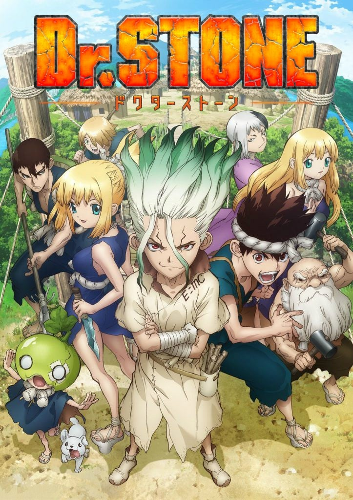

> [!bookinfo|noicon]+ **石纪元**
> 
>
| 日文名 | Dr.STONE |
|:------: |:------------------------------------------: |
| 类型 | 漫改 |
| 新番 | 2019 年 7 月 |
| 集数 | 共24话 |
| 官网 | [https://dr-stone.jp/](https://https://dr-stone.jp/) |
| 制作 | トムス・エンタテインメント |
| 导演 | 飯野慎也 |
| 脚本 | 木戸雄一郎 |
| 评分 | 7.2|
| 制片人 |  |

> [!abstract]+ **简介**
> 全人类被神奇的现象一瞬间石化后过了几千年——
拥有超人般头脑、天生的科学少年·千空苏醒了。
在文明遭到毁灭的石头世界（STONE WORLD）里，千空决定要用科学的力量复原整个世界。而与此同时苏醒过来的有，以有着过人体力的儿时玩伴·大木大树为首的伙伴们，从零开始创造文明——
从石器时代到现代文明，一定要赶上这科学史的200万年差距！
前所未闻的创世冒险谭，就此开幕！

> [!tip]+ **章节列表**
>- [ ] 第1话：石之世界 (2019-07-05)
>- [ ] 第2话：石之世界的王者 (2019-07-12)
>- [ ] 第3话：科学的武器 (2019-07-19)
>- [ ] 第4话：升起狼烟 (2019-07-26)
>- [ ] 第5话：石之世界 初章 (2019-08-02)
>- [ ] 第6话：石之世界的两个国家 (2019-08-09)
>- [ ] 第7话：200万年的隐居处 (2019-08-16)
>- [ ] 第8话：石之路线 (2019-08-23)
>- [ ] 第9话：手握科学的明灯 (2019-08-30)
>- [ ] 第10话：廉价的同盟 (2019-09-06)
>- [ ] 第11话：清晰的世界 (2019-09-13)
>- [ ] 第12话：互相托付身后的伙伴们 (2019-09-20)
>- [ ] 第13话：假面战士 (2019-09-27)
>- [ ] 第14话：火焰大师 (2019-10-04)
>- [ ] 第15话：200万年的结晶 (2019-10-11)
>- [ ] 第16话：数千年物语 (2019-10-18)
>- [ ] 第17话：百夜与千空 (2019-10-25)
>- [ ] 第18话：石之战争 (2019-11-01)
>- [ ] 第19话：向现代进发 (2019-11-08)
>- [ ] 第20话：动力的时代 (2019-11-15)
>- [ ] 第21话：斯巴达手工俱乐部 (2019-11-22)
>- [ ] 第22话：宝物 (2019-11-29)
>- [ ] 第23话：科学的波浪 (2019-12-06)
>- [ ] 第24话：将声音无限传递到远方 (2019-12-13)

> [!tip]+ **主要角色**
> 
| 角色 | CV | 简介| 角色图片 |
|:----:|:---:|:---:|:--------:|
| モブキャラクター | 梶原岳人 | 闲角，常称作路人，在电视剧、电影等作品中，指戏份薄弱的副角、不相关的小人物、串场的闲杂人等。可能用来表达地方民众的声音，或是充当背景。 モブキャラクター（mob character）とは、漫画、アニメ、映画、コンピュータゲームなどに描かれる端役のこと。群衆（群集）、または主要キャラクター以外の、その他大勢のこと。群集キャラ、背景キャラともいう。 |  |
| 石神千空 | 小松未可子 | 喜欢科学的少年，相信科学的力量，拥有丰富的知识贮备。 作为石神村村长统领着科学王国。 |  |
| 大木大樹 | 田村睦心 | 千空的朋友，暗恋着杠。 被千空称作体力笨蛋，性格温柔，绝不会攻击他人。 |  |
| 小川杠 | 市ノ瀬加那 | 大树的同学兼暗恋对象。性格开朗，喜欢恶作剧。 属于手艺部，手指非常灵巧，擅长料理，女子力高。 |  |
| 獅子王司 | 中村悠一 | 灵长类最强的高中生，能够徒手打倒狮子的男人。 |  |
| コハク | 沼倉愛美 | 16岁，居住于石神村的少女，身手矫健、力量不输男性、视力11.0，会基本算术。琉璃的妹妹。 |  |
| クロム | 泊明日菜 | 16岁，村中的“妖术使”，喜欢搜集各种材料的热血少年，靠着自己的实验而懂得许多科学知识，让千空十分惊讶。对科学充满热忱，因此与千空结为挚友。喜欢琉璃，与琉璃是青梅竹马，曾发誓过要治好琉璃的病。 |  |
| 金狼 | 前野智昭 | 18岁，保护村子的门卫，银狼的哥哥。一开始不太欢迎千空这个外人，但在他给他制作的长枪涂上金色后，稍稍改观。患有模糊病(近视)，为看清事物经常用力瞪大眼睛，因此给人凶恶的印象，实力约与玛古玛持平但因病无法发挥，在科学组制作眼镜得到矫正。 |  |
| 銀狼 | 村瀬歩 | 16岁，保护村子的门卫，金狼的弟弟。意志力薄弱，容易得意忘形，也经常因感到害怕而退缩示弱，得到了众人一致"不能让这个人当上村长"的评价，但在关键时刻意外有可靠的一面，并因此救过克罗姆一命。 |  |
| ルリ | 上田麗奈 | 18歳。传承“百物语”的巫女，琥珀的姐姐。因为患有肺炎而体虚。 和克罗姆是青梅竹马，本身也对克罗姆有好感。 |  |
| スイカ | 高橋花林 | 9岁。戴着整个西瓜皮的小个子少女，因为患有近视而利用西瓜皮上挖出的洞才看得清楚(小孔效果)。可以将身体完全缩在西瓜皮里伪装成单纯的西瓜来收集情报。 |  |
| 浅霧幻 | 河西健吾 | 19岁（石化前），魔术师，擅长操控人心，因此被司以优先序列复活，后被司派去打听千空的下落。性格上以自身利益为优先，只追随胜利的一方。 |  |