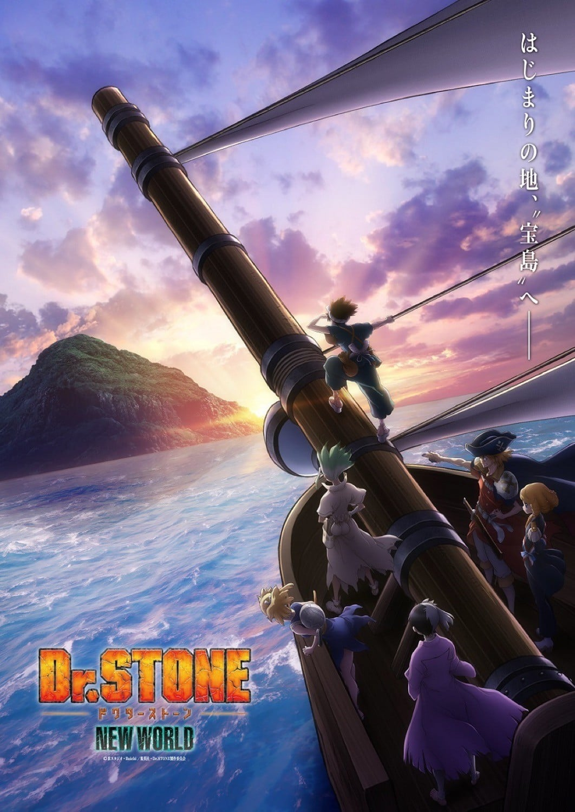
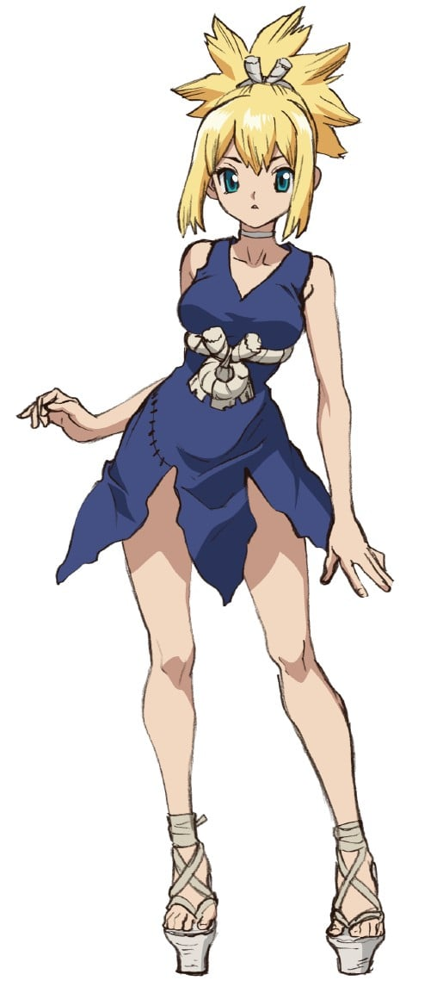
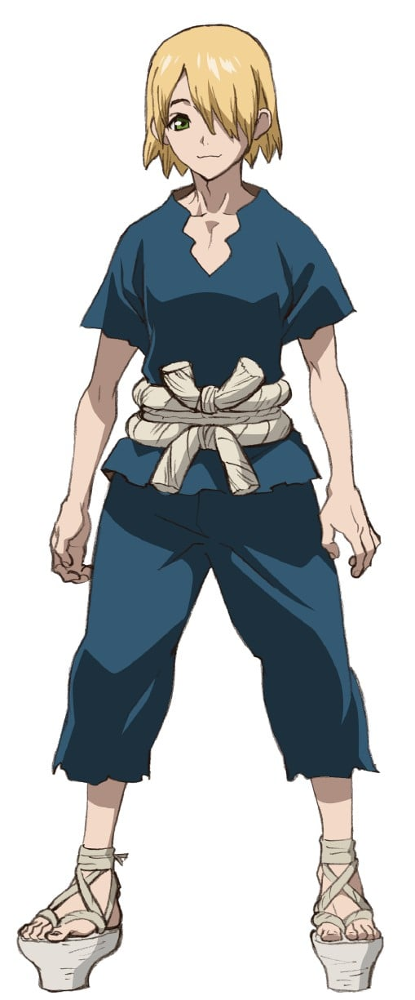

> [!bookinfo|noicon]+ **石纪元 新世界**
> 
>
| 日文名 | Dr.STONE NEW WORLD |
|:------: |:------------------------------------------: |
| 类型 | 漫改 |
| 新番 | 2023 年 4 月 |
| 集数 | 共11话 |
| 官网 | [https://dr-stone.jp](https://https://dr-stone.jp) |
| 制作 | トムス・エンタテインメント |
| 导演 | 松下周平 |
| 脚本 | 木戸雄一郎 |
| 评分 | 7.2|
| 制片人 | 片桐秀介 |

> [!abstract]+ **简介**
> 自全人类被神秘现象瞬间石化之后，已过去了几千年——
千空，一个有着超越常人的头脑，彻头彻尾的科学少年醒来了。
面对着文明已经灭绝的石之世界，千空决心以科学的力量重建地球，他找来了同伴，建立起了“科学王国”。
但是，他们碰上了由灵长类最强高中生狮子王司统领的“武力帝国”。
司为了净化人类，决心以强大的武力，阻止科学的发展。
经过科学与武力的大战，千空等人的科学王国取得优势，两国最终和解。
司因为背叛而陷入了冷冻睡眠状态，而千空为了复活全人类，决心率领科学王国前往石化光线的产生地——地球另一头的新世界。
迈向全世界，解开石化之谜！
石世界的大航海时代终于拉开了序幕！

> [!tip]+ **章节列表**
>- [ ] 第1话：NEW WORLD MAP (2023-04-06)
>- [ ] 第2话：欲望即正义 (2023-04-13)
>- [ ] 第3话：第一次接触 (2023-04-20)
>- [ ] 第4话：科学之眼 (2023-04-27)
>- [ ] 第5话：科学船帕尔修斯 (2023-05-04)
>- [ ] 第6话：宝箱 (2023-05-11)
>- [ ] 第7话：绝望与希望的光 (2023-05-18)
>- [ ] 第8话：王牌在科学之船上 (2023-05-25)
>- [ ] 第9话：美丽的科学 (2023-06-01)
>- [ ] 第10话：科学战争 (2023-06-08)
>- [ ] 第11话：亲手抓住奇迹 (2023-06-15)

> [!tip]+ **主要角色**
> 
| 角色 | CV | 简介| 角色图片 |
|:----:|:---:|:---:|:--------:|
| 石神千空 | 小林裕介 | 喜欢科学的少年，相信科学的力量，拥有丰富的知识贮备。 作为石神村村长统领着科学王国。 |  |
| 大木大樹 | 古川慎 | 千空的朋友，暗恋着杠。 被千空称作体力笨蛋，性格温柔，绝不会攻击他人。 |  |
| 小川杠 | 市ノ瀬加那 | 大树的同学兼暗恋对象。性格开朗，喜欢恶作剧。 属于手艺部，手指非常灵巧，擅长料理，女子力高。 |  |
| 獅子王司 | 中村悠一 | 灵长类最强的高中生，能够徒手打倒狮子的男人。 |  |
| コハク | 沼倉愛美 | 16岁，居住于石神村的少女，身手矫健、力量不输男性、视力11.0，会基本算术。琉璃的妹妹。 |  |
| クロム | 佐藤元 | 16岁，村中的“妖术使”，喜欢搜集各种材料的热血少年，靠着自己的实验而懂得许多科学知识，让千空十分惊讶。对科学充满热忱，因此与千空结为挚友。喜欢琉璃，与琉璃是青梅竹马，曾发誓过要治好琉璃的病。 |  |
| 金狼 | 前野智昭 | 18岁，保护村子的门卫，银狼的哥哥。一开始不太欢迎千空这个外人，但在他给他制作的长枪涂上金色后，稍稍改观。患有模糊病(近视)，为看清事物经常用力瞪大眼睛，因此给人凶恶的印象，实力约与玛古玛持平但因病无法发挥，在科学组制作眼镜得到矫正。 |  |
| 銀狼 | 村瀬歩 | 16岁，保护村子的门卫，金狼的弟弟。意志力薄弱，容易得意忘形，也经常因感到害怕而退缩示弱，得到了众人一致"不能让这个人当上村长"的评价，但在关键时刻意外有可靠的一面，并因此救过克罗姆一命。 |  |
| ルリ | 上田麗奈 | 18歳。传承“百物语”的巫女，琥珀的姐姐。因为患有肺炎而体虚。 和克罗姆是青梅竹马，本身也对克罗姆有好感。 |  |
| スイカ | 高橋花林 | 9岁。戴着整个西瓜皮的小个子少女，因为患有近视而利用西瓜皮上挖出的洞才看得清楚(小孔效果)。可以将身体完全缩在西瓜皮里伪装成单纯的西瓜来收集情报。 |  |
| 浅霧幻 | 河西健吾 | 19岁（石化前），魔术师，擅长操控人心，因此被司以优先序列复活，后被司派去打听千空的下落。性格上以自身利益为优先，只追随胜利的一方。 |  |
| カセキ | 麦人 | 60岁，经验丰富且满怀热忱的工匠，因为擅长工艺而协助千空与克罗姆，并与他们成为忘年之交。 |  |