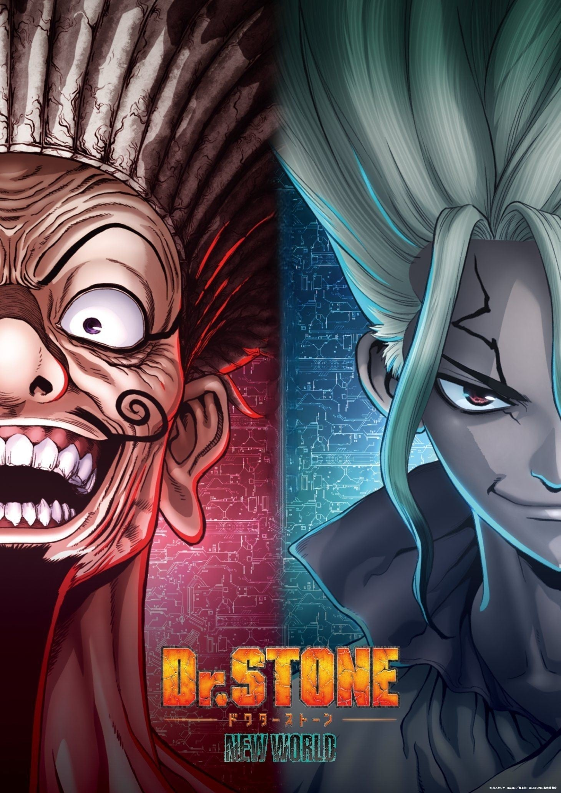

> [!bookinfo|noicon]+ **石纪元 新世界 第2部分**
> 
>
| 日文名 | Dr.STONE NEW WORLD 第2クール |
|:------: |:------------------------------------------: |
| 类型 | 漫改 |
| 新番 | 2023 年 10 月 |
| 集数 | 共11话 |
| 官网 | [https://dr-stone.jp](https://https://dr-stone.jp) |
| 制作 | トムス・エンタテインメント |
| 导演 | 松下周平 |
| 脚本 | 木戸雄一郎 |
| 评分 | 7.4|
| 制片人 | 片桐秀介 |

> [!abstract]+ **简介**
> 全人類が、謎の現象により一瞬で石化して数千年――。
超人的な頭脳を持つ、根っからの科学少年・千空が目覚めた。

文明が滅んだ石の世界(ストーンワールド)を前に、千空は、科学の力で世界を取り戻すことを決意。新たな仲間を集め『科学王国』を作りあげる。
しかし、そこへ霊長類最強の高校生・獅子王司率いる『武力帝国』が立ちはだかる。
人類の浄化を目指し、強大な武力によって科学の発展を阻止しようとする司。
科学vs武力の戦いは激闘の末、千空たち科学王国が優勢となり、両国は遂に和解する。

仲間の謀反によってコールドスリープ状態になった司、そして、全人類を復活すべく、
科学王国は石化光線の発生源、地球の裏側・新世界を目指す！

世界に飛び出て石化の謎を解き明かす！
石の世界(ストーンワールド)大航海時代がついに開幕する――!!

> [!tip]+ **章节列表**
>- [ ] 第12话：反击的科学王国 (2023-10-12)
>- [ ] 第13话：美杜莎的真面目 (2023-10-19)
>- [ ] 第14话：尔虞我诈的牌局 (2023-10-26)
>- [ ] 第15话：立体空间的决战 (2023-11-02)
>- [ ] 第16话：全域大乱战 (2023-11-09)
>- [ ] 第17话：鬼牌 (2023-11-16)
>- [ ] 第18话：灭亡的闪光 (2023-11-23)
>- [ ] 第19话：最后一人 (2023-11-30)
>- [ ] 第20话：最初的梦 (2023-12-07)
>- [ ] 第21话：宝岛 (2023-12-14)
>- [ ] 第22话：跨越新世界 (2023-12-21)

> [!tip]+ **主要角色**
> 
| 角色 | CV | 简介| 角色图片 |
|:----:|:---:|:---:|:--------:|
| 石神千空 | 小松未可子 | 喜欢科学的少年，相信科学的力量，拥有丰富的知识贮备。 作为石神村村长统领着科学王国。 |  |
| 大木大樹 | 古川慎 | 千空的朋友，暗恋着杠。 被千空称作体力笨蛋，性格温柔，绝不会攻击他人。 |  |
| 小川杠 | 市ノ瀬加那 | 大树的同学兼暗恋对象。性格开朗，喜欢恶作剧。 属于手艺部，手指非常灵巧，擅长料理，女子力高。 |  |
| 獅子王司 | 中村悠一 | 灵长类最强的高中生，能够徒手打倒狮子的男人。 |  |
| コハク | 沼倉愛美 | 16岁，居住于石神村的少女，身手矫健、力量不输男性、视力11.0，会基本算术。琉璃的妹妹。 |  |
| クロム | 佐藤元 | 16岁，村中的“妖术使”，喜欢搜集各种材料的热血少年，靠着自己的实验而懂得许多科学知识，让千空十分惊讶。对科学充满热忱，因此与千空结为挚友。喜欢琉璃，与琉璃是青梅竹马，曾发誓过要治好琉璃的病。 |  |
| 金狼 | 前野智昭 | 18岁，保护村子的门卫，银狼的哥哥。一开始不太欢迎千空这个外人，但在他给他制作的长枪涂上金色后，稍稍改观。患有模糊病(近视)，为看清事物经常用力瞪大眼睛，因此给人凶恶的印象，实力约与玛古玛持平但因病无法发挥，在科学组制作眼镜得到矫正。 |  |
| 銀狼 | 村瀬歩 | 16岁，保护村子的门卫，金狼的弟弟。意志力薄弱，容易得意忘形，也经常因感到害怕而退缩示弱，得到了众人一致"不能让这个人当上村长"的评价，但在关键时刻意外有可靠的一面，并因此救过克罗姆一命。 |  |
| ルリ | 上田麗奈 | 18歳。传承“百物语”的巫女，琥珀的姐姐。因为患有肺炎而体虚。 和克罗姆是青梅竹马，本身也对克罗姆有好感。 |  |
| スイカ | 高橋花林 | 9岁。戴着整个西瓜皮的小个子少女，因为患有近视而利用西瓜皮上挖出的洞才看得清楚(小孔效果)。可以将身体完全缩在西瓜皮里伪装成单纯的西瓜来收集情报。 |  |
| 浅霧幻 | 河西健吾 | 19岁（石化前），魔术师，擅长操控人心，因此被司以优先序列复活，后被司派去打听千空的下落。性格上以自身利益为优先，只追随胜利的一方。 |  |
| カセキ | 麦人 | 60岁，经验丰富且满怀热忱的工匠，因为擅长工艺而协助千空与克罗姆，并与他们成为忘年之交。 |  |