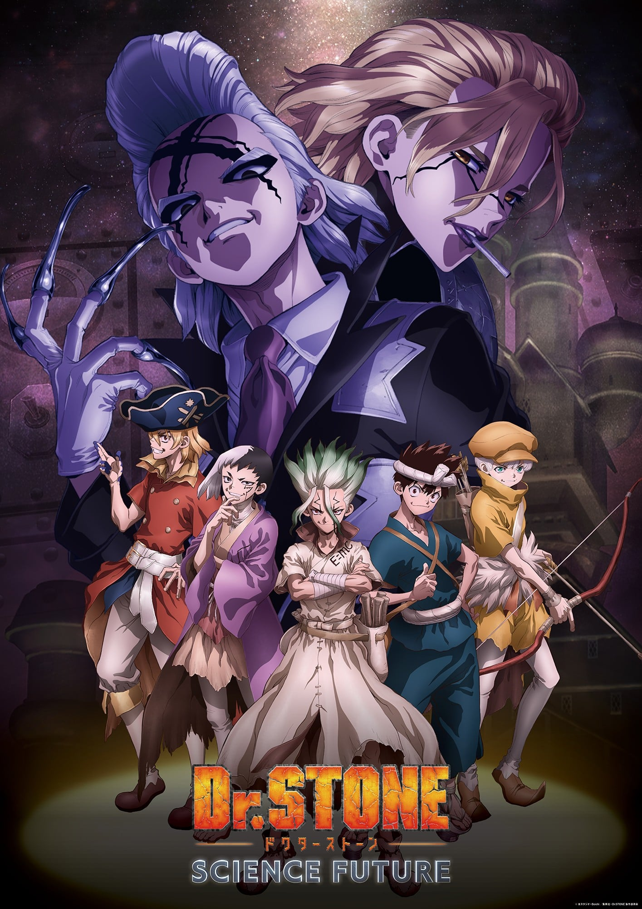
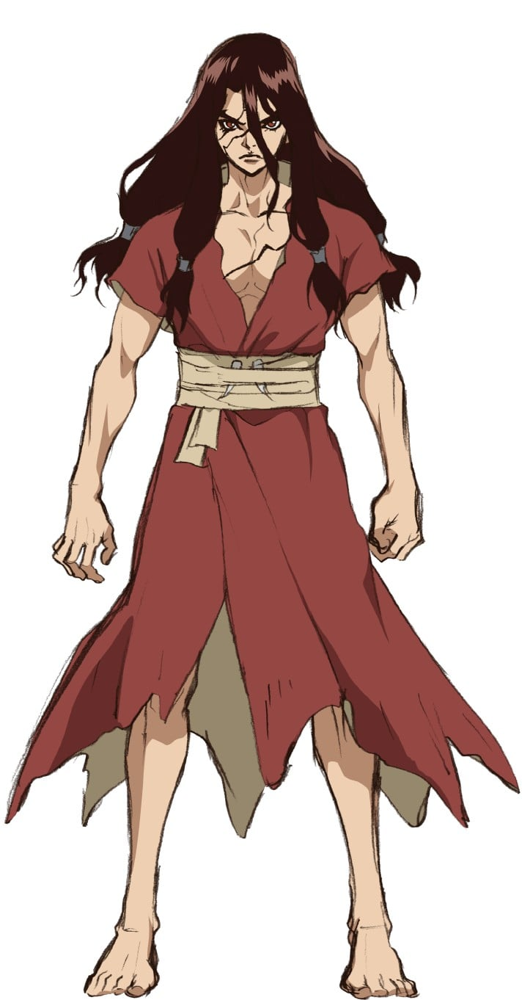
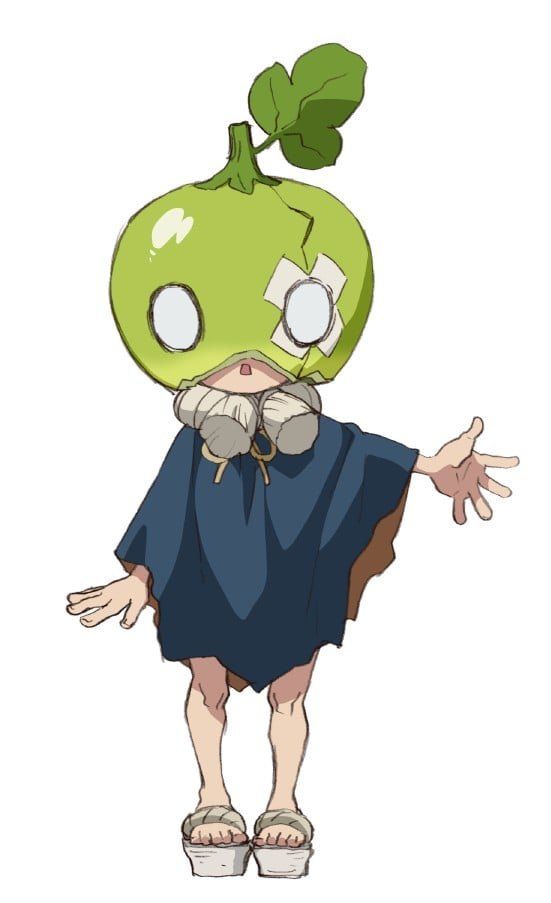
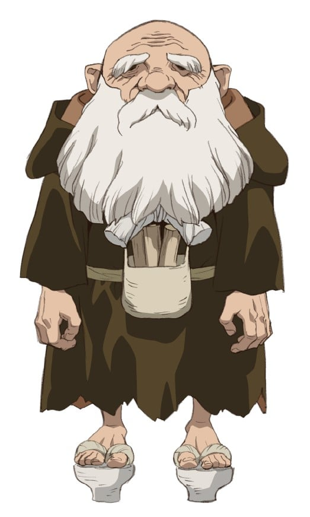

> [!bookinfo|noicon]+ **石纪元 科学与未来**
> 
>
| 日文名 | Dr.STONE SCIENCE FUTURE |
|:------: |:------------------------------------------: |
| 类型 | 漫改 |
| 新番 | 2025 年 1 月 |
| 集数 | 共12话 |
| 官网 | [https://dr-stone.jp](https://https://dr-stone.jp) |
| 制作 | トムス・エンタテインメント |
| 导演 | 松下周平 |
| 脚本 | 金田一士,砂山蔵澄 |
| 评分 | 7.3|
| 制片人 | 片桐秀介 |

> [!abstract]+ **简介**
> 宝島での激戦を終え、無事に科学王国へと帰還した千空たち。手に入れた石化装置で、コールドスリープしていた司を復活させることに成功。司は科学王国の仲間となった！そして、人類石化の黒幕・ホワイマンの本拠地が“月”であることを突き止めた千空たちは、月を目指す！このストーンワールドで、ゼロから宇宙船を作るビッグプロジェクトへと乗り出した。早速、世界中から宇宙船の素材を集める為、ペルセウス号で大海原へと飛び出した千空たち。復活液の原料となる大量のコーンを求め、最初の目的地・アメリカ大陸を目指す。勇気、結束、科学力、全てが試される大航海の先に、千空たちを揺るがす脅威が待ち構えていた──!!遂に、千空たちの冒険は世界、そして宇宙へ向けて動き出す！人類の未来を救う為、千空は仲間と共に全力で科学の道を切り拓いていく!!

> [!tip]+ **章节列表**
>- [ ] 第1话：龙水对阵千空 (2025-01-09)
>- [ ] 第2话：科学之旅 (2025-01-16)
>- [ ] 第3话：暗夜诱蛾灯 (2025-01-23)
>- [ ] 第4话：X博士 (2025-01-30)
>- [ ] 第5话：博士之间的对决 (2025-02-06)
>- [ ] 第6话：科学是优雅的 (2025-02-13)
>- [ ] 第7话：两位科学家 (2025-02-20)
>- [ ] 第8话：锁定目标 (2025-02-27)
>- [ ] 第9话：科学之灯 (2025-03-06)
>- [ ] 第10话：在泥泞的道路上 (2025-03-13)
>- [ ] 第11话：熟知规则之人与创造规则之人 (2025-03-20)
>- [ ] 第12话：重逢 (2025-03-27)

> [!tip]+ **主要角色**
> 
| 角色 | CV | 简介| 角色图片 |
|:----:|:---:|:---:|:--------:|
| 石神千空 | 小松未可子 | 喜欢科学的少年，相信科学的力量，拥有丰富的知识贮备。 作为石神村村长统领着科学王国。 |  |
| 大木大樹 | 田村睦心 | 千空的朋友，暗恋着杠。 被千空称作体力笨蛋，性格温柔，绝不会攻击他人。 |  |
| 小川杠 | 市ノ瀬加那 | 大树的同学兼暗恋对象。性格开朗，喜欢恶作剧。 属于手艺部，手指非常灵巧，擅长料理，女子力高。 |  |
| 獅子王司 | 中村悠一 | 灵长类最强的高中生，能够徒手打倒狮子的男人。 |  |
| コハク | 沼倉愛美 | 16岁，居住于石神村的少女，身手矫健、力量不输男性、视力11.0，会基本算术。琉璃的妹妹。 |  |
| クロム | 佐藤元 | 16岁，村中的“妖术使”，喜欢搜集各种材料的热血少年，靠着自己的实验而懂得许多科学知识，让千空十分惊讶。对科学充满热忱，因此与千空结为挚友。喜欢琉璃，与琉璃是青梅竹马，曾发誓过要治好琉璃的病。 |  |
| 金狼 | 前野智昭 | 18岁，保护村子的门卫，银狼的哥哥。一开始不太欢迎千空这个外人，但在他给他制作的长枪涂上金色后，稍稍改观。患有模糊病(近视)，为看清事物经常用力瞪大眼睛，因此给人凶恶的印象，实力约与玛古玛持平但因病无法发挥，在科学组制作眼镜得到矫正。 |  |
| 銀狼 | 村瀬歩 | 16岁，保护村子的门卫，金狼的弟弟。意志力薄弱，容易得意忘形，也经常因感到害怕而退缩示弱，得到了众人一致"不能让这个人当上村长"的评价，但在关键时刻意外有可靠的一面，并因此救过克罗姆一命。 |  |
| ルリ | 上田麗奈 | 18歳。传承“百物语”的巫女，琥珀的姐姐。因为患有肺炎而体虚。 和克罗姆是青梅竹马，本身也对克罗姆有好感。 |  |
| スイカ | 高橋花林 | 9岁。戴着整个西瓜皮的小个子少女，因为患有近视而利用西瓜皮上挖出的洞才看得清楚(小孔效果)。可以将身体完全缩在西瓜皮里伪装成单纯的西瓜来收集情报。 |  |
| 浅霧幻 | 河西健吾 | 19岁（石化前），魔术师，擅长操控人心，因此被司以优先序列复活，后被司派去打听千空的下落。性格上以自身利益为优先，只追随胜利的一方。 |  |
| カセキ | 麦人 | 60岁，经验丰富且满怀热忱的工匠，因为擅长工艺而协助千空与克罗姆，并与他们成为忘年之交。 |  |