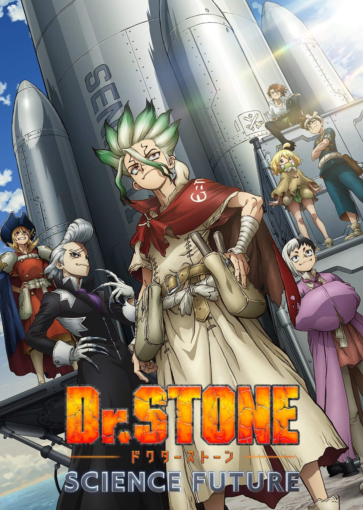
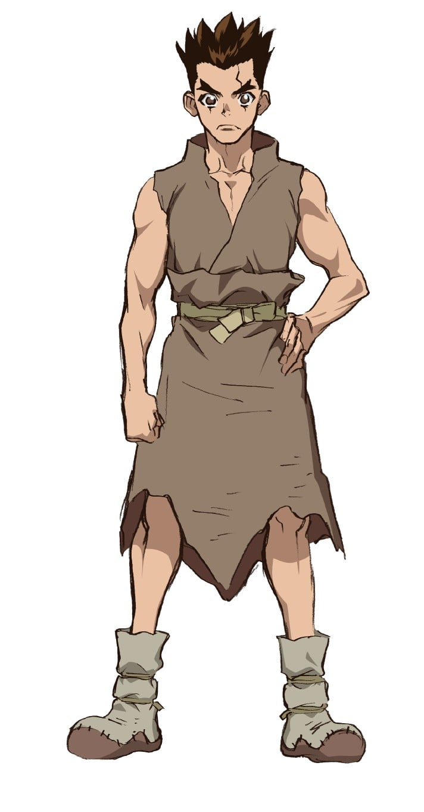
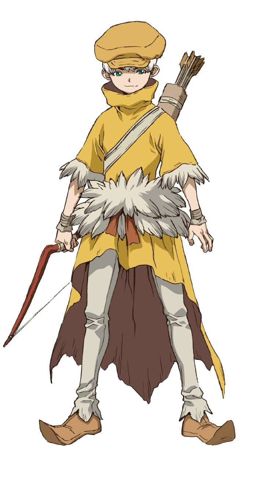

> [!bookinfo|noicon]+ **石纪元 科学与未来 第3部分**
> 
>
| 日文名 | Dr.STONE SCIENCE FUTURE 第3クール |
|:------: |:------------------------------------------: |
| 类型 | 漫改 |
| 新番 | 2026 年 4 月 |
| 集数 | 共0话 |
| 官网 | [https://dr-stone.jp](https://https://dr-stone.jp) |
| 制作 | トムス・エンタテインメント |
| 导演 | 松下周平 |
| 脚本 |  |
| 评分 | 7.7|
| 制片人 |  |

> [!abstract]+ **简介**
> 为了取得打造宇宙船所需的材料，以及从世界各地的石化中复活人类以获得更多人力，千空等人分成三队，开始环游世界。他们为了取得登陆月球所不可或缺的力量—「数学力」，前往「印度」。千空等人究竟能否登上月球，揭开「为什么人（Whyman）」的真相！？

[简介原文]
石器時代から現代文明まで、科学史200万年を駆け上がる！前代未聞のクラフト冒険譚（アドベンチャー）、ここに開幕！
全人類石化の黒幕・ホワイマンが月にいると突き止めた千空は、全ての謎を暴くため『月面着陸計画』を始動！この石の世界（ストーンワールド）で、ゼロから宇宙船を作るビックプロジェクトへと乗り出した。
世界中から宇宙船の素材を集めるため、大海原へと飛び出した千空たち。最初の目的地・アメリカ大陸でDr.ゼノ率いる科学王国と対立し、科学vs.科学の速攻戦を繰り広げる。
さらに石化光線の発信源・南米で、スタンリー部隊と衝突！激しい戦いの末、世界中の人間は再び全て石になった――。
絶望的な状況下、スイカがたった一人で科学を繋ぐ希望となり、千空を目覚めさせた。
Dr.ゼノと最強タッグを組んだ科学王国が最後に挑むのは、最高難度の“月面ロケット”作り！
ついに、石の世界（ストーンワールド）から宇宙、そして月へ――。千空は全人類の未来を取り戻すため、ホワイマンと石化の謎、その核心へと迫る‼

> [!tip]+ **章节列表**
>- [ ] 第1话： (2026-04-02)
>- [ ] 第2话： (2026-04-09)
>- [ ] 第3话： (2026-04-16)
>- [ ] 第4话： (2026-04-23)
>- [ ] 第5话： (2026-04-30)
>- [ ] 第6话： (2026-05-07)
>- [ ] 第7话： (2026-05-14)
>- [ ] 第8话： (2026-05-21)
>- [ ] 第9话： (2026-05-28)
>- [ ] 第10话： (2026-06-04)
>- [ ] 第11话： (2026-06-11)
>- [ ] 第12话： (2026-06-18)

> [!tip]+ **主要角色**
> 
| 角色 | CV | 简介| 角色图片 |
|:----:|:---:|:---:|:--------:|
| 石神千空 | 小林裕介 | 喜欢科学的少年，相信科学的力量，拥有丰富的知识贮备。 作为石神村村长统领着科学王国。 |  |
| 大木大樹 | 古川慎 | 千空的朋友，暗恋着杠。 被千空称作体力笨蛋，性格温柔，绝不会攻击他人。 |  |
| 小川杠 | 市ノ瀬加那 | 大树的同学兼暗恋对象。性格开朗，喜欢恶作剧。 属于手艺部，手指非常灵巧，擅长料理，女子力高。 |  |
| 獅子王司 | 中村悠一 | 灵长类最强的高中生，能够徒手打倒狮子的男人。 |  |
| コハク | 沼倉愛美 | 16岁，居住于石神村的少女，身手矫健、力量不输男性、视力11.0，会基本算术。琉璃的妹妹。 |  |
| クロム | 佐藤元 | 16岁，村中的“妖术使”，喜欢搜集各种材料的热血少年，靠着自己的实验而懂得许多科学知识，让千空十分惊讶。对科学充满热忱，因此与千空结为挚友。喜欢琉璃，与琉璃是青梅竹马，曾发誓过要治好琉璃的病。 |  |
| スイカ | 高橋花林 | 9岁。戴着整个西瓜皮的小个子少女，因为患有近视而利用西瓜皮上挖出的洞才看得清楚(小孔效果)。可以将身体完全缩在西瓜皮里伪装成单纯的西瓜来收集情报。 |  |
| 浅霧幻 | 河西健吾 | 19岁（石化前），魔术师，擅长操控人心，因此被司以优先序列复活，后被司派去打听千空的下落。性格上以自身利益为优先，只追随胜利的一方。 |  |
| カセキ | 麦人 | 60岁，经验丰富且满怀热忱的工匠，因为擅长工艺而协助千空与克罗姆，并与他们成为忘年之交。 |  |
| 氷月 | 石田彰 | 枪使，精通使用长枪的格斗术，流派是“尾张贯流枪术（日语：貫流）”。个性冷酷自私，面对毒气威胁时，毫不犹豫地将同伴当作牺牲品。其使用的长枪是“管枪”，但被幻以碳钢刀破坏，持管枪时的实力可说和司不相上下。 |  |
| 西園寺羽京 | 小野賢章 | 司・氷月と共に司帝国の3トップに数えられるほどの実力者の弓使い。石化前は自衛官で潜水艦のソナーマンだった。弓の腕と聴力を見込まれ、司帝国では主に見張りなどを担当している。 |  |
| 七海龍水 | 鈴木崚汰 |  |  |