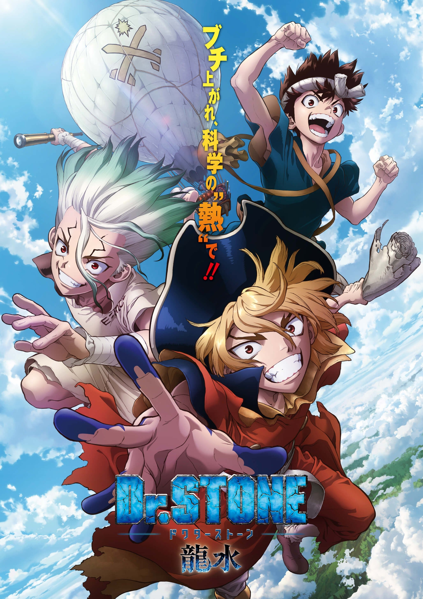

> [!bookinfo|noicon]+ **石纪元 龙水**
> 
>
| 日文名 | Dr.STONE 龍水 |
|:------: |:------------------------------------------: |
| 类型 | 漫改 |
| 新番 | 2022 年 7 月 |
| 集数 | 共1话 |
| 官网 | [https://dr-stone.jp/](https://https://dr-stone.jp/) |
| 制作 | トムス・エンタテインメント |
| 导演 | 松下周平 |
| 脚本 | 木戸雄一郎 |
| 评分 | 7.1|
| 制片人 |  |

> [!abstract]+ **简介**
> 司帝国との戦いが終わり、コールドスリープした司を救うべく動き出した千空たち。
石化現象の謎を突き止める為、ついに科学王国は地球の裏側・新世界を目指す！

航海に向けて船造りを始めた千空たちは、航海力100億の神腕船長を仲間にしようと、記者だった南の情報をもとに、七海財閥の御曹司で、かつて帆船を乗り回していた男“七海龍水”を目覚めさせる。

「はっはー！世界は再び俺の物だ‼」と豪語する龍水は、その圧倒的な強欲さで村に通貨を作り、ゴージャスな暮らしを満喫。船長を引き受ける代わりに、資源の王様“石油”が欲しいと提案するが…？

> [!tip]+ **章节列表**
>- [ ] 第1话：Dr.STONE 龍水 (2022-07-10)
>- [ ] 第0话：テレビスペシャル『Dr.STONE 龍水』生配信特番 #DrSTONE夏祭り (2022-06-12)

> [!tip]+ **主要角色**
> 
| 角色 | CV | 简介| 角色图片 |
|:----:|:---:|:---:|:--------:|
| 石神千空 | 小林裕介 | 喜欢科学的少年，相信科学的力量，拥有丰富的知识贮备。 作为石神村村长统领着科学王国。 |  |
| 大木大樹 | 古川慎 | 千空的朋友，暗恋着杠。 被千空称作体力笨蛋，性格温柔，绝不会攻击他人。 |  |
| 小川杠 | 市ノ瀬加那 | 大树的同学兼暗恋对象。性格开朗，喜欢恶作剧。 属于手艺部，手指非常灵巧，擅长料理，女子力高。 |  |
| コハク | 沼倉愛美 | 16岁，居住于石神村的少女，身手矫健、力量不输男性、视力11.0，会基本算术。琉璃的妹妹。 |  |
| クロム | 佐藤元 | 16岁，村中的“妖术使”，喜欢搜集各种材料的热血少年，靠着自己的实验而懂得许多科学知识，让千空十分惊讶。对科学充满热忱，因此与千空结为挚友。喜欢琉璃，与琉璃是青梅竹马，曾发誓过要治好琉璃的病。 |  |
| 金狼 | 前野智昭 | 18岁，保护村子的门卫，银狼的哥哥。一开始不太欢迎千空这个外人，但在他给他制作的长枪涂上金色后，稍稍改观。患有模糊病(近视)，为看清事物经常用力瞪大眼睛，因此给人凶恶的印象，实力约与玛古玛持平但因病无法发挥，在科学组制作眼镜得到矫正。 |  |
| 銀狼 | 村瀬歩 | 16岁，保护村子的门卫，金狼的弟弟。意志力薄弱，容易得意忘形，也经常因感到害怕而退缩示弱，得到了众人一致"不能让这个人当上村长"的评价，但在关键时刻意外有可靠的一面，并因此救过克罗姆一命。 |  |
| ルリ | 上田麗奈 | 18歳。传承“百物语”的巫女，琥珀的姐姐。因为患有肺炎而体虚。 和克罗姆是青梅竹马，本身也对克罗姆有好感。 |  |
| スイカ | 高橋花林 | 9岁。戴着整个西瓜皮的小个子少女，因为患有近视而利用西瓜皮上挖出的洞才看得清楚(小孔效果)。可以将身体完全缩在西瓜皮里伪装成单纯的西瓜来收集情报。 |  |
| 浅霧幻 | 河西健吾 | 19岁（石化前），魔术师，擅长操控人心，因此被司以优先序列复活，后被司派去打听千空的下落。性格上以自身利益为优先，只追随胜利的一方。 |  |
| カセキ | 麦人 | 60岁，经验丰富且满怀热忱的工匠，因为擅长工艺而协助千空与克罗姆，并与他们成为忘年之交。 |  |
| 西園寺羽京 | 小野賢章 | 司・氷月と共に司帝国の3トップに数えられるほどの実力者の弓使い。石化前は自衛官で潜水艦のソナーマンだった。弓の腕と聴力を見込まれ、司帝国では主に見張りなどを担当している。 |  |