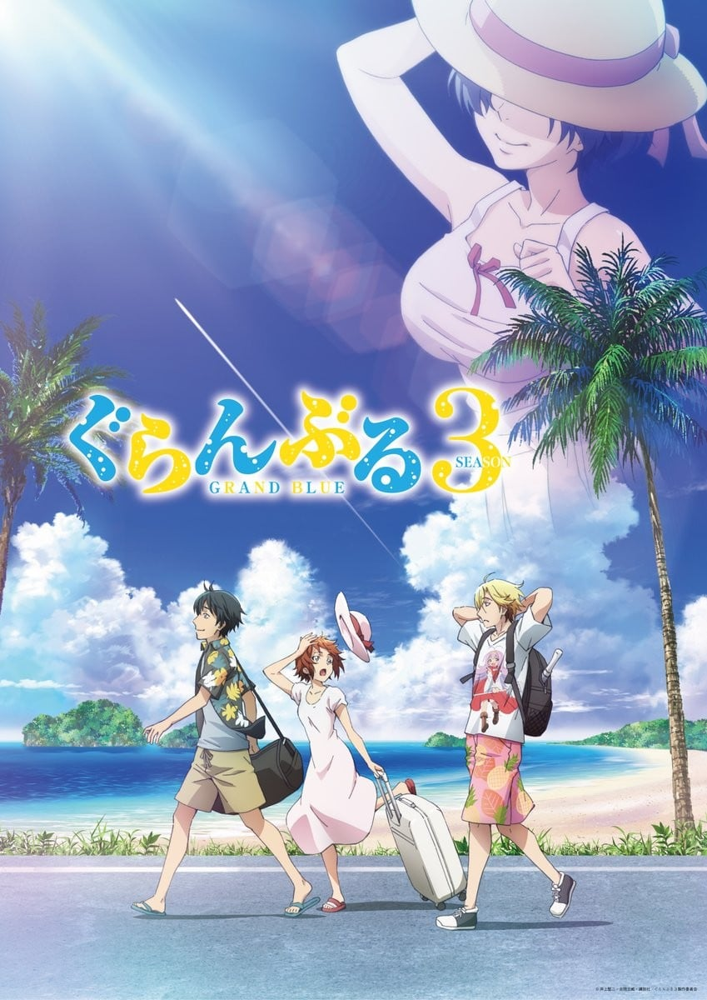
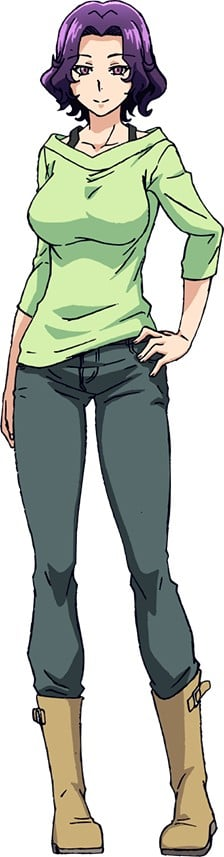
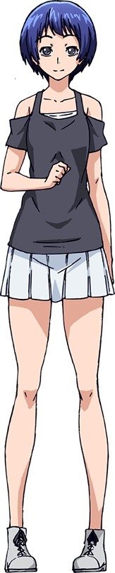
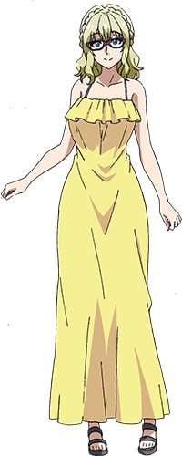
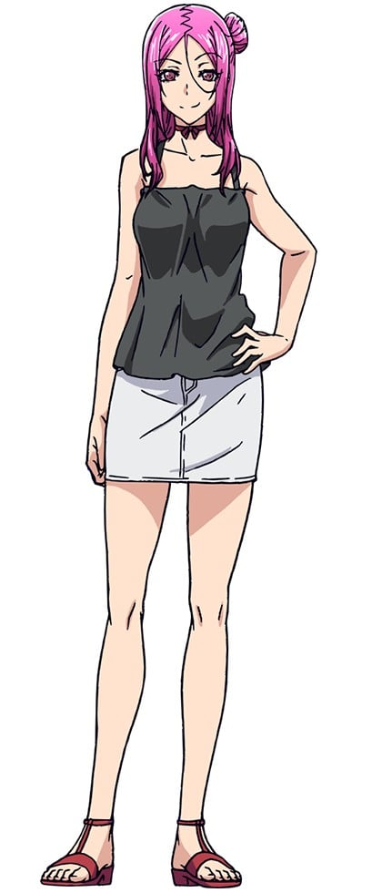

> [!bookinfo|noicon]+ **碧蓝之海 第三季**
> 
>
| 日文名 | ぐらんぶる Season 3 |
|:------: |:------------------------------------------: |
| 类型 | 漫改 |
| 新番 | 0 年 0 月 |
| 集数 | 共0话 |
| 官网 | [https://grandblue-anime.com/](https://https://grandblue-anime.com/) |
| 制作 | セイバーワークス |
| 导演 | 高松信司 |
| 脚本 |  |
| 评分 | 9|
| 制片人 |  |

> [!abstract]+ **简介**
> 北原伊織が伊豆で大学生活を始めて数か月ー

居候しているダイビングショップ「グランブルー」ではかわいい従妹の古手川千紗と一つ屋根の下。そこに従姉の古手川奈々華、オトナの色気がたまらない浜岡梓、同級生の吉原愛菜も加わって、順風満帆な青春のキャンパスライフを過ごしていた！

……というのは一面で、大学生活の大半は全裸野郎どもとの狂乱騒ぎ！

というのも、伊織が入ったダイビングサークル「Peek a Boo（ピーカブー）」は、ダイビングはそこそこに屈強な男達が全裸になって酒を酌み交わすバカ騒ぎを日常としており、伊織はイケメンだが真性オタクの今村耕平と共に、すっかりサークルに染まっていたのだ。

そんな中、ダイビングショップ“ドルフィン”がパラオに支店を作ったが人手が足りないので手伝いに来てくれないかと奈々華から頼まれる伊織。しかし耕平はアニメがリアルタイムで見られないので海外には行きたくないと言っていた事を思い出し…

今夏、初の海外パラオで“ぐらんぶる”ライフが幕を開ける！

> [!tip]+ **章节列表**
- 暂无章节信息

> [!tip]+ **主要角色**
> 
| 角色 | CV | 简介| 角色图片 |
|:----:|:---:|:---:|:--------:|
| 北原伊織 | 内田雄馬 | 　　本作における主人公。伊豆大学機械工作科に入学した1年生。 　　男子校のノリに辟易し、薔薇色のキャンパスライフを夢見て男女共学の伊豆大学に進学する。ダイビング未経験の上泳ぐこともままならず「水が怖い」と表現する位苦手。しかし時田と寿により男ばかりのダイビングサークル「PaB」に強制的に入会させられてしまう。経験や交流を積んでいくうちにダイビングの魅力に惹かれ、水への恐怖感も徐々にではあるが克服していく。水泳以外のスポーツは全般的に得意。 　　アルコール類に対して免疫は無かったが、「PaB」の豪快かつ無茶な飲み会に参加するうちに耐性を身に付けるようになった。それと同時に、パンツ姿で学内をうろつくことにも抵抗を覚えなくなった。 |  |
| 古手川千紗 | 安済知佳 | 　　本作におけるヒロイン。伊織の同い年の従姉妹。同じく伊豆大学機械工作科の1年生。 　　ダイビング経験者。将来の夢はインストラクターで、水族館でたまに手伝いをしていたりする。男女比率140:3である学科での人気は高く、「伊豆春祭」でミスコンを獲ったことで学内での知名度も高くなってしまい、男除けのために伊織が彼氏だと偽ることで平穏を得た。伊織とバディになった際には、水の苦手な伊織に楽しんでもらえるよう真剣だった。 　　伊織に対してはダイビングの魅力を伝えようと自分なりに画策する面倒見のいい一面を見せているが、伊織の下衆な言動に度々虫けらを見るような冷たい視線を送ることもある。 |  |
| 古手川奈々華 | 内田真礼 | 　　伊織の従姉妹で、千紗の姉。「グランブルー」の看板娘兼インストラクターとして働いている。 　　美人でスタイルが良く性格も優しいが、実は極度のシスコン。対象である千紗にはばれていないが、それ以外の人物には周知されている。瞬く間に「Pab」に染まってしまったせいで乱れがちな伊織の生活態度を度々気にかけている。梓とは仲が良く、電話で色々と相談に乗ってもらうことが多い。 |  |
| 浜岡梓 | 行成とあ | 　　青海女子大の3年生。インカレサークルである「PaB」のメンバーの1人。 　　作中最強の酒豪。美人でナイスバディだが、「PaB」のノリに完全に適応しており全裸の男たち(伊織ら)が雑魚寝する部屋で平気で眠ったり、野球拳に混ざったりする上に、彼らの前で下着姿になることにも抵抗がない。奈々華とは仲が良く、電話で色々と相談に乗ることが多い。奈々華の電話相談のせいで伊織をバイ仲間と誤解し、奈々華にすら秘密にしている自身の性向を伊織にカミングアウトしてしまった。好きなタイプは男なら時田、女なら奈々華。伊織の好きなタイプの「男」を執拗に聞き出し、耕平（伊織の嘘）と伊織をくっつけようと画策したりする一方で、伊織と千紗の仲を取り持つようなことをして面白がるなど、どこまで本気なのか分からない行動を取る。 |  |
| 吉原愛菜 | 阿澄佳奈 | 　　青海女子大の1年生。特に登場当初は金髪のウィッグにケバい化粧をしていたため伊織と耕平からは「ケバ子」という不名誉なあだ名で呼ばれているが、素顔は素朴で愛らしい黒髪のショートヘアである。地方出身者故か酔ったり動揺すると地元訛りが出る。運動能力は耕平よりはマシだが得意ではない方。 　　「華やかな大学デビュー」のためにテニスサークル「ティンカーベル（以降、ティンベル）」に入ったが、見た目のケバさとテニスが上手くできなかったことからサークル内では練習から外されるなど迫害されていたが、学祭で伊織が耕平と一緒に逆に部長の工藤へ逆襲をしてくれたことをきっかけに「ティンベル」を辞め、「PaB」に入会した。このことをきっかけに、伊織のことが気になっている様子だが想いは打ち明けられずにいる。 　　普段は大人しく作中数少ない常識人なため、平気で脱ぎまくる男連中にツッコミを入れている。一方化粧をしていた時もかなり性格が変貌するが、酔ったときはより性格が豹変して「PaB」のノリに完全に適合するようになる。のけ者扱いだったティンベル時代と違いPaBでは公平に扱われており、メンバーとは仲を深めつつダイビングの楽しさを覚えていく。 |  |
| 今村耕平 | 木村良平 | 　　伊織の同級生。見た目は金髪のイケメンだが、妄想癖のある真性のアニメオタクで常日頃キャラクターが描かれたTシャツなどの衣類を愛用しているため、周囲の人物をドン引きさせることが多い。いわゆる三次元には興味が薄いもののまったく興味が無いタイプではなく、「お兄ちゃん」と呼んでもらうなど典型的な「オタクの願望」には目がない。 　　ダイビング未経験者で、伊織に騙されるかたちで「PaB」に入会させられる。以降、伊織とは常に共に行動しつつ、危機に際しては躊躇なく互いを身代わりにしようとする、悪友とも呼べる関係を築いている。その一方、ここぞというときは伊織とは協力しあい、息の合ったところを見せる。運動は苦手だが、ダイビングについては飲み込みが早く目立った失態を犯すことはなかった。 |  |
| 時田信治 | 安元洋貴 | 　　寿と同じく3年生。「PaB」の会長。「グランブルー」でよく手伝いをしている。 　　角刈りに筋骨隆々の巨体をもった男性。酒が入ると度を越えた暴走を見せることがあるが、ダイビングに関しては真面目そのもので後輩の面倒見もよい。伊織を片腕で抱えるほどの怪力を誇り、また運動能力が桁違いに高い。 |  |
| 寿竜次郎 | 小西克幸 | 　　伊織と同じ学科の先輩で3年生。「PaB」のメンバーでサークルの幹部的立ち位置。「グランブルー」でよく手伝いをしている。 　　鉄のように固い筋肉を纏った金髪の男性。時田と同様飲み会でははっちゃけるが、ダイビングに関しては非常に真面目で博識。時田と並んで運動能力が並外れて高い。バイトでバーテンダーをしており、お客からは人気がある。 |  |
| カリーナ | M・A・O | 伊織が実家へ帰省をする際に出会ったドイツ人女性。オタクサークルのメンバーで、日本のある文化に強いあこがれを持っている。 |  |
| 北原栞 | 諸星すみれ | 伊織の妹。淑やかで大人しい、和装が似合う中学三年生。伊織のことを「兄様」と慕い、大学生活を心配しているようだが、実際には裏の目的があるようで… |  |
| 毒島桜子 | 山根綺 | 青海女子大の一年生。仲の良いユキと菜摘と行動していることが多い。ある一件で伊織とは因縁が生まれてしまう。プライドが高いが、実は努力家。 |  |
| 野島元 | 江口拓也 | 伊織と耕平の同級生。黒縁眼鏡をかけたロン毛のインテリ風バカ。伊織のセッティングした合コンに参加した。定期テストの際に、腕の間にカンペを仕込んだ結果、汗で文字がにじんで読めなかったことがある。 |  |