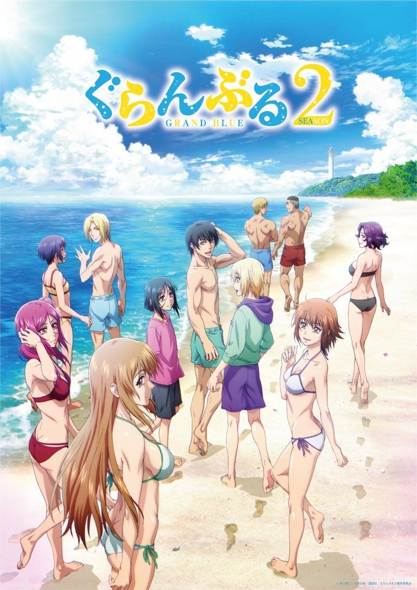
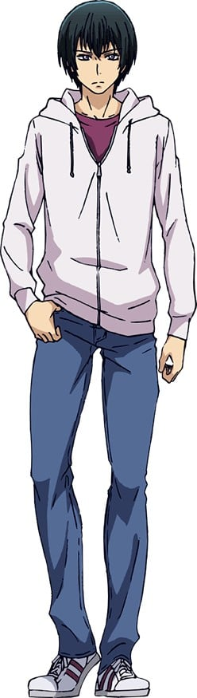
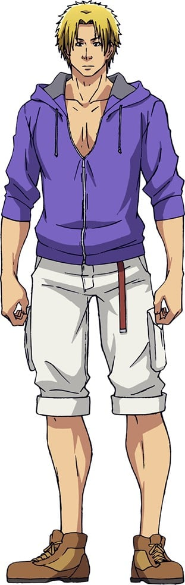
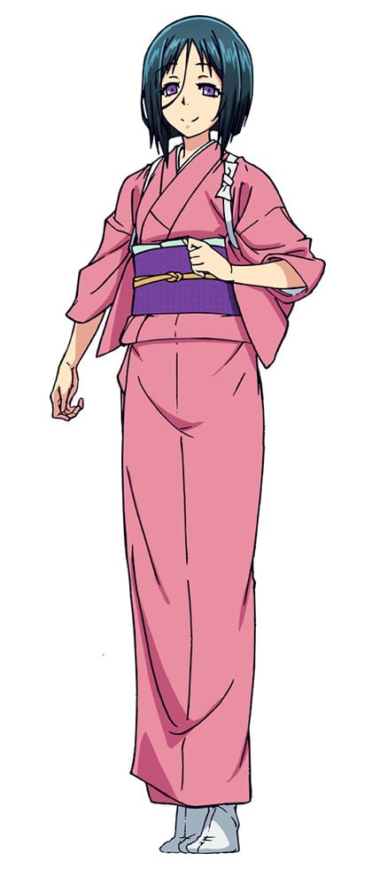
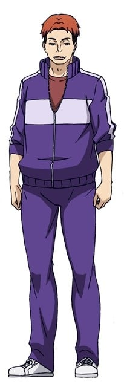

> [!bookinfo|noicon]+ **碧蓝之海 第二季**
> 
>
| 日文名 | ぐらんぶる Season 2 |
|:------: |:------------------------------------------: |
| 类型 | 漫改 |
| 新番 | 2025 年 7 月 |
| 集数 | 共12话 |
| 官网 | [http://grandblue-anime.com/](https://http://grandblue-anime.com/) |
| 制作 | ゼロジー |
| 导演 | 高松信司 |
| 脚本 | 高松信司 |
| 评分 | 7.3|
| 制片人 | 宮城夢乃,持丸健 |

> [!abstract]+ **简介**
> 我们的夏天不会结束！北原伊织在伊豆开始大学生活已经三个月——

寄住的潜水商店「Grand Blue」里，他和可爱的表妹古手川千纱同住一个屋檐下。再加上表姊古手川奈奈华、散发成熟魅力令人难以抗拒的滨冈梓，以及同学吉原爱菜，共同度过了顺风顺水的青春校园生活！

……当然这只是表面，大学生活的大半时光其实是与全裸家伙们的疯狂闹腾！
因为伊织加入的潜水社团「Peek a Boo」平时潜水马马虎虎，却把健壮男子们全裸对饮的闹腾当成日常；伊织也与帅气却真正御宅族的今村耕平一起，彻底染上了这个社团的风气。
就在此时，完成冲绳潜水执照课程、返回伊豆的伊织收到了妹妹・北原栞寄来的信……

妹妹来袭、青梅女子大的学园祭、试胆大会、约会、无人岛露营！
被可爱的全裸家伙们包围的伊织的大学生活再次开始！ ！

> [!tip]+ **章节列表**
>- [ ] 第1话：妹妹 (2025-07-07)
>- [ ] 第2话：哥哥 (2025-07-14)
>- [ ] 第3话：印象游戏 (2025-07-21)
>- [ ] 第4话：门票争夺战 (2025-07-28)
>- [ ] 第5话：第一次的女子大学 (2025-08-04)
>- [ ] 第6话：再次来到女子大学 (2025-08-11)
>- [ ] 第7话：夏比冲击实验 (2025-08-18)
>- [ ] 第8话：打工的同事 (2025-08-25)
>- [ ] 第9话：喜欢吗？ (2025-09-01)
>- [ ] 第10话：约会看电影 (2025-09-08)
>- [ ] 第11话：出发去无人岛吧！ (2025-09-15)
>- [ ] 第12话：这样就一笔勾销了 (2025-09-22)

> [!tip]+ **主要角色**
> 
| 角色 | CV | 简介| 角色图片 |
|:----:|:---:|:---:|:--------:|
| 北原伊織 | 内田真礼 | 　　本作における主人公。伊豆大学機械工作科に入学した1年生。 　　男子校のノリに辟易し、薔薇色のキャンパスライフを夢見て男女共学の伊豆大学に進学する。ダイビング未経験の上泳ぐこともままならず「水が怖い」と表現する位苦手。しかし時田と寿により男ばかりのダイビングサークル「PaB」に強制的に入会させられてしまう。経験や交流を積んでいくうちにダイビングの魅力に惹かれ、水への恐怖感も徐々にではあるが克服していく。水泳以外のスポーツは全般的に得意。 　　アルコール類に対して免疫は無かったが、「PaB」の豪快かつ無茶な飲み会に参加するうちに耐性を身に付けるようになった。それと同時に、パンツ姿で学内をうろつくことにも抵抗を覚えなくなった。 |  |
| 古手川千紗 | 安済知佳 | 　　本作におけるヒロイン。伊織の同い年の従姉妹。同じく伊豆大学機械工作科の1年生。 　　ダイビング経験者。将来の夢はインストラクターで、水族館でたまに手伝いをしていたりする。男女比率140:3である学科での人気は高く、「伊豆春祭」でミスコンを獲ったことで学内での知名度も高くなってしまい、男除けのために伊織が彼氏だと偽ることで平穏を得た。伊織とバディになった際には、水の苦手な伊織に楽しんでもらえるよう真剣だった。 　　伊織に対してはダイビングの魅力を伝えようと自分なりに画策する面倒見のいい一面を見せているが、伊織の下衆な言動に度々虫けらを見るような冷たい視線を送ることもある。 |  |
| 古手川奈々華 | 内田真礼 | 　　伊織の従姉妹で、千紗の姉。「グランブルー」の看板娘兼インストラクターとして働いている。 　　美人でスタイルが良く性格も優しいが、実は極度のシスコン。対象である千紗にはばれていないが、それ以外の人物には周知されている。瞬く間に「Pab」に染まってしまったせいで乱れがちな伊織の生活態度を度々気にかけている。梓とは仲が良く、電話で色々と相談に乗ってもらうことが多い。 |  |
| 浜岡梓 | 行成とあ | 　　青海女子大の3年生。インカレサークルである「PaB」のメンバーの1人。 　　作中最強の酒豪。美人でナイスバディだが、「PaB」のノリに完全に適応しており全裸の男たち(伊織ら)が雑魚寝する部屋で平気で眠ったり、野球拳に混ざったりする上に、彼らの前で下着姿になることにも抵抗がない。奈々華とは仲が良く、電話で色々と相談に乗ることが多い。奈々華の電話相談のせいで伊織をバイ仲間と誤解し、奈々華にすら秘密にしている自身の性向を伊織にカミングアウトしてしまった。好きなタイプは男なら時田、女なら奈々華。伊織の好きなタイプの「男」を執拗に聞き出し、耕平（伊織の嘘）と伊織をくっつけようと画策したりする一方で、伊織と千紗の仲を取り持つようなことをして面白がるなど、どこまで本気なのか分からない行動を取る。 |  |
| 吉原愛菜 | 阿澄佳奈 | 　　青海女子大の1年生。特に登場当初は金髪のウィッグにケバい化粧をしていたため伊織と耕平からは「ケバ子」という不名誉なあだ名で呼ばれているが、素顔は素朴で愛らしい黒髪のショートヘアである。地方出身者故か酔ったり動揺すると地元訛りが出る。運動能力は耕平よりはマシだが得意ではない方。 　　「華やかな大学デビュー」のためにテニスサークル「ティンカーベル（以降、ティンベル）」に入ったが、見た目のケバさとテニスが上手くできなかったことからサークル内では練習から外されるなど迫害されていたが、学祭で伊織が耕平と一緒に逆に部長の工藤へ逆襲をしてくれたことをきっかけに「ティンベル」を辞め、「PaB」に入会した。このことをきっかけに、伊織のことが気になっている様子だが想いは打ち明けられずにいる。 　　普段は大人しく作中数少ない常識人なため、平気で脱ぎまくる男連中にツッコミを入れている。一方化粧をしていた時もかなり性格が変貌するが、酔ったときはより性格が豹変して「PaB」のノリに完全に適合するようになる。のけ者扱いだったティンベル時代と違いPaBでは公平に扱われており、メンバーとは仲を深めつつダイビングの楽しさを覚えていく。 |  |
| 今村耕平 | 木村良平 | 　　伊織の同級生。見た目は金髪のイケメンだが、妄想癖のある真性のアニメオタクで常日頃キャラクターが描かれたTシャツなどの衣類を愛用しているため、周囲の人物をドン引きさせることが多い。いわゆる三次元には興味が薄いもののまったく興味が無いタイプではなく、「お兄ちゃん」と呼んでもらうなど典型的な「オタクの願望」には目がない。 　　ダイビング未経験者で、伊織に騙されるかたちで「PaB」に入会させられる。以降、伊織とは常に共に行動しつつ、危機に際しては躊躇なく互いを身代わりにしようとする、悪友とも呼べる関係を築いている。その一方、ここぞというときは伊織とは協力しあい、息の合ったところを見せる。運動は苦手だが、ダイビングについては飲み込みが早く目立った失態を犯すことはなかった。 |  |
| 時田信治 | 安元洋貴 | 　　寿と同じく3年生。「PaB」の会長。「グランブルー」でよく手伝いをしている。 　　角刈りに筋骨隆々の巨体をもった男性。酒が入ると度を越えた暴走を見せることがあるが、ダイビングに関しては真面目そのもので後輩の面倒見もよい。伊織を片腕で抱えるほどの怪力を誇り、また運動能力が桁違いに高い。 |  |
| 寿竜次郎 | 小西克幸 | 　　伊織と同じ学科の先輩で3年生。「PaB」のメンバーでサークルの幹部的立ち位置。「グランブルー」でよく手伝いをしている。 　　鉄のように固い筋肉を纏った金髪の男性。時田と同様飲み会でははっちゃけるが、ダイビングに関しては非常に真面目で博識。時田と並んで運動能力が並外れて高い。バイトでバーテンダーをしており、お客からは人気がある。 |  |
| 北原栞 | 諸星すみれ | 伊織の妹。淑やかで大人しい、和装が似合う中学三年生。伊織のことを「兄様」と慕い、大学生活を心配しているようだが、実際には裏の目的があるようで… |  |
| 毒島桜子 | 山根綺 | 青海女子大の一年生。仲の良いユキと菜摘と行動していることが多い。ある一件で伊織とは因縁が生まれてしまう。プライドが高いが、実は努力家。 |  |
| 野島元 | 江口拓也 | 伊織と耕平の同級生。黒縁眼鏡をかけたロン毛のインテリ風バカ。伊織のセッティングした合コンに参加した。定期テストの際に、腕の間にカンペを仕込んだ結果、汗で文字がにじんで読めなかったことがある。 |  |
| 山本真一郎 | 榎木淳弥 | 伊織と耕平の同級生。女に見境のないクズだが、童貞の鑑。伊織のセッティングした合コンに参加した。テスト中は飲食禁止であることを知らず、ペットボトルのラベルの裏にカンペを仕込んで失敗したことがある。 |  |