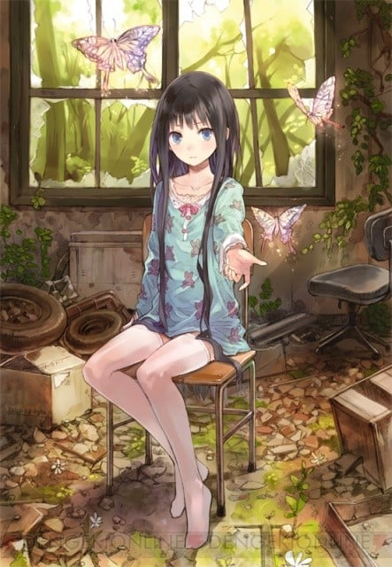
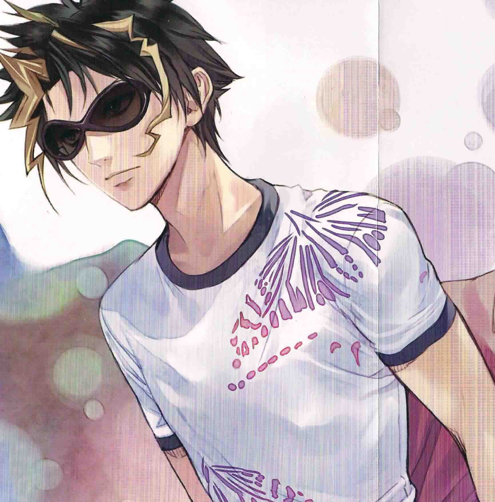
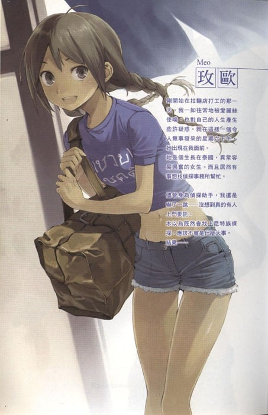
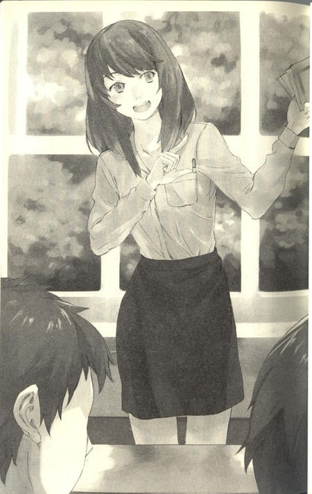

> [!bookinfo|noicon]+ **神的记事本**
> 
>
| 日文名 | 神様のメモ帳 |
|:------: |:------------------------------------------: |
| 类型 | 小说改 |
| 新番 | 2011 年 7 月 |
| 集数 | 共12话 |
| 官网 | [http://www.kamimemo.com](https://http://www.kamimemo.com) |
| 制作 | J.C.STAFF |
| 导演 | 桜美かつし |
| 脚本 | 綾奈ゆにこ,水上清資,伊神貴世 |
| 评分 | 6.7|
| 制片人 |  |

> [!abstract]+ **简介**
> 舞台是都市市中心附近的地方。描寫著普通的高中生藤島鳴海與僱主偵探愛麗絲、與她的助手尼特族們活躍的故事。故事當中有些描寫了現實中暴力集團、與毒品等事件。同時也是描寫尼特族青少年有點不堪、有點可笑，又帶著一絲淡淡哀愁的青春冒險故事。

> [!tip]+ **章节列表**
>- [ ] 第1话：关于她，我所知道的二三事 (2011-07-02)
>- [ ] 第2话：你与旅行包 (2011-07-15)
>- [ ] 第3话：我俩所能做到的 (2011-07-22)
>- [ ] 第4话：花丸汤头的由来 (2011-07-29)
>- [ ] 第5话：那家伙了解我 (2011-08-05)
>- [ ] 第6话：我可能会惨败 (2011-08-12)
>- [ ] 第7话：尽我所能 (2011-08-19)
>- [ ] 第8话：我不相信命运 (2011-08-26)
>- [ ] 第9话：那个夏天的二十一球 (2011-09-02)
>- [ ] 第10话：关于你 (2011-09-09)
>- [ ] 第11话：我的碎片 (2011-09-16)
>- [ ] 第12话：你与我以及她的事 (2011-09-23)

> [!tip]+ **主要角色**
> 
| 角色 | CV | 简介| 角色图片 |
|:----:|:---:|:---:|:--------:|
| アリス | 小倉唯 | 本名紫苑寺有子。自称尼特侦探的茧居族，年龄不详，看起来只有12、13岁的样子。身高130厘米不到。有着长及双腿的黑发，容颜可爱到让人想抱住的地步。但嘴巴相当犀利，说话也毫不留情，经常喋喋不休。 平时总是穿着睡衣。利用网络解开事件之谜。侦探事务所就在“花丸拉面店”楼上，因此她经常叫外送（可是很挑食，普通的餐点几乎都不吃），但很喜欢吃老板做的冰激凌。患有“开放场所恐惧症”，在室外会感到不舒服。 非常喜欢喝“Dr Pepper”，冰箱里几乎都是这个饮料。有很多布娃娃。不喜欢洗澡，也不喜欢自己的衣服、床单、布娃娃被清洗。 第二集曾对鸣海说过“你果然跟我很像”。自称“死者的代言人”，挖出死者所要传达的真相。她甚至认为全世界有那么多人在受苦，都是错在她自己能力不足（光是这点就有点像鸣海）。 对身为助手的鸣海抱持着恋爱的感觉，但鸣海本人却毫无知觉。对友造曾说过，鸣海是第一个一直待在爱丽丝身边的人。 “这本轻小说真厉害！2011年”人气女性角色第二名。 |  |
| 藤島鳴海 | 松岡禎丞 | 本作の主人公。16歳の男子高校生。誕生日は10月31日。容姿はごくごく平凡で特徴がないと言われる。母親はすでに死んでおり、父親は家によりつかず、姉と二人暮らしをしている。幼い頃から転校を繰り返してきたせいで内向的な性格をしており、独り言が多く、考えていることがしばしば口から漏れる。彩夏やその他の人々との触れあいをきっかけに、他人に対して徐々に心を開くようになる。 エンジェル・フィックス事件でアリスに雇われて以来、探偵助手をつとめる。平時はアリスの食事の世話や事務所の掃除、使い走りなどが業務である。身体能力にも情報収集能力にも特筆すべきところはなく、社交性もないが、視覚・聴覚が鋭敏で、観察力に優れている。コンピュータにはそれなりに詳しく、絵心もある。また、追い込まれた状況になるとまったくだれも考えつかなかったような奇策を着想し、無鉄砲ともいえるほどの行動力を発揮する。必要な状況では非常に口がうまくなり、詐欺師の才能があると評価されることが多い。 四代目とは義兄弟の盃を交わしており、平坂組組員からは多大な信頼を寄せられ「兄貴」と呼ばれて慕われている。本人は自覚していないが人望が厚く、大規模イベントを運営できるほどの統率力もある。 最近ではヒモの素質があるのではないかと周囲から訝られている。 作中でたびたび作家としての能力を持つことが示唆されており、またこの『神様のメモ帳』自体がナルミの執筆した手記である（という体裁で書かれている）ことを示す描写がある。第５巻の短編集は、実際にナルミの書いた事件簿という形態をとっている。 |  |
| 篠崎彩夏 | 茅野愛衣 | ナルミのクラスメイトの少女。可愛らしい目と気の強そうな眉が特徴。『ラーメンはなまる』でアルバイトをしている。またアリスを風呂に入れるなど、生活の面倒をみていた。 趣味は園芸で、高校の花壇や温室の植物の世話をすべてひとりでこなしていた。学校で孤立していたナルミを園芸部に強引に入部させ、またラーメン屋に連れていってアリスたちと引きあわせた。ナルミとは対照的に明るく前向きな性格をしているように見えるが、実は人付き合いが苦手で中学校時代は不登校だった経験を持つ。両親は離婚しており、母親と同居している。高校を中退した兄がいる。 エンジェル・フィックス事件で屋上から飛び降り植物状態になり、その後意識を取り戻したものの、記憶を失くしていた。後に『ラーメンはなまる』の店員に復帰する。 園芸部廃部後に設立された中央園芸会議の議長に就任した。 |  |
| ミン | 生天目仁美 | NEET探偵事務所のあるビル一階の『ラーメンはなまる』の若い女店主。本名は黄明麗（ファン・ミンリー）。香港マフィア『黄道盟』のボスの孫娘だが、ほぼ普通の日本人と同じように育った。常にポニーテール、胸にさらし、タンクトップと黒い腰エプロンという格好をしている。 『ラーメンはなまる』の裏手はニートたちのたまり場となっており、また実質的にアリスの生活の面倒を見ているため、ニート探偵団の母親役のような存在となっている。喧嘩っ早くすぐに手が出る性格で、ニートたちの自堕落ぶりを厳しく叱る。しかし本質的には面倒見が良く、ニートたちやナルミのことも親身に心配するため、慕われている。 氷菓職人を目指していたが、行方不明になった父親のラーメン屋を継いだ。そのため、ラーメン作りよりも氷菓作りの方が格段に上手い。『はなまる』はラーメン屋であるにもかかわらずアイスを売りのひとつとしている。 平坂組メンバーたちからは「四天王筆頭」として四代目やテツよりも喧嘩が強いと見られている。 |  |
| テツ | 松風雅也 | 本名は一宮哲雄。アリスのもとに集うニート探偵団の一員。金にだらしないが、面倒見が良く頼りになる兄貴分な存在。ナルミの四つ年上で、同じ高校に通っていたが、とある問題を起こして中退したとされている。ギャンブル好きで、現在はスロットや競馬で生計を立てているニート。高校時代はボクシングをしており、ジムの会長から将来を嘱望されていたが、高校中退と同時期に緑内障と診断されプロになることを断念した。しかしその実力は衰えておらず、ヤクザを相手にしても怯まない度胸を併せ持つ。警察や暴力団などとのコネクションを持っており、事件解決に役立てることが多々ある。「四天王」の一人で、四代目とは互角の実力で、一巻の時点で49勝49敗3分。 |  |
| 少佐 | 宮田幸季 | 本名は向井均。アリスのもとに集うニート探偵団の一員。大学図書館に資料本を買わせるため、として大学に在学しており、厳密にはニートではない（期限年数いっぱいまで在籍した後退学するつもりと発言している）。小学生にも間違えられるほど小柄かつ童顔で、ミリタリーマニアなのでいつも迷彩服などを着用してモデルガンを持ち歩き、サバイバルゲームを趣味とする。工学系の卓越した知識と技術を持ち、盗聴器やスタングレネードまでをも自作する。ピッキングも得意とし、侵入や工作のエキスパートである。 鳴海の事を「藤島中将」と呼ぶが、軍の実質的な最高権力者は少佐であると主張しているので敬称としては呼んでいない。探偵団の他の面々とは異なり平坂組では敬意を払われていない。 |  |
| ヒロ | 櫻井孝宏 | 本名は桑原宏明。アリスのもとに集うニート探偵団の一員。ホスト風の美青年であり、落とした女性は数百人以上。人当たりが良く、話術も非常に巧みである。テツと同年齢。ヒモだが、実はミンに対して真剣な恋心を抱いており、プロポーズもしている。彼女のためなら自分の身も省みない度胸も持つ。 中学生から風俗嬢などの住居に転がり込んで生活しているヒモ。携帯を複数持っており、女性関係や用途によって使い分けている。「主夫」や「ジゴロ」との違いに対し持論を述べるなど「ヒモ」に関する独自の哲学を持っている。 女性関係はだらしないが友人を大切にするため、ナルミに対して最も親身である。街中に女友達がおり非常にまめな対応をするため、とくに情報収集においてそのネットワークが力を発揮する。 |  |
| 四代目 | 小野大輔 | 本名は雛村壮一郎。街中の不良少年を集めたチーム「平坂組」の組長。テツ、ヒロと同年齢と思われる。狼のような目つきで精悍な顔立ちをしており、髪は白く染めている。口は悪いが仲間思いで、決断力に優れ、気配りができ、頭も切れる。実はかなりの心配性。喧嘩も非常に強く、「四天王」の一人とされる。テツとの喧嘩は一巻の時点で49勝49敗3分。 関西のテキ屋系の商家の四代目であり、実家から逃げて東京に流れ、そこで不良少年たちを束ねて瞬く間にヘッドにのし上がった実力の持ち主。部下をはじめ、多くの人間は「壮」「壮さん」と呼ぶが、アリス周辺の人間だけは「四代目」というあだ名で呼ぶ。実家を嫌っているために四代目と呼ばれることを快く思っていないが、その嫌がり方がかえってアリスを面白がらせてしまい、あだ名が定着する結果となった。からかわれるときは「ヒナちゃん」と呼ばれる。 商家の息子らしく金にうるさく、非常に建設的な思考の持ち主で理詰めであり、四巻ではイベントコーディネーターとしての仕事も行っている。ナルミのまわりでは最も常識人であり、自堕落なテツ、少佐、ヒロとは線引きをしたがるが、お互いに暗黙の内に信頼し合っている。賭け事には非常に弱い。 当初はただの高校生でありながら事件に関わってくるナルミを足手まといとしてしか見ていなかったが、やがてその土壇場での行動力を認め、義兄弟の盃を交わし、自分に何かあれば代わりにナルミが平坂組を仕切れと言うようになるまでになり、誰よりも信頼している。知り合った当初から何故か変わらずナルミのことを「園芸部」と呼び続けている。 平坂錬次とはとある事件で決別したが、無意識で彼との友情を繋ぎとめようとしており、アリスに錬次を見つけ出すよう依頼をする。 部下には秘密にしているが、実は手芸が趣味で、プロ並みの腕前を持つ。アリスのぬいぐるみの修繕も行う。 |  |
| 平坂錬次 | 鈴村健一 | 平坂幫的創始人，操著一口怪怪的關西腔。因為五年前喜善遭刺死，因此憎恨當時在場的第四代，並認為一切都是第四代的錯。後來離開東京後音訊全無，並在小說第四集返回東京，並利用柳原會施以報復，並打算搞垮整個平坂幫。 和鳴海在動物園以可樂進行交杯酒的動作。 在Live House時，愛麗絲親口對平坂說出真相，讓他震驚不已，也後悔自己的所作所為。 在解開誤會過後，搭新幹線離開了東京。因為他覺得東京已經沒有能夠容納他的地方了。 |  |
| メオ | 小笠原早紀 | 草壁昌也之女，十四歲、泰國藉。小說第二集帶著內含兩億元現金的波士頓袋拜訪NEET偵探事務所。事實上被黑道田原幫追殺，鳴海等人得知實情後，委託明老闆讓玫歐借宿她家。廚藝不錯，特別是泰式料理。 似乎對鳴海有點好感。 |  |
| 黒田小百合 | 遠藤綾 | 鳴海和彩夏的老師。外表成熟漂亮，很多老師都以為她是寡婦，但事實上她還是單身，現在年齡推測是30出頭。在讀大學時當過家教，對教學抱有熱誠，過去曾利用M中的溫室，在裡面對成績不好的學生進行課後輔導，她認為在花草旁邊唸書是一件很棒的事。在彩夏從醫院醒過來，並回來上課後，為了讓彩夏和鳴海能夠趕上課業（鳴海在第三學期幾乎請假沒來上學，因此成績爛到差點要留級），因此再度使用園藝社的溫室對他們兩個進行課後輔導。基本上是教國文，但經過課後輔導後，鳴海覺得她上的英文和數學比國文更好。 四年前曾在溫室對阿哲和羽矢野友彥與其他學生進行課後輔導。知道羽矢野友彥死亡一事，也看到他死在校門口。 |  |
| 善喜 | 石田彰 | 韓國人，若木手藝店的老闆。第四代是其店裡的常客。外表相當美型，因此讓附近的高中女生趨之若鶩。 本名叫「喜善（ヒソン（喜善））」。被後藤田幫老大的正妻憤怒地狠狠刺了腹部一刀。經過手術過後勉強活下來，也因此有些行動不便。但事後他卻也得以開設夢寐以求的手藝店，完成自己的夢想。 然而第四代卻對愛慕喜善的平坂鍊次隱瞞了整起事件，也讓他以為喜善已經死了。幾年後又跑回東京找第四代報仇。 |  |