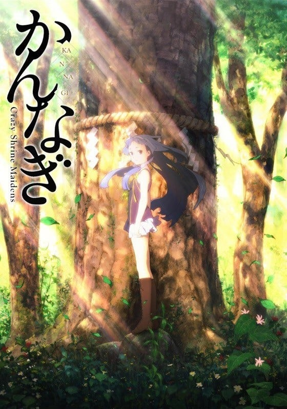
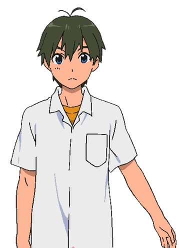
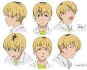

> [!bookinfo|noicon]+ **神薙**
> 
>
| 日文名 | かんなぎ |
|:------: |:------------------------------------------: |
| 类型 | 漫改 |
| 新番 | 2008 年 10 月 |
| 集数 | 共14话 |
| 官网 | [https://www.nagisama-fc.com/anime/](https://https://www.nagisama-fc.com/anime/) |
| 制作 | A-1 Pictures |
| 导演 | 山本寛 |
| 脚本 | 倉田英之、本田透、髙橋龍也,髙橋龍也,倉田英之,本田透 |
| 评分 | 7.1|
| 制片人 | 清水暁 |

> [!abstract]+ **简介**
> 　　天上掉下美少女的故事已经落伍了，今次是美少女破土而出！
　　高中生御厨仁用古树的木材雕刻了精灵像木雕，本打算以此参加地区展览会。不想搬运中，木雕掉在地上，竟然突然变出一位蓝发美少女！
　　这是怎么回事？漫画中美少女出现，住进主角家的荒唐剧情难道要发生在仁身上了吗？正当仁因这突如其来的变化而不知所措之际，少女开口说道：“吾乃产土神也。”
　　这位叫做薙的少女自称是神灵显灵，手拿动画片中的魔法棒去消灭“秽”。但是无论怎么看，薙不过是个爱耍大小姐脾气的可爱女孩。
　　仁，面对这位破土而出的少女，到底该怎么办？  

> [!tip]+ **章节列表**
>- [ ] 第1话：神篱的少女 (2008-10-04)
>- [ ] 第2话：玉音进攻！ (2008-10-11)
>- [ ] 第3话：学校的女神 (2008-10-18)
>- [ ] 第4话：姐妹 (2008-10-25)
>- [ ] 第5话：发现！爱餐桌魔人吧 (2008-11-01)
>- [ ] 第6话：小剃的心跳购物回忆 (2008-11-08)
>- [ ] 第7话：漂亮女孩大危机！超辣鳗鱼饭的逆袭（后篇） (2008-11-15)
>- [ ] 第8话：迷路的暴风雨之丘 (2008-11-22)
>- [ ] 第9话：令人害羞的学园喜剧 (2008-11-29)
>- [ ] 第10话：卡拉OK战士 麦克风贵子 (2008-12-6)
>- [ ] 第11话：可是，含糊其辞 (2008-12-13)
>- [ ] 第12话：却为朝生暮死 (2008-12-20)
>- [ ] 第13话：仁，害羞了 (2008-12-27)
>- [ ] 第14话：如果有这样的[神薙]的话…… (2009-05-27)

> [!tip]+ **主要角色**
> 
| 角色 | CV | 简介| 角色图片 |
|:----:|:---:|:---:|:--------:|
| ナギ | 戸松遥 | 依附在仁雕成的木像上的少女姿态的神，与仁在一个学校读书。除了态度骄傲和第一人称是“妾”以外，完全不像个神，有时也会搞笑。虽然以驱邪作为自己使命，不过因为是分身魂，并不能直接接触到它们。A罩杯。喜欢吃点心，甚至把美味棒揉碎了洒在米饭上或者夹在面包里吃，因此最近得了口腔溃疡。周围的人把她当作仁的同父异母的姐姐。 |  |
| 御厨仁 | 沢城みゆき | 高中一年级的学生。拥有能看见灵的体质，可以帮助薙驱邪。美术部员。一个人住。很憧憬像大铁一样的男人，加入美术部也是因为想要变得和大铁一样。美术部的前辈给他取了个绰号，叫做“too pure pure boy”。喜欢巨乳。 |  |
| 青葉つぐみ | 沢城みゆき | 高中一年级的学生。仁的青梅竹马。只会做煎鸡蛋和凉青菜这两样菜。据本人说是“接近于C的B罩杯”。投稿同人志时的笔名是“樱羽夏苑（桜羽夏苑（おううかおん））”。    青叶鸫鸫是与御厨仁从小一起长大的青梅竹马。由于御厨仁的父亲长期在外不归，家中只有仁自己住，所以仁的父亲就拜托比仁稍大一些的鸫来作御厨仁的“保护人”，而鸫也一直把自己放在仁的“保护人”的地位，处处为仁着想。虽然鸫的厨艺并不好，只会做很少的饭菜，但她仍然经常为独自生活的仁带去自己亲手制作的简单便当，悉心照料着仁的生活。长期的相处使得鸫对仁的感情渐渐发生了变化。当仁为了反驳自己的同性恋谣言而决定找女友的时候，鸫虽然非常羞愧，但仍然积极的与另一性感女孩竞争，希望仁能选择自己作女友。在于仁的生活中，对接近仁的女孩的嫉妒溢于言表。 青叶鸫是一个善良、纯朴、天真而平凡的女孩。在众多女主角中，她几乎没有可以胜过别人的优点。她的最大特点就是易于相处，从来不会被人讨厌，也从来不会与人发生激烈争吵。就算面对自己的情敌，她也毫无心机。 |  |
| ざんげ | 花澤香菜 | ナギの妹（川向こうに分社を立てる際、同じナギの木を株分けした存在）。本体の木が神社内に存在するため、下記の白亜の身体を依り代としている。 神薙町で「ざんげちゃん」として人々の悩みを聞き、ざんげちゃんFC（ファンクラブ）を創設するなど、ローカルアイドルとして活躍している。アイドルになったのはただ単に信仰者を集めることにより神として存在し続けたいだけである。アイドル時は明るく振る舞っているが、実の性格は腹黒く少々サディストの気もあり、姉のナギとは仲が良くない。 人間の肉体を依り代とするため、穢れを素手で直接祓うことが出来る。ただし、神としての使命感はなく、どうでもいいと言い切っている。 不器用なので料理や裁縫が苦手だが、時々白亜と入れ替わることによりカバーしている。ただし、心の中で会話することはできないらしく、表に出ている方が独り言のように喋る必要がある。 引っ込みがちな白亜の性格を嫌っているが、友達を作りたい時は助力もする（アンナと広美には「二重人格」と説明している）。 ざんげが表に出ているときは白亜はその行動が見えているため、時々白亜のために仁に対し白亜がドキドキするような大胆な行動を取る事も。 アニメOPではアイドル・ナギのライバルとして登場。記者会見場でナギと張り合うシーンが描かれている。 |  |
| 涼城白亜 | 花澤香菜 | 忏悔所依附的少女。 与忏悔的小恶魔性格不同的是白亚的性格则显得害羞内向，为了得到御厨仁而自愿将身体献给忏悔；非常的会做菜，与御厨仁似乎是旧相识。 |  |
| 響大鉄 | 星野貴紀 | 高中一年级的学生。美术部员。是个沉默而性格温柔的巨汉，很意外的唱歌好听。和仁结成了异常坚固的友谊，以至于被一些人误认为是情侣。 擅长画画，对与御厨仁同居的剃有着非常高的警戒心。 |  |
| 秋葉巡 | 柿原徹也 | 高中一年级的学生。美术部员。虽然外表普通，不过是个典型的动画御宅族。很讨厌别人对御宅族的偏见。 |  |
| 木村貴子 | 早水リサ | 美術部部長の眼鏡っ子。可愛い女の子が可愛い格好をしているのを見るのが好き。腐女子の気があり、興奮すると鼻血を出す。メイド喫茶に行って以来、色々と腐女子用語を調べるようになり、段々とオタク知識に詳しくなっている。挙句の果てには秋葉すら知らない言葉まで知っているようになった。歌うと普段とは似ても似つかぬ、かなりのアニメ声になる。 アニメOPではダンサーとして登場。ナギにダンスの指導をするも、その下手さに頭を抱えるシーンが描かれている。 |  |
| 大河内紫乃 | 中原麻衣 | 美术部副部长。身材很好，平时眼睛张开很小，看起来像是闭上了一样，如果眼睛睁开似乎会发生什么意外的事（动画中则是一唱歌就会睁开眼睛）。 |  |
| 涼城 怜悧 | 三宅健太 | 仁的学校的宗教学老师，白亚的父亲。 |  |