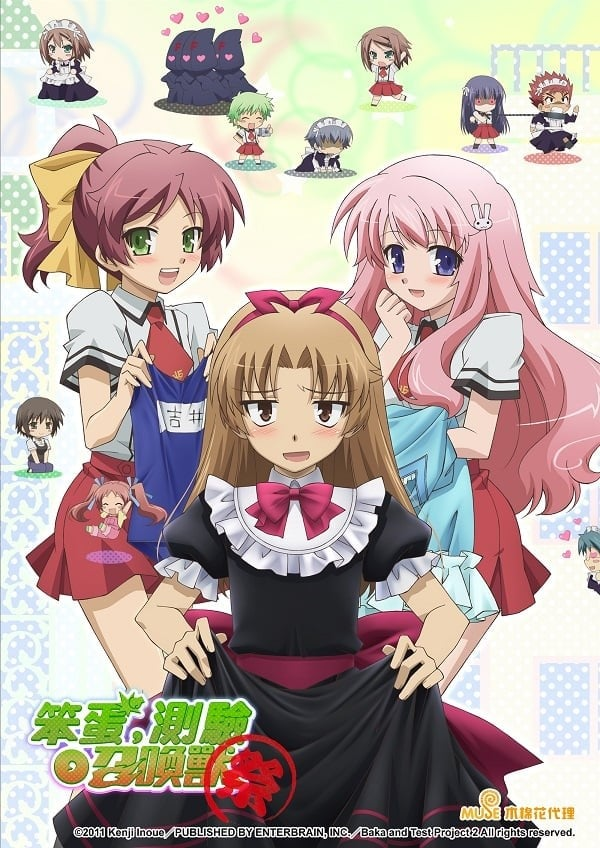
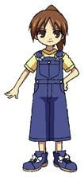
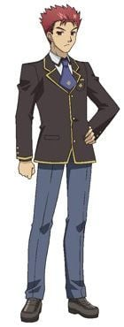
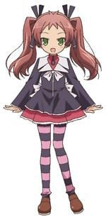
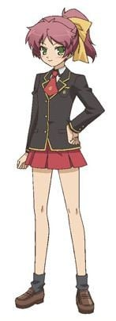
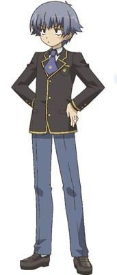
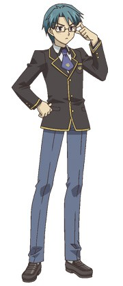

> [!bookinfo|noicon]+ **笨蛋，测验，召唤兽 ～祭～**
> 
>
| 日文名 | バカとテストと召喚獣 〜祭〜 |
|:------: |:------------------------------------------: |
| 类型 | 小说改 |
| 新番 | 2011 年 2 月 |
| 集数 | 共2话 |
| 官网 | [http://www.bakatest.com/ova/index.html](https://http://www.bakatest.com/ova/index.html) |
| 制作 | SILVER LINK. |
| 导演 | 大沼心 |
| 脚本 | 高山カツヒコ |
| 评分 | 7.3|
| 制片人 | 金子逸人 |

> [!abstract]+ **简介**
> 拥有根据科学、偶然性和神秘学开发出的「试验召唤系统」的文月学园，即将迎来被称为「清凉祭」的学园祭，为了准备迎接每年都会有众多来宾的学园祭，吉井明久等人所在的2年F班又将引起怎样的骚动呢？

> [!tip]+ **章节列表**
>- [ ] 第1话：我，女仆，新的旅程 (2011-02-23)
>- [ ] 第2话：笨蛋，烟花，召唤大会 (2011-03-30)
>- [ ] 第1话：Baka Galgame

> [!tip]+ **主要角色**
> 
| 角色 | CV | 简介| 角色图片 |
|:----:|:---:|:---:|:--------:|
| 吉永双葉 |  |  |  |
| 坂本雄二 | 鈴木達央 | 文月学園高等部の2年生。Fクラス代表。1年生時からの明久の悪友で相棒。180cm強の長身と精悍な顔立ちを持つ不良少年。神無月中学校出身。集団の統率力に優れ、個性が強すぎるFクラスを巧みに操縦する。 幼少時代には「神童」の異名をとり、現在学年首席の地位を誇る翔子よりも高い学力を持っていたが、喧嘩ばかりしていたのか現在はその面影は微塵にも感じられない。中学生時代は喧嘩で鳴らしていたため今も尚「悪鬼羅刹」の名で他校の不良達に恐れられている。 「勉強すること」に意味を見出さず、基本的に己の欲望や保身以外には行動しない無気力な性格。しかし一度やる気を起こせばその頭脳は現在でも「神童」そのもので、明久をいとも容易く罠に嵌め、試召戦争その他に様々な知略・謀略を巡らし、必要があれば自らが動いて計略を成功へと導く。喧嘩腰の相手には「パンチから始め、キックで繋ぎ、プロレス技で締める交渉術」を使用する。 幼馴染の翔子から小学生の時のある事件がきっかけでずっと好意を抱かれており、Aクラスとの試召戦争で敗北した時の条件により彼女と交際する事となってしまう。更に学園祭で明久の策略により婚姻届に判を押されてしまい交際返上と婚姻届の奪取のためAクラスへのリベンジを目指して学力を上げており、現在では元神童という事もありほぼ全科目でAクラス並の学力になっている。 翔子が自分に寄せる好意はあくまで「勘違いからくる好意」だと主張しているが、召喚テストで翔子の胸に抱かれた際は、本音を喋る召喚獣が嬉しがっていた。明久には「翔子が相手だと冷静に物事を考えられていない」ことを指摘されていたり、瑞希には「他の事は凄く気が回るのに、翔子ちゃんにだけはとても不器用」と分析されている。 明久とは1年生時からの悪友であり相棒的な存在だが、明久に対する仕打ちはFクラスのメンバーの中でも特に酷く、試召戦争の宣戦布告の使者が袋叩きにされると予想していながらその役をやらせたり、鉄人やその他の教師から逃げる為の囮に使うなど散々な扱いをしている、が、なんだかんだ言って仲良し。天然ボケな母親には苦労しており、明久が自分と同じく家族に苦労していることがわかると珍しく同情しフォローを入れた。また、その母親が反面教師になっている故か、小学生の頃から料理の知識も身に付けており、その腕前は自らも料理が非常に上手い明久をもうならせるほど。いつも明久とつるんでいる為に同性愛妄想癖のある生徒には明久の「恋人」と認識されている。 召喚獣の装備は物語開始当初の装備は改造制服にメリケンサック（ほぼ素手である為明久には雑魚と言われた）で、オカルトの比率が増加した際には本質「野性」が影響した「狼男」となり、２学期のメンテナンス後の新装備は学力が大幅に上がったにもかかわらず防具は今までの物に虎の刺繍が追加されただけ、明久とは違い武器も変化したが、メリケンサックから棒に変わっただけであった。代理召喚型（点数を使いフィールドを発生させる能力を持つ）の白金の腕輪を持っており、試召戦争の際には不利な状況で使用しフィールド干渉で戦闘を回避したり、教師の許可が得られないような作戦を実行するのに役立っている。 |  |
| 木下秀吉 | 加藤英美里 | 文月学園高等部の2年生。Fクラス所属。1年生時からの明久の友人。名前の由来は豊臣秀吉とその旧名・木下藤吉郎から。 演劇部に所属しており、特技は声帯模写で女声も男声も自由自在。Fクラスに所属しているのは演劇に入れ込み過ぎて普段の学業が疎かになっているため。 Fクラスでは数少ない常識人だが、そのためアクの強い友人達に振り回されがち。一人称は「わし」で、語尾に「〜じゃ」をつけるなど古風な言い方が特徴。 「稀代の美少女」「第三の性別"秀吉"」と称される程の美貌の持ち主だが、れっきとした男性である。その可愛らしさは新聞部主催の「女装が似合う男子生徒ランキング」にてノミネートされたが物言いがつき、審議の結果「アンフェアである」としてランキングに反映されなかったほどで、すでに男の娘というワードが浸透しているにもかかわらず、ファンの間ではあくまで"秀吉"という属性で扱われる。遂には女性陣からも完全に性別を忘れられつつあり、姉の優子と玲だけが彼を男子として認識している。 明久と同様に写真を裏で売買されており、相場はアキちゃん（明久）の5倍。本人は男子扱いされないことを遺憾としているが明久に好意を示されると頬を染めたり、明久が康太の女装を褒めた時は反射的に彼の頭を叩き不機嫌そうな表情を見せたり、バカ友達と言われて嬉しがったり、召喚テストの際には召喚獣を明久に飛び付かせようと考えたり、「嫁」と言われたら「婿だ」と返すなどの微妙に論点のずれたツッコミを入れ、明久の事を好きだという噂はデマだろと言われ返事に困る等、度々明久に対し特別な感情を抱いているような節が見うけられる。 他のFクラスの主要メンバーと違いこれといった得意科目や召喚獣の特殊能力がないため、試召戦争では戦闘員としては目立たない。代わりに戦闘外の駆け引きや策略、指揮において演劇部としての特技を重用されることが多く、本人が乗り気でなくともいざ状況が始まれば過度の演劇魂のせいで役割を完璧に演じてしまう。 可憐な外見に似合わずジャガイモの芽を食べても平気な「鉄の胃袋」を持っているらしいが、瑞希の弁当の前にはあえなく轟沈した。 召喚獣の装備は、物語開始時からの物は袴に薙刀、オカルト比率増加状態では本質の「可愛さ」が影響した「猫又」となり、メンテナンス更新後のは刀に新撰組の羽織となった。 「このライトノベルがすごい!」2009年度版総合1位（男性キャラ部門1位、同時に女性キャラ部門10位）。2010年度版男性キャラ部門1位、女性キャラ部門7位、2011年度男性キャラ4位。 |  |
| 島田葉月 | 平田真菜 |  |  |
| 木下優子 | 加藤英美里 |  |  |
| 吉井明久 | 下野紘 | 本作主角兼说话的角色。初中在长月中学就读。外表称得上是美少年，却被散发出来的笨蛋气息所抵销掉，拥有笨蛋的代名词‘观察处分者’的头衔，学力成绩低弱，与其说是不擅长读书，不如说是智力不足，连谈论道理的对话都跟不上。同时，他的某些不懂其中含义的分量的言行也常被周围人误会。女学生的评价为“非常适合女装及BL”，在文月学园中达成“似乎很适合穿女装的男生排行NO.1"，“最不想被这家伙看作笨 蛋排行NO.1”，“似乎很受欢迎的男生～同性恋～排行NO.1”的帽子戏法。喜欢姬路，却因为自卑认为配不上她，因此至今没有任何进展。遇到与姬路有关的事时会发挥出自己的愚勇和惊人的战斗潜能， 甚至能够以平常想都想不到的集中力准备考试而拿高分（只限一科）。双亲因为工作居留海外，他自己又花钱不加节制，为了兴趣而过着极端贫穷的生活，主食为盐水（有时配上砂糖），目前最想要的是卡路里。在学力强化合宿不小心用手机简讯传给了美波看起来像告白的内容而为后来的一系列骚动埋下了隐患。常常被人怀疑与其他男生有暧昧关系，如雄二.秀吉.甚至连土屋也是被怀疑的对象。不过本人实际上对男人并无兴趣，不过秀吉除外(因为是将秀吉当作是女生看待) 家里是秉持着“女性至上主义”，所以母亲与姐姐在家事上都是完全不行的，因而造就了明久专家级的家事技能，特别是厨艺上有着超越一般家庭料理的水准，拿手菜是西班牙海鲜饭。 　　原本召唤兽是无法触碰实际物品的，但由于他有那头衔的缘故，他的召唤兽才能够接触到物体，同时也比别人擅长于操纵召唤兽（因为经常用召唤兽帮老师们做杂务）。但做为代价的是，召唤兽所受伤害的一部分会转移到自己身上，依照情况甚至有可能流血。他以自身安全为优先事项，为此能不择手段（思考卑鄙的手段时脑袋会短路）。拥有的白金腕轮能力是可以将分数除二为代价，召唤出两只召唤兽，动画中拥有的黑金腕轮能力，可以在没有老师的情况下召唤出召唤力场（动画版原创情节的与A班的第二次试召战争中因为明久努力学习备战的缘故，使黑金腕轮无法再按开发者的设定继续判定明久是“笨蛋”而失控自爆）。 |  |
| 島田美波 | 水橋かおり | 文月学園高等部の2年生。Fクラス所属。身長152cm。10月10日生まれ。1年生時からの明久のクラスメート。ドイツ育ちの帰国子女。 勝気な目と髪に大きな黄色いリボンで束ねられたポニーテールがトレードマーク。美形で長身・美脚のモデル体型だが胸は絶壁。 「明久を殴る事」が趣味と公言する攻撃的な性格で、明久がセクハラ発言をする度に半殺しにしているが実際は「特別な感情」の裏返しで、いわゆるツンデレ。最近では無意識のうちに明久に関節技を決めていることすらある。第2回（Bクラス戦）の試召戦争で敵に包囲された明久を脅迫し、それ以降「美波」「アキ」と呼び合っている。 なお明久の狂言・行動が原因で文月学園の「彼女にしたくない女子」の第3位にランクインしている。しかし同性には非常に人気が高い。 一人称は「ウチ」。入学当初、ワタシという発言が他の皆に聞き取りづらく日本語での会話がまともにできなかったが故に周囲の誤解を招いてクラス内で孤立してしまう。そんな中で邪険に扱ってるのに不器用ながらも自分に接してくる明久の真意を理解したことで友人となり、その時から呼び方を変えるようになった。また、その時から明久のことを気にかけてはいたが、決定的に惚れたのは明久が美春に対して、いつも男友達のように扱っている自分のことを「魅力的な女の子」と告げていたことから（康太の録音を盗み聞きしていた）。現在では日本語での会話ぐらいは無難にできるが、未だに混乱するとドイツ語が出てくる癖は直っていない。 瑞希と同じく明久の女装姿を気に入っており、ムッツリ商会から明久の女装姿の写真や抱き枕を頻繁に購入している。 本来ならBクラス以上の学力を持つもドイツ育ちで漢字が読めないため問題文を理解できず、結果として殆どの教科の点が低い。古典の点数に至っては1桁、但し数学は漢字を使わないのでまだ得意。 両親が仕事で不在がちな為家事全般を引き受けており、料理は上手である。しかし明久の腕前を知ってからは少々自信喪失ぎみ。 召喚獣の装備は、物語開始時点から（漫画版では1年時から）の物は軍服にサーベル、オカルトの比率が増加した際の変化は、「壁のごとき部位」という本質が影響、「ぬりかべ」になった。メンテナンス更新により2学期は騎士鎧にランス（オカルト版同様本質が影響されて、盾代わりのまな板にならないかと心配していた）。 「このライトノベルがすごい!」2009年度版女性キャラ部門26位 |  |
| 土屋康太 | 宮田幸季 | 文月学園高等部の2年生。Fクラス所属。1年生時からの明久の友人。身長162cm、体重48kg。AB型。並外れたスケベ心とそれを隠そうとするひたむきな姿から「ムッツリーニ（寡黙なる性識者）」と呼ばれる。 ほぼ全ての台詞の頭に「……」が付くほど寡黙な性格。明久と同等のバカだが性に関する知識だけは豊富かつ貪欲で、しかし実際には妄想ですら致死レベルの鼻血を噴くほどウブ。故に身の危険がさらされる可能性が高いイベント時は、輸血パックを持参している。1年時は情報操作と隠密行動で一部の生徒以外に「ムッツリーニ」であることは知られていなかったが、Fクラスになった初日に雄二にバラされその際における行動により完全に認知され、以降は異名のほうが浸透し本名を忘れられつつある。 本質はともかく、やや幼い外見と前述のひたむきな姿から秀吉ほどではないものの、周囲からはかわいい等と評されることが多々ある。 裏ではムッツリ商会を営んでおり、明久や秀吉の写真や抱き枕等の販売元。それらの売り上げはデジカメ、盗聴機材などの情報収集などの資金になっている。 保健体育の実力はAクラスで同じく保健体育が得意な工藤愛子を瞬殺し、とある目的のため努力すれば教師を凌ぐほどの点数も取れる。しかし、それ以外の科目は壊滅的で、学年最下位の明久をも下回る。また、料理や裁縫なども得意で本人曰く「紳士の嗜み」だが全ては下心の副産物。現代に蘇った忍者と称される「情報屋」で諜報（盗撮&盗聴等）・探索・暗殺・ピッキング技術に優れ裏方のエキスパートとして常時・戦時共に重宝されているがその行動のほぼ全てが法に触れる技術である為、バレたら一巻の終わりの綱渡り人生。 上記の通り試召戦争においては保健体育以外ほとんど戦力にならないが、作中では雄二の優れた指揮や巧妙な作戦のおかげで保健体育の強さを発揮する機会が多く、また自身の持つ特殊技能を使って偵察や状況報告、破壊工作を行う（邪魔な人物をもっとも効率的な方法で排除する）ため貢献度は高い。 召喚獣の装備は初期の物は小太刀二刀流の忍者装束、腕輪の特殊能力は「加速」。これによる高速での移動と攻撃を得意とする。オカルト増加時は、その血と女への渇望が影響し、「ヴァンパイア」となるその際にも腕輪の能力は健在で、狼に変身して高速で攻撃することが可能。メンテナンスの合間の試験運用の際の半自立行動時の際、本体と全く同じ行動を起こすため特に興味を持たれなかった。2学期のメンテナンス後は上忍相当の服装に昇格した。 |  |
| 霧島翔子 | 磯村知美 | 文月学園高等部の2年生。1993年11月11日生まれ。Aクラスの代表で学年首席。 長い黒髪が印象的な寡黙な美少女で、神々しささえ漂うその美しさから男女問わず人気がある。しかし男子からの告白は全て断っており、一部では同性愛者ではないかとの噂が立っていたが、これは幼馴染の雄二を想い続けており、周囲の女性に警戒の視線を向けていたためであった。 Fクラスとの試召戦争に勝利した事で、雄二と名目上の恋人同士となる。普段の落ち着いた振る舞いとは裏腹に雄二へのアプローチは積極的で、正攻法からストーキング紛い、更には法に触れる行為や性的な既成事実の強要等、実に様々な手で結婚を迫っている。既に坂本家の実印を入手し、雄二との婚姻届を作成しているため本人曰くというか実質的に婚約者である。壮絶なまでに嫉妬深く、理由の如何や事の大小、関わった相手の性別を問わず雄二の浮気は決して許さない。 周りから「お嬢様」と呼ばれたり雄二が婿入りを恐れていることから家はかなりの資産家であると思われ、実際に家柄もいいらしい。雄二の母との仲は良好。その割りには雄二への扱いは理不尽そのもので、浮気疑いやセクシーな人物が登場したりすると目潰しやアイアンクローの餌食にしている。雄二との子供の名前はしょうゆと決めており翔子と雄二の名前をあわせたもの。翔子曰く、「味のある子に育つ」。雄二曰く「捻くれものに育つ未来しか想像できない。」また、想像妊娠の意味を取り違えており雄二が翔子のでこにキスをして子供ができたと思いこんでいる。、雄二に病院に行くよう言われた際は雄二は精神科のつもりだが本人は産婦人科だと勘違いしている。 雄二との関係をきっかけにFクラスのバカメンバーとも親しくなり、Aクラスのメンバーでは最も出番が多い（アニメ版ではFクラス以外の生徒の中で唯一全話登場）。「一生懸命に努力する人物」を好み、ある一件から瑞希とも親しくなる。そしてそれは雄二の事が大好きな理由の一つでもある。雄二を想う気持ちの発端には、小学生の頃のある出来事が関係している。その時に感じた自らの想いに確信を持ち、「雄二のお嫁さんになる」事を夢見て7年経った今もその気持ちは揺らいでいない。 学年首席の名に恥じない学力を誇り、一度学んだことは決して忘れない程の記憶力を持つ。但し雄二から教わった誤答もそのまま憶えているため、そこに僅かな隙が存在する（本来は誤答を教わっても正答を聞いた際に修正されるはずだが、雄二から教えてもらった事と、優先して覚えているようである）。当然鉄人の補習を受けることはないが、アニメでは雄二と補習をやりたいがためにわざと回復試験で0点を取って補習を受けようとした描写もある（本人曰く「雄二がいるなら休みでも来るし、雄二がいないなら平日でも来ない」）。なお恋愛の価値観が極端に偏っており、恋愛に関するバカテストや恋愛相談コーナーでは珍回答続出。 アニメではEDテーマ『晴れときどき笑顔』を瑞希、美波、秀吉と共に歌ったり、発売されているアニメグッズ等に明久達と同様に彼女もメインに描かれていたりなどメインキャラクターに格上げされている（原作の方も試召戦争時以外では出番が非常に多くなってきている）。 召喚獣の装備は武者鎧に日本刀。 |  |
| 姫路瑞希 | 原田ひとみ | 1992年11月1日出生，文月学园高中部二年级。原本的学习成绩是全年第二，但在分班考试时，因为中途发高烧而离席，所以考试全部零分，被分配到F班去。由于她可怜的容貌与超群的胸围比例而支持者众多。 召唤兽的装备是西洋盔甲和巨剑，小说第八集武器和盔甲变的更强。黄金手环的特殊能力则是燃烧对手。 与明久从小学就是同班同学，因小时候跟明久的互动而喜欢明久，但明久本人完全没有自觉，在分班考试时因明久庇护自己才注意到。其后发现明久为了她自己而挑起试召战争的事，决定也用信来传达心情，但又在会错意的明久建议下当面说出。之后，信件一度失去踪影，最后亲手撕成碎片并被雄二烧毁。曾和明久间接接吻，却没有更进一步。     随后只要跟明久相关的事情都会想要参与以及知道，与平常表现相反内心想法十分大胆。有着收集明久女装照片（其中包括抱枕和闷声色狼建成的“闷声商会”）的兴趣。 受到经常在一起的美波影响，在妒忌时“处罚”明久，方式亦越来越极端。料理方面十分笨拙（本人亦是毫无自觉），制成的便当有令人晕倒和带走人灵魂的怪味。有吃过其料理的人都会100%被击倒(连号称铁胃的秀吉、“铁人”西村老师都禁受不起，不过前者跟雄二、明久和闷声色狼因为时常得吃瑞希做的料理而渐渐有了抵抗力。)，作料理的次数会因“生气”而增加。虽然可以把料理倒掉，但随着一次接一次，危险度会逐渐增加。 |  |
| 久保利光 | 寺島拓篤 | 文月学园高等部二年级学生。就读A班，5月9日生(金牛座)。拥有学年次席的实力，主要是文科，国文分实际上数450分以上，黄金手环能力是风刃，学力略输给姬路，原本排名为第三。召唤兽的装备是武士战甲跟大镰刀。A班男子代表，戴着眼镜，外表十分冷酷。真正的同性恋者，暗恋明久，事情牵扯到明久时便会失去理智。和美春不同，对自己的性倾向感到苦恼，不过在强化合宿后，曲解明久的发言而立志要谈同性恋。曾经向土屋订购上面印有明久穿水手服的等身大抱枕套。 |  |
| 吉井玲 | 井上喜久子 | 吉井家的长女，也就是明久的姐姐，23岁。几乎是无可挑剔的美女，胸部为E罩杯，于哈佛大学毕业（动画版追加是教育文凭的设定）。基本上和明久完全相反，拥有优秀的头脑，明久因而被雄二讽刺：“好的都被拿走了”，但意外地是个料理白痴，例如：把饭团的口感弄成西班牙大锅饭的口感；被问到洗米用的工具会回答砥石。对自己和别人都很严厉，因此担任明久的观察处分者时，令他吃足苦头和戏弄。不过对明久这弟弟似乎带有强烈的感情，所以平常的行为可说是一种关爱的表现，只是太过夸张（起床之吻、穿着暴露、拍泳装写真、与明久一起洗澡等等）。动画第九集（小说第5卷）明久表明了自己最喜欢姊姊了，但是是以家人的喜欢，反观玲似乎对明久有家人以上的喜欢。揭露了明久对于女生的兴趣为“马尾”和“巨乳”，害得隔天瑞希花了两小时结好一头马尾，美波戴了胸部衬垫。很容易醉酒。 |  |