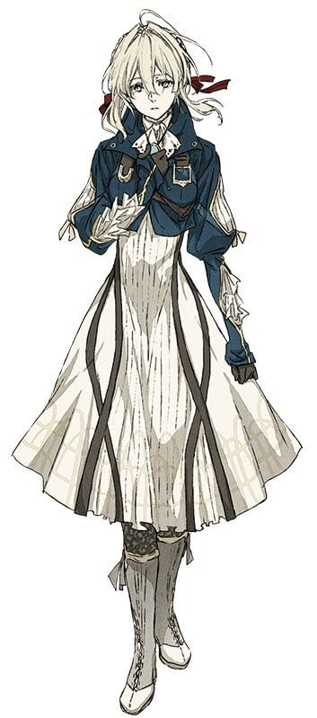
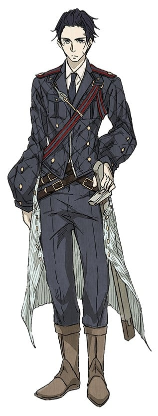
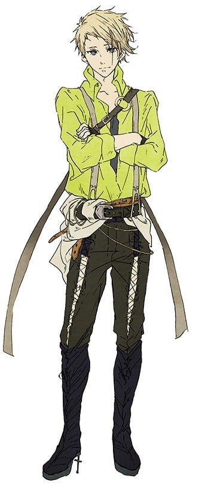
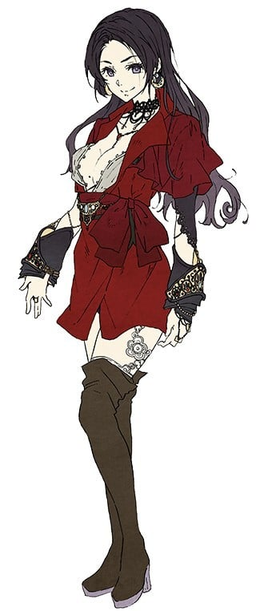
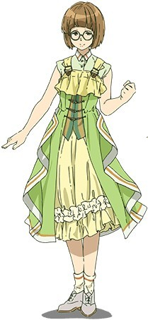
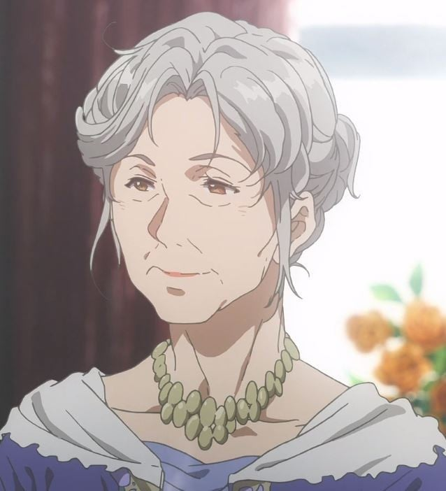
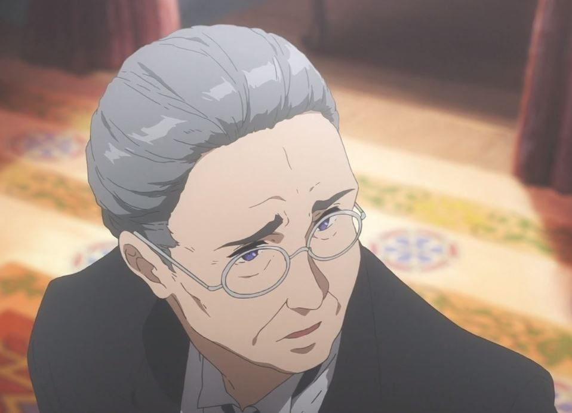
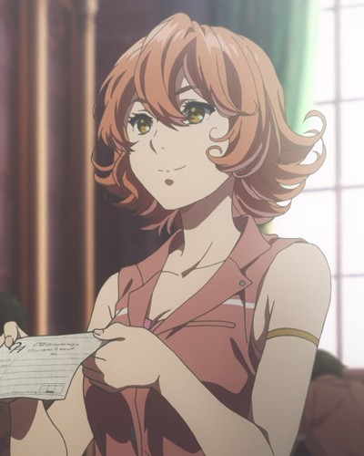

> [!bookinfo|noicon]+ **紫罗兰永恒花园**
> 
>
| 日文名 | ヴァイオレット・エヴァーガーデン |
|:------: |:------------------------------------------: |
| 类型 | 小说改 |
| 新番 | 2018 年 1 月 |
| 集数 | 共13话 |
| 官网 | [http://violet-evergarden.jp/](https://http://violet-evergarden.jp/) |
| 制作 | 京都アニメーション |
| 导演 | 石立太一 |
| 脚本 | 鈴木貴昭,吉田玲子,浦畑達彦 |
| 评分 | 7.6|
| 制片人 |  |

> [!abstract]+ **简介**
> 某个大陆的、某个时代。
大陆南北分割的战争结束了，世界逐渐走向了和平。
在战争中、作为军人而战斗的薇尔莉特·伊芙加登离开了军队，来到了大港口城市。怀抱着战场上一个对她而言比谁都重要的人告诉了她“某个话语”――。
街道上人群踊跃，有轨电车在排列着煤气灯的马路上穿梭着。薇尔莉特在街道上找到了“代写书信”的工作。那是根据委托人的想法来组织出相应语言的工作。
她直面着委托人、触碰着委托人内心深处的坦率感情。与此同时，薇尔莉特在记录书信时，那一天所告知的那句话的意思也逐渐接近了。

> [!tip]+ **章节列表**
>- [ ] 第1话：“爱”与自动手记人偶 (2018-01-10)
>- [ ] 第2话：“回不来了” (2018-01-17)
>- [ ] 第3话：“希望你成为出色的自动手记人偶” (2018-01-24)
>- [ ] 第4话：“你将不再是道具，而是成为人如其名的人” (2018-01-31)
>- [ ] 第5话：“写替人结缘的书信吗？” (2018-02-07)
>- [ ] 第6话：“在某处的星空下” (2018-02-14)
>- [ ] 第7话：“　　　　” (2018-02-21)
>- [ ] 第8话：“薇尔莉特・伊芙加登” 前篇 (2018-02-28)
>- [ ] 第9话：“薇尔莉特・伊芙加登” 后篇 (2018-03-07)
>- [ ] 第10话：“心爱的人 永远守护着你” (2018-03-14)
>- [ ] 第11话：“再也不想让任何人死去” (2018-03-21)
>- [ ] 第12话：自动手记人偶与“爱” 前篇 (2018-03-28)
>- [ ] 第13话：自动手记人偶与“爱” 后篇 (2018-04-04)
>- [ ] 第4.5话：了解“爱”的那一天一定会到来 (2018-07-04)

> [!tip]+ **主要角色**
> 
| 角色 | CV | 简介| 角色图片 |
|:----:|:---:|:---:|:--------:|
| スペンサー・モールバラ | 日笠陽子 |  |  |
| ヴァイオレット・エヴァーガーデン | 石川由依 | 隶属C·H邮政公司的“自动记忆人偶”少女。 与其美貌不相称的是，拥有罕见的战斗力。 幼年时被基尔伯特捡到。有着作为军人的过去。 |  |
| クラウディア・ホッジンズ | 子安武人 | 原是莱丁谢夫特里希国的军人，现任C·H邮政公司的社长。 也作为薇尔莉特的监护人。 爱好打扮，喜欢赌博。 虽然和基尔伯特性格完全不同，两人却是老朋友。 |  |
| ギルベルト・ブーゲンビリア | 浪川大輔 | 莱丁谢夫特里希国陆军军人。 在兄长的要求下，成为薇尔莉特亲人般的存在。 |  |
| ベネディクト・ブルー | 内山昂輝 | CH郵便社に務める配達員（ポストマン）。 ホッジンズとは以前からの知り合いで、雇われ始めてからもぶっきらぼうな態度は変わらない。 |  |
| カトレア・ボードレール | 遠藤綾 | CH郵便社に務める自動手記人形。 指名の絶えない看板ドールで、ホッジンズとは働き始める前から親しい仲だった。 |  |
| エリカ・ブラウン | 茅原実里 | アイリスよりも少し先輩の自動手記人形。 依頼主とのやりとりが苦手で仕事に自信を持てずにいる。 |  |
| アイリス・カナリー | 戸松遥 | CH郵便社に務める新人の自動手記人形。 働く女性に憧れており、仕事で名を上げようと意気込んでいる。 |  |
| ティファニー・エヴァーガーデン | 沢田敏子 |  |  |
| オリバー | 野坂尚也 |  |  |
| リリアン | 引坂理絵 | C·H邮政公司的接待员。 |  |
| ネリネ | 齋藤綾 | C·H邮政公司的接待员。 |  |