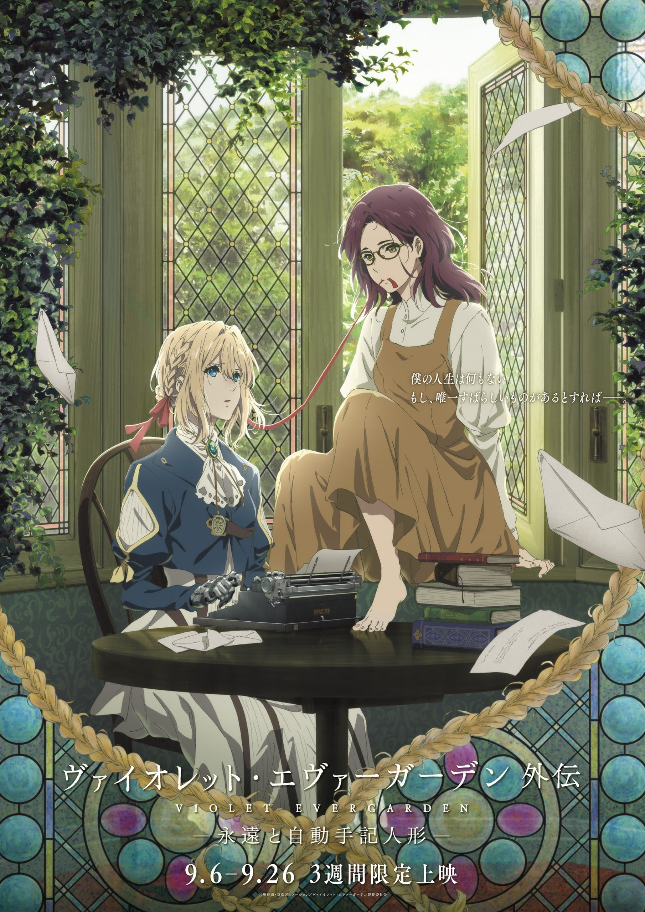
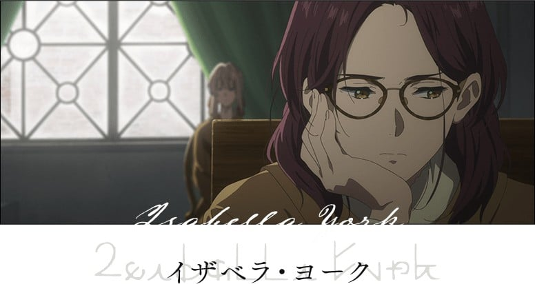

> [!bookinfo|noicon]+ **紫罗兰永恒花园 外传 - 永远与自动手记人偶 -**
> 
>
| 日文名 | ヴァイオレット・エヴァーガーデン 外伝 - 永遠と自動手記人形 - |
|:------: |:------------------------------------------: |
| 类型 | 小说改 |
| 新番 | 2019 年 9 月 |
| 集数 | 共1话 |
| 官网 | [http://www.violet-evergarden.jp/sidestory/](https://http://www.violet-evergarden.jp/sidestory/) |
| 制作 | 京都アニメーション |
| 导演 | 藤田春香 |
| 脚本 | 鈴木貴昭、浦畑達彦,鈴木貴昭,浦畑達彦 |
| 评分 | 7.5|
| 制片人 |  |

> [!abstract]+ **简介**
> 暁佳奈の人気ライトノベルを原作とする京都アニメーション制作のTVアニメ「ヴァイオレット・エヴァーガーデン」の外伝作品。感情を持たない元軍人の少女ヴァイオレットが、手紙を代筆する“自動手記人形”の仕事を通して様々な人たちの想いと向き合い、愛の意味を知っていく姿を繊細な映像表現で綴るファンタジー群像劇。本作では、生きることに絶望していた新たな依頼主の少女イザベラとの物語が描かれる。監督はTVシリーズでシリーズ演出を手がけた藤田春香。2019年9月に3週間限定で劇場上映を実施。

……大切なものを守るのと引き換えに僕は、僕の未来を売り払ったんだ。
良家の子女のみが通うことを許される女学校。
父親と「契約」を交わしたイザベラ・ヨークにとって、
白椿が咲き誇る美しいこの場所は牢獄そのもので……。
未来への希望や期待を失っていたイザベラの前に現れたのは、
教育係として雇われたヴァイオレット・エヴァーガーデンだった。

> [!tip]+ **章节列表**
>- [ ] 第1话：紫罗兰永恒花园 外传 - 永远与自动手记人偶 - (2019-09-06)

> [!tip]+ **主要角色**
> 
| 角色 | CV | 简介| 角色图片 |
|:----:|:---:|:---:|:--------:|
| 女子生徒 | 慶長佑香 |  |  |
| ヴァイオレット・エヴァーガーデン | 石川由依 | 隶属C·H邮政公司的“自动记忆人偶”少女。 与其美貌不相称的是，拥有罕见的战斗力。 幼年时被基尔伯特捡到。有着作为军人的过去。 |  |
| クラウディア・ホッジンズ | 子安武人 | 原是莱丁谢夫特里希国的军人，现任C·H邮政公司的社长。 也作为薇尔莉特的监护人。 爱好打扮，喜欢赌博。 虽然和基尔伯特性格完全不同，两人却是老朋友。 |  |
| ベネディクト・ブルー | 内山昂輝 | CH郵便社に務める配達員（ポストマン）。 ホッジンズとは以前からの知り合いで、雇われ始めてからもぶっきらぼうな態度は変わらない。 |  |
| カトレア・ボードレール | 遠藤綾 | CH郵便社に務める自動手記人形。 指名の絶えない看板ドールで、ホッジンズとは働き始める前から親しい仲だった。 |  |
| エリカ・ブラウン | 茅原実里 | アイリスよりも少し先輩の自動手記人形。 依頼主とのやりとりが苦手で仕事に自信を持てずにいる。 |  |
| アイリス・カナリー | 戸松遥 | CH郵便社に務める新人の自動手記人形。 働く女性に憧れており、仕事で名を上げようと意気込んでいる。 |  |
| ティファニー・エヴァーガーデン |  |  |  |
| ネリネ | 齋藤綾 | C·H邮政公司的接待员。 |  |
| ローランド | 各務立基 |  |  |
| ルクリア・モールバラ | 田所あずさ |  |  |
| イザベラ・ヨーク | 寿美菜子 | 大贵族·约克家的女儿。对于自己的未来感到悲观。 对于当教育员的薇尔莉特感到不快。 |  |