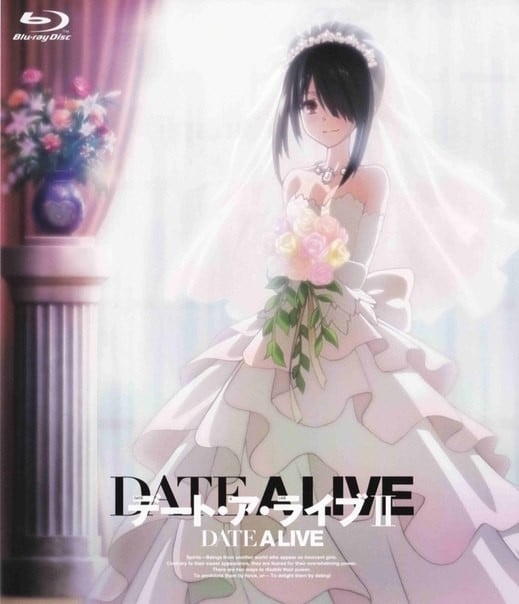

> [!bookinfo|noicon]+ **约会大作战 OAD**
> 
>
| 日文名 | デート・ア・ライブ OAD |
|:------: |:------------------------------------------: |
| 类型 | 小说改 |
| 新番 | 2014 年 12 月 |
| 集数 | 共1话 |
| 官网 | [http://date-a-live-anime.com/1st-2nd](https://http://date-a-live-anime.com/1st-2nd) |
| 制作 | プロダクションアイムズ |
| 导演 | 元永慶太郎 |
| 脚本 | 白根秀樹 |
| 评分 | 6.8|
| 制片人 |  |

> [!abstract]+ **简介**
> 『デート・ア・ライブ アンコール』3巻限定版收录新作OAD
TVアニメ未放送、ファン待望のエピソードを収録したブルーレイ付き

> [!tip]+ **章节列表**
>- [ ] 第11话：狂三Star Festival (2014-12-09)

> [!tip]+ **主要角色**
> 
| 角色 | CV | 简介| 角色图片 |
|:----:|:---:|:---:|:--------:|
| 五河士道 | 島﨑信長 | 本作主角。都立来禅高中2年级生。年幼时曾发生被双亲抛弃，而后被五河家接继的过往经历。因此，对其他人绝望的感触非常敏锐，像是对抱持着绝望的十香在初次见面即被其所察觉。 是一般所认知中极其普通的高中生，实际上却存有能透过接吻吸收、封印精灵的力量，遭受致命伤害时会自伤口点燃火焰，并伴随着再生、终而复活这样特殊的体质（正确来说，再生能力是因封印琴里的精灵能力所产生的奇特副作用，倘若琴里的封印被解除则无此一能力），被“拉塔托斯克”半强迫地选为以对话沟通来避免精灵被杀害减少为目标的脚色。本人最初也对这样的工作踌躇犹疑，但借由与十香与四糸乃的接触之后则渐渐变得想帮助精灵们，并决心以自己的意志担任与精灵沟通交涉的角色。 |  |
| 夜刀神十香 | 井上麻里奈 | 本作女主角之一。与迷团般的大爆炸一并现身于士道前的精灵少女，拥有一头及膝的黑色长发与水晶般不可思议色彩的眼睛。士道对她的第一印象，就是那可以被称为暴力一般美丽。没有包含名子在内和自己相关的一切记忆，在第二次与士道相遇后，希望士道为她命名，士道基于两人第一次见面的日子（四月十日）而命名为“十香”。 由于每次出现都遭到人类攻击，使她对人类充满恐惧与敌意，一见到人就会攻击，但在与士道相遇后逐渐改变她对人的观感，变得非常喜爱人类的世界。个性纯真可爱，天然呆，食量惊人，缺乏日常生活知识，如孩童般的对所有事物都充满好奇。在精灵力量被士道封印后经过拉塔托斯克假造户口后以转校生的身分转入他的班级，并暂时住进五河家中，之后搬进拉塔托斯克建于五河家旁的特殊公寓。与折纸因各种缘由非常不合，对她总以全名称呼，每天都跟她围绕着士道争吵。 |  |
| 五河琴里 | 竹達彩奈 | 本作女主角之一。14岁，士道名义上的妹妹。 喜欢的东西是棒棒糖，讨厌的东西是恐怖故事。 特征是将粉红色的头发扎成一对双马尾的可爱傲娇少女，但同时也是将士道拉上与精灵对话交涉作为根绝空间震手段“拉塔托斯克”的司令官。具有双重人格般的两种性格，以头上所绑的缎带颜色作为切换性格，白色是士道平时所熟知的纯真妹妹，黑色则是超S的毒舌司令。强迫士道学习男女交际的方法，一但失败就会毫无留情的揭开士道过去年少轻狂时的黑暗历史。 每天早上都会收看星座占卜与血型占卜的节目。 把拉塔托斯克中自己所管辖的部队成员的样貌全都记熟，并当成家人一样对待。 |  |
| 氷芽川四糸乃 | 野水伊織 | 出现在士道前的第2个精灵。识别名为隐居者（Hermit）（ハーミット）。 长相宛若法国娃娃般美丽的蓝发少女，外表年纪与琴里相近，手拿着一个样子滑稽的兔子手偶（四糸奈）。 喜欢的东西是可爱的帽子与四糸奈，讨厌的东西是受人注目的地方、暴力与受伤。 生性温驯而胆小怕生，几乎不敢与人直接对话，会以腹语术由手偶“四糸奈”这个人格与他人沟通。但由于对外皆由“四糸奈”对应，使四糸乃本身的精神处于封闭状态，在手偶脱离之后，四糸乃的本人格才浮现。一旦失去“四糸奈”的支持，四糸乃就会变得极度容易恐慌，任何刺激都会让她反射性的发动攻击，但心中仍是希望不要伤害任何人，士道为此做出承诺，说会成为保护她远离痛苦与伤害的英雄。 能操控水与寒气，因这项特质使她在力量被士道封印之前每次现界后周围总是倾盆大雨。灵装是一件饰有兔耳的绿色斗篷“神威灵装·四番（El）［（神威霊装・四番（エル）］”，天使“冰结傀儡（Zadkiel）［氷結傀儡（ザドキエル）］”是能冻结周围的巨大人偶，能以夹带灵力的雨水及寒气张开防御用的结界，任何在范围内带有灵力的事物都被冻结，连同显像装置制造的随意领域也能冰冻。  四糸奈（よしのん） 四糸乃手中的兔子手偶，由她所创造出来的另一人格，只在戴上手偶时才会浮现。是四糸乃理想中的自己，也是她的朋友。 四糸奈的感官完全依赖于四糸乃。 个性开朗健谈，言词上总是充满自信，不过偶尔有话说得太过份的毛病。不断鼓励并支持四糸乃，并代替内向的她与他人对话。除此之外四糸奈也是四糸乃的精神依靠，为避免自身的恐惧使力量失控而创造出来的坚强形象，而这也是基于四糸乃不想伤害他人的温柔。虽说是借由四糸乃以腹语术发声，但由于两者的思考是个别独立的，所以四糸奈的发言无关于四糸乃的意志。 当四糸乃在力量不完全的状态下召唤天使时，四糸奈的人格会转移到“冰结傀儡”上。 全名于小说第21卷判明。 |  |
| 時崎狂三 | 真田アサミ | 出现于故事中的第3个精灵。识别名为：梦魇（Nightmare）（ナイトメア）。 喜欢的东西是动物，讨厌的东西是人类。 突然转入来禅高中的转校生，一头黑色长发绑成两条马尾，异常长的浏海几乎遮住脸的左半边，皮肤如同珍珠般白晢光滑，在众人前自称精灵。刚开始就对士道异常的亲密。 对杀死人命毫不抗拒，至今已被确认由狂三亲手杀死的人超过一万名以上，但杀死的人几乎都是一些街头流氓和地方混混但未被人所知。被认为是最邪恶的精灵，虽然崇宫真那曾经成功杀死她，但过了一阵子后又会毫发无伤再度出现，而她就一直在杀人与被杀的轮回中徘徊。虽自称自己喜欢杀人也喜欢被杀，但曾因士道的话而产生动摇，而且也曾因看到少年虐待小猫而大发雷霆。 |  |