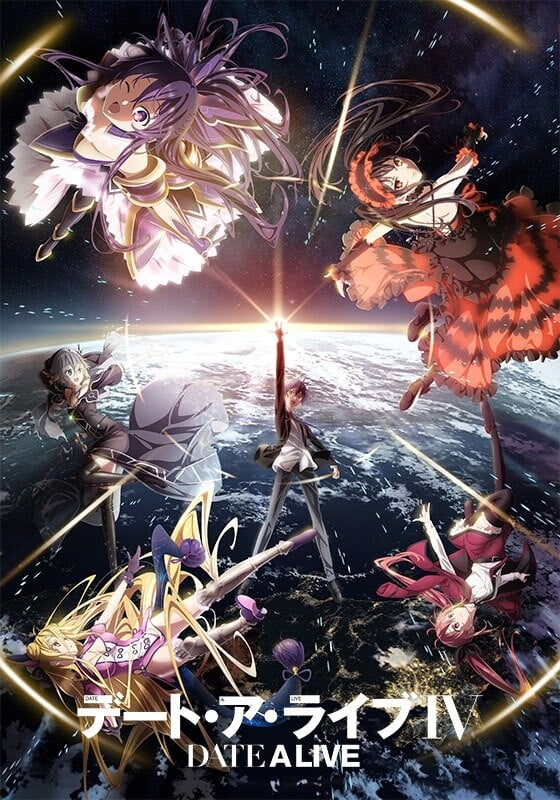
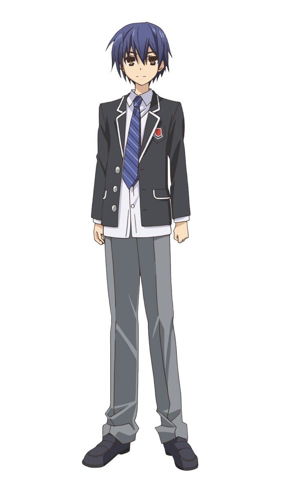
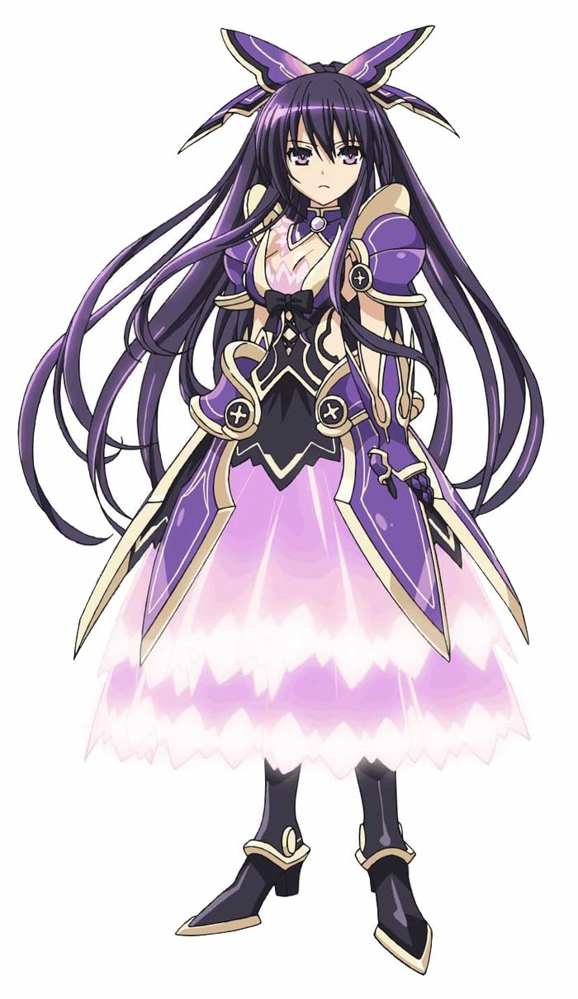
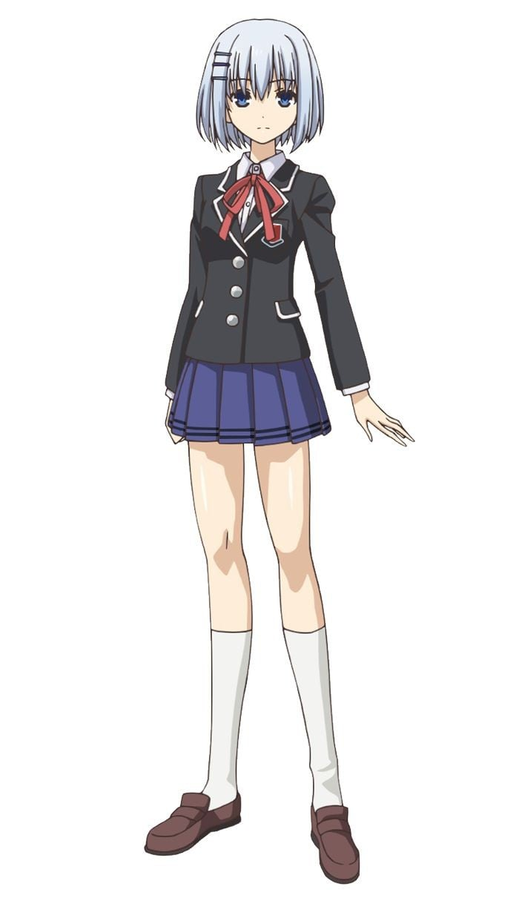
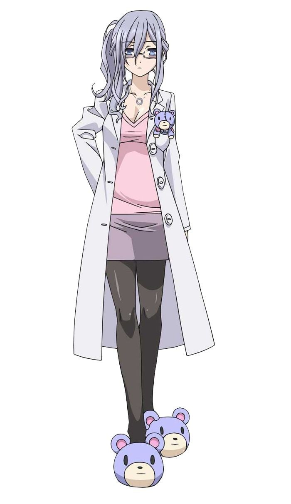
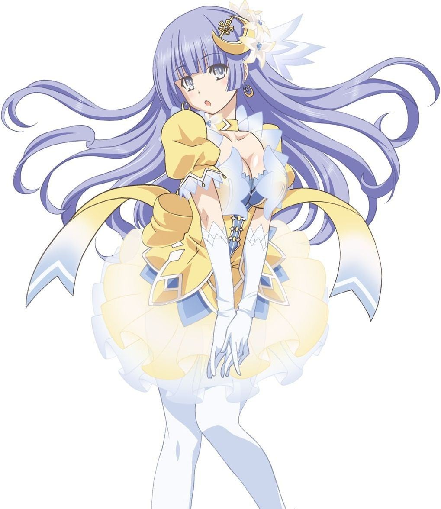
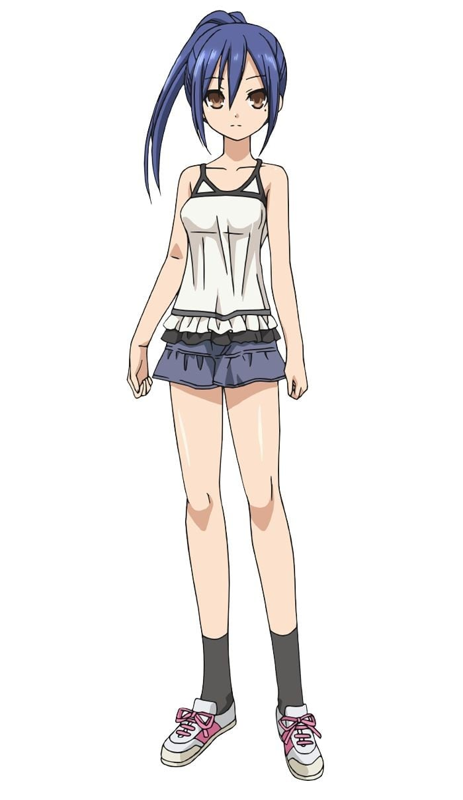
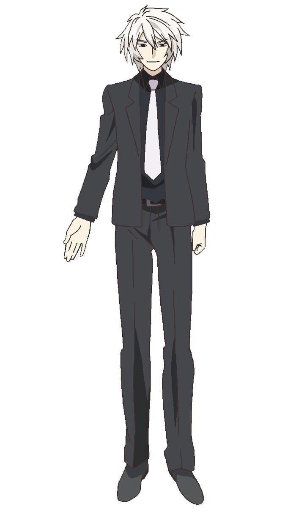
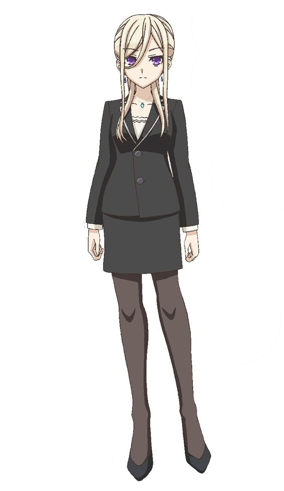

> [!bookinfo|noicon]+ **约会大作战 第四季**
> 
>
| 日文名 | デート・ア・ライブⅣ |
|:------: |:------------------------------------------: |
| 类型 | 小说改 |
| 新番 | 2022 年 4 月 |
| 集数 | 共12话 |
| 官网 | [https://date-a-live4th-anime.com](https://https://date-a-live4th-anime.com) |
| 制作 | GEEKTOYS |
| 导演 | 中川淳 |
| 脚本 | 志茂文彦 |
| 评分 | 6.5|
| 制片人 | 今本尚志 |

> [!abstract]+ **简介**
> 伴随着前所未有的灾难“空间震”，从邻界现身的少女们――精灵。
她们拥有的强大能力足以匹敌灾祸，使人类不断地疲于应付。
要对抗精灵，人类能选择的手段，是用武力消灭精灵，或是――
“与精灵约会，使其娇羞！”
亲吻因娇羞让好感度达到MAX的精灵，便能封印她们的灵力，并转换成自己的力量――这是五河士道拥有的特异能力。过于强大的灵力是将精灵们卷入斗争漩涡的元凶，士道通过对灵力进行抑制，时而为了守护她们使用这份力量，陆续拯救了夜刀神十香等精灵们。
自从精灵首次出现在人类面前，已过数十年。人类与精灵的关系与应对方法也暗地里产生变化…...
被士道拯救的一个个精灵们、尚未出现的精灵们，
还有，采取不同于士道所属＜拉塔托斯克＞的手段，和精灵们对峙的势力。
打破了短暂的宁静……
士道与精灵的战争（约会），又要开始了―—

> [!tip]+ **章节列表**
>- [ ] 第1话：别慌。这是精灵的陷阱 (2022-04-08)
>- [ ] 第2话：好，那就二次元 (2022-04-15)
>- [ ] 第3话：你的就是我的 (2022-04-22)
>- [ ] 第4话：太空的精灵 (2022-04-29)
>- [ ] 第5话：童话故事 (2022-05-06)
>- [ ] 第6话：敞开的心扉 (2022-05-13)
>- [ ] 第7话：被封闭的记忆 (2022-05-20)
>- [ ] 第8话：钥匙与剑 (2022-05-27)
>- [ ] 第9话：梦魔的诱惑 (2022-06-03)
>- [ ] 第10话：少女的时间 (2022-06-10)
>- [ ] 第11话：往日的罪孽 (2022-06-17)
>- [ ] 第12话：救赎的轮回 (2022-06-24)

> [!tip]+ **主要角色**
> 
| 角色 | CV | 简介| 角色图片 |
|:----:|:---:|:---:|:--------:|
| 五河士道 | 藏合紗恵子 | 本作主角。都立来禅高中2年级生。年幼时曾发生被双亲抛弃，而后被五河家接继的过往经历。因此，对其他人绝望的感触非常敏锐，像是对抱持着绝望的十香在初次见面即被其所察觉。 是一般所认知中极其普通的高中生，实际上却存有能透过接吻吸收、封印精灵的力量，遭受致命伤害时会自伤口点燃火焰，并伴随着再生、终而复活这样特殊的体质（正确来说，再生能力是因封印琴里的精灵能力所产生的奇特副作用，倘若琴里的封印被解除则无此一能力），被“拉塔托斯克”半强迫地选为以对话沟通来避免精灵被杀害减少为目标的脚色。本人最初也对这样的工作踌躇犹疑，但借由与十香与四糸乃的接触之后则渐渐变得想帮助精灵们，并决心以自己的意志担任与精灵沟通交涉的角色。 |  |
| 夜刀神十香 | 井上麻里奈 | 本作女主角之一。与迷团般的大爆炸一并现身于士道前的精灵少女，拥有一头及膝的黑色长发与水晶般不可思议色彩的眼睛。士道对她的第一印象，就是那可以被称为暴力一般美丽。没有包含名子在内和自己相关的一切记忆，在第二次与士道相遇后，希望士道为她命名，士道基于两人第一次见面的日子（四月十日）而命名为“十香”。 由于每次出现都遭到人类攻击，使她对人类充满恐惧与敌意，一见到人就会攻击，但在与士道相遇后逐渐改变她对人的观感，变得非常喜爱人类的世界。个性纯真可爱，天然呆，食量惊人，缺乏日常生活知识，如孩童般的对所有事物都充满好奇。在精灵力量被士道封印后经过拉塔托斯克假造户口后以转校生的身分转入他的班级，并暂时住进五河家中，之后搬进拉塔托斯克建于五河家旁的特殊公寓。与折纸因各种缘由非常不合，对她总以全名称呼，每天都跟她围绕着士道争吵。 |  |
| 鳶一折紙 | 富樫美鈴 | 本作女主角之一。士道的同班同学。有着纯白如雪的直发，经常面无表情如人偶般的少女。 喜欢的东西是士道，讨厌的东西是精灵。 成绩超群绝伦，经常是全年级的榜首。在全国性的模拟考中也曾摘得首位。另外也是运动能力全能的完美美少女。但是，除了士道以外，在别人面前几乎完全不表露出情感，被搭话也无视之，休息时间也只一个人看着书本。 叫唤他人时基本上都是使用全名，在招待士道到自己的家过后即改以名字称呼之。 另一方面，也是陆上自卫队对抗精灵部队──AST的成员。位阶为上士，虽然年轻但却有极高的作战能力。 |  |
| 五河琴里 | 竹達彩奈 | 本作女主角之一。14岁，士道名义上的妹妹。 喜欢的东西是棒棒糖，讨厌的东西是恐怖故事。 特征是将粉红色的头发扎成一对双马尾的可爱傲娇少女，但同时也是将士道拉上与精灵对话交涉作为根绝空间震手段“拉塔托斯克”的司令官。具有双重人格般的两种性格，以头上所绑的缎带颜色作为切换性格，白色是士道平时所熟知的纯真妹妹，黑色则是超S的毒舌司令。强迫士道学习男女交际的方法，一但失败就会毫无留情的揭开士道过去年少轻狂时的黑暗历史。 每天早上都会收看星座占卜与血型占卜的节目。 把拉塔托斯克中自己所管辖的部队成员的样貌全都记熟，并当成家人一样对待。 |  |
| 氷芽川四糸乃 | 野水伊織 | 出现在士道前的第2个精灵。识别名为隐居者（Hermit）（ハーミット）。 长相宛若法国娃娃般美丽的蓝发少女，外表年纪与琴里相近，手拿着一个样子滑稽的兔子手偶（四糸奈）。 喜欢的东西是可爱的帽子与四糸奈，讨厌的东西是受人注目的地方、暴力与受伤。 生性温驯而胆小怕生，几乎不敢与人直接对话，会以腹语术由手偶“四糸奈”这个人格与他人沟通。但由于对外皆由“四糸奈”对应，使四糸乃本身的精神处于封闭状态，在手偶脱离之后，四糸乃的本人格才浮现。一旦失去“四糸奈”的支持，四糸乃就会变得极度容易恐慌，任何刺激都会让她反射性的发动攻击，但心中仍是希望不要伤害任何人，士道为此做出承诺，说会成为保护她远离痛苦与伤害的英雄。 能操控水与寒气，因这项特质使她在力量被士道封印之前每次现界后周围总是倾盆大雨。灵装是一件饰有兔耳的绿色斗篷“神威灵装·四番（El）［（神威霊装・四番（エル）］”，天使“冰结傀儡（Zadkiel）［氷結傀儡（ザドキエル）］”是能冻结周围的巨大人偶，能以夹带灵力的雨水及寒气张开防御用的结界，任何在范围内带有灵力的事物都被冻结，连同显像装置制造的随意领域也能冰冻。  四糸奈（よしのん） 四糸乃手中的兔子手偶，由她所创造出来的另一人格，只在戴上手偶时才会浮现。是四糸乃理想中的自己，也是她的朋友。 四糸奈的感官完全依赖于四糸乃。 个性开朗健谈，言词上总是充满自信，不过偶尔有话说得太过份的毛病。不断鼓励并支持四糸乃，并代替内向的她与他人对话。除此之外四糸奈也是四糸乃的精神依靠，为避免自身的恐惧使力量失控而创造出来的坚强形象，而这也是基于四糸乃不想伤害他人的温柔。虽说是借由四糸乃以腹语术发声，但由于两者的思考是个别独立的，所以四糸奈的发言无关于四糸乃的意志。 当四糸乃在力量不完全的状态下召唤天使时，四糸奈的人格会转移到“冰结傀儡”上。 全名于小说第21卷判明。 |  |
| 時崎狂三 | 真田アサミ | 出现于故事中的第3个精灵。识别名为：梦魇（Nightmare）（ナイトメア）。 喜欢的东西是动物，讨厌的东西是人类。 突然转入来禅高中的转校生，一头黑色长发绑成两条马尾，异常长的浏海几乎遮住脸的左半边，皮肤如同珍珠般白晢光滑，在众人前自称精灵。刚开始就对士道异常的亲密。 对杀死人命毫不抗拒，至今已被确认由狂三亲手杀死的人超过一万名以上，但杀死的人几乎都是一些街头流氓和地方混混但未被人所知。被认为是最邪恶的精灵，虽然崇宫真那曾经成功杀死她，但过了一阵子后又会毫发无伤再度出现，而她就一直在杀人与被杀的轮回中徘徊。虽自称自己喜欢杀人也喜欢被杀，但曾因士道的话而产生动摇，而且也曾因看到少年虐待小猫而大发雷霆。 |  |
| 神無月恭平 | 子安武人 | 〈拉塔托斯克〉的副司令官。28岁、不像是日本人的美男子，但却是超级M兼变态。在约会的可选择项目中，一定会选定回答中最糟糕的选项，常被琴里责备与无视，但却因此感到高兴且其意志历久弥坚。 加入拉塔托斯克前，是AST的前任皇牌，更是日下部燎子新人时期的队长。显现装置的熟练度远在当时其他AST队员之上。每当有违规的队员被他的手碰到肩的话，该队员就要被逼穿上其指定的cosplay服装。被碰到第二次的话，该队员就要在穿上cosplay衣服的情况下，把他踩在脚下作为惩罚。因此队员们相当讨厌这种变态惩罚，所以AST在那时期的军纪很端正。最后留下了“找一位与我相应的主人”的话语离开了AST。虽加入了拉塔托斯克，可是仍被认定有回归AST的可能，因而被保留AST的席位。 有关于约会作战的指挥能力只能以“绝望”来形容，甚至被其他队员吐槽。与之相反的是，他在实战指挥、显现装置的操作技术上却十分优秀。 对Arbatel一战中，独自操控七台显现装置之余，还能把本来用作通讯的世界树之叶〈Yggd．Folium〉当作机雷使用。 有帮忙制作使用琴里的照片制成的圣琴里勋章（SaintKotori），给予在拉塔托斯克对琴里带来功绩的人。 曾自爆自己偶尔会穿女装。 |  |
| 村雨令音 | 遠藤綾 | 拉塔托斯克的分析官。年约20多岁、配戴着眼镜的年轻女性，重度失眠症患者，曾说自己约有30年没睡了。眼睛总是像要闭起来似的，极有可能突然间倒下。 如琴里的左右手般的存在，与琴里共同进行对士道的训练，或进行与精灵有关的情报分析、监测等工作。 于十香出现在天宫市之后，便于来禅高中担任物理科教师和身兼士道所处班级的副班导师。经常将充满缝补痕迹的绒毛玩具熊置放在胸前的口袋中。不知何故经常将士道的名字念成是“士太郎（しんたろう）”，并将其简称为“小士（シン）”（但却能正常地叫出其他人的名字）。 经常被琴里收买。 有异常的道德观，如士道不小心跌倒而扑上其身体时也不会作出任何行为及动作。 |  |
| 誘宵美九 | 茅原実里 | 出现于故事中的第6个精灵。识别名为：〈歌姬Diva（ディーヴァ）〉  拥有着紫银的头发和瞳孔，以及说话不紧不慢的特点。半年前被确认现界过一次除此之外没有任何相似资料。实际上从半年前开始一直维持着现界，和狂三一样融入到了人类社会，龙胆寺女子学院的学生，更是以让男性难以靠近的偶像身份活跃着。只是搭话的程度好感度就会降到蟑螂之下的极度厌恶男性，非常喜欢女性的百合型精灵。  能力为操控声音，一旦被美九以灌注灵力的声音“请求”，没有灵力的一般人类都会无从抵抗的顺从。灵装是有着中空袖子以及花边状光带的上衣，下面则是有着光之褶皱边的裙子的光之礼服“神威灵装·九番（Shaddai El Chai）［神威靈装·九番（シャダイ・エル・カイ）］”。天使为有着光之键盘的巨大管风琴“破军歌姬（Gabriel）［破軍歌姫（ガブリエル）］”。当美九往音乐中注入灵力，听到这音乐的人只要不塞住耳朵，即便是力量被封印状态下的精灵也会被洗脑，而且就算是通过扩音器听到也有效果，除此之外也能发出具有物理性破坏力量的音波。 |  |
| 崇宮真那 | 味里 | DEM公司调派到天宫驻屯地的AST补充人员，位阶为少尉。 士道的亲生妹妹，虽然没有过去的记忆，但身上带着一张与士道在小时候的合照。 世上排名第二的魔术师，身体受到大量的改造，被判定生命只剩下10年不到。现已退出DEM公司，加入拉塔托斯克。 |  |
| アイザック・レイ・ペラム・ウェストコット | 置鮎龍太郎 | DEM公司执行董事，实质上的上层主管。 似乎知道士道的过去，在与士道见面时说出了“崇宫”的字眼。 与〈拉塔托斯克〉的圆桌会议的议长伍德曼是旧识。 |  |
| エレン・ミラ・メイザース | 伊藤静 | DEM第二执行部部长，威斯考特的秘书兼左右手，世界最强魔术师，代号为Adeptus 1。拥有专用CR-UNIT〈潘德拉刚Pendragon（ペンドラゴン）〉。 年纪与士道差不多的少女，对威斯考特十分忠心。 亚衣、麻衣及美衣三人组是爱莲的天敌。每当爱莲在修学旅行准备执行DEM的任务时遇见三人组，必定会被阻碍，最终惨被三人“玩弄”。 |  |