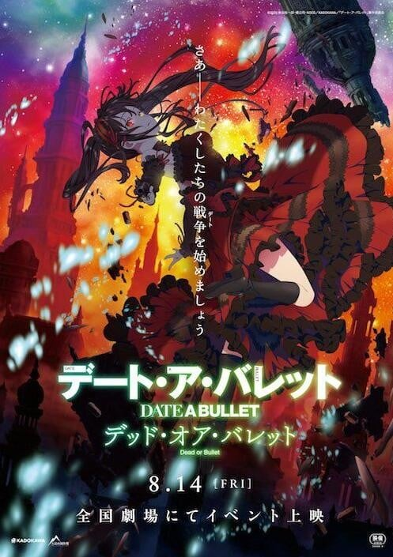

> [!bookinfo|noicon]+ **约会大作战 赤黑新章：虚或实**
> 
>
| 日文名 | デート・ア・バレット デッド・オア・バレット |
|:------: |:------------------------------------------: |
| 类型 | 小说改 |
| 新番 | 2021 年 3 月 |
| 集数 | 共1话 |
| 官网 | [http://date-a-bullet.com/](https://http://date-a-bullet.com/) |
| 制作 | GEEKTOYS |
| 导演 | 中川淳 |
| 脚本 | 東出祐一郎 |
| 评分 | 6.2|
| 制片人 | 奥山真吾,今本尚志 |

> [!abstract]+ **简介**
> 〈最悪の精霊〉時崎狂三　顕界——
 
この世界とは異なる隣界より顕現し、地上に厄災をもたらす精霊と呼ばれる少女たち——

或る者は無垢であり、或る者は救いを求め、そして或る少女は己の目的のため、自らの心を殺し続けた——

第３の精霊、コードネーム<ナイトメア>。

時間を操る規格外に強大な天使<刻々帝（ザフキエル）>を行使し、その行動、思想、そして目的に至るまで数多の謎を抱えた最悪の精霊・時崎狂三——

彼女が舞い降りたのは、人間も、精霊すらも存在しない隣界の片隅だった……

全世界シリーズ累計発行部数６００万部の大人気ライトノベル『デート・ア・ライブ』。

その中でも異色の存在感を誇る時崎狂三のスピンオフ作品が新作アニメ化！

彼女の左眼に刻まれる狂三だけの戦争(デート)の引鉄が今、引かれる——

> [!tip]+ **章节列表**
>- [ ] 第1话： (2020-08-14)

> [!tip]+ **主要角色**
> 
| 角色 | CV | 简介| 角色图片 |
|:----:|:---:|:---:|:--------:|
| 時崎狂三 | 真田アサミ | 出现于故事中的第3个精灵。识别名为：梦魇（Nightmare）（ナイトメア）。 喜欢的东西是动物，讨厌的东西是人类。 突然转入来禅高中的转校生，一头黑色长发绑成两条马尾，异常长的浏海几乎遮住脸的左半边，皮肤如同珍珠般白晢光滑，在众人前自称精灵。刚开始就对士道异常的亲密。 对杀死人命毫不抗拒，至今已被确认由狂三亲手杀死的人超过一万名以上，但杀死的人几乎都是一些街头流氓和地方混混但未被人所知。被认为是最邪恶的精灵，虽然崇宫真那曾经成功杀死她，但过了一阵子后又会毫发无伤再度出现，而她就一直在杀人与被杀的轮回中徘徊。虽自称自己喜欢杀人也喜欢被杀，但曾因士道的话而产生动摇，而且也曾因看到少年虐待小猫而大发雷霆。 |  |
| 白の女王 | 大西沙織 | 白の女王クイーンと呼ばれている謎の少女。 軍服に身を包み、色違いの両眼オッドアイを有しているということ以外、その存在は謎に包まれている。 今回の殺し合いバトルロイヤルへの参加すらも定かではないが、《第一○領域マルクト》において準精霊と一線を画する存在であることは疑いないようである。 狂三とも、なにやら因縁があるようだが…… |  |
| 緋衣響 | 本渡楓 | 狂三に生命を助けられ、協力者となる準精霊の少女。 大した力はないらしく、指宿パニエからは雑魚呼ばわりされている。 明るく調子がよい性格で、とぼけた部分も多い。 ただ、このバトルロイヤルに生命を賭けるだけの動機も持ち合わせている様子。 終始狂三に振り回されつつも、この隣界のナビゲーター的な役割を担っていくことに。 |  |
| 蒼 | 伊瀬茉莉也 | 巨大なハルバードを携えた準精霊の少女。 その身体能力は準精霊の中でも群を抜いており、ビスケットを砕くかの如く敵を屠る様から『ビスケットスマッシャー』という別称で呼ばれることも。 普段から無口で、何を考えているのか判然としないが、かなりのバトルマニアの模様。 隣界に存在しなくなったとされる、災厄的な力を有した精霊――狂三の出現を歓迎しているような節も…… |  |
| 指宿パニエ | 日高里菜 | 幼い令嬢の様な風体の準精霊。 だが、その見た目とは裏腹に『人形遣いドールマスター』の通称で恐れられる存在でもある。 百を超える人形を個々に使役することが可能で、人形たちは彼女の手足として、統率の行き届いた軍隊と化す。 そういった能力の特異性ゆえか、彼女自身、戦略・智謀に長けているようで、なかなかの策士である様子。 |  |
| 佐賀繰唯 | 瀬戸麻沙美 | 様々な忍の技を駆使する準精霊。 主たる武器は苦無くない。空蝉も使用可能と、まさに外見通り、忍者・くノ一としての能力を有している。 潜伏・幻惑・奇襲……純粋な戦闘力もさることながら、彼女の本当の恐ろしさは、敵の裏をかき、確実性を高めて葬るという、その周到な性格であると言っても過言ではない。 |  |
| 土方イサミ | 藤原夏海 | 身の丈に匹敵するほどの日本刀を得物とする準精霊の少女。 彼女を言い表すなら、まさに『猪突猛進』。秀でた身体能力を駆使し、とにかく斬って斬って斬りまくる。 《第一○領域マルクト》において、音に聞こえた実力者の一人として認められている。 |  |