> [!bookinfo|noicon]+ **苍之骑士团**
> 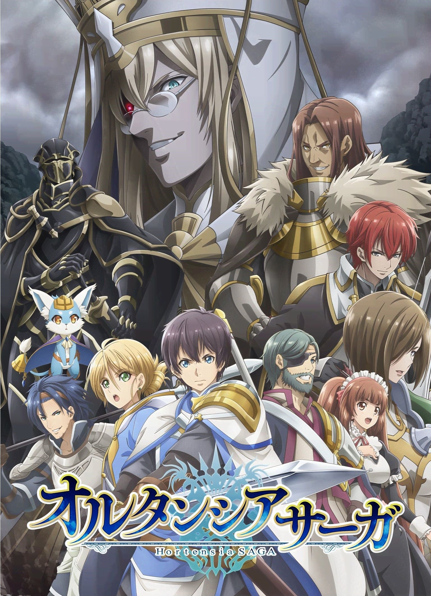
>
| 日文名 | オルタンシア・サーガ |
|:------: |:------------------------------------------: |
| 类型 | 游戏改 |
| 新番 | 2021 年 1 月 |
| 集数 | 共12话 |
| 官网 | [https://animehorsaga.jp](https://https://animehorsaga.jp) |
| 制作 | ライデンフィルム |
| 导演 | 西片康人 |
| 脚本 | 宮尾百合香,佐藤裕,池田臨太郎 |
| 评分 | 5.3|
| 制片人 |  |

> [!abstract]+ **简介**
> 在叶佩特斯半岛上有着700年历史的大国——奥尔坦西亚王国。
由于王国有着富饶的土地而常年受到周边国家的侵略威胁，而王国下属的科美利亚公国和奥维利亚公国则化作剑盾，常年征战沙场，保护人民免受战争的祸乱。
然而，圣王历767年12月5日，科美利亚公国宣布独立并向奥尔坦西亚公开宣战。同时，王国各地开始出现远古传说中的生物和诡异的怪物，自此，奥尔坦西亚王国迎来了混沌的时代……
在这乱世当中，骑士们为了实现自己的宿命而卷入这场动乱的中心。
从一场悲剧开始的关于宿命的继承与斗争的奇幻冒险谭，就此开幕。

> [!tip]+ **章节列表**
>- [ ] 第1话：觉悟 ~与加梅里亚的战斗~ (2021-01-06)
>- [ ] 第2话：记忆 ~玛格尼亚的传说~ (2021-01-13)
>- [ ] 第3话：镇魂 ~前往被隔离的村落~ (2021-01-20)
>- [ ] 第4话：急转 ~迈向混沌的序曲~ (2021-01-27)
>- [ ] 第5话：冲突 ~能守护之物~ (2021-02-03)
>- [ ] 第6话：真伪 ~公主的重担~ (2021-02-10)
>- [ ] 第7话：绝境 ~被揭露的真相~ (2021-02-17)
>- [ ] 第8话：灯火 ~公主的归来~ (2021-02-24)
>- [ ] 第9话：魔女 ~回到过往的试炼~ (2021-03-03)
>- [ ] 第10话：决战 ~向着解放行军~ (2021-03-10)
>- [ ] 第11话：拉锯 ~信念的尽头~ (2021-03-17)
>- [ ] 第12话：约定 ~再一次 于夕阳下的山丘~ (2021-03-24)

> [!tip]+ **主要角色**
> 
| 角色 | CV | 简介| 角色图片 |
|:----:|:---:|:---:|:--------:|
| アルフレッド・オーベル | 細谷佳正 | オルタンシア王国の辺境・オーベル領を治める地方貴族で、この物語の主人公。 3年前のルギス反乱で父・フェルナンドを失い、そのあとを継いで、オーベル領主となった。 口数が少なく、あまり感情を表に出すことはないが性格は優しい。 叔父のモーリスを後見人とし、領主と騎士の仕事をこなす毎日。 | 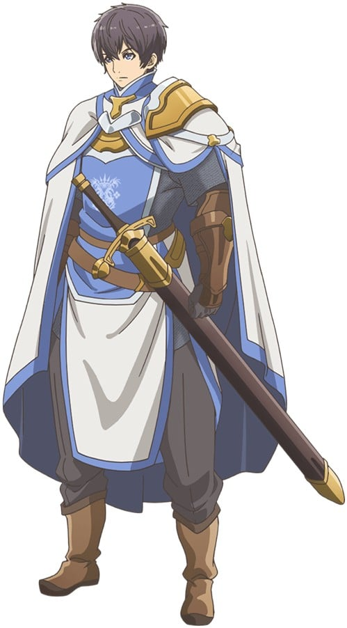 |
| マリユス・カステレード | 堀江由衣 | 3年前、戦火につつまれる王都で、フェルナンドが助けた少年。 戦争孤児となったため、モーリスがオーベルに連れ帰った。気が強く負けず嫌いで、誰に対しても物おじしない性格。 現在は、主人公の従者兼見習い騎士として、共に旅を続けている。 なぜか、オーベルに来る以前のことを話そうとはしない。 | 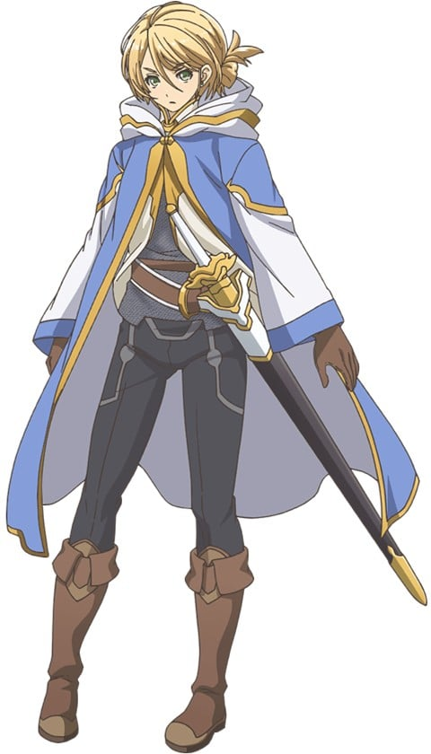 |
| モーリス・ボードレール | 津田健次郎 | 3年前まで、王国騎士団第三兵団隊長を務めていた百戦錬磨の騎士。 当時フェルナンドのサポートを行い王女と王子救出に動くが、その際に片目を負傷してしまう。 性格は豪快で熱血漢であるが、百戦錬磨の騎士でもあり戦闘時には誰よりも冷静である。現在は、オーベルで主人公の父親代わりを勤める。 | 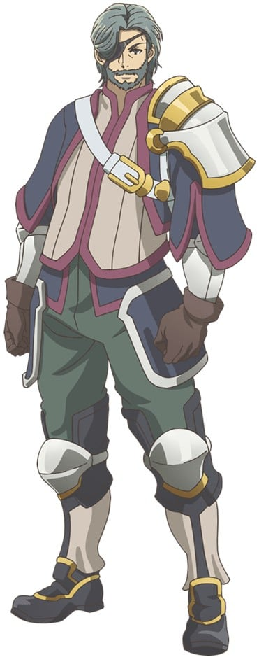 |
| ノンノリア・フォリー | 上田麗奈 | オーベル家に仕える少女。 早くに両親を亡くしたため、主人公の父・フェルナンドが給仕として引き取った。いつも明るく、素直な性格。家事全般をこなすだけでなく、主人公とともに密かに剣の修行もしている。 何ごとにも一生懸命だが、逆にそれがあだとなり、トラブルメーカーとなってしまうことも……。 | 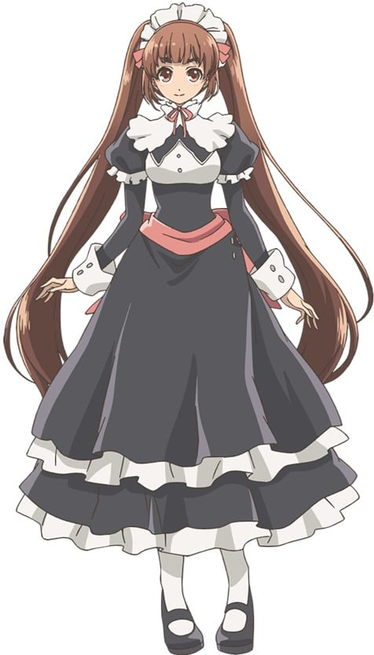 |
| クー・モリモル | 内田彩 | 人間の言葉を話す謎の生き物。 一説によるとオルタンシアの王族を守護する精霊とも言われているが……尻尾に付いた鈴は、特別な時にのみ鳴り響くという。 |  |
| デフロット・ダノワ | 梅原裕一郎 | オルタンシア辺境にあるペタル村出身の青年。 村を出て賞金稼ぎをしながら旅していたが、故郷で原因不明の奇病が発生したと聞きつけ帰郷する。 性格はやんちゃで常に楽観的。女性に目がなく、美人を見たら口説くのが礼儀だと考えている。 剣は自己流だが、意外と勘がよいとモーリスからは評されている。 | 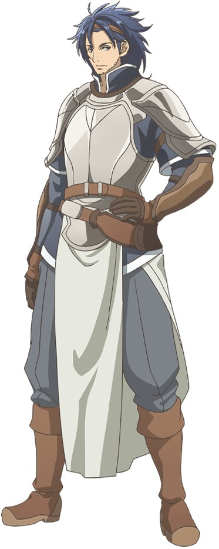 |
| アーデルハイド・オリヴィエ | 小林ゆう | オリヴィエ公国の公爵・レオン公の養女。 女性の身でありながら、神殿騎士にまでのぼりつめたほどの腕を持ち、現在は王国騎士団の総長を務める。自分に厳しく、他人に対しても常に毅然とした態度で接する。 父亡き後、オリヴィエ公国の統治権を、オルタンシア教会に奪われたことを悔やんでいる。 | 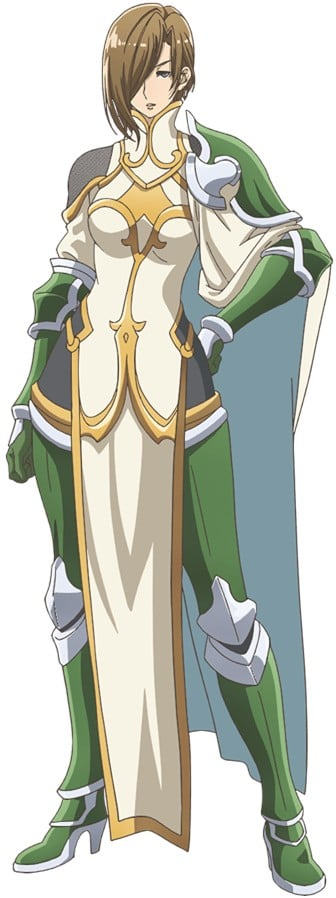 |
| レオン・D・オリヴィエ | 柿原徹也 | オルタンシア王国に仕える二大公国のひとつ、オリヴィエ公国を治める大公にして、王国騎士団最強の「神殿騎士」の肩書きを背負う騎士。 その勇名は近隣諸国のみならず、はるか遠方の国にまで知られているほど。 親友であるルギスに降りかかる苦境に胸を痛め、それを打開するため奔走するが……。 | 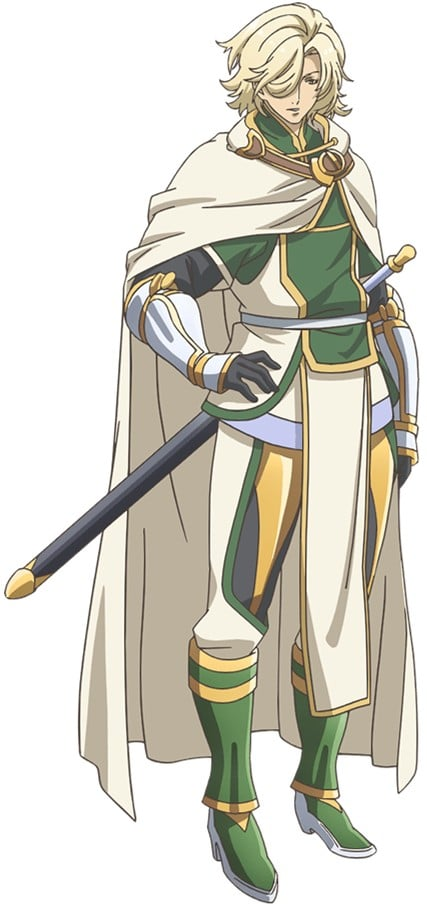 |
| フェルナンド・オーベル | 子安武人 | オルタンシア王国、オーベル領の領主にして王国騎士。そしてその王国騎士の中でも最強と称される「神殿騎士」筆頭の地位にあった偉大な男。 さまざまな事情によりその地位を返上し、国王より預かった自身の領地にて隠居同様の生活を送るようになる。 しかし、その瞳の奥に宿る、情熱の炎は消えてはいない。 | 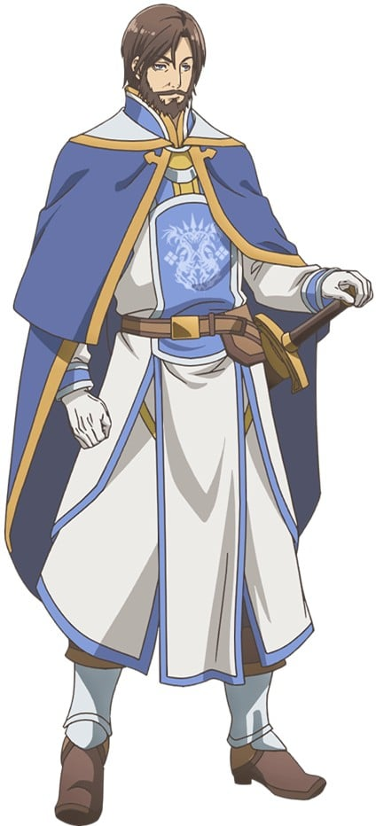 |
| ルギス・F・カメリア | 乃村健次 | オルタンシア王国に仕える二大公国のひとつ、カメリア公国を治める大公。 フェルナンド卿、レオン公と共に最強の「神殿騎士」の一角を担っており、個人の力量においては他のふたりをも凌ぐと言われる。 その武勇と清廉潔白な人柄から、国王と同等以上の支持を領民から受けていた。 聖王暦767年12月5日、王都にて反乱を起こし国王を含む数多くの英雄を殺害。 後にオルタンシア王国からの独立を宣言した。 | 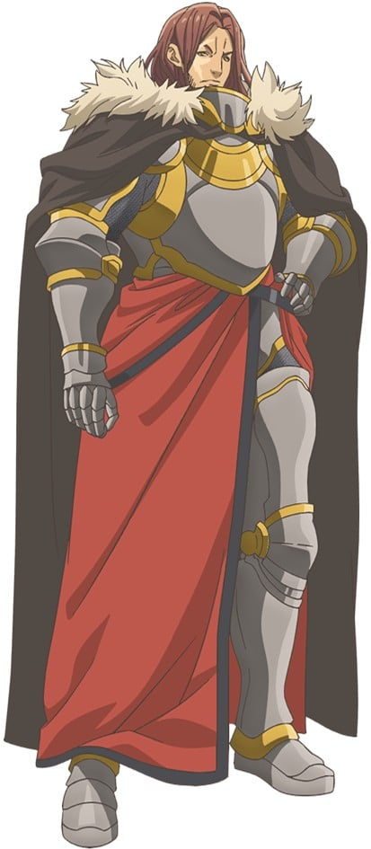 |
| ロイ・バッシュロ | 江口拓也 | 新時代の「神殿騎士」にして、カメリア大公ルギスの腹心。 平民出身の騎士であるという立場の弱さから不当な処罰を受けるも、公明正大を旨とするルギス公に窮地を救われ、以降忠誠を誓う。 自身が仕えるルギス公以上に実直で、場合によっては融通が利かないと評されるほどの真面目な性格をしている。 その技量は神殿騎士の名に恥じぬほどであり、王国随一の弓の使い手とも呼ばれる。 | 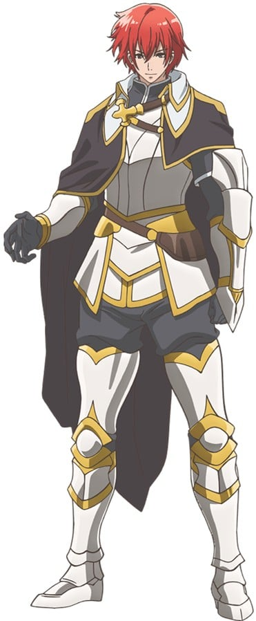 |
| ベルナデッタ・オーベル | 大坪由佳 | オーベル領主の妹にしてフェルナンド・オーベルの娘。 病弱だった母の性質を受け継いでしまい、生まれた時から床に臥せりがちな生活を強いられていた。 馬車の事故に巻き込まれて行方不明となり、死亡扱いとなっている。 | 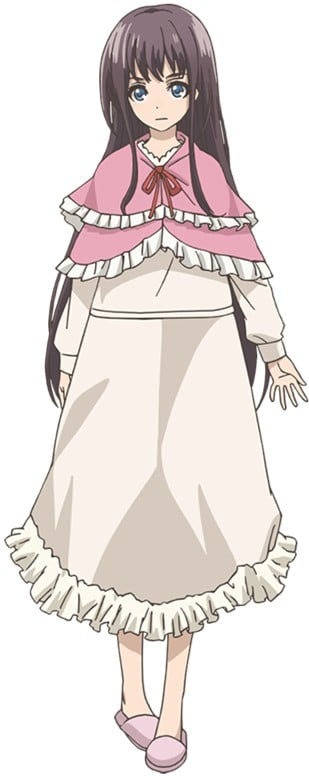 |