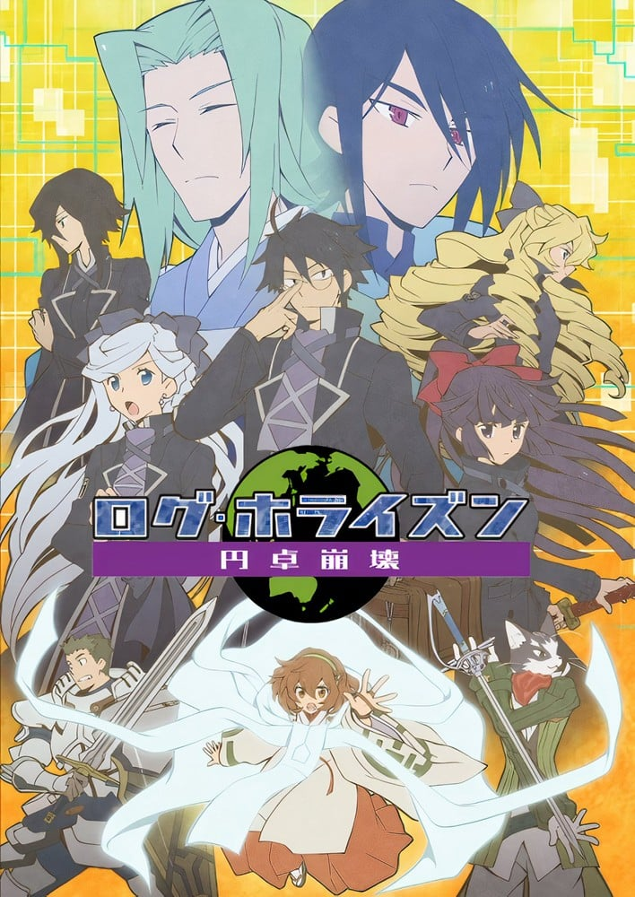

> [!bookinfo|noicon]+ **记录的地平线 圆桌崩坏**
> 
>
| 日文名 | ログ・ホライズン 円卓崩壊 |
|:------: |:------------------------------------------: |
| 类型 | 小说改 |
| 新番 | 2021 年 1 月 |
| 集数 | 共12话 |
| 官网 | [https://www6.nhk.or.jp/anime/program/detail.html?i=loghorizon3](https://https://www6.nhk.or.jp/anime/program/detail.html?i=loghorizon3) |
| 制作 | スタジオディーン |
| 导演 | 石平信司 |
| 脚本 | 大西信介,入江信吾,根元歳三 |
| 评分 | 6.8|
| 制片人 |  |

> [!abstract]+ **简介**
> 某日，数万名玩家突然被困在了网游《幻境神话》的世界里！在这个怪物与魔法真实存在的异世界里，被称作“冒险者”的玩家们陷入了混乱，冒险者都市“秋叶原”也逐渐沦为不法之地。
不善交际的城惠，也是这样的冒险者的一员。但决意改善这一切现状的他，和盟友直继、晓、喵太等人组成了公会“记录的地平线”，并以自己的聪明才智为武器，呼吁冒险者们团结一心。冒险者们的自治组织“圆桌会议”就此成立，为秋叶原恢复了秩序与和平。
通过“圆桌会议”牵头，冒险者们也开始了与游戏世界的原居民“大地人”的交流。贵族代表柯文家的蕾妮希雅公主作为大使出任秋叶原，冒险者与大地人的贵族、商人、普通居民们的交流也愈加活跃。
自从冒险者们被传送到这个世界的“大灾难”以来，已经过了1年时间。在秋叶原表面上的和平与繁荣之下，却藏着新种怪物“典灾”的袭来、东西方贵族的权力斗争、冒险者之间的贫富差距与观念差异等不安的火种。
而终于，冒险者们团结的象征“圆桌会议”迎来了分崩离析的危机……

> [!tip]+ **章节列表**
>- [ ] 第1话：蕾妮希雅结婚 (2021-01-13)
>- [ ] 第2话：秋叶原公爵 (2021-01-20)
>- [ ] 第3话：破裂的圆桌 (2021-01-27)
>- [ ] 第4话：秋叶原大选 (2021-02-03)
>- [ ] 第5话：各自的祝福 (2021-02-10)
>- [ ] 第6话：桃花源的仙君 (2021-02-17)
>- [ ] 第7话：并非诅咒 (2021-02-24)
>- [ ] 第8话：最始的古代种 (2021-03-03)
>- [ ] 第9话：憧憬 (2021-03-10)
>- [ ] 第10话：アキバの迷宮 (2021-03-17)
>- [ ] 第11话：失望の典災 (2021-03-24)
>- [ ] 第12话：夜啼鳥（ナイチンゲール）の唄 (2021-03-31)

> [!tip]+ **主要角色**
> 
| 角色 | CV | 简介| 角色图片 |
|:----:|:---:|:---:|:--------:|
| リ＝ガン | 多田野曜平 | 精灵族，职业为魔法学者。 现任米莱雷克的贤者（ミラルレイクの賢者）。 拥有高深的知识，近30年间都在恒冰古宫廷地下的书斋中研究世界级的魔法。在圆桌会议来到舞滨参见联盟会议时，找到城惠讲述了他对这个世界的研究。 |  |
| シロエ／城鐘恵 | 寺島拓篤 | 作品的男主角。半祖族，主职业为赋予术师，副职业为抄写师。 现实世界中是工学系的大学生。 个性谨慎周到，在"浪荡者的茶会"里有着智库的地位 前期对公会有着不好的回忆。后期由猫太引导，找到人生方向后，成立"纪录者的地平线" 担任公会长，秋叶原公会会馆所有人，圆桌会议11席代表之一 外号："参谋"，"腹黑眼镜"，"东之外抄" 大地人之间称为"大魔术师城惠"(活跃时间长达180多年) 在资深玩家跟大地人的史料之中都是知名人物 |  |
| 直継／葉瀬川直継 | 前野智昭 | 人族，主职业为守护战士，副职业为边境巡视。现实世界中是社会人士。 个性直爽，交际型人物.缺点是爱开黄腔(但是不习惯被人开黄腔)。跟老是以内裤当题材 "浪荡者茶会"的开心果，维系牵绊的存在。因工作退出时，茶会实质等同解散 强调"真正的强并不是等级，而是等级以外的东西" 复归的头一天就遇上大灾难 外号："内裤战士" |  |
| アカツキ／羽倉静 | 加藤英美里 | 人族，主职业为刺客，副职业为追踪者。自称"主公的忍者"，推测与城惠同年。 萝莉体型，初期为"男性"玩家，受城惠给予的限定道具而改变回自身应有的外型 从此以后发誓追随城惠以报答恩情，随着故事的进展而真正的爱上城惠 在"秋叶原的星期天"中与实莉发生城惠争夺战(天秤祭的逛街权) 外号："城惠直属的暗杀者"，"城惠身边的美少女" |  |
| にゃん太 | 中田譲治 | 猫人族，主职业为盗剑士，副职业为厨师。 个性温文儒雅是个绅士，但是发怒时魄力惊人 "秋叶原革命"的关键人物，第一位发现规格外合成法的人。是活化秋叶原经济的幕后推手之一 "浪荡者茶会"和"记录的地平线"众人的咨询对象，年龄为30后半左右的岁数 外号："隐者"，"老师"，"熏银"，"班长" |  |
| トウヤ | 山下大輝 | 人族，主职业为武士，副职业为会计。 等级6级（认识城惠时）→29级（夏季集训时）→34级（城惠使用契约术式时），公会：无（大灾害时）→哈美伦→记录的地平线 与实莉是双胞胎姊弟，实际年龄14岁。 国中生，个性鲁莽，责任感强。现实中双脚不良于行，但作为男子汉而也想尽力照顾姐姐，初期受城惠的指导，后期拜直继为师。 |  |
| ミノリ | 田村奈央 | 人族，主职业神官，副职业为裁缝师(后期转为见习徒弟) 国中生，班长个性，做事仔细小心，顾虑周到(得城惠直传)。 中后期为"纪录的地平线"新米组的后卫战术指挥("朱雀门的鬼祭"大战攻略中发挥实力) |  |
| 五十鈴 | 松井恵理子 | 人族，主职业吟游诗人，类型是指挥家，副职业为游牧民。 等级24级（夏季集训时）→29级（城惠使用契约术式时），公会：无（大灾害时）→哈美伦→三日月同盟→记录的地平线  高中生，现实世界中为管乐队，喜欢各种乐器。由于头发质粗而留成长辫，体型高瘦，个性开朗，不擅长深入的思考。 对伦迪浩斯印象是金毛猎犬，但是喜欢著伦迪浩斯，是第一个发现伦迪浩斯是大地人的冒险者。 |  |
| ルンデルハウス＝コード | 柿原徹也 | 人族，主职业妖术师，副职业为冒险者。 等级23（夏季集训时）→25级（城惠使用契约术式时），公会：无→记录的地平线 通称伦迪（ルディ），金发碧眼的美男子。自尊心高，被周围的人当作笨蛋而接受，但对自己的错误会坦承道歉，个性直率。 大地人出身，却一直仰慕冒险者的自由作风。偷偷参加“圆桌会议”举办的夏季集训，对自我能力的要求很高而非常努力训练。 |  |
| マリエール／坂本鞠絵 | 原由実 | 中小型公会「三日月同盟」的会长。精灵族。主要职业为牧师，副职业为木匠。 圆桌会议11席代表之一 现实中是家管，大阪人女校出生，个性豪放。与荷丽艾塔是手帕交 "秋叶原的向日葵"，"三日月同盟的太阳" |  |
| ヘンリエッタ／梅子 | 高垣彩陽 | 人族，主职业为吟游诗人，类型是指挥家，副职业为会计。等级90。 人族，“三日月同盟”的会计，现实世界中也是会计，家族有投资金融事业。与玛莉艾儿是现实中高中时代就认识的好朋友。非常喜欢晓这样的可爱女孩。 虽对城惠抱有好感，却认为城惠身边已有晓与实莉，而不打算表露心意。 现实世界的本名为“梅子（梅子（うめこ））”。 “秋叶原的铃兰”，“三日月同盟的月亮”。 |  |
| セララ | 久野美咲 | 人族，主职业为德鲁伊，副职业为家管员。等级19（大灾害时）→25级（夏季集训时）→30级（城惠使用契约术式时）。 在故事开始时被困于薄野并遭受布里甘提亚的欺凌，被喵太所救直到城惠前来救援。 在“三日月同盟”中负责照顾新手玩家，很得周围人们的信赖。 对喵太抱持着恋慕之情，自认为没有表露，但实际上只有喵太不知情外外人都已知道，经常跟随喵太。 |  |