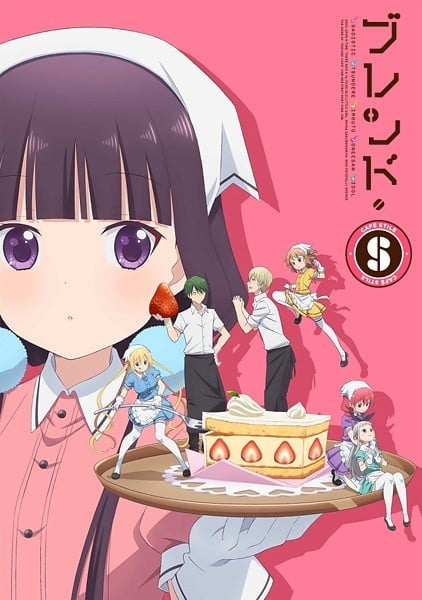

> [!bookinfo|noicon]+ **调教咖啡厅**
> 
>
| 日文名 | ブレンド・S |
|:------: |:------------------------------------------: |
| 类型 | 漫改 |
| 新番 | 2017 年 10 月 |
| 集数 | 共12话 |
| 官网 | [http://blend-s.jp/](https://http://blend-s.jp/) |
| 制作 | A-1 Pictures |
| 导演 | 益山亮司 |
| 脚本 | 雑破業,益山貴司 |
| 评分 | 6.8|
| 制片人 | 清田穣二 |

> [!abstract]+ **简介**
> 可以享受傲娇、妹妹等等，店员们的各种“属性”的咖啡厅中，新来打工的莓香被店长要求的竟然是“抖S”角色！？
她在努力工作的过程中，意外地觉醒了“抖S”的才能……。
遭到践踏也全部都是褒奖，完全颠倒的工作喜剧！ 

> [!tip]+ **章节列表**
>- [ ] 第1话：第一次的抖S (2017-10-07)
>- [ ] 第2话：无仁义的甜点 (2017-10-14)
>- [ ] 第3话：约会之后是18禁 (2017-10-21)
>- [ ] 第4话：后辈是姐姐（健全） (2017-10-28)
>- [ ] 第5话：雨后感冒 (2017-11-04)
>- [ ] 第6话：水边逸事（已成年） (2017-11-11)
>- [ ] 第7话：香蕉、草莓，忙死人 (2017-11-18)
>- [ ] 第8话：偶像属性也有哦 (2017-11-25)
>- [ ] 第9话：主人就任，姐姐来袭 (2017-12-02)
>- [ ] 第10话：我·来·教·你♡ (2017-12-09)
>- [ ] 第11话：傲娇拿手，壁咚无力 (2017-12-16)
>- [ ] 第12话：最喜欢了！ (2017-12-23)

> [!tip]+ **主要角色**
> 
| 角色 | CV | 简介| 角色图片 |
|:----:|:---:|:---:|:--------:|
| 大宮忍 |  | 艾莉丝在日本寄宿家庭的女儿。绰号“小忍”。国中时曾寄住在艾莉丝家。 外表为黑发、黑色瞳孔的典型日本人，西装制服穿的很整齐。 个性沉稳，不太受到外在事物影响。连和朋友说话都很客气。 很喜欢外国文化，不过感受性相当奇怪。有很多洋装，自己很喜欢穿，也很喜欢让艾莉丝穿。未来的梦想是翻译人员，但是英文却很差，她的朋友和老师都很担心。 |  |
| 滝本ひふみ |  | 　　役職：キャラクターデザイナー 　　人と喋るのが苦手で、社内での会話も主にメッセで行う。そのメッセでは打って変わってフランクな口調となり、顔文字も多用する。 　　年齢は不明。家で宗次郎という名前のハリネズミを飼っており、小動物的なところが似ている青葉には妙な親近感を覚えている。 |  |
| 桜ノ宮苺香 | 和氣あず未 | 抖S角色担当。16岁。性格认真且礼貌。  目つきが悪いせいで、バイトの面接に受からないと悩んでいたが、 店長に誘われ「スティーレ」で働くことに。海外留学が夢。 |  |
| 日向夏帆 | 鬼頭明里 | 傲娇角色担当。17岁。头发是金发双马尾。  金髪ツインテとスタイルの良さで人気の高校生店員。 実はゲームが大好きで、金欠になってしまうことも。 |  |
| 星川麻冬 | 春野杏 | 妹妹角色担当。头发是茶色的短发。  見た目は幼いが、実は大学生。普段は落ち着いているが、 仕事になるとキラキラな妹キャラに。キッズアニメが好き。 |  |
| 天野美雨 | 種﨑敦美 | 姐姐角色担当。漫画作家，是“花园文件”的社团的主催者。  普段は眼鏡をかけており、同人活動をしている。 優しいお姉さん属性担当だが、意外とノリがいい性格。 |  |
| 神崎ひでり | 徳井青空 | 伪娘偶像角色担当。  可愛いアイドルになるのが夢の僕っ子店員。 見た目もまるでお人形さんのようだが、実は…？ |  |
| ディーノ | 前野智昭 | 店长兼厨房担当。意大利出身。  苺香をスカウトした「スティーレ」の店長でイタリア人。 興奮すると鼻血が出てしまう癖がある。 |  |
| 秋月紅葉 | 鈴木達央 | 厨房担当。发色是草色。  「スティーレ」のキッチン担当。女の子同士の触れ合いに 神秘と可能性を感じる百合好き男子。 |  |
| オーナー | 鈴木達央 | 大型犬和哈士奇的混种狗。名字是莓香以店长是它的食客而起名的。氛围和莓香很像，但是其实是雄的。是只莓香捡来带到店里的弃犬，因为莓香的哥哥和姐姐不擅长对狗，绕了一圈之后最后让迪诺去养了。 |  |
| 桜ノ宮愛香 | 松嵜麗 | 樱之宫莓香的姐姐。 |  |