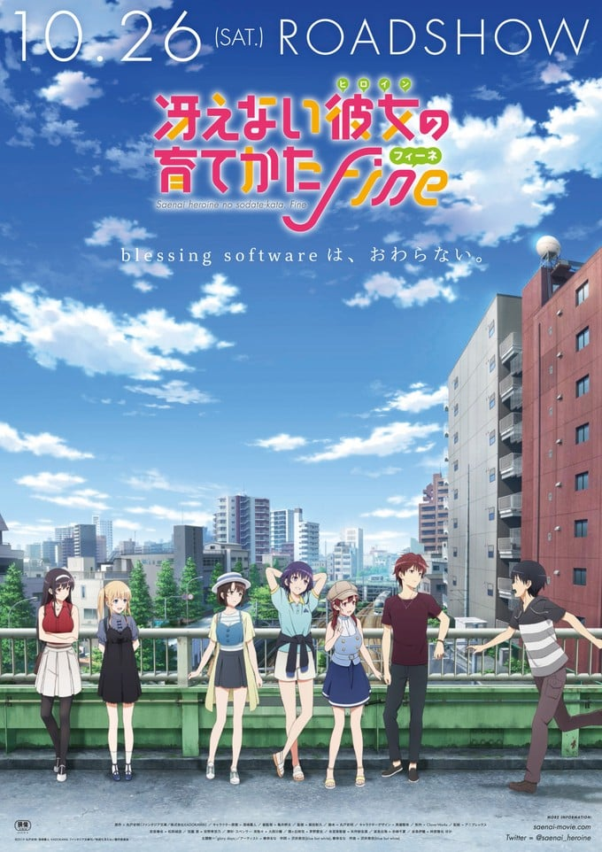
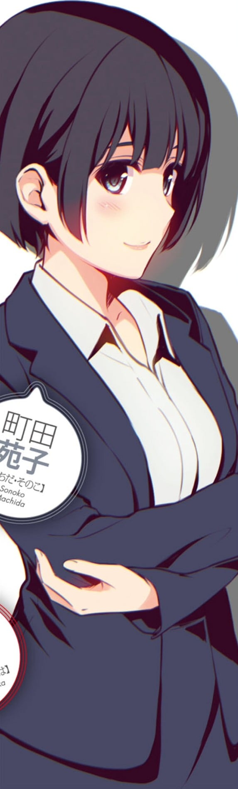

> [!bookinfo|noicon]+ **路人女主的养成方法 Fine**
> 
>
| 日文名 | 冴えない彼女の育てかた Fine |
|:------: |:------------------------------------------: |
| 类型 | 小说改 |
| 新番 | 2019 年 10 月 |
| 集数 | 共1话 |
| 官网 | [https://saenai-movie.com/](https://https://saenai-movie.com/) |
| 制作 | CloverWorks |
| 导演 | 柴田彰久 |
| 脚本 | 丸戸史明 |
| 评分 | 7.7|
| 制片人 | 辻俊一 |

> [!abstract]+ **简介**
> 某个春天的日子，安艺伦也决定做一部以在樱花飞舞的坡道上命中注定般相遇的少女——加藤惠为女主角的同人游戏。邀请了加入了美术部、作为同人插画家活动的泽村·斯潘塞·英梨梨，以及学年第一的优等生、作为轻小说作家活跃的霞之丘诗羽，成立了blessing software。终于发表了第一部作品。
英梨梨和诗羽为了开发游戏大作《Fields Chronicle》，来到了人气创作者红坂朱音的身边。blessing software的代表伦也继续进行社团活动，与副代表惠一起开始了新作的开发。启用学妹波岛出海为插画师，委托出海的哥哥——伊织为制作人，和冰堂美智留以及她的乐队——icy tail一起进行新作的开发……
英梨梨和诗羽的大作究竟如何？伦也和惠的关系有什么异变？blessing software究竟将去向何方？围绕路人女主的青春涂鸦，迎来大结局。

> [!tip]+ **章节列表**
>- [ ] 第1话：路人女主的养成方法 Fine (2019-10-26)

> [!tip]+ **主要角色**
> 
| 角色 | CV | 简介| 角色图片 |
|:----:|:---:|:---:|:--------:|
| 霞ヶ丘詩羽 | 茅野愛衣 | 安艺伦也的学姐，就读同校3年C班。留一头黑色长发、戴着白色发箍，看起来文静的美少女，但时常有劲爆的发言。她以笔名“霞诗子”所写的轻小说《恋爱节拍器》（恋するメトロノーム）由不死川书店的Fantastic文库发行共五集，合计销售破50万册。同人游戏社团“Blessing software”，负责脚本创作。     对男主角的称呼为伦理同学，不过有时候，例如害羞的时候，也会称呼男主角伦也学弟。 |  |
| 澤村・スペンサー・英梨々 | 大西沙織 | 日英混血，父亲是英国外交官，母亲是日本人，身材娇小，留着金色的双马尾。就读同校2年G班，是美术部的王牌，原本参加同人游戏社团“egoistic-lily”，笔名“柏木英理”（柏木 エリ）。应安艺伦也的请求加入同人游戏社团“Blessing software”，负责角色设定及原画。     跟安艺伦也自国小便认识。     隐性宅，在学校是外表光鲜亮丽的美少女公主，在家工作时则是不修边幅的邋遢模样。     对男主角的称呼为伦也。 |  |
| 加藤恵 | 安野希世乃 | 安艺伦也的同班同学，9月23日出生，是个平凡没有存在感的女孩，但仔细看是个可人儿，起初留着鲍伯头，后来留长头发并束成马尾。被就读医学院的堂哥加藤圭一误以为与安艺伦也是男女朋友。受安艺伦也的请求担任同人游戏的女主角。     有位将结婚的姊姊。     对男主角的称呼为安艺。 |  |
| 安芸倫也 | 松岡禎丞 | 本作的男主角，12月18日出生，是爱好ACG的御宅族，同人游戏社团“Blessing software”的制作人兼导演。就读丰之崎学园2年B班，在校成绩平平，但获学校准许打工。一年级时为了在校庆上播放动画而跑教师办公室与教务主任力争许可，还惊动校长，成为校内屈指可数的名人之一。     有很强的行动力。除了课业外，只要认定要做的事情就会全力以赴。 |  |
| 波島出海 | 赤﨑千夏 | 单行本第三集新登场的人物，就读国中三年级，身材娇小、留着双马尾却拥有巨乳。是安艺伦也的儿时玩伴，同样也参与同人志创作。     具有很强的同人志创作才能，甚至曾引起英梨梨的嫉妒，不过由于不擅长宣传所以读者群偏小。     对男主角的称呼为伦也学长。 |  |
| 氷堂美智留 | 矢作紗友里 | 单行本第四集新登场的人物，与安艺伦也就读不同的学校，身材高佻，留着短发。参加“icy tail”乐团，会弹奏吉他、歌唱以及作曲。在同人游戏社团“Blessing software”负责音乐制作。     属于只要投身进去，就立刻能在该领域有出色表现的奇才，不过兴趣在加入乐团之前时常转变。对于御宅文化抱有一定的偏见和无法理解。     和男主角同年同月同日甚至同间医院出生，被霞之丘诗羽形容为君临于顶点的原始级青梅竹马。     对男主角的称呼为阿伦。 |  |
| 波島伊織 | 柿原徹也 | 出海的哥哥，有着以男性而言显得略尖、却又清澈明亮的声音。并留着每个月都少不了要去理发厅报到的轻盈褐色卷发。 与伦也是同学年，两人是在中学一年级时认识，是个与俊帅外表不同、凌驾于伦也之上的御宅族。 认识许多大牌的同人作家、商业领域的知名漫画家、动画家、乃至于顶着导演或董事长头衔的大人都认识好几位。而且连初次见面的大人物，他都能亲昵地向对方攀谈并且博得好感，社交技能特异绝伦。 但本质上是个会把人分为“用得上”和“用不上”的同人投机客，在相处过段时间后认清其真面目的伦也便选择与他疏远。不过伦也并未向出海揭露此事。 现在是著名同人社团‘rouge en rouge’的第二任代表。 |  |
| 姫川時乃 | 鈴木絵理 | ‘icy tail’的吉他手，昵称为“小时”，美智留未加入之前也兼任主唱。 个子娇小并绑着侧马尾。 初次Live前一直向美智留隐藏自己的御宅族兴趣。实际上是声优宅、声优演唱会的常客，擅长御宅艺。将来的愿望是替声优伴奏。 |  |
| 水原叡智佳 | 田辺留依 | ‘icy tail’的贝斯手，昵称为“叡智佳”。 留着短发并有着雀斑。 初次Live前一直向美智留隐藏自己的御宅族兴趣。实际上是NICONICO动画重度爱好者，有着交往的男友是VOCALOID作曲家的传言。 因为会写程式码，所以被伦也在星期天抓来帮忙而不得不取消约会，因此怨念很强。 |  |
| 森丘藍子 | 大地葉 | ‘icy tail’的团长与鼓手，昵称为“蓝子”。 长发绑成两束，性格冷静寡言。 初次Live前一直向美智留隐藏自己的御宅族兴趣。实际上是动画宅，在迷上某部乐团类动画的时候，因为喜欢的角色是鼓手，也开始拿起鼓棒担任鼓手。 |  |
| 紅坂朱音 | 生天目仁美 | ‘rouge en rouge’的创设者，初代代表者。 |  |
| 町田苑子 | 桑島法子 | 隶属于不死川Fantastic文库，是霞之丘诗羽的编辑。称呼霞之丘诗羽为「诗酱（詩（しー）ちゃん）」。 |  |