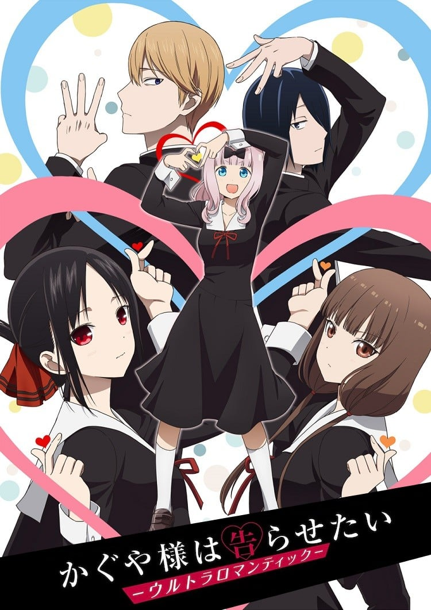

> [!bookinfo|noicon]+ **辉夜大小姐想让我告白-超级浪漫-**
> 
>
| 日文名 | かぐや様は告らせたい-ウルトラロマンティック- |
|:------: |:------------------------------------------: |
| 类型 | 漫改 |
| 新番 | 2022 年 4 月 |
| 集数 | 共13话 |
| 官网 | [https://kaguya.love/3rd/](https://https://kaguya.love/3rd/) |
| 制作 | A-1 Pictures |
| 导演 | 小俣真一,畠山守(小俣真一) |
| 脚本 | 中西やすひろ(1,2,5,6,9,10,12,13)、菅原雪絵(3,4,7,8,11),菅原雪絵,中西やすひろ |
| 评分 | 8.3|
| 制片人 | 菊池雄一郎 |

> [!abstract]+ **简介**
> 秀知院学园是秀才云集的菁英学校，在学生会中担任学生会副会长·四宫辉夜遇见了学生会长·白银御行。
原以为这两个任谁都觉得很登对的天才应该很快就会在一起，但这两人却因为过高的自尊心导致他们终没能向对方告白。
“该用什么办法才能让对方向自己告白呢？”在这场恋爱头脑战中用尽各种智慧谋略、身经百战的两人，各自在心中下了某个决心。
在秀知院学园高中部的文化祭“奉心祭”的最终日到来前，两人的恋情将会出现巨大的进展。

> [!tip]+ **章节列表**
>- [ ] 第1话：伊井野想要被治愈 / 辉夜大小姐没有察觉到 / 藤原千花想要战斗 (2022-04-08)
>- [ ] 第2话：白银御行想要撮合 / 辉夜大小姐想带出去 / 辉夜大小姐想要阻止 (2022-04-15)
>- [ ] 第3话：柏木渚想诛杀 / 四条真妃想做点什么 / 白银御行想要被信任 (2022-04-22)
>- [ ] 第4话：四宫辉夜的无理难题 燕的子安贝篇1 / 石上优想要回应 / 藤原千花想住下 (2022-04-29)
>- [ ] 第5话：藤原千花想要铭记于心 / 早坂爱想说话 / 四条真妃想依赖 (2022-05-06)
>- [ ] 第6话：学生会想前进 / 白银御行想让人告白② / 白银御行想让人告白③ (2022-05-13)
>- [ ] 第7话：伊井野弥子无法去爱① / 想要谈谈文化祭 / 白银御行想吹气球 (2022-05-20)
>- [ ] 第8话：白银圭想卖弄 / 关于四宫辉夜② / 辉夜大小姐想要告白 (2022-05-27)
>- [ ] 第9话：一年级的学生 春天 / 辉夜大小姐的文化祭 / 石上优的文化祭 (2022-06-03)
>- [ ] 第10话：慎原梢想玩耍 / 藤原千花想揭穿 / 白银御行的文化祭 (2022-06-10)
>- [ ] 第11话：白银御行想让她告白4 / 子安燕想要拒绝 / 白银御行想让她告白5 (2022-06-17)
>- [ ] 第12话：辉夜大小姐想要告白② / 辉夜大小姐想要告白③ / “双告白”前篇 (2022-06-24)
>- [ ] 第13话：“双告白”后篇 / 秀知院后夜祭 (2022-06-24)
>- [ ] 第0话：TOKYO ROMANTIC NIGHT (2022-04-02)
>- [ ] 第1话：ティザーPV 「石上優は語りたい」 (2021-10-21)

> [!tip]+ **主要角色**
> 
| 角色 | CV | 简介| 角色图片 |
|:----:|:---:|:---:|:--------:|
| 四宮かぐや | 古賀葵 | 本作的主角。秀知院学园高中部2年A班的女学生，担任学生会副会长。参加的社团是弓道部。 四大财阀之一，四宫集团的千金。  万能型的天才，但是不谙世故，无意识中会瞧不起人。 想告诉白银御行他和猫耳很般配。 |  |
| 白銀御行 | 古川慎 | 本作的另一个主角。秀知院学园高中部2年B班的男学生，担任学生会的会长，有着凶恶的眼神。 和父亲妹妹三人一起生活，妹妹白银圭在秀知院学园初中部就读。 可以说是努力中毒的努力型天才。 一天学习十小时，剩下的时间用来打工。 想告诉四宫辉夜她和猫耳很般配。 |  |
| 藤原千花 | 小原好美 | 本作的女主角，高中部2年B班的女学生，担任学生会书记。桌游部所属，三姐妹中的次女。 |  |
| 石上優 | 鈴木崚汰 | 本作的里主角，高中部一年级的男学生，担任学生会会计。玩具公司家的次子。 |  |
| 早坂愛 | 花守ゆみり | 高中部2年A班的女学生，四宫集团高管的女儿，在四宫家担任辉夜的侍女。 有着四分之一的爱尔兰血统。 出生于代代对四宫家效忠的家系，从小就开始服侍辉夜，与辉夜有着姐妹般的关系。 |  |
| 柏木渚 | 麻倉もも | 高中部2年B班的女学生，志愿者部部长，大型造船公司会长的女儿，成绩非常优秀。 |  |
| 田沼つばさ | 八代拓 | 秀知院学园高中部2年级B班。名字[s]柏木[/s]翼在漫画第99话判明，全名田沼翼在漫画第137话判明。 医院院长的儿子，名医田沼正造的孙子，继承人。隶属于志愿者部。 |  |
| 白銀圭 | 鈴代紗弓 | 御行的妹妹，初中部二年级，在初中部的学生会担任会计。 |  |
| 白銀の父 | 子安武人 | 职业不定，因为工厂经营失败，七年前妻子离家出走，现在和两个孩子住在月租五万日元的公寓中。 |  |
| 四条眞妃 | 市ノ瀬加那 | 高中部2年B班的女学生，四宫家分家，与本家的辉夜关系不佳，表面很傲慢，实则性格活泼纤细，被石上称为“傲娇前辈”，拥有仅次于白银和辉夜名列年级第三的学力。 |  |
| 伊井野ミコ | 富田美憂 | 本作の裏ヒロイン。  私立秀知院学園高等部1年B組で風紀委員と生徒会の会計監査を兼任している。 |  |
| 子安つばめ | 福原遥 | 秀知院学园高中部三年级女学生，新体操部成员，体育祭红组应援团副团长。才貌双全，为人体贴善良，为众多男学生的梦中情人。 |  |