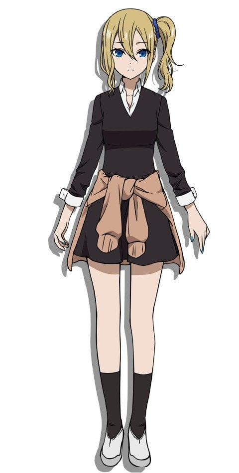
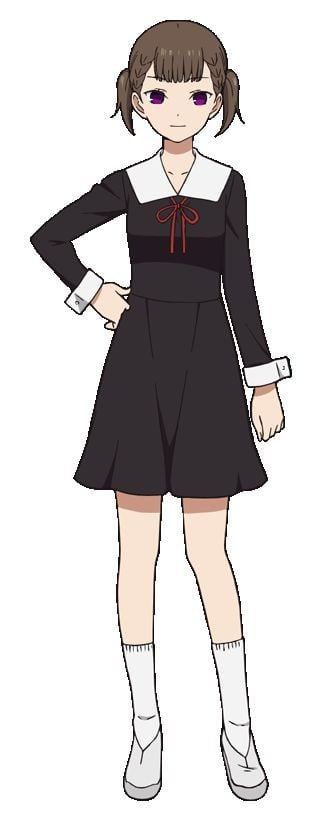

> [!bookinfo|noicon]+ **辉夜大小姐想让我告白 通往大人的阶梯**
> 
>
| 日文名 | かぐや様は告らせたい 大人への階段 |
|:------: |:------------------------------------------: |
| 类型 | 漫改 |
| 新番 | 2025 年 12 月 |
| 集数 | 共2话 |
| 官网 | [https://kaguya.love/](https://https://kaguya.love/) |
| 制作 | A-1 Pictures |
| 导演 | 小俣真一,畠山守(小俣真一) |
| 脚本 |  |
| 评分 | 8.3|
| 制片人 | 菊池雄一郎 |

> [!abstract]+ **简介**
> "每一处都令人怀念，而所有的一切都是无可替代的重要回忆。" 这里是聚集秀才的精英学校——秀知院学园。在该校学生会相遇的副会长四宫辉夜与学生会长白银御行，在经历了漫长的恋爱头脑战后，终于确定了彼此关系……。时光流逝——辉夜独自在房间里翻阅着一本相册。相册中的每一张照片，都记录着她与白银，以及在秀知院学园共度的伙伴们之间点点滴滴的回忆。随着她沉浸在思念之中，一页接一页地翻过。而辉夜的回忆也再次鲜明地浮现在心头……。

[简介原文]
「どれも懐かしくて、全てがかけがえのない大切な思い出。」 

秀才たちが集うエリート校・秀知院学園 
その生徒会で出会った副会長・四宮かぐやと生徒会長・白銀御行。 
2人は長きにわたる恋愛頭脳戦の末、交際することに…… 

月日は流れ、部屋でひとりアルバムを眺めるかぐや。 
そこには、白銀や秀知院学園の仲間と過ごした思い出を収めた写真が並んでいる。 

懐かしさに浸りページをめくる度、かぐやの思い出が蘇る。

> [!tip]+ **章节列表**
>- [ ] 第1话：藤原千花想吓人 / 白银御行想聊天 / 四宫辉夜的无理难题 (2025-12-31)
>- [ ] 第2话：男女ABC / 辉夜姬想聊天 / 辉夜姬想送行 (2025-12-31)

> [!tip]+ **主要角色**
> 
| 角色 | CV | 简介| 角色图片 |
|:----:|:---:|:---:|:--------:|
| 四宮かぐや | 古賀葵 | 本作的主角。秀知院学园高中部2年A班的女学生，担任学生会副会长。参加的社团是弓道部。 四大财阀之一，四宫集团的千金。  万能型的天才，但是不谙世故，无意识中会瞧不起人。 想告诉白银御行他和猫耳很般配。 |  |
| 白銀御行 | 古川慎 | 本作的另一个主角。秀知院学园高中部2年B班的男学生，担任学生会的会长，有着凶恶的眼神。 和父亲妹妹三人一起生活，妹妹白银圭在秀知院学园初中部就读。 可以说是努力中毒的努力型天才。 一天学习十小时，剩下的时间用来打工。 想告诉四宫辉夜她和猫耳很般配。 |  |
| 藤原千花 | 小原好美 | 本作的女主角，高中部2年B班的女学生，担任学生会书记。桌游部所属，三姐妹中的次女。 |  |
| 石上優 | 鈴木崚汰 | 本作的里主角，高中部一年级的男学生，担任学生会会计。玩具公司家的次子。 |  |
| 早坂愛 | 花守ゆみり | 高中部2年A班的女学生，四宫集团高管的女儿，在四宫家担任辉夜的侍女。 有着四分之一的爱尔兰血统。 出生于代代对四宫家效忠的家系，从小就开始服侍辉夜，与辉夜有着姐妹般的关系。 |  |
| 柏木渚 | 麻倉もも | 高中部2年B班的女学生，志愿者部部长，大型造船公司会长的女儿，成绩非常优秀。 |  |
| 田沼つばさ | 八代拓 | 秀知院学园高中部2年级B班。名字[s]柏木[/s]翼在漫画第99话判明，全名田沼翼在漫画第137话判明。 医院院长的儿子，名医田沼正造的孙子，继承人。隶属于志愿者部。 |  |
| 白銀圭 | 鈴代紗弓 | 御行的妹妹，初中部二年级，在初中部的学生会担任会计。 |  |
| 白銀の父 | 子安武人 | 职业不定，因为工厂经营失败，七年前妻子离家出走，现在和两个孩子住在月租五万日元的公寓中。 |  |
| 四条眞妃 | 市ノ瀬加那 | 高中部2年B班的女学生，四宫家分家，与本家的辉夜关系不佳，表面很傲慢，实则性格活泼纤细，被石上称为“傲娇前辈”，拥有仅次于白银和辉夜名列年级第三的学力。 |  |
| 伊井野ミコ | 富田美憂 | 本作の裏ヒロイン。  私立秀知院学園高等部1年B組で風紀委員と生徒会の会計監査を兼任している。 |  |
| 子安つばめ |  | 秀知院学园高中部三年级女学生，新体操部成员，体育祭红组应援团副团长。才貌双全，为人体贴善良，为众多男学生的梦中情人。 |  |