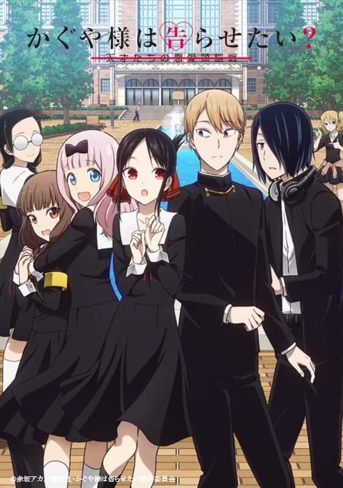
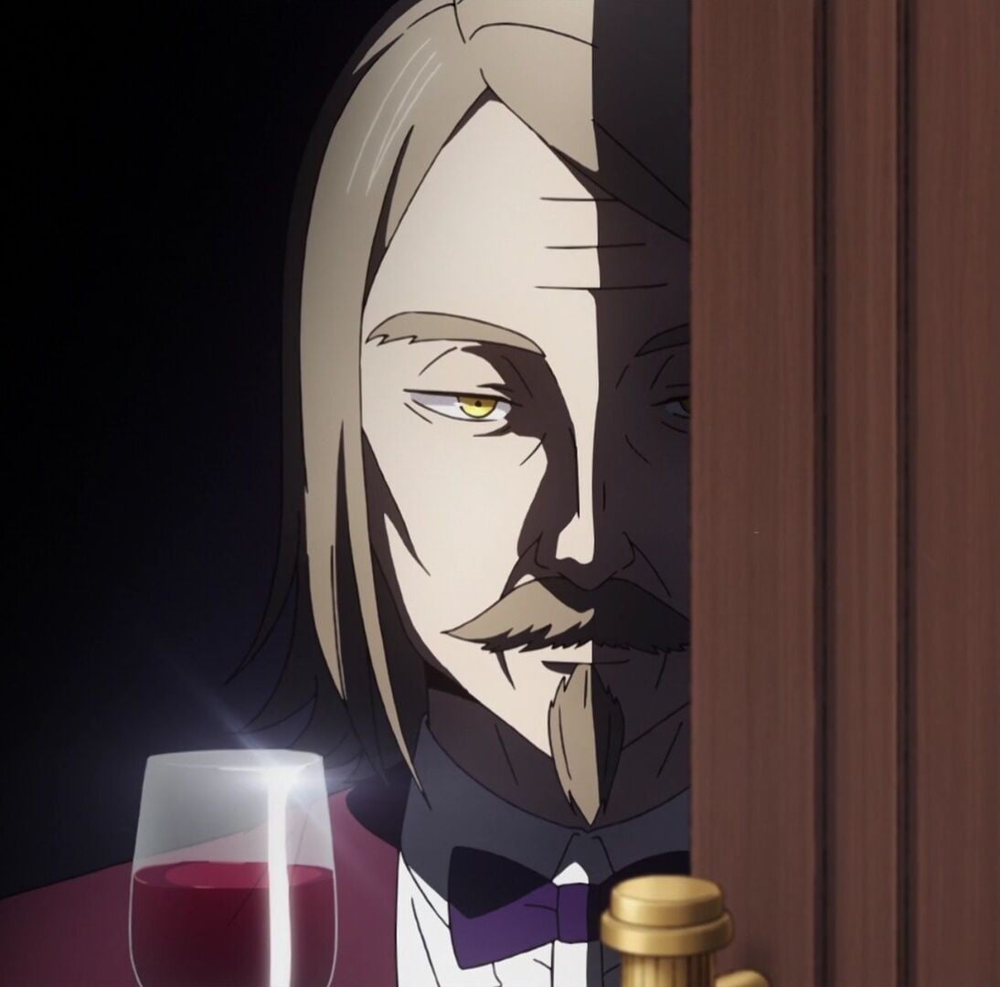

> [!bookinfo|noicon]+ **辉夜大小姐想让我告白?～天才们的恋爱头脑战～**
> 
>
| 日文名 | かぐや様は告らせたい?～天才たちの恋愛頭脳戦～ |
|:------: |:------------------------------------------: |
| 类型 | 漫改 |
| 新番 | 2020 年 4 月 |
| 集数 | 共12话 |
| 官网 | [https://kaguya.love/2nd/](https://https://kaguya.love/2nd/) |
| 制作 | A-1 Pictures |
| 导演 | 小俣真一,畠山守(小俣真一) |
| 脚本 | 中西やすひろ,中西やすひろ(1,2,5,6,9,12)、菅原雪絵(3,4,7,8,10,11),菅原雪絵 |
| 评分 | 7.9|
| 制片人 | 山田賢志郎、菊池雄一郎,菊池雄一郎,山田賢志郎 |

> [!abstract]+ **简介**
> 人才云集的精英校·秀知院学园，在该校的学生会相遇的副会长·四宫辉夜与学生会长·白银御行。
无论任何人都认为十分般配的这两位天才，本以为很快就会喜结良缘，但碍于过高的自尊心而仍然未能告白！
“如何让对方告白”在这样的恋爱头脑战中穷尽智略的两人……
其罕有的知性热失控！已经完全无法控制！
恋爱让天才变成傻瓜！
新感觉“头脑战”？恋爱喜剧，再次开战！

> [!tip]+ **章节列表**
>- [ ] 第1话：早坂爱想要守住 / 学生会没有成神 / 辉夜大小姐想结婚 / 辉夜大小姐想要庆祝 (2020-04-11)
>- [ ] 第2话：辉夜大小姐想问出话 / 辉夜大小姐想要赠送 / 藤原千花想要确认 (2020-04-18)
>- [ ] 第3话：白银御行想仰望 / 第67期学生会 / 辉夜大小姐不想称呼 (2020-04-25)
>- [ ] 第4话：早坂爱想拿下 / 辉夜大小姐想被“告白” / 伊井野想要端正 (2020-05-02)
>- [ ] 第5话：白银御行想受欢迎 / 柏木渚想要安慰 / 白银御行想唱歌 / 辉夜大小姐想踢下去 (2020-05-09)
>- [ ] 第6话：不让伊井野弥子被嘲笑 / 想让伊井野弥子笑 / 辉夜大小姐没被叫到 (2020-05-16)
>- [ ] 第7话：辉夜大小姐想让他脱下 / 辉夜大小姐想让他释放 / 白银御行想让她读 / 辉夜大小姐♡水族馆 (2020-05-23)
>- [ ] 第8话：伊井野弥子想忍住 / 辉夜大小姐不害怕 / 辉夜大小姐想看病 (2020-05-30)
>- [ ] 第9话：于是石上优闭上了双眼② / 辉夜大小姐想要触摸 / 辉夜大小姐不拒绝 (2020-06-06)
>- [ ] 第10话：白银圭不能说 / 白银御行想跳舞 / 大佛小钵想取缔 / 白银父亲想问出来 (2020-06-13)
>- [ ] 第11话：于是石上优闭上了双眼③ / 白银御行和石上优 / 大友京子不曾发现 (2020-06-20)
>- [ ] 第12话：学生会想被拍 / 藤原千花想让它膨胀 (2020-06-27)

> [!tip]+ **主要角色**
> 
| 角色 | CV | 简介| 角色图片 |
|:----:|:---:|:---:|:--------:|
| 四宮かぐや | 古賀葵 | 本作的主角。秀知院学园高中部2年A班的女学生，担任学生会副会长。参加的社团是弓道部。 四大财阀之一，四宫集团的千金。  万能型的天才，但是不谙世故，无意识中会瞧不起人。 想告诉白银御行他和猫耳很般配。 |  |
| 白銀御行 | 大地葉 | 本作的另一个主角。秀知院学园高中部2年B班的男学生，担任学生会的会长，有着凶恶的眼神。 和父亲妹妹三人一起生活，妹妹白银圭在秀知院学园初中部就读。 可以说是努力中毒的努力型天才。 一天学习十小时，剩下的时间用来打工。 想告诉四宫辉夜她和猫耳很般配。 |  |
| 藤原千花 | 小原好美 | 本作的女主角，高中部2年B班的女学生，担任学生会书记。桌游部所属，三姐妹中的次女。 |  |
| 石上優 | 鈴木崚汰 | 本作的里主角，高中部一年级的男学生，担任学生会会计。玩具公司家的次子。 |  |
| 早坂愛 | 花守ゆみり | 高中部2年A班的女学生，四宫集团高管的女儿，在四宫家担任辉夜的侍女。 有着四分之一的爱尔兰血统。 出生于代代对四宫家效忠的家系，从小就开始服侍辉夜，与辉夜有着姐妹般的关系。 |  |
| 柏木渚 | 麻倉もも | 高中部2年B班的女学生，志愿者部部长，大型造船公司会长的女儿，成绩非常优秀。 |  |
| 田沼つばさ | 八代拓 | 秀知院学园高中部2年级B班。名字[s]柏木[/s]翼在漫画第99话判明，全名田沼翼在漫画第137话判明。 医院院长的儿子，名医田沼正造的孙子，继承人。隶属于志愿者部。 |  |
| 白銀圭 | 鈴代紗弓 | 御行的妹妹，初中部二年级，在初中部的学生会担任会计。 |  |
| 白銀の父 | 子安武人 | 职业不定，因为工厂经营失败，七年前妻子离家出走，现在和两个孩子住在月租五万日元的公寓中。 |  |
| 四条眞妃 | 市ノ瀬加那 | 高中部2年B班的女学生，四宫家分家，与本家的辉夜关系不佳，表面很傲慢，实则性格活泼纤细，被石上称为“傲娇前辈”，拥有仅次于白银和辉夜名列年级第三的学力。 |  |
| Adolphe Pescarolo | 山本格 | 私立秀知学园的校长 |  |
| 伊井野ミコ | 富田美憂 | 本作の裏ヒロイン。  私立秀知院学園高等部1年B組で風紀委員と生徒会の会計監査を兼任している。 |  |