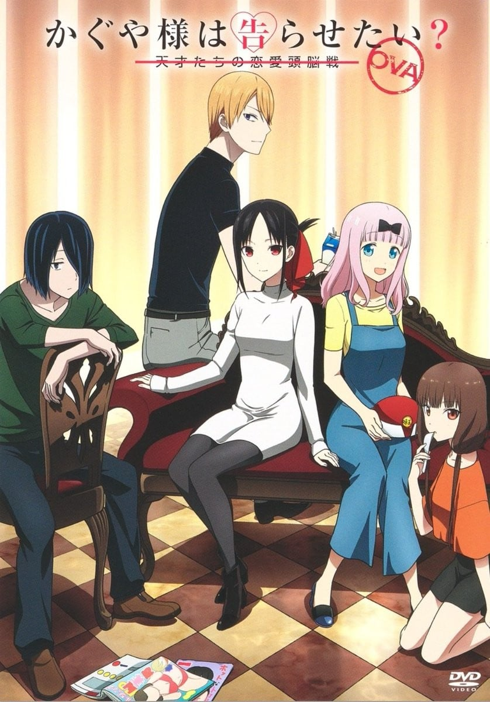
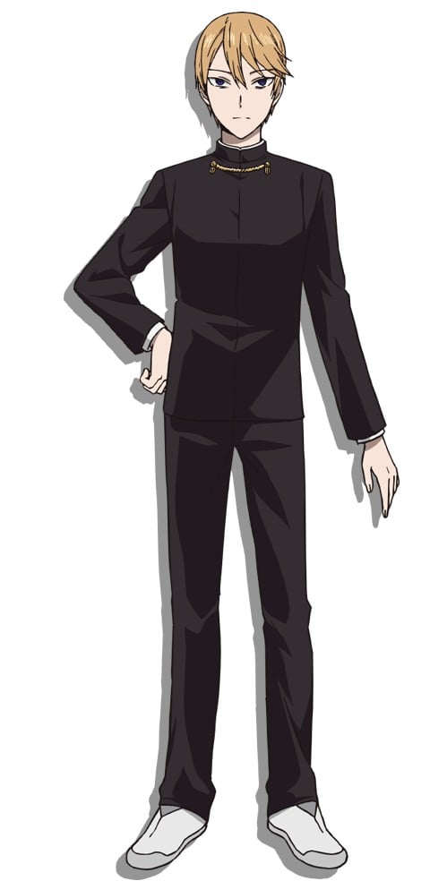
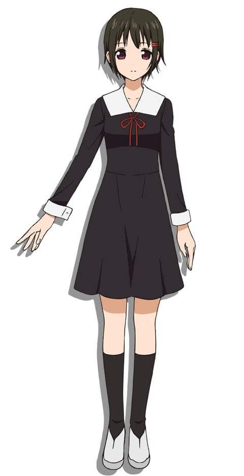
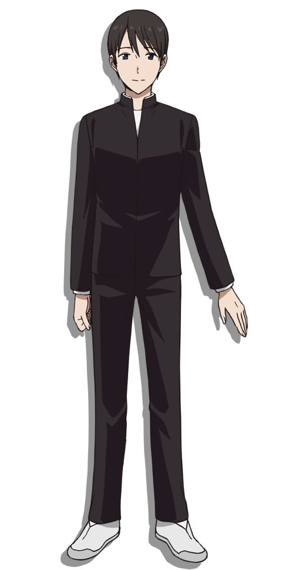
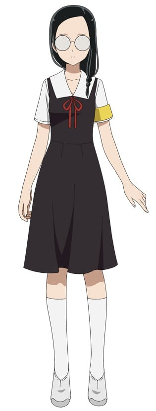

> [!bookinfo|noicon]+ **辉夜大小姐想让我告白？～天才们的恋爱头脑战～ OVA**
> 
>
| 日文名 | かぐや様は告らせたい？～天才たちの恋愛頭脳戦～ OVA |
|:------: |:------------------------------------------: |
| 类型 | 漫改 |
| 新番 | 2021 年 5 月 |
| 集数 | 共1话 |
| 官网 |  |
| 制作 | A-1 Pictures |
| 导演 | 小俣真一,畠山守(小俣真一) |
| 脚本 | 中西やすひろ |
| 评分 | 7.2|
| 制片人 | 山田賢志郎、菊池雄一郎,菊池雄一郎,山田賢志郎 |

> [!abstract]+ **简介**
> かぐや様は告らせたい 第22巻 アニメDVD同梱版 ~天才たちの恋愛頭脳戦~

「かぐや様ダークネスvolume1」プール終わりのシャワー室。水着姿のかぐや・藤原の身に次々と巻き起こるあんなことやこんなこと…！？秀知院学園、とある夏の日の物語。
「かぐや様ダークネスvolume2」コインパーキングでエロ本を見つけた石上と白銀。中を覗くとかぐやや藤原、ミコ似のキャラクターが。エロ本に興味をそそられつつも生徒会メンバーの顔がチラつき我に返り帰路についたと思われた二人だったが…！？
「かぐや様は食べさせたい」突如幕をあけた生徒会ガチンコチャーハン対決。白銀・かぐや・石上が腕をふるう三者三様のチャーハンに審査員の藤原・ミコが舌鼓を打つ。果たして優勝の座は誰の手に！？
©赤坂アカ／集英社・かぐや様は告らせたい製作委員会

> [!tip]+ **章节列表**
>- [ ] 第1话：『Darkness篇／炒饭对决』 (2021-05-19)

> [!tip]+ **主要角色**
> 
| 角色 | CV | 简介| 角色图片 |
|:----:|:---:|:---:|:--------:|
| 四宮かぐや | 古賀葵 | 本作的主角。秀知院学园高中部2年A班的女学生，担任学生会副会长。参加的社团是弓道部。 四大财阀之一，四宫集团的千金。  万能型的天才，但是不谙世故，无意识中会瞧不起人。 想告诉白银御行他和猫耳很般配。 |  |
| 白銀御行 | 大地葉 | 本作的另一个主角。秀知院学园高中部2年B班的男学生，担任学生会的会长，有着凶恶的眼神。 和父亲妹妹三人一起生活，妹妹白银圭在秀知院学园初中部就读。 可以说是努力中毒的努力型天才。 一天学习十小时，剩下的时间用来打工。 想告诉四宫辉夜她和猫耳很般配。 |  |
| 藤原千花 | 小原好美 | 本作的女主角，高中部2年B班的女学生，担任学生会书记。桌游部所属，三姐妹中的次女。 |  |
| 石上優 | 鈴木崚汰 | 本作的里主角，高中部一年级的男学生，担任学生会会计。玩具公司家的次子。 |  |
| 早坂愛 | 花守ゆみり | 高中部2年A班的女学生，四宫集团高管的女儿，在四宫家担任辉夜的侍女。 有着四分之一的爱尔兰血统。 出生于代代对四宫家效忠的家系，从小就开始服侍辉夜，与辉夜有着姐妹般的关系。 |  |
| 柏木渚 |  | 高中部2年B班的女学生，志愿者部部长，大型造船公司会长的女儿，成绩非常优秀。 |  |
| 田沼つばさ |  | 秀知院学园高中部2年级B班。名字[s]柏木[/s]翼在漫画第99话判明，全名田沼翼在漫画第137话判明。 医院院长的儿子，名医田沼正造的孙子，继承人。隶属于志愿者部。 |  |
| 白銀圭 | 鈴代紗弓 | 御行的妹妹，初中部二年级，在初中部的学生会担任会计。 |  |
| 白銀の父 | 子安武人 | 职业不定，因为工厂经营失败，七年前妻子离家出走，现在和两个孩子住在月租五万日元的公寓中。 |  |
| 四条眞妃 |  | 高中部2年B班的女学生，四宫家分家，与本家的辉夜关系不佳，表面很傲慢，实则性格活泼纤细，被石上称为“傲娇前辈”，拥有仅次于白银和辉夜名列年级第三的学力。 |  |
| 伊井野ミコ | 富田美憂 | 本作の裏ヒロイン。  私立秀知院学園高等部1年B組で風紀委員と生徒会の会計監査を兼任している。 |  |
| 大仏こばち | 日高里菜 | 衆知院学年高等部の一年生。石上や伊井野と同じクラスメイトで、丸メガネが特徴。 伊井野ミコとは小等部の頃からの縁で、唯一の親友である。暴走しやすく、一人ぼっちになりがちな伊井野を長らく支えてきた。それ故に一緒にいることが多く、伊井野の扱いは作中で一番慣れている。そんな事情もあってか、過保護にしすぎたせいで、伊井野が成長するチャンスを奪っていたのではないかと悩んでいたらしい。石上の悪い噂には懐疑的であり、応援団のメンバーにフォローをお願いするなど、気配り上手な一面が見て取れる。伊井野のために生徒会選挙の応援演説も務めたが、ぶっちゃけ生徒会には興味がないらしく、現在は風紀委員に所属している。 妄想が激しいのか、手のひらに書いた人に感情移入してしまい、食べられなくなってしまう場面も。イラストを描くのが得意で、本人曰く激しいのも描けるらしい。 こう見えて肉食系女子であり、文化祭を前に応援団の団長とちゃっかり交際している。 |  |