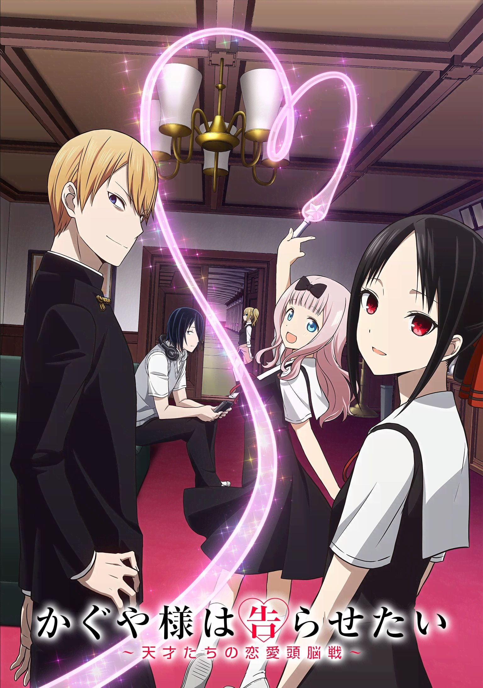
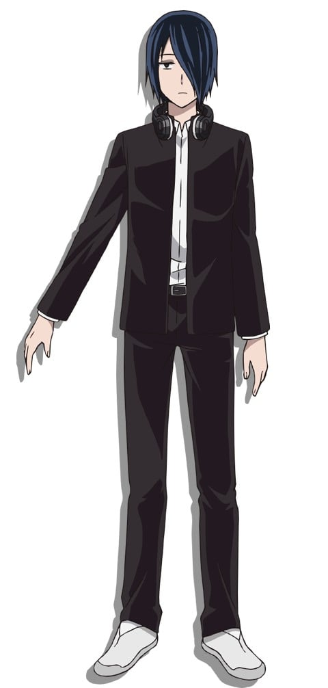
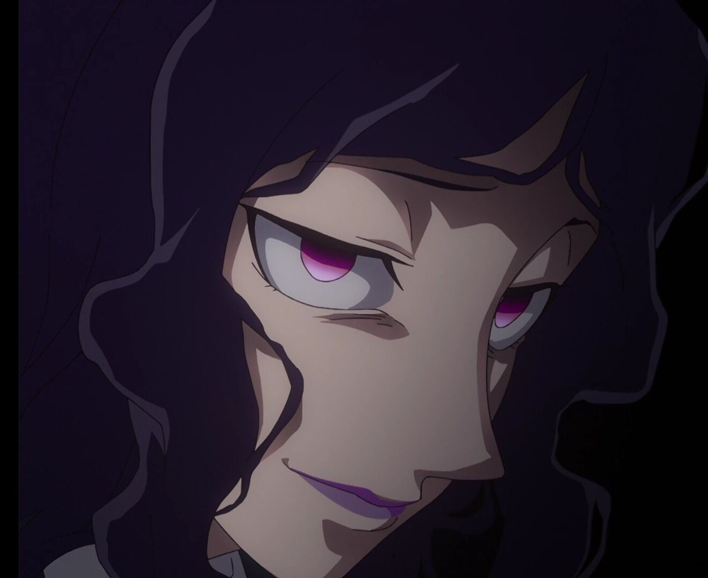

> [!bookinfo|noicon]+ **辉夜大小姐想让我告白～天才们的恋爱头脑战～**
> 
>
| 日文名 | かぐや様は告らせたい～天才たちの恋愛頭脳戦～ |
|:------: |:------------------------------------------: |
| 类型 | 漫改 |
| 新番 | 2019 年 1 月 |
| 集数 | 共12话 |
| 官网 | [https://kaguya.love/1st/](https://https://kaguya.love/1st/) |
| 制作 | A-1 Pictures |
| 导演 | 小俣真一,畠山守(小俣真一) |
| 脚本 | 菅原雪絵,中西やすひろ,中西やすひろ(1,2,5,7,8,10,11)、菅原雪絵(3,4,6,9,12) |
| 评分 | 7.8|
| 制片人 | 山田賢志郎 |

> [!abstract]+ **简介**
> 家庭背景与人品都很棒！！一大群有前途的秀才所聚集的秀知院学园！！在那里的学生会相遇的副会长·四宫辉夜与会长·白银御行原本应该是彼此受到了对方吸引…但想不到都过半年了却仍然什么事情也没发生！！最麻烦的是这两个自尊心超强、无法坦率的家伙，居然开始想着要“设法让对方向自己告白”！？
直到恋情有下落之前会很欢乐的故事！！新感觉“斗智”爱情喜剧、就此开战！！

> [!tip]+ **章节列表**
>- [ ] 第1话：想被邀请看电影 / 辉夜大小姐想要被阻止 / 辉夜大小姐想品尝 (2019-01-12)
>- [ ] 第2话：辉夜大小姐想要交换 / 藤原想出门 / 白银御行想隐瞒 (2019-01-19)
>- [ ] 第3话：白银御行还没体验 / 辉夜大小姐想被猜中 / 辉夜大小姐想走路 (2019-01-26)
>- [ ] 第4话：辉夜大小姐想被欣赏 / 学生会想让别人说出口 / 辉夜大小姐想收到信息 / 白银御行想说话 (2019-02-02)
>- [ ] 第5话：辉夜大小姐想完成任务 / 白银御行想展示 / 辉夜大小姐想一起撑伞 (2019-02-09)
>- [ ] 第6话：石上优想活下去 / 藤原千花想测试 / 辉夜大小姐想被注意到 (2019-02-16)
>- [ ] 第7话：白银御行想工作 / 辉夜大小姐想让人加入 / 辉夜大小姐想忍耐 (2019-02-23)
>- [ ] 第8话：辉夜大小姐想被称呼 / 白银御行不能输 / 然后石上优闭上了眼 (2019-03-02)
>- [ ] 第9话：辉夜大小姐想送人回家 / 藤原千花想去探望 / 关于四宫辉夜的一些事① (2019-03-09)
>- [ ] 第10话：辉夜大小姐不能原谅 / 辉夜大小姐想要原谅 / 白银御行想出门 (2019-03-16)
>- [ ] 第11话：早坂爱想泡澡 / 藤原千花超级想吃 / 白银御行想要遇见 / 听不见烟花的声音 前篇 (2019-03-23)
>- [ ] 第12话：听不见烟花的声音 后篇 / 辉夜大小姐不想回避 (2019-03-30)

> [!tip]+ **主要角色**
> 
| 角色 | CV | 简介| 角色图片 |
|:----:|:---:|:---:|:--------:|
| 四宮かぐや | 古賀葵 | 本作的主角。秀知院学园高中部2年A班的女学生，担任学生会副会长。参加的社团是弓道部。 四大财阀之一，四宫集团的千金。  万能型的天才，但是不谙世故，无意识中会瞧不起人。 想告诉白银御行他和猫耳很般配。 |  |
| 白銀御行 | 古川慎 | 本作的另一个主角。秀知院学园高中部2年B班的男学生，担任学生会的会长，有着凶恶的眼神。 和父亲妹妹三人一起生活，妹妹白银圭在秀知院学园初中部就读。 可以说是努力中毒的努力型天才。 一天学习十小时，剩下的时间用来打工。 想告诉四宫辉夜她和猫耳很般配。 |  |
| 藤原千花 | 小原好美 | 本作的女主角，高中部2年B班的女学生，担任学生会书记。桌游部所属，三姐妹中的次女。 |  |
| 石上優 | 鈴木崚汰 | 本作的里主角，高中部一年级的男学生，担任学生会会计。玩具公司家的次子。 |  |
| 早坂愛 | 花守ゆみり | 高中部2年A班的女学生，四宫集团高管的女儿，在四宫家担任辉夜的侍女。 有着四分之一的爱尔兰血统。 出生于代代对四宫家效忠的家系，从小就开始服侍辉夜，与辉夜有着姐妹般的关系。 |  |
| 柏木渚 | 麻倉もも | 高中部2年B班的女学生，志愿者部部长，大型造船公司会长的女儿，成绩非常优秀。 |  |
| 田沼つばさ | 八代拓 | 秀知院学园高中部2年级B班。名字[s]柏木[/s]翼在漫画第99话判明，全名田沼翼在漫画第137话判明。 医院院长的儿子，名医田沼正造的孙子，继承人。隶属于志愿者部。 |  |
| 白銀圭 | 鈴代紗弓 | 御行的妹妹，初中部二年级，在初中部的学生会担任会计。 |  |
| 白銀の父 | 子安武人 | 职业不定，因为工厂经营失败，七年前妻子离家出走，现在和两个孩子住在月租五万日元的公寓中。 |  |
| 四条眞妃 | 市ノ瀬加那 | 高中部2年B班的女学生，四宫家分家，与本家的辉夜关系不佳，表面很傲慢，实则性格活泼纤细，被石上称为“傲娇前辈”，拥有仅次于白银和辉夜名列年级第三的学力。 |  |
| Adolphe Pescarolo | 山本格 | 私立秀知学园的校长 |  |
| ベルトワーズ・ベツィー | 天城サリー | 法校学生会副会长 |  |