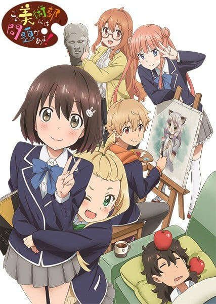
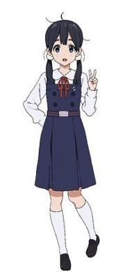
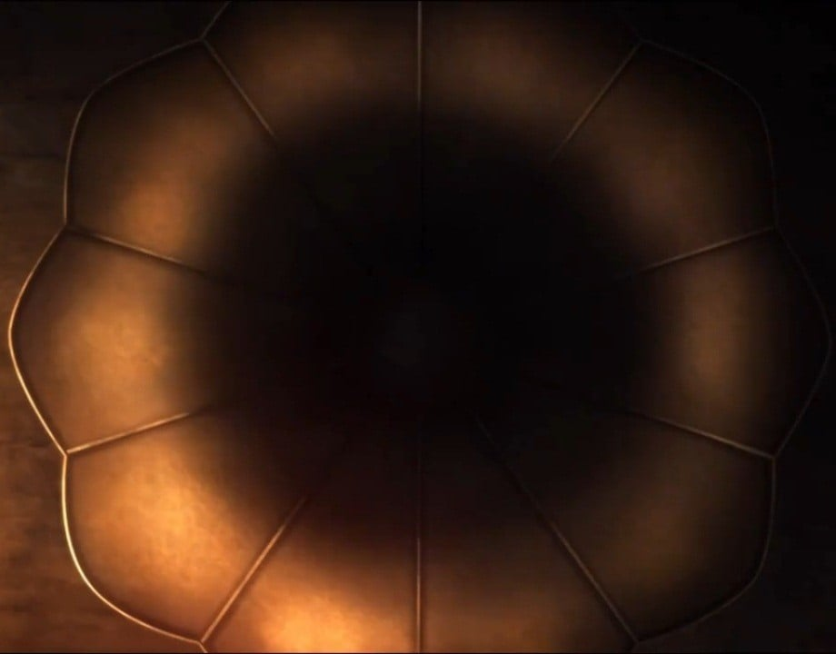
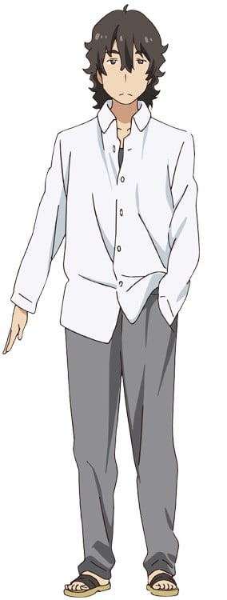
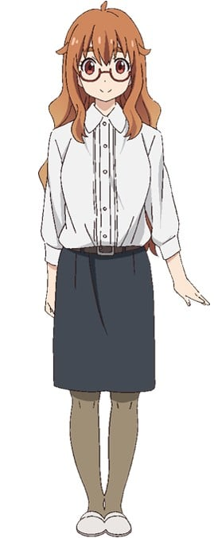
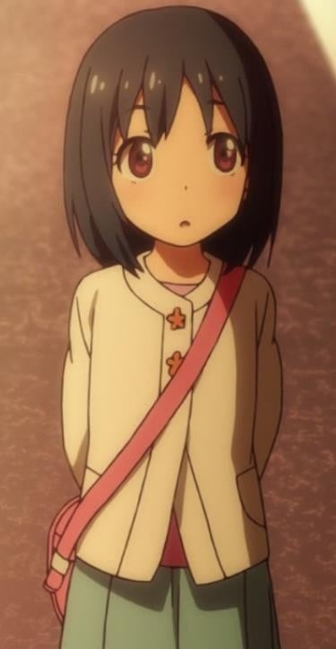

> [!bookinfo|noicon]+ **这个美术社大有问题！**
> 
>
| 日文名 | この美術部には問題がある！ |
|:------: |:------------------------------------------: |
| 类型 | 漫改 |
| 新番 | 2016 年 7 月 |
| 集数 | 共12话 |
| 官网 | [http://www.tbs.co.jp/anime/konobi/](https://http://www.tbs.co.jp/anime/konobi/) |
| 制作 | feel. |
| 导演 | 及川啓 |
| 脚本 | 荒川稔久 |
| 评分 | 7.3|
| 制片人 | 吉田啓祐 |

> [!abstract]+ **简介**
> 存在于平凡无奇的普通学校“月杜中学”的普通美术部。那里有着虽有绘画才能却只为了描绘理想的“二次元新娘”而燃起使命的内卷昴同学，以及对无可救药的内卷同学感到在意的宇佐美瑞希同学。以及，对两人似乎关注又似乎没有关注、总在睡觉的部长，和总带着不可思议气息的神秘部员柯莱特同学。这样稍微有些遗憾的人们所集中的美术部，今天也在发生着什么问题——。

> [!tip]+ **章节列表**
>- [ ] 第1话：这群人有问题/再见 内卷同学 (2016-07-07)
>- [ ] 第2话：美术部部长杀人事件/好孩子坏孩子迷路的孩子/情书恐慌 (2016-07-14)
>- [ ] 第3话：要找的东西在哪里？/短波波头/间接接吻 (2016-07-21)
>- [ ] 第4话：欢迎来到美术部/可蕾散步/一点点 渐渐地 (2016-07-28)
>- [ ] 第5话：误会列车/鸽子与人鱼与打扫泳池 (2016-08-04)
>- [ ] 第6话：神秘的美少女转校生/让人在意的二人 (2016-08-11)
>- [ ] 第7话：第一次共同作业……？/大师伊万莉 (2016-08-18)
>- [ ] 第8话：秘密的房间/一起来寻宝吧！ (2016-08-25)
>- [ ] 第9话：追寻魔导书！/挑战者再临/萌香散步 (2016-09-01)
>- [ ] 第10话：回忆中的绿松色/宇佐美补习班/香织奇袭 (2016-09-08)
>- [ ] 第11话：团结！空罐！文化祭！ (2016-09-15)
>- [ ] 第12话：今后依旧 (2016-09-22)

> [!tip]+ **主要角色**
> 
| 角色 | CV | 简介| 角色图片 |
|:----:|:---:|:---:|:--------:|
| 北白川たまこ |  | 主人公。高中一年级生，家里在兔子山商店街经营饼类小吃店“玉屋”。  个性活泼开朗。隶属于舞棒部。十分喜欢饼类小吃。  虽然性格有些冒失，但制作点心方面可谓天才。 |  |
| アナウンス | 渡部優衣 | 各作品通用广播/播音员。 |  |
| 宇佐美みずき | 小澤亜李 | 美術部で唯一まともな2年生。内巻くんの二次元趣味に呆れつつも、彼のことが気になっている。空回りしがちな振り回され系女の子。 |  |
| 内巻すばる | 小林裕介 | 絵の才能に恵まれながらも、「理想の二次元嫁」を描くためだけに美術部に在籍する２年生。そして、三次元にはまったく興味がない。 |  |
| 部長 | 利根健太朗 | 読んで字のごとく、美術部の部長。こう見えて3年生。いつも部室で寝ており、やる気がないが、年上らしいアドバイスをしてくれることも。 |  |
| コレット | 上坂すみれ | 美術部唯一の1年生で、自由奔放な言動が目立つオデコ系ガール。日本に来て6～7年になる外国人で、在住歴は長い。 |  |
| 立花夢子 | 水樹奈々 | 豊満なボディを持つ美術部顧問で天然。「夢子せんせい」と呼ばれている。 |  |
| 伊万莉まりあ | 東山奈央 | 内巻くんのクラスに転校してくる、謎（？）の美少女。男子からの人気は高いのだが、中二病をこじらせ気味の一面もあり……？ |  |
| 綾瀬かおり | 徳井青空 | ハイテンションで表情豊かな女の子。片思い中の宇佐美さんを「淫乱」呼ばわりするなど、いつもからかって遊んでいる。 |  |
| 本多さやか | しもがまちあき | 新聞部に所属する背の小さい女の子。校内新聞の記者で、真実しか書かないらしい。 |  |
| 国川涼子 | 丸塚香奈 | 長身のメガネ女子。３人のなかでは一番大人な雰囲気をもっていて、かおりの暴走をたしなめる一面も。 |  |
| 萌香 | 田中あいみ |  |  |