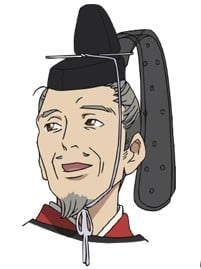

> [!bookinfo|noicon]+ **野良神**
> 
>
| 日文名 | ノラガミ |
|:------: |:------------------------------------------: |
| 类型 | 漫改 |
| 新番 | 2014 年 1 月 |
| 集数 | 共12话 |
| 官网 | [http://noragami-anime.net/1/](https://http://noragami-anime.net/1/) |
| 制作 | BONES |
| 导演 | タムラコータロー |
| 脚本 | 三重野瞳,福田裕子,赤尾でこ(三重野瞳),和場明子 |
| 评分 | 7.1|
| 制片人 |  |

> [!abstract]+ **简介**
> 没有神社供奉、缺少香火的落魄神明夜斗，因为性格缺陷，导致手下的神器纷纷跳槽。怀抱“受万民景仰”这个伟大理想的他，只好只身在此岸与彼岸间徘徊，为五块钱的香油钱（五斗米）折腰，接受上至斩妖除魔，下至修东修西的各类委托……

> [!tip]+ **章节列表**
>- [ ] 第1话：家猫与流浪神与尾巴 (2014-01-05)
>- [ ] 第2话：如雪一般 (2014-01-12)
>- [ ] 第3话：招致灾祸 (2014-01-19)
>- [ ] 第4话：幸福的所在之处 (2014-01-26)
>- [ ] 第5话：境界线 (2014-02-02)
>- [ ] 第6话：可怕的人 (2014-02-09)
>- [ ] 第7话：迷惘之事，注定之事 (2014-02-16)
>- [ ] 第8话：跨越一线 (2014-02-23)
>- [ ] 第9话：名字 (2014-03-02)
>- [ ] 第10话：受忌惮之人 (2014-03-09)
>- [ ] 第11话：被抛弃的神 (2014-03-16)
>- [ ] 第12话：一片记忆碎片 (2014-03-23)

> [!tip]+ **主要角色**
> 
| 角色 | CV | 简介| 角色图片 |
|:----:|:---:|:---:|:--------:|
| モブキャラクター | 石谷春貴 | 闲角，常称作路人，在电视剧、电影等作品中，指戏份薄弱的副角、不相关的小人物、串场的闲杂人等。可能用来表达地方民众的声音，或是充当背景。 モブキャラクター（mob character）とは、漫画、アニメ、映画、コンピュータゲームなどに描かれる端役のこと。群衆（群集）、または主要キャラクター以外の、その他大勢のこと。群集キャラ、背景キャラともいう。 |  |
| 夜ト | 神谷浩史 | 祀られる社もないマイナーで無名な神。自称「デリバリーゴッド」。武神だが、八百万の神の中でも末端の末端の存在。あらゆるものを斬る能力を持つ。かつては人斬りも行っており、禍事を好む卑しい禍津神として知られていた。神器の名前には「音」の一文字を入れる。 |  |
| 壱岐ひより | 内田真礼 | 良家の令嬢で15歳の中学3年生→高校1年生。隠れ格闘技好きで、蟷野という選手のファン。父親が医者。母親は古風でやや口うるさい。なお、母親は、酔っていても夜トなど狭間の存在に気付く鋭さを持っている。また、年の離れた兄がいる。 依頼で探していた猫を追って道路に飛び出した夜トを助けようとして自分がバスにひかれてしまい、幸い命に別状はなかったものの、半妖となり、魂が抜けやすい生霊として中途半端な狭間の存在になってしまった（夜ト曰く「体をよく落とす」）。そのため、頻繁に眠り込むようになって幽体離脱してしまい、しかも自分の意思では体に戻れなくなってしまう。この体質を治してもらうよう夜トに依頼し、何かと夜トに付きまとうようになる。しっかり者だが、発想がまだまだ子供っぽい。 夜トや雪音のにおいが好きで、霊体になるとそのにおいを犬のように追うことができる。 |  |
| 雪音 | 梶裕貴 | 夜トに拾われ”神器（しんき）”となる少年。名前を呼ばれて”雪器（せっき）”となれば、剣と化す。 |  |
| 小福 | 豊崎愛生 | エビスと名乗る神様。 かわいらしい姿だが、実は・・・!? |  |
| 大黒 | 小野大輔 | 小福の神器。名は「黒」。 いかつい外見をしているが、実は子供好きで、家庭的。 |  |
| 毘沙門 | 沢城みゆき | 七福神の一柱。多くの神器で武装している最強の武神。夜トを仇敵と狙っている。 |  |
| 兆麻 | 福山潤 | 神器型态：耳饰 毘沙门的神器。名为“兆”。戴着眼镜的青年。称呼毘沙门为“毘娜（ヴィーナ）”。是毘沙门神器当中最为古老的神器、“麻”之一族唯一存活下来的人。神器形状为樱花造型的耳环。本身的战斗能力低，负责指挥各个神器使他们的能力技术发挥到最大值（修正命中精度、攻撃范围的辅佐等），在毘沙门神器中担任最为重要的角色。他正确的引导被认为是“毘沙门成为最强武神的原因”，连夜斗也甘拜下风。 |  |
| 天神 | 大川透 | 神格：天神、雷神、学问之神、梅花树之神 在全国有许多的神社，天满组的老大。外貌是老人样，身边有许多身穿巫女装束的神器。登场时会咏唱菅原道真的和歌“东风若吹起，务使庭香乘风来。吾梅纵失主，亦勿忘春日”。神器的族名为“喻”。 考试季节繁忙时，会找夜斗来帮忙办事。虽然也会跟夜斗吵架起争执，但是也会接受对方的拜托，以及给日和合宜的建议。 |  |
| 野良 | 釘宮理恵 | 不特定多数の神に仕える神器。夜トと謎の過去をもつ。 |  |
| 蠃蚌 | 櫻井孝宏 |  |  |
| 真喩 | 今井麻美 | 神器型态：烟斗 过去在夜斗麾下名为“伴音”的短刃状神器（当时器名为“伴”），以“生理上无法接受”为理由只工作三个月便辞职。现在天神赐名为“真”，外型为留着妹妹头的女性，身为伴音的时候穿着和服且披了一件自缝的旧毛衣改制披肩。 虽然当伴器时的形状是短刃，但如今作为真器是烟斗状的神器。 因为过去的主仆关系，替夜斗进行了雪音的楔。其实认为夜斗并不是个恶神，对他仍维持一定程度的敬意，只是夜斗不擅经营所以厌恶当其神器。 |  |