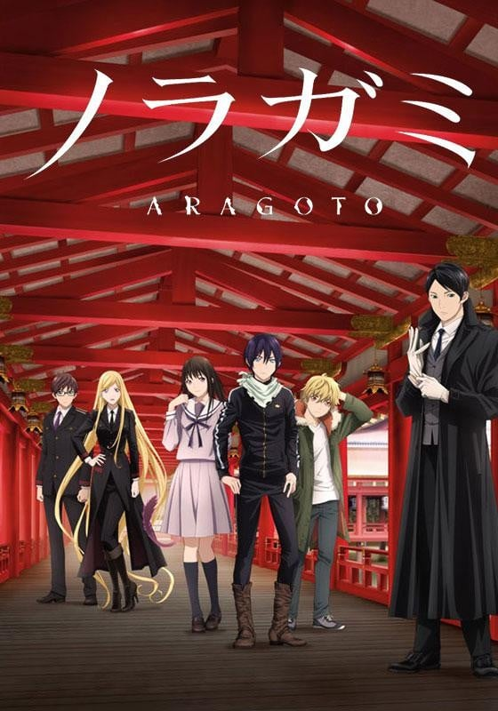
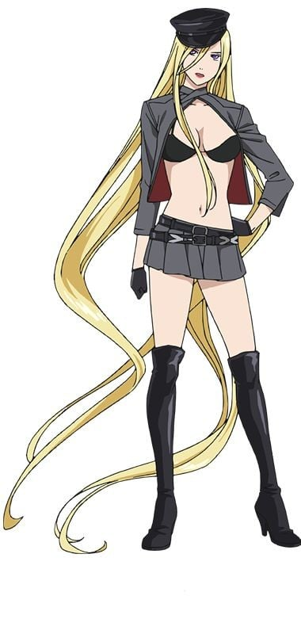
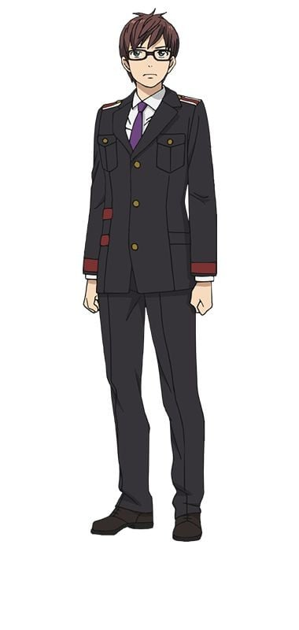
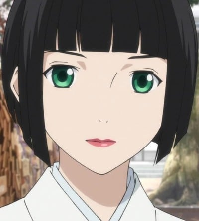
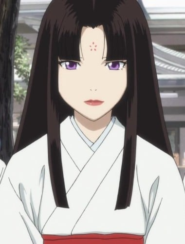

> [!bookinfo|noicon]+ **野良神 ARAGOTO**
> 
>
| 日文名 | ノラガミ ARAGOTO |
|:------: |:------------------------------------------: |
| 类型 | 漫改 |
| 新番 | 2015 年 10 月 |
| 集数 | 共13话 |
| 官网 | [http://noragami-anime.net/](https://http://noragami-anime.net/) |
| 制作 | BONES |
| 导演 | タムラコータロー |
| 脚本 | 三重野瞳,和場明子,福田裕子 |
| 评分 | 7.1|
| 制片人 |  |

> [!abstract]+ **简介**
> 在此岸与彼岸的交界处，八百万神明和服侍他们的死灵——神器，以及被称为妖的魑魅魍魉一同生活着。某天，普通的女初中生一岐日和意外遇到了居无定所、没有工作、自称是“神”的青年夜斗。其实此话不假，夜斗是个没有神社供奉、缺少香火的落魄神明，因为性格缺陷，导致手下的神器纷纷跳槽。怀抱“受万民景仰”这个伟大愿望的他，只好只身在此岸与彼岸间徘徊，为五元（日语中“五元”与“有缘”同音）的香油钱折腰，接受上至斩妖除魔，下至修东修西的各类委托。然而像这样一个粗心大意、性情不定，而且不能很好地听人祈愿、没有人知道的神明却有一个能力，那就是将此岸与彼岸以及其夹缝——世上各种杂七杂八的东西斩断。

> [!tip]+ **章节列表**
>- [ ] 第1话：获持讳名 (2015-10-02)
>- [ ] 第2话：她的回忆 (2015-10-09)
>- [ ] 第3话：虚假的羁绊 (2015-10-16)
>- [ ] 第4话：愿望 (2015-10-23)
>- [ ] 第5话：神的祝福、诅咒 (2015-10-30)
>- [ ] 第6话：应该做的事 (2015-11-06)
>- [ ] 第7话：神明的供奉方式 (2015-11-13)
>- [ ] 第8话：祸津神 (2015-11-20)
>- [ ] 第9话：断丝之音 (2015-11-27)
>- [ ] 第10话：如此心愿 (2015-12-04)
>- [ ] 第11话：黄泉归来 (2015-12-11)
>- [ ] 第12话：你的呼唤 (2015-12-18)
>- [ ] 第13话：福神的传说 (2015-12-25)

> [!tip]+ **主要角色**
> 
| 角色 | CV | 简介| 角色图片 |
|:----:|:---:|:---:|:--------:|
| モブキャラクター | 桑畑裕輔 | 闲角，常称作路人，在电视剧、电影等作品中，指戏份薄弱的副角、不相关的小人物、串场的闲杂人等。可能用来表达地方民众的声音，或是充当背景。 モブキャラクター（mob character）とは、漫画、アニメ、映画、コンピュータゲームなどに描かれる端役のこと。群衆（群集）、または主要キャラクター以外の、その他大勢のこと。群集キャラ、背景キャラともいう。 |  |
| 夜ト | 神谷浩史 | 祀られる社もないマイナーで無名な神。自称「デリバリーゴッド」。武神だが、八百万の神の中でも末端の末端の存在。あらゆるものを斬る能力を持つ。かつては人斬りも行っており、禍事を好む卑しい禍津神として知られていた。神器の名前には「音」の一文字を入れる。 |  |
| 壱岐ひより | 内田真礼 | 良家の令嬢で15歳の中学3年生→高校1年生。隠れ格闘技好きで、蟷野という選手のファン。父親が医者。母親は古風でやや口うるさい。なお、母親は、酔っていても夜トなど狭間の存在に気付く鋭さを持っている。また、年の離れた兄がいる。 依頼で探していた猫を追って道路に飛び出した夜トを助けようとして自分がバスにひかれてしまい、幸い命に別状はなかったものの、半妖となり、魂が抜けやすい生霊として中途半端な狭間の存在になってしまった（夜ト曰く「体をよく落とす」）。そのため、頻繁に眠り込むようになって幽体離脱してしまい、しかも自分の意思では体に戻れなくなってしまう。この体質を治してもらうよう夜トに依頼し、何かと夜トに付きまとうようになる。しっかり者だが、発想がまだまだ子供っぽい。 夜トや雪音のにおいが好きで、霊体になるとそのにおいを犬のように追うことができる。 |  |
| 雪音 | 梶裕貴 | 夜トに拾われ”神器（しんき）”となる少年。名前を呼ばれて”雪器（せっき）”となれば、剣と化す。 |  |
| 小福 | 豊崎愛生 | エビスと名乗る神様。 かわいらしい姿だが、実は・・・!? |  |
| 大黒 | 小野大輔 | 小福の神器。名は「黒」。 いかつい外見をしているが、実は子供好きで、家庭的。 |  |
| 毘沙門 | 沢城みゆき | 七福神の一柱。多くの神器で武装している最強の武神。夜トを仇敵と狙っている。 |  |
| 兆麻 | 福山潤 | 神器型态：耳饰 毘沙门的神器。名为“兆”。戴着眼镜的青年。称呼毘沙门为“毘娜（ヴィーナ）”。是毘沙门神器当中最为古老的神器、“麻”之一族唯一存活下来的人。神器形状为樱花造型的耳环。本身的战斗能力低，负责指挥各个神器使他们的能力技术发挥到最大值（修正命中精度、攻撃范围的辅佐等），在毘沙门神器中担任最为重要的角色。他正确的引导被认为是“毘沙门成为最强武神的原因”，连夜斗也甘拜下风。 |  |
| 天神 | 大川透 | 神格：天神、雷神、学问之神、梅花树之神 在全国有许多的神社，天满组的老大。外貌是老人样，身边有许多身穿巫女装束的神器。登场时会咏唱菅原道真的和歌“东风若吹起，务使庭香乘风来。吾梅纵失主，亦勿忘春日”。神器的族名为“喻”。 考试季节繁忙时，会找夜斗来帮忙办事。虽然也会跟夜斗吵架起争执，但是也会接受对方的拜托，以及给日和合宜的建议。 |  |
| 野良 | 釘宮理恵 | 不特定多数の神に仕える神器。夜トと謎の過去をもつ。 |  |
| 真喩 | 今井麻美 | 神器型态：烟斗 过去在夜斗麾下名为“伴音”的短刃状神器（当时器名为“伴”），以“生理上无法接受”为理由只工作三个月便辞职。现在天神赐名为“真”，外型为留着妹妹头的女性，身为伴音的时候穿着和服且披了一件自缝的旧毛衣改制披肩。 虽然当伴器时的形状是短刃，但如今作为真器是烟斗状的神器。 因为过去的主仆关系，替夜斗进行了雪音的楔。其实认为夜斗并不是个恶神，对他仍维持一定程度的敬意，只是夜斗不擅经营所以厌恶当其神器。 |  |
| 梅雨 | 早見沙織 | 天神旁随从般的女性，其实是1000年以前追随道真的梅树精，不是神器。拥有能够与树木对话的能力。 说出天神小时候一开始也不是很好的神明，常安慰给予其他前来求助的神器，要好好引导自己神明的建议。 道真（天神）从小很喜欢在梅树上玩耍，梅雨是道真公（天神）在被放逐离开京都前时常相处的梅树的梅树精，道真公追封为天神后待在他身边，尽心协助天神。 菅原道真很喜欢梅树，实际上日本各地的天满宫内都种满梅树。 |  |