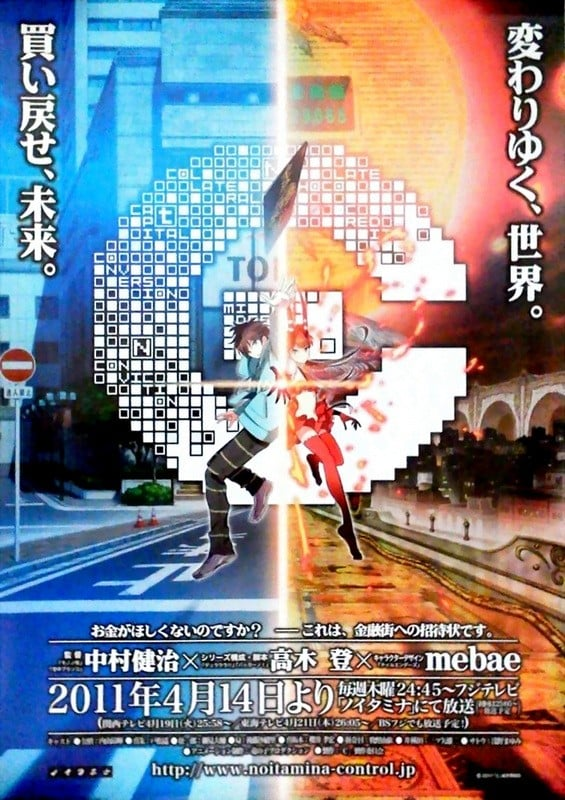

> [!bookinfo|noicon]+ **金钱掌控**
> 
>
| 日文名 | C |
|:------: |:------------------------------------------: |
| 类型 | 原创 |
| 新番 | 2011 年 4 月 |
| 集数 | 共11话 |
| 官网 | [http://www.noitamina-control.jp/](https://http://www.noitamina-control.jp/) |
| 制作 | タツノコプロ |
| 导演 | 中村健治 |
| 脚本 | 大西信介,高木登,杉原研二,石川学 |
| 评分 | 6.9|
| 制片人 | 溝渕康人；制作制片人：金苗将宏、星野達也,金苗将宏 |

> [!abstract]+ **简介**
> 故事背景设定在 20XX 年的日本，国家背负着巨大的财政赤字，被称为是经济崩坏、日本的末日。但是，某个叫做“Sovereign Wealth Fund”的新兴政府系金融机构，凭着成功运用政府资金，实现了财政再建的奇迹。另一方面，虽然政府经济复苏，但长久以来所引发的社会现象却不会因此消解：年轻人的就业问题、裁员与失业问题、面对未来的绝望感、逃避现实、结婚率下降以及少子化、还有失业者因此自暴自弃而引发的无差别暴力事件、失踪人口与自杀人口的激增……
某一天，就读都内经济学部的大学生余贺公麿面前，出现了一名神秘男子，询问道“以你的未来作为抵押借给你金钱，你将会如何利用自身才能去使用这笔钱？”公麿的人生自此展开了重大转变。

> [!tip]+ **章节列表**
>- [ ] 第1话：复杂 (2011-04-14)
>- [ ] 第2话：巧合 (2011-04-21)
>- [ ] 第3话：阴谋 (2011-04-28)
>- [ ] 第4话：转换 (2011-05-05)
>- [ ] 第5话：修练 (2011-05-12)
>- [ ] 第6话：冲突 (2011-05-19)
>- [ ] 第7话：组成 (2011-05-26)
>- [ ] 第8话：信誉 (2011-06-02)
>- [ ] 第9话：破产 (2011-06-09)
>- [ ] 第10话：冲突 (2011-06-16)
>- [ ] 第11话：未来 (2011-06-23)
>- [ ] 第1话：Матрёшка
>- [ ] 第1话：RPG

> [!tip]+ **主要角色**
> 
| 角色 | CV | 简介| 角色图片 |
|:----:|:---:|:---:|:--------:|
| 余賀公麿 | 内山昂輝 | 经济学部2年级在读，平凡的19岁大学生，经济拮据，没有女朋友。幼时生父失踪，母亲病逝，由母方的叔母养大，现在则靠奖学金独自生活。梦想拥有平凡幸福的家庭，希望成为公务员。 |  |
| 真朱 | 戸松遥 | 与公麿在金融街相遇的美少女，是被称为「Asset」的存在，在金融街进行战斗时与公麿共战的伙伴。 |  |
| 三國壮一郎 | 細見大輔 | 因为各种的因缘际会而和公麿在金融街中一起行动的男子。率领着名为“椋鸟公会”的集团。17 岁便自哈佛商学院毕业，拥有多个博士学位、MBA。现在为政府下属“主权财富基金”（利用国家外汇存底投资及运作资金）中、日本国有投资企业的最高负责人，在各界都拥有相当大的影响力。 |  |
| Q | 後藤沙緒里 | 壮一郎的Asset，经常是睡迷糊的样子，不知道在想什么。也有人认为Q拥有金融街中最强的能力。喜欢将麦得斯货币(Midas Money)当作零嘴食用。 |  |
| 真坂木 | 櫻井孝宏 |  |  |
| 生田羽奈日 | 牧野由依 | 公麿的大学同学，不知为何对於公麿特别在意，男友是有钱人家的少爷。 |  |
| カカズズ | 白川周作 | 三国过去从别人手中夺取的asset，固有经济魔法为White knight。 |  |
| オーロール |  | 三国的第三名asset，固有经济魔法为“睡美人”，可以吸收敌方asset的力量。 |  |
| 堀井一郎 | 高橋直純 | 椋鸟公会的干部之一。 |  |
| 石動桐人 | 中谷一博 | 椋鸟公会的监事，负责会费、活动收支相关监察。 |  |
| 進藤基 | 金尾哲夫 | 椋鸟公会的干部之一，三国的左右手。 |  |
| 竹田崎重臣 | 菊池正美 | 卖情报的金牙男。 |  |