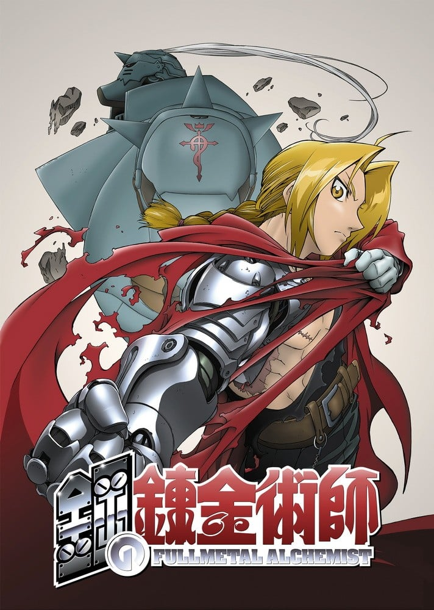
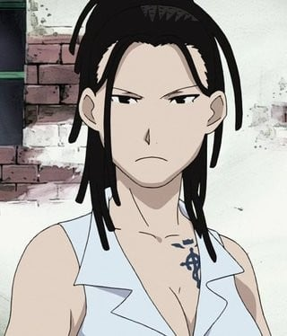
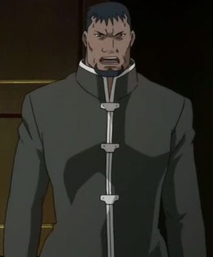
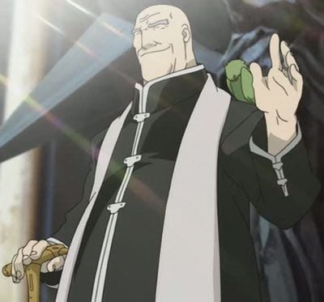
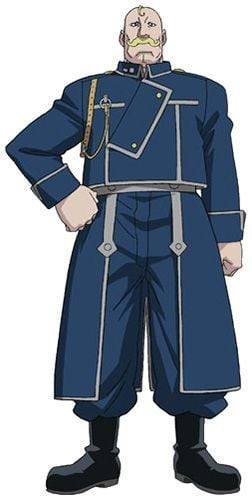

> [!bookinfo|noicon]+ **钢之炼金术师**
> 
>
| 日文名 | 鋼の錬金術師 |
|:------: |:------------------------------------------: |
| 类型 | 漫改 |
| 新番 | 2003 年 10 月 |
| 集数 | 共51话 |
| 官网 | [http://www.hagaren.jp/](https://http://www.hagaren.jp/) |
| 制作 | BONES |
| 导演 | 水島精二 |
| 脚本 | 吉永亜矢,井上敏樹,高橋ナツコ,高山カツヒコ,會川昇,石川学,大和屋暁 |
| 评分 | 8.2|
| 制片人 |  |

> [!abstract]+ **简介**
> 　　爱德华德和他的弟弟阿尔芬斯十分思念在他们还小的时候亡故的母亲，实行了炼金术中最大的禁忌——可以将死者复活的人体炼成。 可是炼成失败，爱德华德失去了左腿，阿尔芬斯则失去了全身。爱德华德好不容易才以牺牲自己的右臂为代价将弟弟的灵魂炼成，并定着在一副铠甲上，可是其代价未免太大了。爱德华德和阿尔芬斯一起，为了找回所失去的一切，开始踏上了寻找拥有极大力量的“贤者之石”的旅程。 
　　 
　　右臂和左腿用钢制义肢“机械铠”来替代的他，被人们称为“钢之炼金术师”…

> [!tip]+ **章节列表**
>- [ ] 第1话：挑战太阳的人 (2003-10-04)
>- [ ] 第2话：禁忌的身体 (2003-10-11)
>- [ ] 第3话：母亲… (2003-10-18)
>- [ ] 第4话：爱的炼成 (2003-10-25)
>- [ ] 第5话：疾走！机械铠！ (2003-11-01)
>- [ ] 第6话：国家炼金术师资格考试 (2003-11-08)
>- [ ] 第7话：合成兽恸哭之夜 (2003-11-15)
>- [ ] 第8话：贤者之石 (2003-11-22)
>- [ ] 第9话：军队走狗的银怀表 (2003-11-27)
>- [ ] 第10话：怪盗塞莲 (2003-12-06)
>- [ ] 第11话：砂砾之大地‧前篇 (2003-12-13)
>- [ ] 第12话：砂砾之大地‧后篇 (2003-12-20)
>- [ ] 第13话：焰对钢 (2003-12-27)
>- [ ] 第14话：破坏的右手 (2004-01-10)
>- [ ] 第15话：伊修巴尔大屠杀 (2004-01-17)
>- [ ] 第16话：失去的东西 (2004-01-24)
>- [ ] 第17话：有家人等待的家 (2004-01-31)
>- [ ] 第18话：马尔哥笔记 (2004-02-07)
>- [ ] 第19话：真实深处的深处 (2004-02-14)
>- [ ] 第20话：守护者之魂 (2004-02-21)
>- [ ] 第21话：红色光辉 (2004-02-28)
>- [ ] 第22话：被制造的人类 (2004-03-06)
>- [ ] 第23话：钢之心 (2004-03-13)
>- [ ] 第24话：记忆的黏著 (2004-03-20)
>- [ ] 第25话：离别的仪式 (2004-03-27)
>- [ ] 第26话：她的理由 (2004-04-03)
>- [ ] 第27话：师父 (2004-04-10)
>- [ ] 第28话：一即是全、全即是一 (2004-04-17)
>- [ ] 第29话：纯洁的孩子 (2004-04-24)
>- [ ] 第30话：袭击南方司令部 (2004-05-01)
>- [ ] 第31话：罪 (2004-05-08)
>- [ ] 第32话：森林中的但丁 (2004-05-15)
>- [ ] 第33话：被囚禁的阿尔 (2004-05-29)
>- [ ] 第34话：强欲的理论 (2004-06-05)
>- [ ] 第35话：愚者的再会 (2004-06-12)
>- [ ] 第36话：我心中的罪人 (2004-06-19)
>- [ ] 第37话：焰之炼金术师 战斗的少尉先生 第十三仓库的怪物 (2004-06-26)
>- [ ] 第38话：随川而流 (2004-07-03)
>- [ ] 第39话：东方内战 (2004-07-10)
>- [ ] 第40话：伤痕 (2004-07-17)
>- [ ] 第41话：圣母 (2004-07-24)
>- [ ] 第42话：不知其名 (2004-07-24)
>- [ ] 第43话：野狗开始逃窜 (2004-07-31)
>- [ ] 第44话：光之霍恩海姆 (2004-08-07)
>- [ ] 第45话：使心劣化之物 (2004-08-21)
>- [ ] 第46话：人体炼成 (2004-08-28)
>- [ ] 第47话：封印人造人 (2004-09-04)
>- [ ] 第48话：再会 (2004-09-11)
>- [ ] 第49话：门的另一边 (2004-09-18)
>- [ ] 第50话：死 (2004-09-25)
>- [ ] 第51话：慕尼黑1921 (2004-10-02)
>- [ ] 第0话：『钢之炼金术师』彻底解明！！〜寻求贤者之石〜 (2003-10-02)

> [!tip]+ **主要角色**
> 
| 角色 | CV | 简介| 角色图片 |
|:----:|:---:|:---:|:--------:|
| エドワード・エルリック | 朴璐美 | 通称爱德。为了寻找贤者之石与弟弟一起旅行。性格有很冲动的一面，很容易暴走。对自己比较矮小的身高非常在意，当听到“小豆丁”、“矮子”等字眼便会暴走。年幼时，母亲不幸因流行病死去，为了能再看见母亲的微笑，爱德与弟弟进行人体链成，结果失败，爱德失去左脚、弟弟失去整个身体，为保住弟弟，爱德用右手换取弟弟的灵魂，并将弟弟的灵魂附着于盔甲上。爱德失去的肢体后用机械铠替代。为了知道贤者之石的秘密及得到相关资料，决心成为国家炼金术师，在12岁成功考取，成为军属，得到了“钢”的称号。他不喜欢喝牛奶，但却非常喜欢喝含有牛奶的炖蔬菜汤。打斗时会将右手的机械铠链成带有刀刃的形式。在进行人体链成时打开了真理之门，因此链成时无须画链成阵。身上的银怀表是身为国家炼金术师的证明，但是被他利用炼金术封住，盖子内刻有兄弟两烧毁住处离开家乡的日期。 |  |
| アルフォンス・エルリック | 釘宮理恵 | 在钢铁铠甲中有颗善良的心。     那铠甲里面是空洞洞的。阿尔丰斯·艾尔利克是个只有灵魂的人。4年前，他失去了整个身体作为人体炼成的代价，但因哥哥拼死炼成，他的灵魂得以附在铠甲上，继续生存着。他比任何人更深切地理解爱德、关心他，有时还劝慰容易冲动的哥哥，担当监护人的角色。和哥哥一起持续着取回身体的旅程。对阿尔而言，最大的愿望是爱德的身体能恢复原状。 |  |
| ウィンリィ・ロックベル | 豊口めぐみ | 机械铠装备师。大陆历1899年出生，故事中段年龄15-16岁，淡金色马尾的美少女。  温莉是一名善良、乐观、真诚的女性，在漫画第九话中首次登场，与祖母比拿可修复爱德与“伤疤男”斯卡战斗而损坏的机械铠。出生在利塞布尔，童年时双亲在伊修巴尔战争中医治伤员时被杀，从此随祖母在利塞布尔生活。自幼便认识爱德和阿尔，是兄弟二人珍视的伙伴和家人。温莉十分热爱机械和工具，擅长制造和修理机械铠，和祖母兼著名机械铠技师比拿可在家经营一家小商店。在爱力克兄弟人体炼成母亲失败后，由她们制作并修理爱德右臂和左腿的机械铠。 为了保证它们处于最佳状态，温莉会在必要时外出提供修理。 |  |
| ピナコ・ロックベル | 豊口めぐみ | 养育温莉、教授温莉机械铠知识的祖母。因为靠装备机械铠为生，因此在机械铠方面的技术十分高超。不单对温莉，她还把爱德、阿尔当作亲生孙子般保护。烟斗和笔直挺立的发型是她的特有标志。      别看现在这个样子常常被艾德说成“看不见的婆婆”、“细菌婆婆”，当年可以很有名气的机械装备师，人称利赞布鲁的“皮纳可女豹”…… |  |
| スカー(傷の男) | 置鮎龍太郎 | 为了同胞们而破坏一切的人。     是东部民族伊修巴尔人中的幸存者。因为痛恨在过去的内乱中杀害同胞的军队中的炼金术士，所以对所有国家炼金术士进行报复。斯卡的武器是破坏一切的右臂。力量的来源是手臂上的纹身。虽然斯卡也知道冤冤相报何时了的道理，但仍然独自走着罪孽的不归之路。 | .jpg) |
| イズミ・カーティス | 津田匠子 | 恩威并重的师父。    伊兹米·卡迪斯是教授艾尔利克兄弟炼金术士的师父。在把两个孩子收归门下后，随即将他们放逐到无人岛上，是个斯巴达式的教育家。不过，她的内心经常努力地理解他们表情背后的感情、为他们着想。还有，她的丈夫斯古深爱着她。他保护着受病痛折磨的妻子，两夫妻一起看着爱德他们成长。 |  |
| ロイ・マスタング | 大川透 | 别名“焰之炼金术师”的国家炼金术师。国军大佐。  利用发火布特制的手套产生火花，使用炼金术自如地操纵火焰。  表面看来轻浮，实际相当深不可测。  下雨天比较无能... |  |
| グラトニー | 高戸靖広 | 属于人造人七宗罪之一。 03版： 其实是为了制造贤者之石而特意制造出来的人造人，其目的是在格拉托尼体内炼成贤者之石，无原型。 |  |
| クレイ | 高瀬右光 | レト教の宣教者でコーネロの側近。浅黒い肌に顎鬚が特徴。コーネロの命を受けてエルリック兄弟を襲うが、油断したところにエドが投げたアルの頭をぶつけられて失神する。その後、エンヴィーがコーネロに化けて成り代わったことを知らないまま彼に仕え続け、リオールの暴動が発生すると共に真相を知り、グラトニーに食い殺される。 |  |
| コーネロ | 有本欽隆 |  |  |
| リザ・ホークアイ | 根谷美智子 | 莉莎·霍克艾（Riza Hawkeye），金色长发，职业是军人。是马斯坦的副官兼搭档。视力是常人的8倍（导读手册），擅长用枪，是有名的狙击手，有“鹰眼”之称。其父是出名的炼金术师，马斯坦亦跟随其父学习炼金术。 |  |
| アレックス・ルイ・アームストロング | 内海賢二 |  |  |