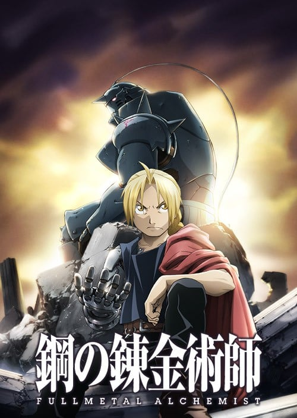
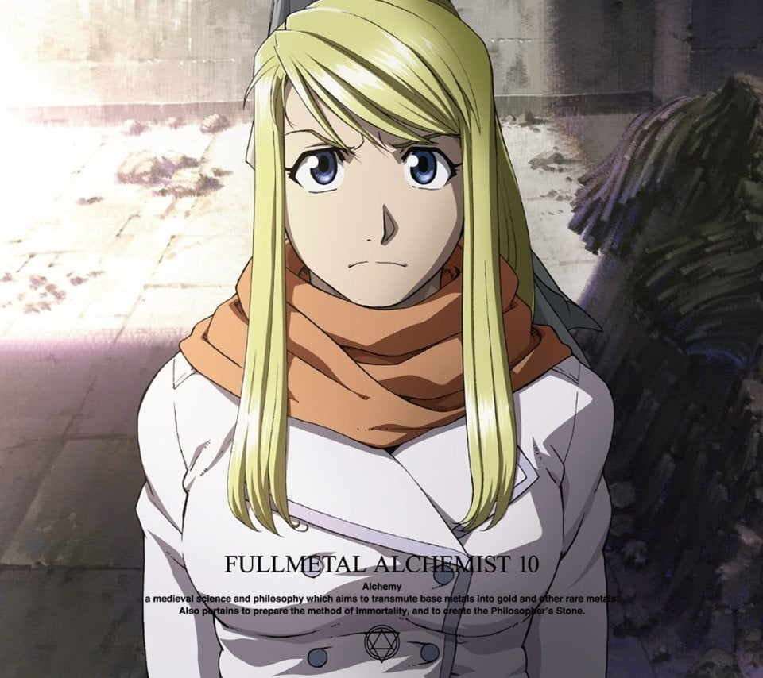
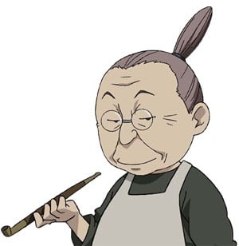
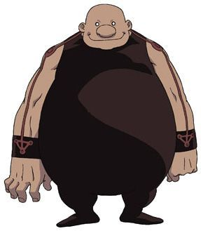
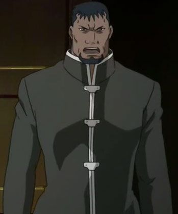
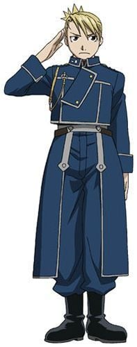

> [!bookinfo|noicon]+ **钢之炼金术师 FULLMETAL ALCHEMIST**
> 
>
| 日文名 | 鋼の錬金術師 FULLMETAL ALCHEMIST |
|:------: |:------------------------------------------: |
| 类型 | 漫改 |
| 新番 | 2009 年 4 月 |
| 集数 | 共64话 |
| 官网 | [http://www.hagaren.jp/fa/](https://http://www.hagaren.jp/fa/) |
| 制作 | BONES |
| 导演 | 入江泰浩 |
| 脚本 | 菅正太郎,土屋理敬,大野木寛(1-3,7-9,12,14,17,19,30,32,40,46,53,56,58-64,sp1-4)、土屋理敬(4-5,10,18,21,23,26,31,36-37,41,45,50,52,55)、菅正太郎(6,11,13,16,22,28,33-34,42,48,54)、津村米紀(15,20,25,27,38,43,49)、水上清資(24,29,35,39,44,47,51,57),津村米紀,水上清資,大野木寛 |
| 评分 | 8.8|
| 制片人 |  |

> [!abstract]+ **简介**
> 因思念已故母亲，触犯炼金术中被视为最大禁忌“人体炼成”，而失去一切的兄弟──装上机械铠、有“钢之炼金术师”之称号的哥哥爱德华·爱力克，以及灵魂被固定于铠甲的弟弟阿尔冯斯──两人为取回失去的东西，踏上寻找贤者之石的旅程，并随着接近贤者之石的真相、在巨大的阴谋中勇往直前。暗地活跃的非人类、徐徐露出本质的军事国家亚美斯多利斯、受虐民众的无比憎恨与复仇怨念、炼金术带来的种种悲剧……散于各点的悲剧，终将连成线，人民、甚至国家都会被卷入其中。

爱力克兄弟处于绝望和希望的狭缝之中，即使如此仍继续前进……

------------------

曾于2003 年一度改编为动画的《钢之炼金术师》，在日本第20卷出版之际，也向外公布动画版的新作将在2009年上半年发表，并表明新系列采原作漫画剧情。其后有关方面在2009年2 月10日，宣布新作《钢之炼金术师 FULLMETAL ALCHEMIST》于4 月5日下午5时开始播放。

本作剧情着重于爱力克兄弟的亲情，在军事国家展开的各种谋略、众多配角的行为与心情，做细腻的描述。并针对受世界经济衰退及动画违法下载泛滥影响的海外市场，ANIPLEX与各国代理商合作，尾随日本播出后一周内，于各国电视台、网络电视播出。

在2009 年纽约动画节（New York Anime Festival）座谈情报指出，预定播放5季（クール）、全63话，后由监督入江泰浩证实。然而《月刊少年GANGAN》2010年6月号正式公布最终回于7月4日播出，即改为全64话。

> [!tip]+ **章节列表**
>- [ ] 第1话：钢之炼金术师 (2009-04-05)
>- [ ] 第2话：开端之日 (2009-04-12)
>- [ ] 第3话：邪教之街 (2009-04-19)
>- [ ] 第4话：炼金术师的烦恼 (2009-04-26)
>- [ ] 第5话：哀伤之雨 (2009-05-03)
>- [ ] 第6话：希望之路 (2009-05-10)
>- [ ] 第7话：被隐藏的真相 (2009-05-17)
>- [ ] 第8话：第五研究所 (2009-05-24)
>- [ ] 第9话：被创造的思念 (2009-05-31)
>- [ ] 第10话：各自的未来 (2009-06-07)
>- [ ] 第11话：拉修巴雷的奇迹 (2009-06-14)
>- [ ] 第12话：一即是全、全即是一 (2009-06-21)
>- [ ] 第13话：达普利斯的野兽们 (2009-06-28)
>- [ ] 第14话：潜伏于地底的人们 (2009-07-05)
>- [ ] 第15话：东方的使者 (2009-07-12)
>- [ ] 第16话：战友的足迹 (2009-07-19)
>- [ ] 第17话：冷彻的火焰 (2009-07-26)
>- [ ] 第18话：小小人类的傲慢手掌 (2009-08-02)
>- [ ] 第19话：不死者之死 (2009-08-09)
>- [ ] 第20话：墓前的父亲 (2009-08-16)
>- [ ] 第21话：愚者的前进 (2009-08-30)
>- [ ] 第22话：遥远的背影 (2009-09-06)
>- [ ] 第23话：战场的少女 (2009-09-13)
>- [ ] 第24话：腹中 (2009-09-20)
>- [ ] 第25话：暗之门 (2009-09-27)
>- [ ] 第26话：再会 (2009-10-04)
>- [ ] 第27话：狭缝间的宴会 (2009-10-11)
>- [ ] 第28话：父亲大人 (2009-10-18)
>- [ ] 第29话：愚者的挣扎 (2009-10-25)
>- [ ] 第30话：伊修瓦尔歼灭战 (2009-11-01)
>- [ ] 第31话：520先士的约定 (2009-11-08)
>- [ ] 第32话：总统之子 (2009-11-15)
>- [ ] 第33话：布里格斯的北壁 (2009-11-22)
>- [ ] 第34话：冰之女王 (2009-11-29)
>- [ ] 第35话：本国的形态 (2009-12-06)
>- [ ] 第36话：家族的肖像 (2009-12-13)
>- [ ] 第37话：最初的人造人 (2009-12-20)
>- [ ] 第38话：巴兹库尔的激战 (2009-12-27)
>- [ ] 第39话：白昼之梦 (2010-01-10)
>- [ ] 第40话：瓶中小人（人造人） (2010-01-17)
>- [ ] 第41话：地狱 (2010-01-24)
>- [ ] 第42话：反击的先兆 (2010-01-31)
>- [ ] 第43话：蝼蚁一啮 (2010-02-07)
>- [ ] 第44话：完全恢复 (2010-02-14)
>- [ ] 第45话：约定之日 (2010-02-21)
>- [ ] 第46话：迫近的暗影 (2010-02-28)
>- [ ] 第47话：黑暗的使者 (2010-03-07)
>- [ ] 第48话：地道下的誓言 (2010-03-14)
>- [ ] 第49话：亲子之情 (2010-03-21)
>- [ ] 第50话：中央动乱 (2010-03-28)
>- [ ] 第51话：不死的军团 (2010-04-04)
>- [ ] 第52话：大家的力量 (2010-04-11)
>- [ ] 第53话：复仇之炎 (2010-04-18)
>- [ ] 第54话：烈火之前 (2010-04-25)
>- [ ] 第55话：大人的活法 (2010-05-02)
>- [ ] 第56话：总统归还 (2010-05-09)
>- [ ] 第57话：永远的辞别 (2010-05-16)
>- [ ] 第58话：人柱 (2010-05-23)
>- [ ] 第59话：失落的光芒 (2010-05-30)
>- [ ] 第60话：天之瞳  地之扉 (2010-06-06)
>- [ ] 第61话：噬神者 (2010-06-13)
>- [ ] 第62话：惨烈的反击 (2010-06-20)
>- [ ] 第63话：门的另一边 (2010-06-27)
>- [ ] 第64话：旅途的尽头 (2010-07-04)
>- [ ] 第1话：盲目的炼金术师 (2009-08-26)
>- [ ] 第2话：单纯的人们 (2009-12-23)
>- [ ] 第3话：师父物语 &amp; 师父初恋物语 (2010-04-21)
>- [ ] 第4话：那也是他的战场 (2010-08-25)

> [!tip]+ **主要角色**
> 
| 角色 | CV | 简介| 角色图片 |
|:----:|:---:|:---:|:--------:|
| エドワード・エルリック | 朴璐美 | 通称爱德。为了寻找贤者之石与弟弟一起旅行。性格有很冲动的一面，很容易暴走。对自己比较矮小的身高非常在意，当听到“小豆丁”、“矮子”等字眼便会暴走。年幼时，母亲不幸因流行病死去，为了能再看见母亲的微笑，爱德与弟弟进行人体链成，结果失败，爱德失去左脚、弟弟失去整个身体，为保住弟弟，爱德用右手换取弟弟的灵魂，并将弟弟的灵魂附着于盔甲上。爱德失去的肢体后用机械铠替代。为了知道贤者之石的秘密及得到相关资料，决心成为国家炼金术师，在12岁成功考取，成为军属，得到了“钢”的称号。他不喜欢喝牛奶，但却非常喜欢喝含有牛奶的炖蔬菜汤。打斗时会将右手的机械铠链成带有刀刃的形式。在进行人体链成时打开了真理之门，因此链成时无须画链成阵。身上的银怀表是身为国家炼金术师的证明，但是被他利用炼金术封住，盖子内刻有兄弟两烧毁住处离开家乡的日期。 |  |
| アルフォンス・エルリック | 釘宮理恵 | 在钢铁铠甲中有颗善良的心。     那铠甲里面是空洞洞的。阿尔丰斯·艾尔利克是个只有灵魂的人。4年前，他失去了整个身体作为人体炼成的代价，但因哥哥拼死炼成，他的灵魂得以附在铠甲上，继续生存着。他比任何人更深切地理解爱德、关心他，有时还劝慰容易冲动的哥哥，担当监护人的角色。和哥哥一起持续着取回身体的旅程。对阿尔而言，最大的愿望是爱德的身体能恢复原状。 |  |
| ウィンリィ・ロックベル | 高本めぐみ | 机械铠装备师。大陆历1899年出生，故事中段年龄15-16岁，淡金色马尾的美少女。  温莉是一名善良、乐观、真诚的女性，在漫画第九话中首次登场，与祖母比拿可修复爱德与“伤疤男”斯卡战斗而损坏的机械铠。出生在利塞布尔，童年时双亲在伊修巴尔战争中医治伤员时被杀，从此随祖母在利塞布尔生活。自幼便认识爱德和阿尔，是兄弟二人珍视的伙伴和家人。温莉十分热爱机械和工具，擅长制造和修理机械铠，和祖母兼著名机械铠技师比拿可在家经营一家小商店。在爱力克兄弟人体炼成母亲失败后，由她们制作并修理爱德右臂和左腿的机械铠。 为了保证它们处于最佳状态，温莉会在必要时外出提供修理。 |  |
| ピナコ・ロックベル | 小山茉美 | 养育温莉、教授温莉机械铠知识的祖母。因为靠装备机械铠为生，因此在机械铠方面的技术十分高超。不单对温莉，她还把爱德、阿尔当作亲生孙子般保护。烟斗和笔直挺立的发型是她的特有标志。      别看现在这个样子常常被艾德说成“看不见的婆婆”、“细菌婆婆”，当年可以很有名气的机械装备师，人称利赞布鲁的“皮纳可女豹”…… |  |
| スカー(傷の男) | 三宅健太 | 为了同胞们而破坏一切的人。     是东部民族伊修巴尔人中的幸存者。因为痛恨在过去的内乱中杀害同胞的军队中的炼金术士，所以对所有国家炼金术士进行报复。斯卡的武器是破坏一切的右臂。力量的来源是手臂上的纹身。虽然斯卡也知道冤冤相报何时了的道理，但仍然独自走着罪孽的不归之路。 | .jpg) |
| イズミ・カーティス | 津田匠子 | 恩威并重的师父。    伊兹米·卡迪斯是教授艾尔利克兄弟炼金术士的师父。在把两个孩子收归门下后，随即将他们放逐到无人岛上，是个斯巴达式的教育家。不过，她的内心经常努力地理解他们表情背后的感情、为他们着想。还有，她的丈夫斯古深爱着她。他保护着受病痛折磨的妻子，两夫妻一起看着爱德他们成长。 |  |
| ロイ・マスタング | 三木眞一郎 | 别名“焰之炼金术师”的国家炼金术师。国军大佐。  利用发火布特制的手套产生火花，使用炼金术自如地操纵火焰。  表面看来轻浮，实际相当深不可测。  下雨天比较无能... |  |
| グラトニー | 白鳥哲 | 属于人造人七宗罪之一。 03版： 其实是为了制造贤者之石而特意制造出来的人造人，其目的是在格拉托尼体内炼成贤者之石，无原型。 |  |
| クレイ | 江川央生 | レト教の宣教者でコーネロの側近。浅黒い肌に顎鬚が特徴。コーネロの命を受けてエルリック兄弟を襲うが、油断したところにエドが投げたアルの頭をぶつけられて失神する。その後、エンヴィーがコーネロに化けて成り代わったことを知らないまま彼に仕え続け、リオールの暴動が発生すると共に真相を知り、グラトニーに食い殺される。 |  |
| コーネロ | 加藤精三 |  |  |
| リザ・ホークアイ | 折笠富美子 | 莉莎·霍克艾（Riza Hawkeye），金色长发，职业是军人。是马斯坦的副官兼搭档。视力是常人的8倍（导读手册），擅长用枪，是有名的狙击手，有“鹰眼”之称。其父是出名的炼金术师，马斯坦亦跟随其父学习炼金术。 |  |
| アレックス・ルイ・アームストロング | 内海賢二 |  |  |