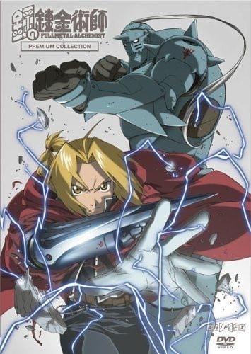

> [!bookinfo|noicon]+ **钢之炼金术师 PREMIUM COLLECTION**
> 
>
| 日文名 | 鋼の錬金術師 PREMIUM COLLECTION |
|:------: |:------------------------------------------: |
| 类型 | 漫改 |
| 新番 | 2006 年 3 月 |
| 集数 | 共4话 |
| 官网 | [https://www.hagaren.jp/old/video/premium.html](https://https://www.hagaren.jp/old/video/premium.html) |
| 制作 | BONES |
| 导演 | 水島精二 |
| 脚本 |  |
| 评分 | 7.3|
| 制片人 |  |

> [!abstract]+ **简介**
> 実写篇(实写篇)
新作短篇之一。盔甲阿尔寻找爱德的故事。

宴会篇(宴会篇)
新作短篇之一。为了祝贺结束摄影剧场版的宴会於居酒屋(小酒馆)『凡豆(ぼんず/Bonzu)』举办，可爱的SD角色们集合起来，大家一起胡闹。

子ども篇(孩子篇)
新作短篇之一。给某某的100岁生日礼物。

国家錬金术师军団VS七大ホムンクルス(国家鍊金术师军团vs七大人造人)
在USJ上映的短篇映像。

恩维与古力德镜头篇
具体不明。

> [!tip]+ **章节列表**
>- [ ] 第1话：国家鍊金术师军团vs七大人造人
>- [ ] 第2话：实写篇
>- [ ] 第3话：宴会篇
>- [ ] 第4话：孩子篇

> [!tip]+ **主要角色**
> 
| 角色 | CV | 简介| 角色图片 |
|:----:|:---:|:---:|:--------:|
| - | - | - | - |