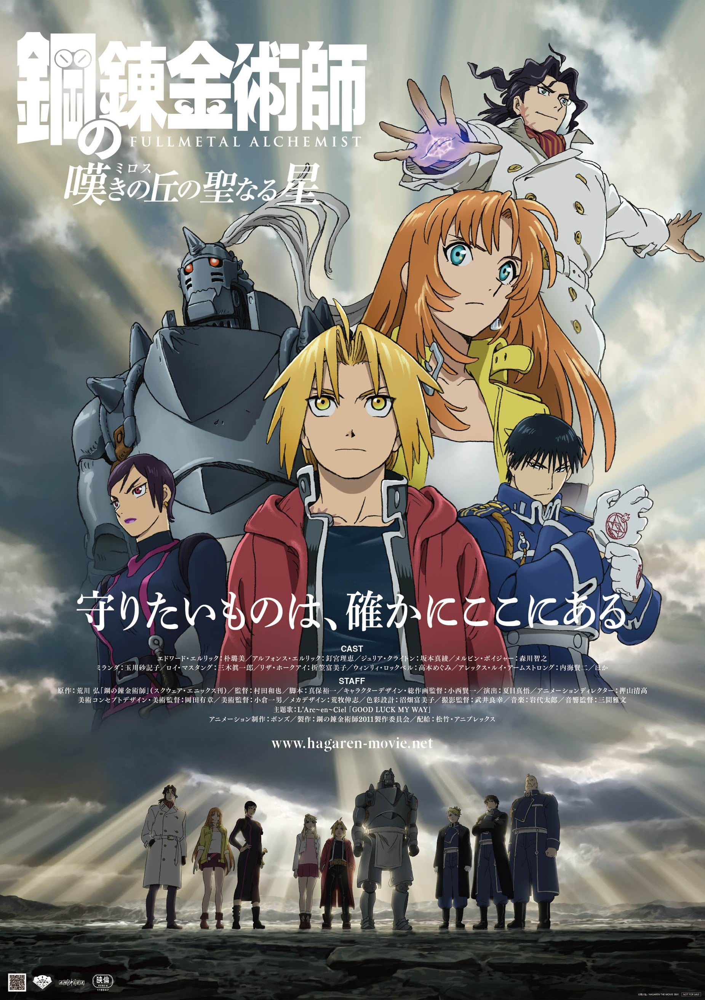
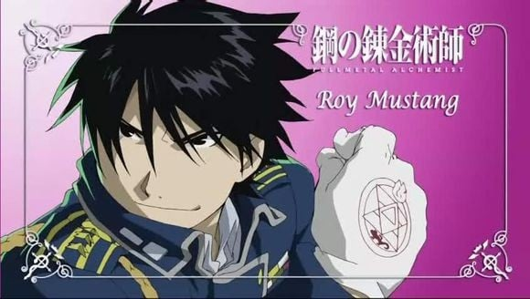
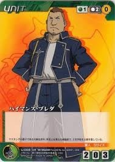
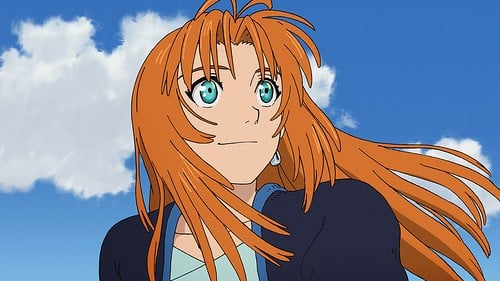
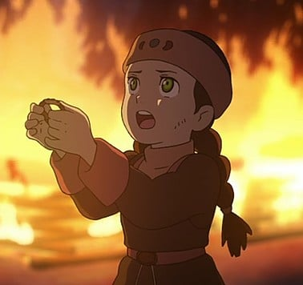

> [!bookinfo|noicon]+ **钢之炼金术师 叹息之丘的圣星**
> 
>
| 日文名 | 鋼の錬金術師 嘆きの丘の聖なる星 |
|:------: |:------------------------------------------: |
| 类型 | 漫改 |
| 新番 | 2011 年 7 月 |
| 集数 | 共1话 |
| 官网 | [https://www.hagaren-movie.net/](https://https://www.hagaren-movie.net/) |
| 制作 | BONES |
| 导演 | 村田和也 |
| 脚本 | 真保裕一 |
| 评分 | 6.9|
| 制片人 |  |

> [!abstract]+ **简介**
> 　　《钢之炼金术师：叹息之丘的神圣之星》是独立于此前两部动画内容的全新故事。在位于中央首都的监狱，即将刑满的男人梅尔文逃狱出脱了，他掌握着神秘而强大的炼金术。为了追寻这个男子的身影，爱德华与阿尔冯斯来到了西部边境，被称作圣地的“米洛斯”。在这个被巨大岩石包围的地方，兄弟二人遇到了少女茱莉亚，并被一个名叫黑蝙蝠的反抗组织捕获。随着调查的深入，他们逐渐了解到这个城市里隐藏着的血腥历史……

> [!tip]+ **章节列表**
>- [ ] 第1话：钢之炼金术师 叹息之丘的圣星 (2011-07-02)

> [!tip]+ **主要角色**
> 
| 角色 | CV | 简介| 角色图片 |
|:----:|:---:|:---:|:--------:|
| エドワード・エルリック | 朴璐美 | 通称爱德。为了寻找贤者之石与弟弟一起旅行。性格有很冲动的一面，很容易暴走。对自己比较矮小的身高非常在意，当听到“小豆丁”、“矮子”等字眼便会暴走。年幼时，母亲不幸因流行病死去，为了能再看见母亲的微笑，爱德与弟弟进行人体链成，结果失败，爱德失去左脚、弟弟失去整个身体，为保住弟弟，爱德用右手换取弟弟的灵魂，并将弟弟的灵魂附着于盔甲上。爱德失去的肢体后用机械铠替代。为了知道贤者之石的秘密及得到相关资料，决心成为国家炼金术师，在12岁成功考取，成为军属，得到了“钢”的称号。他不喜欢喝牛奶，但却非常喜欢喝含有牛奶的炖蔬菜汤。打斗时会将右手的机械铠链成带有刀刃的形式。在进行人体链成时打开了真理之门，因此链成时无须画链成阵。身上的银怀表是身为国家炼金术师的证明，但是被他利用炼金术封住，盖子内刻有兄弟两烧毁住处离开家乡的日期。 |  |
| アルフォンス・エルリック | 釘宮理恵 | 在钢铁铠甲中有颗善良的心。     那铠甲里面是空洞洞的。阿尔丰斯·艾尔利克是个只有灵魂的人。4年前，他失去了整个身体作为人体炼成的代价，但因哥哥拼死炼成，他的灵魂得以附在铠甲上，继续生存着。他比任何人更深切地理解爱德、关心他，有时还劝慰容易冲动的哥哥，担当监护人的角色。和哥哥一起持续着取回身体的旅程。对阿尔而言，最大的愿望是爱德的身体能恢复原状。 |  |
| ウィンリィ・ロックベル | 高本めぐみ | 机械铠装备师。大陆历1899年出生，故事中段年龄15-16岁，淡金色马尾的美少女。  温莉是一名善良、乐观、真诚的女性，在漫画第九话中首次登场，与祖母比拿可修复爱德与“伤疤男”斯卡战斗而损坏的机械铠。出生在利塞布尔，童年时双亲在伊修巴尔战争中医治伤员时被杀，从此随祖母在利塞布尔生活。自幼便认识爱德和阿尔，是兄弟二人珍视的伙伴和家人。温莉十分热爱机械和工具，擅长制造和修理机械铠，和祖母兼著名机械铠技师比拿可在家经营一家小商店。在爱力克兄弟人体炼成母亲失败后，由她们制作并修理爱德右臂和左腿的机械铠。 为了保证它们处于最佳状态，温莉会在必要时外出提供修理。 |  |
| ロイ・マスタング | 三木眞一郎 | 别名“焰之炼金术师”的国家炼金术师。国军大佐。  利用发火布特制的手套产生火花，使用炼金术自如地操纵火焰。  表面看来轻浮，实际相当深不可测。  下雨天比较无能... |  |
| リザ・ホークアイ | 折笠富美子 | 莉莎·霍克艾（Riza Hawkeye），金色长发，职业是军人。是马斯坦的副官兼搭档。视力是常人的8倍（导读手册），擅长用枪，是有名的狙击手，有“鹰眼”之称。其父是出名的炼金术师，马斯坦亦跟随其父学习炼金术。 |  |
| アレックス・ルイ・アームストロング | 内海賢二 |  |  |
| ハイマンス・ブレダ | 佐藤美一 | 阶级：少尉 罗伊·马斯坦古上校的部下，体格很胖，喜爱靠头脑进行策略，曾经与对手连续下十五次将棋都胜利，是个头脑慎密的少尉，他也是士官学校第一名毕业的军官；但是却很怕狗。 |  |
| ジュリア・クライトン | 坂本真綾 | 16歳。「黒コウモリ」を名乗るミロスのレジスタンス組織に所属する、茶髪に碧眼の少女。錬金術師で、両親が遺した術式は使いこなせずにいるが、バタネンから教わった簡易な医療系錬金術を扱うことができる。戦士としても優秀で、銃などの扱いや身体能力に長けており、グライダー部隊の一員として戦場にも赴いている。 幼い頃、家族に連れられて西の大国クレタに亡命、その後何者か（後述）によって錬金術師だった両親を惨殺され、兄アシュレイとも生き別れ、孤児になっていた所をデスキャニオンの人々に保護される。祖国ミロスの復興のために励んでおり、ミロスの人々からの信頼は厚い。 |  |
| カリナ | 東山奈央 | ジュリアを慕うミロス人の少女。友人のティアと作った腕輪をジュリアにプレゼントし、それがジュリアの祖国復興の意思をより高めることとなる。 |  |