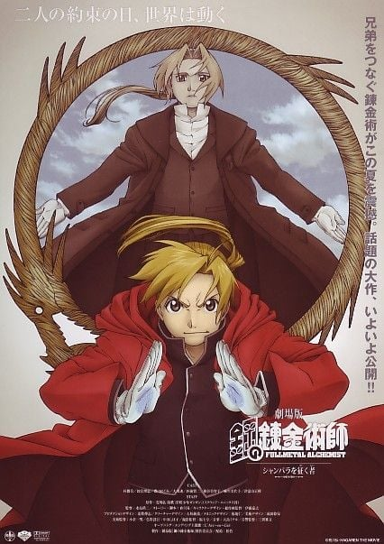
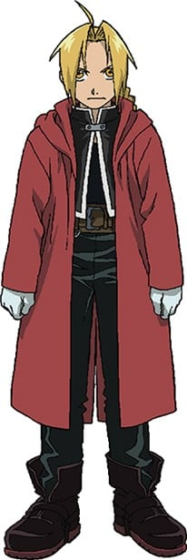
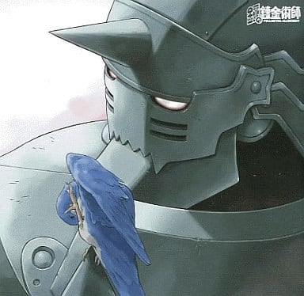
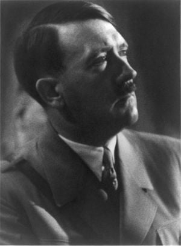
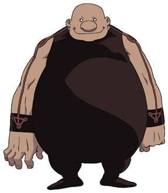
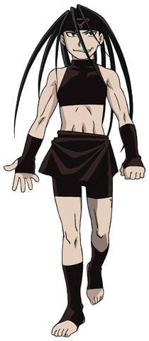
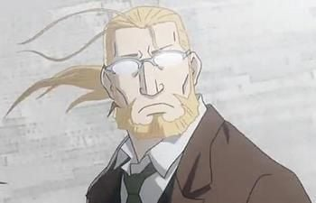
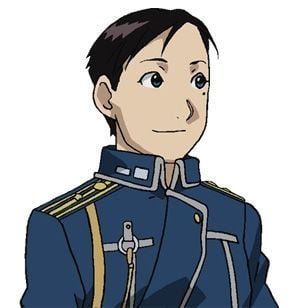
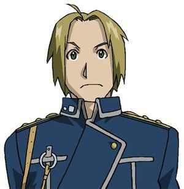

> [!bookinfo|noicon]+ **钢之炼金术师 香巴拉的征服者**
> 
>
| 日文名 | 鋼の錬金術師 シャンバラを征く者 |
|:------: |:------------------------------------------: |
| 类型 | 漫改 |
| 新番 | 2005 年 7 月 |
| 集数 | 共1话 |
| 官网 | [https://www.hagaren.jp/old/hagaren-movie/](https://https://www.hagaren.jp/old/hagaren-movie/) |
| 制作 | BONES |
| 导演 | 水島精二 |
| 脚本 | 會川昇 |
| 评分 | 7.3|
| 制片人 |  |

> [!abstract]+ **简介**
>        背景是1923年的德国慕尼黑。此时的德国正要面对着第一次世界大战战败后所产生的恶性通货膨胀。

       爱德去到一个无法使用炼金术的世界（即现实世界），为了寻找回到他原来世界的线索，便与他弟弟相似的另一个青年阿尔冯斯·海德利西一起做火箭的研究，但对爱德而言，漫长的两年时光过去，相对地，能找出回到原来世界的机会也越来越渺茫。

       一日，与阿尔冯斯一同前往嘉年华会的爱德遇到了一位名为“诺雅”吉普赛的女性。拥有不可思议力量的她，有着只要借由接触对方就能看见被接触者的内心及想法的能力。她是被当时德国人称为“次等民族”的吉普赛人中的一员，她们自称“洛玛”。

       由于她的出现，使得爱德被卷入当时纳粹外围组织“杜利协会”正要发起的计划，即寻找并入侵一个名为香巴拉的国度，同时也意味着炼金术世界将面临危机。

> [!tip]+ **章节列表**
>- [ ] 第1话：

> [!tip]+ **主要角色**
> 
| 角色 | CV | 简介| 角色图片 |
|:----:|:---:|:---:|:--------:|
| エドワード・エルリック | 朴璐美 | 通称爱德。为了寻找贤者之石与弟弟一起旅行。性格有很冲动的一面，很容易暴走。对自己比较矮小的身高非常在意，当听到“小豆丁”、“矮子”等字眼便会暴走。年幼时，母亲不幸因流行病死去，为了能再看见母亲的微笑，爱德与弟弟进行人体链成，结果失败，爱德失去左脚、弟弟失去整个身体，为保住弟弟，爱德用右手换取弟弟的灵魂，并将弟弟的灵魂附着于盔甲上。爱德失去的肢体后用机械铠替代。为了知道贤者之石的秘密及得到相关资料，决心成为国家炼金术师，在12岁成功考取，成为军属，得到了“钢”的称号。他不喜欢喝牛奶，但却非常喜欢喝含有牛奶的炖蔬菜汤。打斗时会将右手的机械铠链成带有刀刃的形式。在进行人体链成时打开了真理之门，因此链成时无须画链成阵。身上的银怀表是身为国家炼金术师的证明，但是被他利用炼金术封住，盖子内刻有兄弟两烧毁住处离开家乡的日期。 |  |
| アルフォンス・エルリック | 釘宮理恵 | 在钢铁铠甲中有颗善良的心。     那铠甲里面是空洞洞的。阿尔丰斯·艾尔利克是个只有灵魂的人。4年前，他失去了整个身体作为人体炼成的代价，但因哥哥拼死炼成，他的灵魂得以附在铠甲上，继续生存着。他比任何人更深切地理解爱德、关心他，有时还劝慰容易冲动的哥哥，担当监护人的角色。和哥哥一起持续着取回身体的旅程。对阿尔而言，最大的愿望是爱德的身体能恢复原状。 |  |
| ウィンリィ・ロックベル | 豊口めぐみ | 机械铠装备师。大陆历1899年出生，故事中段年龄15-16岁，淡金色马尾的美少女。  温莉是一名善良、乐观、真诚的女性，在漫画第九话中首次登场，与祖母比拿可修复爱德与“伤疤男”斯卡战斗而损坏的机械铠。出生在利塞布尔，童年时双亲在伊修巴尔战争中医治伤员时被杀，从此随祖母在利塞布尔生活。自幼便认识爱德和阿尔，是兄弟二人珍视的伙伴和家人。温莉十分热爱机械和工具，擅长制造和修理机械铠，和祖母兼著名机械铠技师比拿可在家经营一家小商店。在爱力克兄弟人体炼成母亲失败后，由她们制作并修理爱德右臂和左腿的机械铠。 为了保证它们处于最佳状态，温莉会在必要时外出提供修理。 |  |
| ロイ・マスタング | 大川透 | 别名“焰之炼金术师”的国家炼金术师。国军大佐。  利用发火布特制的手套产生火花，使用炼金术自如地操纵火焰。  表面看来轻浮，实际相当深不可测。  下雨天比较无能... |  |
| Adolf Hitler |  | 奥地利裔德籍政治家，演说家和军事统帅，国家社会主义德国工人党（纳粹党）党魁。1933年被任命为德国总理，1934年至1945年为德国元首，第二次世界大战期间兼任德国武装力量最高统帅。公认为二战的主要发动者与负责人之一。  1889年，希特勒出生于奥地利因河畔布劳瑙的一个海关文职人员家庭。希特勒在学生时期曾学习过绘画，然而两次报考维也纳美术学院均告失败。一战开始后因政治理想与经济状况窘迫缘故前往德国从军，逐步晋升至下士，并因作战勇敢获得一枚“一级铁十字勋章”和一枚“二级铁十字勋章”。1919年，希特勒担任密探时，接触纳粹党，不久加入，1921年成为党魁。1923年发动啤酒馆政变，被捕入狱后写下《我的奋斗》一书。他以泛德意志民族主义、反犹主义、反资本主义及反共主义作为意识形态纲领，并借助德国各阶层对凡尔赛体系的不满和经济大萧条的机遇发挥宣传天才，获得大众支持。1933年任德国总理后，利用国会纵火案等事件，打压党内外反对势力。1934年总统兴登堡死后，希特勒改称元首，成为独裁者。他对内实行福利政策，管制经济；对外主张德国人的生存空间及德国再武装，“用德国的剑为德国的犁取得土地”。1937年德意日签署三国轴心协议。在利用英、法、美、苏等国矛盾，获得一系列外交冒险胜利之后，1939年德国与苏联依据秘密协定，联手入侵波兰，导致第二次世界大战全面爆发。  在之后的三年里，德国及其他轴心国占领了大部份的欧洲、北非、东亚，东南亚及太平洋诸岛屿。然而1942年之后，盟军开始反攻，德军遭遇多次重挫，转攻为守。而在同一时期，纳粹治下的犹太人遭受到的待遇也从种族歧视和强制劳役转为彻底的种族灭绝，直接促成犹太复国主义高涨。至1945年，盟军已解放遭德军占领的大部分地区。1945年4月，苏联红军逼近柏林之时，希特勒与女友爱娃·布劳恩结婚并在二日内自杀。由于希特勒生前要求焚尸，长期传言他已逃脱。各国经研究苏联红军找到的部分遗骨，确认其死亡。  ————以上为真实人物在历史中的资料，以下补充群众恶搞出的二次设定，请注意区分————  1.因为纳粹标志和佛教万字符正好相反（实际两个都是万字符，结果现在为回避，佛教只用另一个），有元首逆练如来神掌以至于走火入魔的说法。【铁拳无敌孙中山系列设定】  2.电影《帝国的毁灭》中所演的元首太过传神以致经常被拿来恶搞，统称“元首的愤怒”。该段影片中“Hanyuh ist mir!”被空耳为英文“Hanyuu is mine!”，再转译为日语“羽入は俺の嫁”，正好表情动作都很适合，在寒蝉最终话禁播时的恶搞视频中就有这样一句。这被视为元首の嫁是羽入的出处。同时“OOは俺の嫁”的成句也更为流行。 视频：http://www.youtube.com/watch?v=w_Pr9Jg9Lrg  3.近期由于《魔法少女圆》的播出台湾有人制作出恶搞视频元首痛罵虛淵（http://www.youtube.com/watch?v=cxyQuLL749s），由于感情生动，再加上《魔法少女圆》的热播，元首的愤怒类恶搞在中国掀起了又一次高潮。而且经国人的调教，元首的汉语也讲的越来越好了。  4.元首经常被恶搞为loli控、宅男等“亲民”形象。 |  |
| グラトニー | 高戸靖広 | 属于人造人七宗罪之一。 03版： 其实是为了制造贤者之石而特意制造出来的人造人，其目的是在格拉托尼体内炼成贤者之石，无原型。 |  |
| リザ・ホークアイ | 根谷美智子 | 莉莎·霍克艾（Riza Hawkeye），金色长发，职业是军人。是马斯坦的副官兼搭档。视力是常人的8倍（导读手册），擅长用枪，是有名的狙击手，有“鹰眼”之称。其父是出名的炼金术师，马斯坦亦跟随其父学习炼金术。 |  |
| アレックス・ルイ・アームストロング | 内海賢二 |  |  |
| エンヴィー | 山口眞弓 | 恩维，日本漫画家荒川弘著作的漫画《钢之炼金术师》中登场的虚拟人物，为“烧瓶小人”分离出的七种情绪中的嫉妒所制作的人造人，原型为七宗罪中的嫉妒。 |  |
| ヴァン・ホーエンハイム | 江原正士 | 被时间遗忘的炼金术师，爱德和阿尔的父亲。心中怀着深沉的过去离开自己所深爱的家人。当他看到自己所追寻的愿望时，却发现已失去与自己立下的重要约定和自己最珍惜的人。与黑暗势力有着深切的关系，并且知道一切内幕。 |  |
| マリア・ロス | 斎賀みつき |  |  |
| デニー・ブロッシュ | 原田正夫 |  |  |